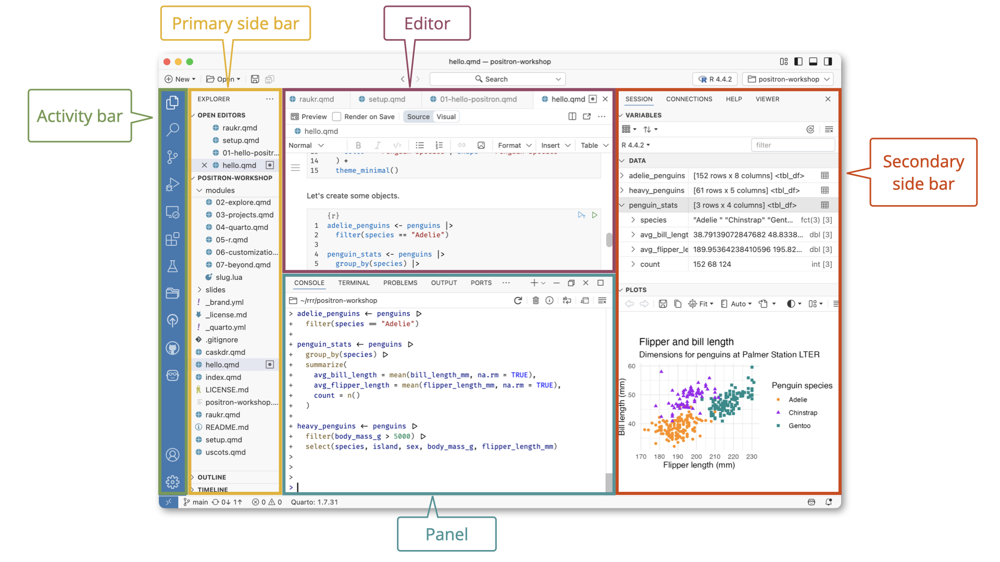
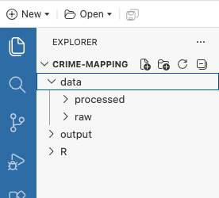
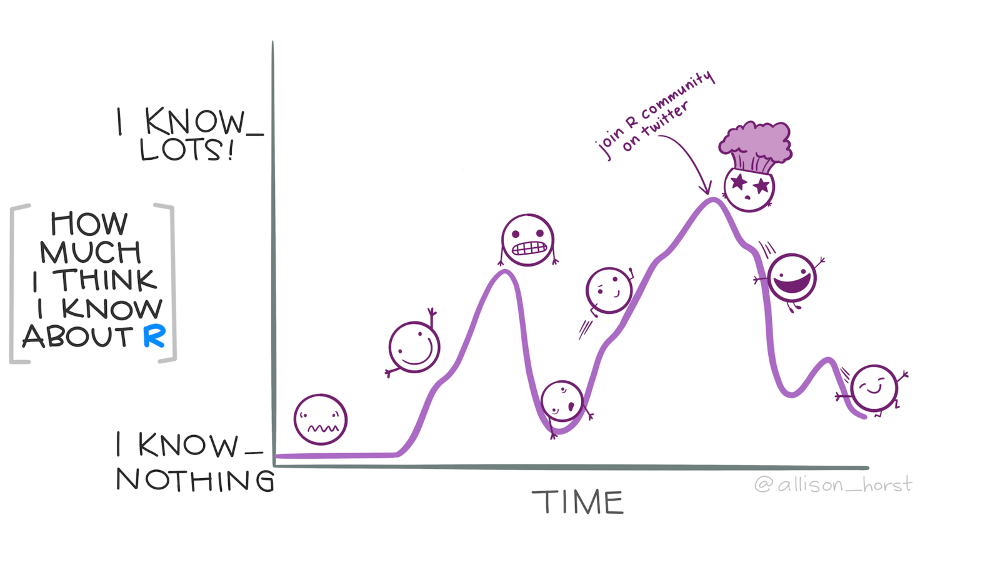

# Getting started {#sec-getting-started}

::: {.abstract}
Get started with crime mapping by learning about why putting crime on maps is useful, get a tour of the Positron software we will use throughout this course and learn how to keep your files organised.
:::


## Welcome


Welcome to _Learn Crime Mapping with R_. This book will help you learn about using maps and spatial analysis techniques to understand crime. Watch this video to learn more.





## Why put crimes on maps?

This course is about how we can use maps and other spatial analysis tools to help understand, prevent and respond to crime. Watch this video to understand why spatial analysis is a useful tool for understanding crime.




::: {.callout-quiz .callout title="Concentrations of crime"}

```{r}
#| echo: false

why_maps_quiz1 <- c(
  "To estimate the total number of crimes in a city",
  answer = "To understand where different types of crime happen most often",
  "To predict the weather in crime-prone areas",
  "To determine the average time crimes occur"
)

why_maps_quiz2 <- c(
  "Most crime is caused by a large number of offenders",
  "About half of all crime happens in half of a city’s neighbourhoods",
  answer = "Most crime occurs in a small minority of places",
  "Crime is approximately equally distributed across all streets in a city"
)

why_maps_quiz3 <- c("25%", answer = "50%", "75%", "100%")

why_maps_quiz4 <- c(
  answer = "Most crime in a high-crime neighbourhood occurs at only a few streets or addresses",
  "Crime is usually random at the neighbourhood level",
  "Analysing neighbourhoods is harder",
  "It is easier to access data on crime at particular addresses than for neighbourhoods"
)

why_maps_quiz5 <- c(
  "Crimes in Medellin are evenly distributed across the city",
  "No specific places in Kaduna experience concentrated burglary rates",
  "Crime in Oslo is spread equally across the city",
  answer = "About half of crimes in Seattle occur on 5% of streets"
)
```


**Why is it important to map crime?**

`r webexercises::longmcq(why_maps_quiz1)`


**What does the law of crime concentration state?**

`r webexercises::longmcq(why_maps_quiz2)`


**According to research on the concentration of crime, how much crime typically happens in the 5–8% of streets or addresses with the most crime?**

`r webexercises::longmcq(why_maps_quiz3)`


**Why do researchers often prefer to focus on micro places, such as streets and addresses, rather than neighbourhoods?**

`r webexercises::longmcq(why_maps_quiz4)`


**Which of the following findings is consistent with the law of crime concentration?**

`r webexercises::longmcq(why_maps_quiz5)`

:::


::: {.box .reading}

Weisburd, D. (2015). [The law of crime concentration and the criminology of place](https://doi.org/10.1111/1745-9125.12070). *Criminology*, 53(2), 133-157.

Johnson, S. (2010). [A brief history of the analysis of crime concentration](https://doi.org/10.1017/S0956792510000082). *European Journal of Applied Mathematics*, 21(4-5), 349.

Farrell, G. (2015). [Crime concentration theory](https://doi.org/10.1057/cpcs.2015.17). *Crime Prevention and Community Safety*, 17(4), 233-248.

:::


## Why is crime concentrated in space?

Why is crime concentrated in space? Watch this video to find out more about how our environment influences opportunities for crime and how that causes clusters of different crimes.




::: {.callout-quiz .callout title="Routine activities"}


```{r}
#| label: why-concentrated-quiz
#| echo: false

why_concentrated_quiz1 <- c(
  "Crime happens randomly in all places",
  answer = "Some places have more environmental features that facilitate specific crimes",
  "Police allocate more resources to high-crime areas",
  "Criminals prefer remote locations to commit crimes"
)

why_concentrated_quiz2 <- c(
  "A motivated offender",
  "A suitable target",
  answer = "A controller who prevents the crime",
  "A place where the offender and target can meet"
)

why_concentrated_quiz3 <- c(
  answer = "They reduce the likelihood of opportunities for crime occurring, e.g. by making targets or places less vulnerable",
  "They deter crimes by arresting offenders",
  "They create opportunities for offenders and targets to meet",
  "They plan environments to increase crime rates"
)

why_concentrated_quiz4 <- c(
  "Criminals always prefer urban areas for all types of crime",
  "Police enforcement varies between locations",
  "Opportunities for crime are spread evenly across all areas",
  answer = "Opportunities for crime are influenced by specific environmental features that vary by crime type"
)

why_concentrated_quiz5 <- c(
  "A location where offenders and controllers meet",
  answer = "The person or object that an offender aims to harm, steal, or engage with",
  "A police operation to reduce crime in specific areas",
  "Any place where crime does not occur"
)
```

**Why are opportunities for crime concentrated in some places more than others?**

`r webexercises::longmcq(why_concentrated_quiz1)`


**According to the routine activities approach, which of the following is _not_ required for a crime opportunity to occur?**

`r webexercises::longmcq(why_concentrated_quiz2)`


**What role do controllers play in preventing crime, according to the routine activities approach?**

`r webexercises::longmcq(why_concentrated_quiz3)`


**Why do different types of crime concentrate in different places?**

`r webexercises::longmcq(why_concentrated_quiz4)`


**What is a target in the context of the routine activities approach?**

`r webexercises::longmcq(why_concentrated_quiz5)`


:::


::: {.box .reading}

Santos, R. B. (2015). [Routine Activity Theory: A Cornerstone of Police Crime Analyst Work](https://ebookcentral.proquest.com/lib/ucl/reader.action?docID=1952969&ppg=130). In _The Criminal Act: the role and influence of routine activity theory_ by Andresen, M. A. and Farrell, G. Palgrave Macmillan.

Cohen, L. E., and Felson, M. (1979). [Social Change and Crime Rate Trends: A Routine Activity Approach](https://doi.org/10.2307/2094589). *American Sociological Review*, 44(4), 588–608.

:::


## Finding your way around Positron

We will use a piece of software called Positron for almost all of this course. Positron is designed specifically for data analysis. If you have previously used either VS Code or RStudio, you will probably find Positron quite familiar, but if you haven't used either of those before, don't worry -- we will guide you through the basics of using Positron in this course.

Watch the _first three minutes_ of this video to find your way around the different panels in the Positron window. For now, don't worry about opening a folder -- we will cover that shortly. Also don't worry if you don't understand all the terms used in the video.



The Positron interface is divided into several panels, each of which has a different purpose. Some of the panels contain multiple tabs, so there are a lot of different things you can do in Positron. But on this course we will only use some of those, so it shouldn't be overwhelming.

{.lightbox fig-alt="Annotated screenshot of the Positron interface showing its main workspace areas. A vertical Activity bar on the far left contains icons for switching between tools. Next to it, the Primary side bar displays the Explorer, listing folders and files in the current workspace, including several Quarto (.qmd) documents. The central Editor contains an open Quarto document with tabs for multiple files, a formatting toolbar, and an editable code and text document. Beneath the editor, a Panel contains tabs including Console, Terminal, Problems, Output and Ports, with the Console tab active and showing R commands and output. On the right, the Secondary side bar contains tabs for Session, Connections, Help and Viewer. The Session tab is active, showing the R Environment with data frames and variables, while the lower portion displays a Plots pane containing a scatter plot of penguin bill length against flipper length. Coloured callout boxes identify and label each of these five interface areas: Activity bar, Primary side bar, Editor, Panel and Secondary side bar."}

The main panels in the Positron interface are:

- **Activity bar**: This vertical bar on the far left contains icons for switching between different tools in Positron. The tool shown in the screenshot above is the Explorer. In the Activity bar you can also select tools that allow you to search in files and folders, load and manage extensions to complete different tasks, and interact with online services that can help you complete your work.
- **Primary side bar**: This panel is next to the Activity bar and shows whatever tool is currently selected in the Activity bar. In the screenshot above, the Explorer is selected, which shows the files and folders in the folder you are working in.
- **Editor**: This is where you edit different files, for example to write R code to complete a particular analytical task. You can have multiple files open at once, and switch between them using the tabs at the top of the Editor.
- **Panel**: This panel is below the Editor and shows different types of output, for example the results of running R code, or messages about problems that have occurred. You can switch between different types of output using the tabs at the top of the Panel. Most of the time we will be working in the Console tab, which shows the results of running R code.
- **Secondary side bar**: This panel is on the far right and shows information about your R session, for example details about data that you have loaded (more on that in the next chapter). The bottom half of the Secondary side bar shows plots that you have created in R, and allows you to export them as image files.


::: {.box .reading}

The [Positron Cheat Sheet](https://rstudio.github.io/cheatsheets/positron.pdf) highlights some of the features available in Positron and gives a list of available keyboard shortcuts. You might want to keep this cheat sheet open in a separate window while you work through the course, or print off a version to keep with you.

:::


## Keeping your files organised {#sec-create-project}

Throughout this course you will use and create several different types of file, for example data files, files containing R code and output files containing maps, charts and reports. It is very important that you keep these files organised in a way that makes it easy to find them again later. Getting into the habit of keeping your files well organised will help a lot later on when you have to deal with multiple files to achieve an objective.


::: {.callout-important title="Common mistake: bad file organisation"}

One of the most common mistakes that people make when writing code is not keeping their files organised. This can make it much harder to find and fix problems with your code, something we will return to in chapter @sec-bugs. Make sure you organise your files well from the start (that's right now) to avoid problems later on.
:::


To keep your files organised, we will keep all the files used for this course in a single folder on your computer called `crime-mapping`, which we will then divide up into subfolders for storing different types of files. To create the `crime-mapping` folder in Positron:

1. In the Welcome panel, open the **New** menu and choose **New Folder from Template …**.
2. Choose **R Project** and click **Next**.
3. Change **Folder Name** from `my-r-project` to `crime-mapping`. Note that the folder name is all lower-case letters with a hyphen between the two words. This is important because it makes it easier to use the folder name in R later on.
4. Click **Browse** and choose a place on your computer to save the folder. You can choose any location you like, but the `Documents` folder on your computer is usually a good choice.
5. Click **Next**.
6. If Positron asks you to choose a version of R, choose the latest numbered version in the list. If no version of R is listed, R might not be installed correctly on your computer.
7. If Positron offers options to use `renv` or initialise a Git repository, leave them unselected for now, then click **Create**.
8. Click **Current Window**. Positron will open the new folder as your workspace and start an R session.

Now that we have created a folder to store all the files for this course, we will create a few subfolders within it to keep different types of files separate. The structure of the `crime-mapping` folder will look like this:

```text
crime-mapping/
├── data/
│   ├── raw/
│   └── processed/
├── output/
└── R/
```

These folders have different purposes:

- `data/` is used to store all the data we will use in this course. It is divided into two subfolders:
  - `data/raw/` contains the original data files exactly as they were downloaded.
  - `data/processed/` contains data that have been cleaned, transformed or combined using R.
- `output/` contains everything produced by your analysis, such as maps, charts and reports.
- `R/` will later be used to store R scripts.

The distinction between `data/raw/` and `data/processed/` is particularly important. Files in `data/raw/` should be kept *sterile*. Once a file has been downloaded into this folder, you should not edit it or overwrite it. Instead, use R to read the original file, perform any cleaning or processing, and save the result into `data/processed/`. This means you can always return to the original data if you need to repeat your analysis. Keeping the original data sterile means that many mistakes you might make while cleaning or processing the data can be easily corrected by simply re-running your R code to produce a new processed file from the original raw file.

To create these folders in Positron:

1. In the **Explorer** panel in the top-left corner, move the pointer over the `CRIME-MAPPING` folder.
2. Click **New Folder …** icon (or right-click and choose **New Folder**) then name the new folder `data`.
3. Repeat steps 1 and 2 to create the `output` and `R` folders.
4. Right click on the name of the `data` folder in the Explorer panel, click on **New Folder …** then name the new folder `raw`. Right click again on the `data` folder to create the `processed` folder.

::: {.callout-important title="Folder and file names should be lower case"}
Folder and file names are easier to use in R when they contain only lower-case letters, numbers, hyphens and underscores. Avoid spaces and special characters where possible. For example, use `crime-mapping` rather than `Crime Mapping`.
:::

The explorer panel should now look like this:

{fig-alt="Screenshot of the Positron interface showing the Explorer panel. The workspace folder, named CRIME-MAPPING, is expanded and contains three items: a data folder, an output folder and an R folder. The data folder is also expanded to show two subfolders named processed and raw. The data folder is currently selected and the toolbar above the Explorer displays icons for creating a new file, creating a new folder, refreshing the Explorer and collapsing all folders. The screenshot illustrates the recommended folder structure for organising files in the course."}


::: {.callout-tip title="Check your work"}
Before continuing, compare the Explorer panel in Positron with the screenshot above. Check that:

- `crime-mapping` is the workspace folder shown at the top of the Explorer;
- `data`, `output` and `R` are directly inside `crime-mapping`;
- `raw` and `processed` are directly inside `data`; and
- you have not accidentally created one of these folders inside another folder.

If the folders are not in the right places, correct that now. Correcting the structure will make the instructions in later chapters much easier to follow.
:::


## Formatting your R code automatically

R code can be written in lots of different ways, some of them easier to read and maintain than others. Well-formatted code is easier to read and less likely to contain mistakes, which we will cover in more detail in @sec-bugs. Positron includes a tool called Air that can format your R code automatically whenever you save a file.

You only need to install the Air tool once, then it will format your R code automatically whenever you save a file. To install Air, find the R Console panel in the bottom-left corner of Positron and paste the following code to the right of the prompt arrow (`>`): 

```{r}
#| filename: "R Console"
#| eval: false

if (!requireNamespace("usethis", quietly = TRUE)) {
  install.packages("usethis")
}
usethis::use_air()
```

Now press  on your keyboard to run the code.


## In summary

Now that you know why crime mapping is useful for understanding crime, why crime is typically concentrated in space, how to find your way around Positron and how to keep your files organised, in the next chapter we will produce our first crime map in R.

If you're not feeling too confident at this point in the course, don't worry – learning something new is always a bit of a roller coaster and there is lots of help available in subsequent chapters.

<p class="full-width-image"></p>

<p class="credits"><a href="https://allisonhorst.com/">Artwork by Allison Horst</a></p>
