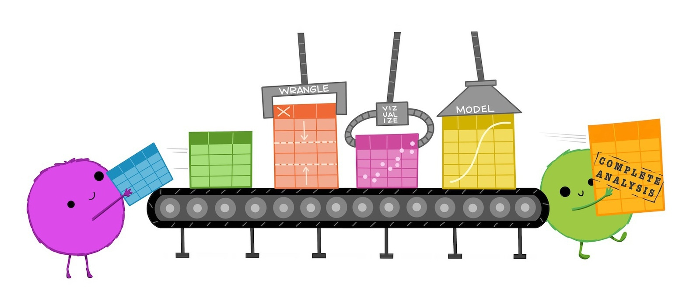
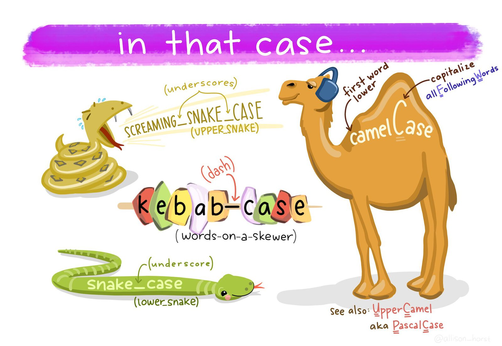
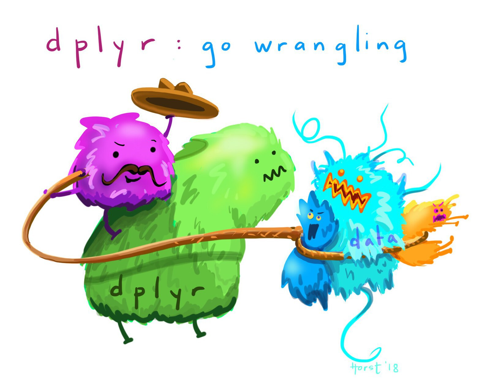
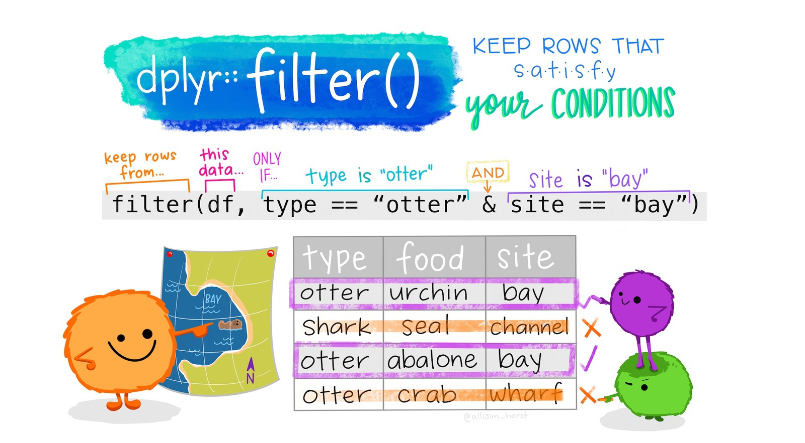

# Loading and selecting data {#sec-wrangling-data}

::: {.abstract}
This chapter introduces the first essential skills of data wrangling: loading data into R and choosing the rows and columns needed for an analysis. You will learn how functions and packages work, how to read CSV and Excel files, how to give objects meaningful names and how to use the dplyr package to select and filter data.
:::


::: {.callout-tip title="Before you start"}

1. Open Positron or -- if you already have Positron open -- start a new R session by clicking the **Restart R** (**&#10227;**) button in the **Console** panel. This makes sure no code you ran previously will interfere with the work you do in this chapter.
2. Make sure you are working in the crime mapping project workspace you created in @sec-create-project. In the top-right corner of the Positron window, you should see a folder icon and the words `crime-mapping`. If not, click the **File** menu, then **Open Folder ...** and choose the `crime-mapping` folder.
:::


```{r}
#| label: setup
#| echo: false
#| include: false

# Load packages
pacman::p_load(here, httr2, readxl, tidyverse)

# Load data
agg_assault_data <- crimemappingdata::aggravated_assaults
san_fran_rob <- crimemappingdata::san_francisco_robbery
```


## Introduction

A major step in using any data to make decisions or draw conclusions is *data wrangling*: the process of transforming data from the format in which we originally have it to the format needed to analyse and present it to our audience. 

<p class="full-width-image"></p>

By the end of this chapter, you will have learned how to:

- download CSV and Excel files into a workspace;
- load and inspect tabular data;
- give R objects meaningful names; and
- select columns and filter rows.

The work in this chapter follows four main stages:

::::: {.process}

:::: {.item color="#3182bd"}
Download data

::: annotation
into the `data/raw` folder
:::
::::

:::: {.item color="#3182bd"}
Load data

::: annotation
from a file into an R object
:::
::::

:::: {.item color="#3182bd"}
Select columns

::: annotation
to keep the variables we need
:::
::::

:::: {.item color="#3182bd"}
Filter rows

::: annotation
to keep the observations we need
:::
::::

:::::

To get started, create the first of two scripts used in this chapter:

1. Click the **File** menu in Positron, then click **New File ...**.
2. Type `chapter_03a.R` in the box marked **Select File Type or Enter File Name...**, then press .
3. Save the file in the `R` folder inside your `crime-mapping` workspace.

As we learned in @sec-first-map, permanent code needed to repeat the analysis belongs in this script. Temporary code that helps you inspect the data or develop the permanent code belongs in the R Console. Code chunks in this chapter are labelled to show where each piece of code belongs.


### Functions

In this chapter we will learn how to wrangle data in R using *functions* – specialised pieces of code that *do* something to the data we give them. The code to use a function (sometimes called *calling* the function) has two parts: the function name followed by a pair of parentheses, inside which are zero or more *arguments* separated by commas. Arguments are a way of providing input that a function works on, or to fine-tune the way the function works (we will see many examples of this later). Remember that you can identify a function in R because the name will always have parentheses after it.

One basic R function is `sqrt()`, which calculates the square root of a number. The `sqrt()` function has only one argument: the number that we want to find the square root of. If we typed the following code into the R Console, R would show us the square root of 2.

```{r}
#| eval: false
#| filename: "R Console"

sqrt(2)
```

When you run code in R, by default R prints the output of your code – in this case, just the number ``r format(sqrt(2), digits = 7)`` (for now, you can ignore the number `[1]` in square brackets).


### Packages

R contains thousands of different functions that do different things. A few functions are contained in the default installation of R that you have already installed (this is sometimes referred to as *base R*). But most functions are contained in *packages*, which are extensions to base R. Most packages focus on a particular type of data analysis, so that there are packages devoted to time-series analysis, testing whether events are clustered in particular places, network analysis and thousands of other tasks. Packages are often developed by experts in the field, and are typically updated to introduce new features.

To use a function from a package we need to do two things: _install_ that package on our computer, and then _load_ the package into our R session. You may see code that does these two steps separately, using the `install.packages()` function to install a package and the `library()` function to load it. However, in this book we use the `p_load()` function from the [pacman package](https://trinker.github.io/pacman_dev/) to do both steps in one line of code. `p_load()` checks whether a package is already installed on your computer, and if it is not, installs it automatically and then loads it. Do not add `install.packages()` to your scripts. Re-installing packages every time a script runs is unnecessary, slows the script down and can make it harder for someone else to run your code on their computer.

In this chapter we will use functions from the here, httr2, readxl and tidyverse packages, so add this code to `chapter_03a.R`:

```{r}
#| filename: "chapter_03a.R"

# Load packages
pacman::p_load(here, httr2, readxl, tidyverse)
```

Now run this code by clicking anywhere on that line of code then pressing  on your keyboard.


::: {.callout-tip collapse="true" title="Why does this line of code start with `pacman::`?"}

The pacman package is an R package that is used to manage other R packages. The `p_load()` function from that package is used to load packages. But we learned above that we must load a package before we can use it, which means we cannot use functions from the pacman package until we have loaded the pacman package. To get around that, instead of just using the function name `p_load()`, we can instead specify which package `p_load()` is from by prefixing the function name with the relevant package name, separated by `::`.
:::

<a href="https://tidyverse.org/" aria-label="Visit the tidyverse website"></a>

Many packages are focused on specialist tasks and so are only used occasionally, but a few packages are likely to be useful in almost all the code we write. Fortunately, packages can themselves load other packages, and all the main packages we need are loaded by the [tidyverse package](https://tidyverse.org/). That is why you will often see `pacman::p_load(tidyverse)` at the top of R code in subsequent chapters – that short line of code loads several packages containing hundreds of functions that we can use in data analysis.


::: {.callout-quiz .callout title="Data wrangling"}

```{r}
#| label: data-wrangling-quiz
#| echo: false

data_wrangling_quiz1 <- c(
  "The process of collecting data from multiple sources.",
  answer = "The process of transforming raw data into a format suitable for analysis.",
  "The process of visualising data on a map.",
  "The process of cleaning corrupted data files."
)

data_wrangling_quiz2 <- c(
  "A visual representation of data.",
  "A mathematical formula used in graphs.",
  "A set of instructions for saving data.",
  answer = "A specialised piece of code that performs a task on data."
)
```


**What is the purpose of data wrangling?**

`r webexercises::longmcq(data_wrangling_quiz1)`


**In general, what is a _function_ in R?**

`r webexercises::longmcq(data_wrangling_quiz2)`


:::


## Loading data {#sec-read-data}

Before we can do anything with any data, we have to load it into R. In this course we will read tabular data in comma-separated values (CSV) and Excel formats, as well as spatial data in different formats (because there are lots of ways to store spatial data). We will learn how to read CSV and Excel data now, but leave loading spatial data until later.

_Tabular data_ (sometimes known as _rectangular data_) describes data formats with multiple columns where every column has the same number of rows. For example, crime data might have columns for the type of crime, date and address at which the crime occurred.

```{r}
#| label:  tabular-data
#| echo: false

tibble::tribble(
  ~type                      , ~date                                              , ~address         ,
  "homicide"                 , as_date(now(tzone = "UTC") - years(1) + days(10))  , "274 Main St"    ,
  "non-residential burglary" , as_date(now(tzone = "UTC") - months(5) + days(20)) , "541 Station Rd" ,
  "personal robbery"         , as_date(now(tzone = "UTC") - days(8))              , "10 North Av"
) |>
  dplyr::mutate(date = strftime(date, "%d %b %Y")) |>
  knitr::kable(caption = "Crime data in rectangular format")
```

Almost all the data we will use in this course will be in this rectangular format, and most of the functions we will use expect data to be rectangular.


### Loading CSV data

<a href="https://readr.tidyverse.org/" aria-label="Visit the readr package website"></a>

Data stored in CSV format is easy to load with the `read_csv()` function from the [readr package](https://readr.tidyverse.org). readr is one of the packages loaded by the tidyverse package, so all we need to do to use this package is include the code `pacman::p_load(tidyverse)` on the first line of our R script. We will use comments (lines of code beginning with `#`) to help explain the code as we go.

During this course, much of the data we use will come from the [crimemappingdata website](https://pkgs.lesscrime.info/crimemappingdata/). We will first download each original file to the `data/raw` folder and then load that local copy into R. Keeping a copy of the original data means that our analysis does not depend on repeatedly accessing a website, and that we can always return to the unchanged source file.

Add this code to the `chapter_03a.R` file and run it.

```{r}
#| filename: "chapter_03a.R"

# Download the data from a URL and store it in a local file
request(
  "https://mpjashby.github.io/crimemappingdata/san_francisco_robbery.csv"
) |>
  req_perform(path = here("data", "raw", "san_francisco_robbery.csv"))
```

The `request()` and `req_perform()` functions from the httr2 (pronounced 'hit-r two') package download the file, following the same pattern used in @sec-load-data. The `here()` function from the here package helps you specify where on your computer you want to store or retrieve a file inside the `crime-mapping` folder we created in @sec-create-project. In this case, `here()` specifies that the file should be stored in a file called `san_francisco_robbery.csv` inside the `raw` folder that is itself inside the `data` folder.

Now we've downloaded the data, we need to load it into R. Add this code to the script file and run it:

```{r}
#| filename: "chapter_03a.R"

# Load the local file into R
san_fran_rob <- read_csv(here("data", "raw", "san_francisco_robbery.csv"))
```

::: {.callout-tip collapse="true" title="What do the messages produced by `read_csv()` mean?"}

By default, the `read_csv()` function prints a message when it loads data to summarise the format of each data column. In the case of the `san_fran_rob` dataset, `read_csv()` tells us that: 

  * there is one column called `offense_type` that contains character (`chr`) values,
  * there are three columns called `uid`, `longitude` and `latitude` containing numeric (`dbl`) values, and
  * there is one column called `date_time` that contains values stored as dates and times (`dttm`).

There are some other possible types of data, but we will learn about these later on. The numeric values are referred to as `dbl` values because they are stored in a format that can handle numbers that are not whole numbers (e.g. 123.456). This format for storing numbers is called the _double-precision floating-point format_, which is often known as the double format for short. Most numbers in R are stored in double format, so you can think of the format code `dbl` as meaning 'numeric'. You don't need to remember that 'double' is short for double-precision floating-point format, just that it represents a number.
:::


This code loads the data using the `read_csv()` function and stores the result in an object named `san_fran_rob`. Objects are places where we can store data. To create an object and store our data in it, we use the assignment operator `<-` (a less-than sign followed by a dash). Rather than typing a less-than sign and a dash every time you need to assign a value to an object, you can instead use the keyboard shortcut  to type an assignment operator.


### Naming objects {#sec-naming-objects}

Object names should briefly describe what an object contains. For example, `san_fran_rob` is more informative than a generic name such as `data`. Meaningful names make a script easier to understand and reduce the chance that you will accidentally use the wrong object. Using the wrong object is a common cause of errors in code, and those errors can be surprisingly hard to track down and fix, so it's best to avoid them by giving objects meaningful names in the first place.

Another way to make object names easier to work with is to only use names containing lowercase letters, numbers and underscores. Object names that follow these rules are said to be written in *snake_case*. Giving all your objects names in `snake_case` means you never have to remember whether you used upper or lower-case letters in an object name, and makes it easier to read object names containing multiple words. This is particularly important because R distinguishes between upper- and lower-case letters, so `crime_data`, `Crime_Data` and `CRIME_DATA` would be three different objects. Using lower-case snake case consistently means that you do not have to remember which variation you chose.

```{r snake-case}
#| echo: false
#| fig-align: center
#| fig-alt: "A cartoon comparing naming conventions: snake_case separates lowercase words with underscores, kebab-case uses dashes, and camelCase capitalises each word after the first. It also shows upper-case variants of snake case and camel case."
#| out.width: 80%


```

This rule applies even when one of the words in an object name normally uses upper-case letters, such as a name or an abbreviation. For example, you should call an object containing data on homicides in Abu Dhabi something like `abu_dhabi_homicides`, **not** `Abu_Dhabi_Homicides` or `AbuDhabiHomicides`. Similarly, if you had a dataset of offences of grievous bodily harm (usually abbreviated to GBH), you should call the object `gbh_data`, **not** `GBH_data` or `GBHData`.

```r
# Good object names
san_fran_rob
aggravated_assault_data

# Avoid these names
Data
sanFranRob
san-fran-rob
data
```

These conventions also apply to column names. Data obtained from elsewhere will not always follow them, but we can use the `janitor::clean_names()` function to convert column names to snake case. We will use that function in @sec-second-map.


::: {.callout-quiz .callout title="Naming objects"}

```{r naming-objects-quiz}
#| echo: false

naming_objects_quiz <- c(
  "`abu-dhabi-homicides`",
  "`Abu_Dhabi_homicides`",
  "`data`",
  answer = "`abu_dhabi_homicides`"
)
```

**Which is the best name for an object containing data on homicides in Abu Dhabi?**

`r webexercises::longmcq(naming_objects_quiz)`

:::


::: {.callout-important title="Object names can be overwritten"}

When choosing object names, it is important to remember that if you assign a value (such as the number `1` or the result of the function `read_csv()`) to an object name, R will overwrite any existing value of that object name. We can see this in a simple example:

```{r}
#| eval: false

one_to_ten <- 1:10
one_to_ten <- sqrt(2)
```

If we were to run this code, the object `one_to_ten` would not actually hold the numbers from one to ten, but instead the value `r format(sqrt(2), digits = 7)` (the square root of two). There is no way to undo assignment of a value to an object, so once you have run the code `one_to_ten <- sqrt(2)` it is not possible to recover any previous value that was assigned to the object `one_to_ten`. For that reason, it is generally a bad idea to reuse object names to store different values in the same script.
:::


Objects come in several different types, with tabular data typically being stored as a *data frame*. The `read_csv()` function produces a modern variation on the data frame called a *tibble*. Tibbles behave like data frames most of the time, but are designed to work conveniently with tidyverse functions. We will use tibbles throughout this course.

If the data are loaded successfully, R will list the columns in the data and the type of variable (numeric, date etc.) stored in each column.

To see the first few rows of data currently stored in an object, we can use the `head()` function. Remember that we run functions such as `head()` in the R Console, not in the script file, because it is temporary code (see @sec-permanent-code). Add this code to the R Console and run it by pressing :


```{r}
#| filename: "R Console"

head(san_fran_rob)
```


### Loading Excel data

<a href="https://readxl.tidyverse.org/" aria-label="Visit the readxl package website"></a>

Loading data from Microsoft Excel files is very similar to loading CSV data, with a few important differences. Functions to load Excel data are contained in the `readxl` package.

Create a second R script by repeating the Positron steps you used earlier. Name the file `chapter_03b.R` and save it in the `R` folder. Add the following code, then place the cursor on each statement and press  to run it.

```{r}
#| filename: "chapter_03b.R"

# Load packages
pacman::p_load(here, httr2, readxl, tidyverse)

# Download the data from a URL and store it in a local file
request(
  "https://mpjashby.github.io/crimemappingdata/aggravated_assaults.xlsx"
) |>
  req_perform(path = here("data", "raw", "aggravated_assaults.xlsx"))
```

Now we have downloaded our data, we can load it into R. Excel files can contain multiple _sheets_, so we need to specify which sheet we would like to load into a tibble. We can use the `excel_sheets()` function in the R Console to get a list of sheets in an Excel file:

```{r}
#| filename: "R Console"

# Get a list of sheets in an Excel file
excel_sheets(here("data", "raw", "aggravated_assaults.xlsx"))
```

We can now load the sheet containing data for Austin and view the first few rows
of the resulting object:

```{r}
#| filename: "chapter_03b.R"

agg_assault_data <- read_excel(
  here("data", "raw", "aggravated_assaults.xlsx"),
  sheet = "Austin"
)
```

and, as usual, we can use the `head()` function to look at the data:

```{r}
#| filename: "R Console"
head(agg_assault_data)
```

Now we have learned how to load our data into an object, we can use other R functions to work with that data in many different ways.


::: {.callout-important title="Use the right function for each file type"}

Different types of data are loaded into R with different functions, e.g. CSV files are loaded with the `read_csv()` function from the readr package and Microsoft Excel files are loaded with the `read_excel()` function from the readxl package. @sec-load-functions has a list of which function to use to load each type of file.

:::


::: {.box .reading}

[Learn more about importing data](https://r4ds.hadley.nz/data-import.html) in the current edition of the free online book [R for Data Science](https://r4ds.hadley.nz/).

Excel data can often be messy and the `readxl` package contains various other functions that can be used to deal with this. You can [learn more about how to handle messy Excel data in this online tutorial](https://lesscrime.info/post/cleaning-ons-data/).

:::


::: {.callout-quiz .callout title="Reading data"}

Answer the following questions to check your understanding of what we've learned so far in this chapter. If you get a question wrong, you can keep trying until you get the right answer.

```{r}
#| label: read-quiz
#| echo: false

read_quiz1 <- c("`readxl`", "`reader`", answer = "`readr`", "`readcsv`")
read_quiz2 <- c(
  "`message(san_fran_rob)`",
  "`summary(san_fran_rob)`",
  "`peak_inside(san_fran_rob)`",
  answer = "`head(san_fran_rob)`"
)
read_quiz3 <- c(
  "`10` (the number 10)",
  answer = "`1.414214` (the square root of 2)",
  "`10.41421` (10 plus the square root of 2)",
  "`14.14214` (10 times the square root of 2)"
)
```

**What R package contains the function `read_csv()` to read CSV data?**

`r webexercises::longmcq(read_quiz1)`

**What R code prints the first few rows of the tibble called `san_fran_rob`?**

`r webexercises::longmcq(read_quiz2)`

**If we create an object using the code `number_ten <- 10` and then run the code `number_ten <- sqrt(2)`, what value will the object `number_ten` now have?**

`r webexercises::longmcq(read_quiz3)`
:::


## Selecting columns

In this section we will learn how to reduce the size of our data by selecting only the columns we need and discarding the rest. This can be particularly useful if we are working with a very-large dataset, or if we want to produce a table containing only some columns.

<p class="full-width-image"></p>

We can use the `select()` function from the [dplyr package](https://dplyr.tidyverse.org/) (one of the packages that is loaded automatically when we call the `pacman::p_load(tidyverse)` function) to select columns.

If we wanted to select just the `date` and `location_type` columns from the `agg_assault_data` we loaded in the previous section, we can use this code:

```{r}
#| filename: "R Console"

select(agg_assault_data, date, location_type)
```

<a href="https://dplyr.tidyverse.org/" aria-label="Visit the dplyr package website"></a>

In a previous section, we mentioned that the code needed to run (or *call*) a function in R has two parts: the function name followed by a pair of parentheses, inside which are zero or more *arguments* separated by commas. The arguments in the `select()` function (and many other functions in the `dplyr` package) work in a slightly different way to many other functions. Here, the first argument is the name of the data object that we want to select from. All the remaining arguments (here, `date` and `location_type`) are the names of the columns we want to select from the data. 

We can select as many columns as we want, by just adding the names of the columns separated by commas. The columns in our new dataset will appear in the order in which we specify them in the `select()` function.

We can also use `select()` to rename columns at the same time as selecting them. For example, to select the columns `date` and `location_type` while also renaming `location_type` to be called `type`, we can use:

```{r}
#| filename: "R Console"

select(agg_assault_data, date, type = location_type)
```

`select()` removes any columns that we don't explicitly choose to keep. If we want to rename a column while keeping *all* the existing columns in the data, we can instead use the `rename()` function (also from the dplyr package):

```{r}
#| filename: "R Console"

rename(agg_assault_data, type = location_type)
```

Remember that functions in R generally do not change existing objects, but instead produce (or *return*) new ones. This means if we want to store the result of this function so we can use it later, we have to assign the value returned by the function to a new object (or overwrite the existing object, but this is a bad idea):

```{r}
#| filename: "R Console"

agg_assault_locations <- select(
  agg_assault_data,
  lon = longitude,
  lat = latitude
)

head(agg_assault_locations)
```


::: {.box .reading}

You can learn more about selecting, filtering and arranging data using the functions in the `dplyr` package by reading this [Introduction to dplyr tutorial](https://dplyr.tidyverse.org/articles/dplyr.html).

:::


::: {.callout-quiz .callout title="Selecting and renaming columns"}

```{r}
#| label: select-quiz
#| echo: false

select_quiz1 <- c(answer = "`rename()`", "`select()`")
select_quiz2 <- c("`rename()`", answer = "`select()`")
```

**Which `dplyr` function allows you to change the name of columns while keeping all the columns in the original data?**

`r webexercises::longmcq(select_quiz1)`

**Which `dplyr` function allows you to choose only some columns in the original data?**

`r webexercises::longmcq(select_quiz2)`
:::


## Filtering rows

Often in crime mapping we will only be interested in part of a particular dataset. In the same way that we can *select* particular *columns* in our data, we can *filter* particular *rows* using the `filter()` function from the dplyr package.

<p class="full-width-image"></p>

If we were only interested in offences in the `agg_assault_data` dataset that occurred in residences, we could use `filter()`:

```{r}
#| filename: "R Console"

filter(agg_assault_data, location_type == "residence")
```

Note that: 

  * the column _name_ `location_type` is not surrounded by quotes (because it represents a column in the data) but the column _value_ `"residence"` is (because it represents the _literal_ character value "residence"), and
  * the `==` (equal to) operator is used, since a single equals sign `=` has another meaning in R.

We can filter using the values of more than one column simultaneously. To filter offences in which the `location_category` is 'retail' and the `location_type` is 'convenience store':

```{r}
#| filename: "R Console"

filter(
  agg_assault_data,
  location_category == "retail",
  location_type == "convenience store"
)
```

::: {.callout-important title="`filter()` returns rows that meet all the criteria you specify"}

When you run the code above, the result will contain only those rows in the original data for which the `location_category` column has the value 'retail' _and_ the `location_type` column has the value 'convenience store'.
:::

As well as filtering using the `==` (equals) operator, we can filter using the greater-than (`>`), less-than (`<`), greater-than-or-equal-to (`>=`) and less-than-or-equal-to (`<=`) operators. For example, we can choose offences that occurred in residences on or after 1 July 2019:

```{r}
#| filename: "R Console"

filter(
  agg_assault_data,
  location_type == "residence",
  date >= ymd("2019-07-01")
)
```

::: {.callout-tip collapse="true" title="What does the `ymd()` function do?"}

The `ymd()` function from the lubridate package (which we will find out more about below) converts a date stored as a text value to a value that R understands represents a calendar date. The function is called `ymd()` because it processes dates that are stored in year-month-date format. We will learn more about working with dates in @sec-mapping-time.
:::

Sometimes we will want to filter rows that are one thing *or* another. We can do this with the `|` (or) operator. For example, we can filter offences that occurred either in leisure facilities _or_ shopping malls on or after 1 July 2019:

```{r}
#| filename: "R Console"

filter(
  agg_assault_data,
  location_category == "leisure" | location_type == "mall",
  date >= ymd("2019-07-01")
)
```

If we want to filter offences that have any one of several different values _in the same column_, we can use the `%in%` (in) operator. To filter offences that occurred in either streets _or_ publicly accessible open spaces:

```{r}
#| filename: "R Console"

filter(agg_assault_data, location_category %in% c("open space", "street"))
```

The code `c("open space", "street")` produces what is referred to in R as a *vector* (sometimes referred to as an *atomic vector*, especially in error messages). A vector is a one-dimensional sequence of values of the same type (i.e. all numbers, all character strings etc.). For example, a vector might hold several strings of text (as in the vector `c("open space", "street")`) or a series of numbers such as `c(1, 2, 3)`. There is lots we could learn about vectors, but for now it's only necessary to know that we can create vectors with the `c()` or _combine_ function.

If we wanted to re-use a vector of values several times in our code, it might make sense to store the vector as an object. For example:

```{r}
#| filename: "R Console"

# Create vector of location types we are interested in
location_types <- c("open space", "street")

# Filter the data
filter(agg_assault_data, location_category %in% location_types)
```

Finally, you can filter based on the output of any R function that returns `TRUE` or `FALSE`. For example, missing values are represented in R as `NA`. We can test whether a value is missing using the `is.na()` function. If we wanted to remove rows from our data that had missing location types, we would filter for those rows that are *not* `NA`. We can do this by combining the `is.na()` function with the `!` (not) operator:

```{r}
#| filename: "R Console"

filter(agg_assault_data, !is.na(location_type))
```

This might be slightly confusing, but what R is doing in this case is:

1. identifying whether each row in the `agg_assault_data` dataset has a missing value in the `location_type` column (using the `is.na()` function), returning either `TRUE` (if the value is missing) or `FALSE` (if the value is not missing) for each row, then
2. reversing the `TRUE` and `FALSE` values (using the `!` operator), so that rows with missing values are now `FALSE` and rows without missing values are now `TRUE`, and finally
3. returning only those rows for which the result of step 2 is `TRUE` (i.e. those rows that do not have missing values in the `location_type` column).

The overall effect of this code is therefore to remove any rows that have missing values in the `location_type` column.

We will see lots more examples of how to use `filter()` in future chapters.


::: {.callout-quiz .callout title="Filtering rows"}

```{r}
#| label: filter-quiz
#| echo: false

filter_quiz1 <- c(
  "A type of object that stores a tibble or data frame",
  answer = "A type of object that stores a one-dimensional sequence of values of the same type",
  "A type of object that stores a one-dimensional sequence of values that can be of different types",
  "There is no such thing as a vector in R"
)
filter_quiz2 <- c(
  "Offences that occurred in both restaurants *and* in shopping malls (e.g. at restaurants inside shopping malls)",
  "Offences that occurred anywhere *except* restaurants or shopping malls (e.g. in homes)",
  "No offences, because the way the two criteria are combined is illogical",
  answer = "Offences that occurred either in restaurants *or* in shopping malls"
)
filter_quiz3 <- c(
  "greater than",
  "less than",
  answer = "less than or equal to",
  "greater than or equal to"
)
```

**What is a vector (sometimes known as an atomic vector) in R?**

`r webexercises::longmcq(filter_quiz1)`

**Which offences (rows) will be returned by the code `filter(agg_assault_data, location_type %in% c("restaurant", "mall"))`?**

`r webexercises::longmcq(filter_quiz2)`

**What does the `<=` operator mean?**

`r webexercises::longmcq(filter_quiz3)`

:::


## Complete scripts

::: {.callout-quiz .callout title="Check your complete scripts"}

Before finishing the chapter, check that `chapter_03a.R` contains all the permanent code needed to download and load the San Francisco robbery data. Compare your script with the model answer after checking it yourself.

`r webexercises::hide("Solution")`

```{r}
#| eval: false
#| file: "../R/chapter_03a.R"
#| filename: "chapter_03a.R"
```

`r webexercises::unhide()`

----

Now check that `chapter_03b.R` contains all the permanent code needed to download and load the Austin aggravated-assault data.

`r webexercises::hide("Solution")`

```{r}
#| eval: false
#| file: "../R/chapter_03b.R"
#| filename: "chapter_03b.R"
```

`r webexercises::unhide()`

:::

Save both scripts by pressing .


## In summary

In this chapter you learned how to:

- download original CSV and Excel files into `data/raw`;
- load and inspect tabular data;
- distinguish functions, arguments, packages, objects and tibbles;
- choose meaningful snake-case object names;
- select or rename columns with `select()` and `rename()`; and
- choose rows that meet particular conditions with `filter()`.

Keep `chapter_03a.R` and `chapter_03b.R` in the `R` folder, together with the original downloaded files in `data/raw`. In @sec-transforming-data we will continue working with these datasets to create new columns, produce summaries and save processed data.


::: {.callout-quiz .callout title="Revision questions"}

1. What is data wrangling, and why is it usually needed before analysis?
2. What is the difference between a function, an argument and a package?
3. Why should R objects have meaningful names written in snake case?
4. How do `select()` and `filter()` reduce a dataset in different ways?

:::


<p class="credits"><a href="https://allisonhorst.com/">Artwork by Allison Horst</a></p>
