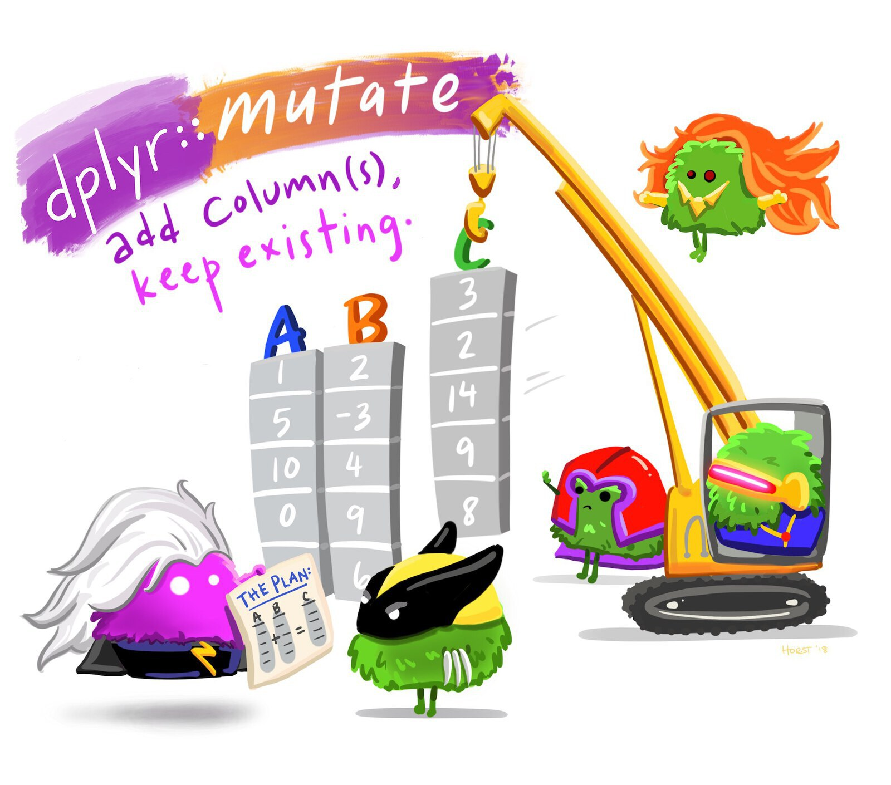

# Wrangling data {#sec-wrangling-data}

::: {.abstract}
This chapter introduces the essential skills of data wrangling, an important step in preparing data for analysis and presentation. You'll learn to load, filter, manipulate, and save datasets using R. This chapter guides you through handling tabular and Excel data formats, selecting relevant data, and applying functions from powerful R packages like tidyverse. By the end of this chapter you will be able to confidently transform raw data into a format ready for meaningful insights. Let’s dive in!
:::


::: {.callout-tip title="Before you start"}

1. Open Positron or -- if you already have Positron open -- start a new R session by clicking the **Restart R** (**&#10227;**) button in the **Console** panel. This makes sure no code you ran previously will interfere with the work you do in this chapter.
2. Make sure you are working in the crime mapping project workspace you created in @sec-create-project. In the top-right corner of the Positron window, you should see a folder icon and the words `crime-mapping`. If not, click the **File** menu, then **Open Folder ...** and choose the `crime-mapping` folder.
:::


```{r}
#| label: setup
#| echo: false
#| include: false

# Load packages
pacman::p_load(here, httr2, readxl, tidyverse)

# Load data
agg_assault_data <- crimemappingdata::aggravated_assaults
san_fran_rob <- crimemappingdata::san_francisco_robbery
```


## Introduction

A major step in using any data to make decisions or draw conclusions is *data wrangling*: the process of transforming data from the format in which we originally have it to the format needed to analyse and present it to our audience. 

<p class="full-width-image"></p>

By the end of this chapter, you will have learned how to:

- download CSV and Excel files into a project;
- load and inspect tabular data;
- select columns and filter rows;
- create and transform columns;
- summarise, count and arrange rows;
- combine several operations using the pipe operator; and
- save processed data without changing the original file.

To get started, create the first of two scripts used in this chapter:

1. Click the **File** menu in Positron, then click **New File ...**.
2. Type `chapter_03a.R` in the box marked **Select File Type or Enter File Name...**, then press .
3. Save the file in the `R` folder inside your `crime-mapping` workspace.

As we learned in @sec-first-map, permanent code needed to repeat the analysis belongs in this script. Temporary code that helps you inspect the data or develop the permanent code belongs in the R Console. Code chunks in this chapter are labelled to show where each piece of code belongs.


### Functions

In this chapter we will learn how to wrangle data in R using *functions* – specialised pieces of code that *do* something to the data we give them. The code to use a function (sometimes called *calling* the function) has two parts: the function name followed by a pair of parentheses, inside which are zero or more *arguments* separated by commas. Arguments are a way of providing input that a function works on, or to fine-tune the way the function works (we will see many examples of this later). Remember that you can identify a function in R because the name will always have parentheses after it.

One basic R function is `sqrt()`, which calculates the square root of a number. The `sqrt()` function has only one argument: the number that we want to find the square root of. If we typed the following code into the R Console, R would show us the square root of 2.

```{r}
#| eval: false
#| filename: "R Console"

sqrt(2)
```

When you run code in R, by default R prints the output of your code – in this case, just the number ``r format(sqrt(2), digits = 7)`` (for now, you can ignore the number `[1]` in square brackets).


### Packages

R contains thousands of different functions that do different things. A few functions are contained in the default installation of R that you have already installed (this is sometimes referred to as *base R*). But most functions are contained in *packages*, which are extensions to base R. Most packages focus on a particular type of data analysis, so that there are packages devoted to time-series analysis, testing whether events are clustered in particular places, network analysis and thousands of other tasks. Packages are often developed by experts in the field, and are typically updated to introduce new features.

To use a function from a package we need to do two things: _install_ that package on out computer, and then _load_ the package into our R session. You may see code that does these two steps separately, using the `install.packages()` function to install a package and the `library()` function to load it. However, in this book we use the `p_load()` function from the [pacman package](https://trinker.github.io/pacman_dev/) to do both steps in one line of code. `p_load()` checks whether a package is already installed on your computer, and if it is not, installs it automatically and then loads it. Do not add `install.packages()` to your scripts. Re-installing packages every time a script runs is unnecessary, slows the script down and can make it harder for someone else to run your code on their computer.

In this chapter we will use functions from the here, httr2, readxl and tidyverse packages, so add this code to `chapter_03a.R`:

```{r}
#| filename: "chapter_03a.R"

# Load packages
pacman::p_load(here, httr2, readxl, tidyverse)
```

Now run this code by clicking anywhere on that line of code then pressing  on your keyboard.


::: {.callout-tip collapse="true" title="Why does this line of code start with `pacman::`?"}

The pacman package is an R package that is used to manage other R packages. The `p_load()` function from that package is used to load packages. But we learned above that we must load a package before we can use it, which means we cannot use functions from the pacman package until we have loaded the pacman package. To get around that, instead of just using the function name `p_load()`, we can instead specify which package `p_load()` is from by prefixing the function name with the relevant package name, separated by `::`.
:::

<a href="https://tidyverse.org/" aria-label="Visit the tidyverse website"></a>

Many packages are focused on specialist tasks and so are only used occasionally, but a few packages are likely to be useful in almost all the code we write. Fortunately, packages can themselves load other packages, and all the main packages we need are loaded by the [tidyverse package](https://tidyverse.org/). That is why you will often see `pacman::p_load(tidyverse)` at the top of R code in subsequent chapters – that short line of code loads several packages containing hundreds of functions that we can use in data analysis.


::: {.callout-quiz .callout title="Data wrangling"}

```{r}
#| label: data-wrangling-quiz
#| echo: false

data_wrangling_quiz1 <- c(
  "The process of collecting data from multiple sources.",
  answer = "The process of transforming raw data into a format suitable for analysis.",
  "The process of visualizing data on a map.",
  "The process of cleaning corrupted data files."
)

data_wrangling_quiz2 <- c(
  "A visual representation of data.",
  "A mathematical formula used in graphs.",
  "A set of instructions for saving data.",
  answer = "A specialized piece of code that performs a task on data."
)
```


**What is the purpose of data wrangling?**

`r webexercises::longmcq(data_wrangling_quiz1)`


**In general, what is a _function_ in R?**

`r webexercises::longmcq(data_wrangling_quiz2)`


:::


## Loading data {#sec-read-data}

Before we can do anything with any data, we have to load it into R. In this course we will read tabular data in comma-separated values (CSV) and Excel formats, as well as spatial data in different formats (because there are lots of ways to store spatial data). We will learn how to read CSV and Excel data now, but leave loading spatial data until later.

_Tabular data_ (sometimes known as _rectangular data_) describes data formats with multiple columns where every column has the same number of rows. For example, crime data might have columns for the type of crime, date and address at which the crime occurred.

```{r}
#| label:  tabular-data
#| echo: false

tibble::tribble(
  ~type                      , ~date                                              , ~address         ,
  "homicide"                 , as_date(now(tzone = "UTC") - years(1) + days(10))  , "274 Main St"    ,
  "non-residential burglary" , as_date(now(tzone = "UTC") - months(5) + days(20)) , "541 Station Rd" ,
  "personal robbery"         , as_date(now(tzone = "UTC") - days(8))              , "10 North Av"
) |>
  dplyr::mutate(date = strftime(date, "%d %b %Y")) |>
  knitr::kable(caption = "Crime data in rectangular format")
```

Almost all the data we will use in this course will be in this rectangular format, and most of the functions we will use expect data to be rectangular.


### Loading CSV data

<a href="https://readr.tidyverse.org/" aria-label="Visit the readr package website"></a>

Data stored in CSV format is easy to load with the `read_csv()` function from the [readr package](https://readr.tidyverse.org). readr is one of the packages loaded by the tidyverse package, so all we need to do to use this package is include the code `pacman::p_load(tidyverse)` on the first line of our R script. We will use comments (lines of code beginning with `#`) to help explain the code as we go.

During this course, much of the data we use will come from the [crimemappingdata website](https://pkgs.lesscrime.info/crimemappingdata/). We will first download each original file to the `data/raw` folder and then load that local copy into R. Keeping a copy of the original data means that our analysis does not depend on repeatedly accessing a website, and that we can always return to the unchanged source file.

Add this code to the `chapter_03a.R` file and run it.

```{r}
#| filename: "chapter_03a.R"

# Download the data from a URL and store it in a local file
request(
  "https://mpjashby.github.io/crimemappingdata/san_francisco_robbery.csv"
) |>
  req_perform(path = here("data", "raw", "san_francisco_robbery.csv"))
```

The `request()` and `req_perform()` functions from the httr2 (pronounced 'hit-r two') package download the file, following the same pattern used in @sec-load-data. The `here()` function from the here package helps you specify where on your computer you want to store or retrieve a file inside the `crime-mapping` folder we created in @sec-create-project. In this case, `here()` specifies that the file should be stored in a file called `san_francisco_robbery.csv` inside the `raw` folder that is itself inside the `data` folder.

Now we've downloaded the data, we need to load it into R. Add this code to the script file and run it:

```{r}
#| filename: "chapter_03a.R"

# Load the local file into R
san_fran_rob <- read_csv(here("data", "raw", "san_francisco_robbery.csv"))
```

::: {.callout-tip collapse="true" title="What do the messages produced by `read_csv()` mean?"}

By default, the `read_csv()` function prints a message when it loads data to summarise the format of each data column. In the case of the `san_fran_rob` dataset, `read_csv()` tells us that: 

  * there is one column called `offense_type` that contains character (`chr`) values,
  * there are three columns called `uid`, `longitude` and `latitude` containing numeric (`dbl`) values, and
  * there is one column called `date_time` that contains values stored as dates and times (`dttm`).

There are some other possible types of data, but we will learn about these later on. The numeric values are referred to as `dbl` values because they are stored in a format that can handle numbers that are not whole numbers (e.g. 123.456). This format for storing numbers is called the _double-precision floating-point format_, which is often known as the double format for short. Most numbers in R are stored in double format, so you can think of the format code `dbl` as meaning 'numeric'. You don't need to remember that 'double' is short for double-precision floating-point format, just that it represents a number.
:::


This code loads the data using the `read_csv()` function and stores the result in an object named `san_fran_rob`. Objects are places where we can store data. To create an object and store our data in it, we use the assignment operator `<-` (a less-than sign followed by a dash). Rather than typing a less-than sign and a dash every time you need to assign a value to an object, you can instead use the keyboard shortcut  to type an assignment operator.


::: {.callout-important title="Object names can be overwritten"}

When choosing object names, it is important to remember that if you assign a value (such as the number `1` or the result of the function `read_csv()`) to an object name, R will overwrite any existing value of that object name. We can see this in a simple example:

```{r}
#| eval: false

one_to_ten <- 1:10
one_to_ten <- sqrt(2)
```

If we were to run this code, the object `one_to_ten` would not actually hold the numbers from one to ten, but instead the value `r format(sqrt(2), digits = 7)` (the square root of two). There is no way to undo assignment of a value to an object, so once you have run the code `one_to_ten <- sqrt(2)` it is not possible to recover any previous value that was assigned to the object `one_to_ten`. For that reason, it is generally a bad idea to reuse object names to store different values in the same script.
:::


Objects come in several different types, with tabular data typically being stored as a *data frame*. The `read_csv()` function produces a modern variation on the data frame called a *tibble*. Tibbles behave like data frames most of the time, but are designed to work conveniently with tidyverse functions. We will use tibbles throughout this course.

If the data are loaded successfully, R will list the columns in the data and the type of variable (numeric, date etc.) stored in each column.

To see the first few rows of data currently stored in an object, we can use the `head()` function. Remember that we run functions such as `head()` in the R Console, not in the script file, because it is temporary code (see @sec-permanent-code). Add this code to the R Console and run it by pressing :


```{r}
#| filename: "R Console"

head(san_fran_rob)
```


### Loading Excel data

<a href="https://readxl.tidyverse.org/" aria-label="Visit the readxl package website"></a>

Loading data from Microsoft Excel files is very similar to loading CSV data, with a few important differences. Functions to load Excel data are contained in the `readxl` package.

Create a second R script by repeating the Positron steps you used earlier. Name the file `chapter_03b.R` and save it in the `R` folder. Add the following code, then place the cursor on each statement and press  to run it.

```{r}
#| filename: "chapter_03b.R"

# Load packages
pacman::p_load(here, httr2, readxl, tidyverse)

# Download the data from a URL and store it in a local file
request(
  "https://mpjashby.github.io/crimemappingdata/aggravated_assaults.xlsx"
) |>
  req_perform(path = here("data", "raw", "aggravated_assaults.xlsx"))
```

Now we have downloaded our data, we can load it into R. Excel files can contain multiple _sheets_, so we need to specify which sheet we would like to load into a tibble. We can use the `excel_sheets()` function in the R Console to get a list of sheets in an Excel file:

```{r}
#| filename: "R Console"

# Get a list of sheets in an Excel file
excel_sheets(here("data", "raw", "aggravated_assaults.xlsx"))
```

We can now load the sheet containing data for Austin and view the first few rows
of the resulting object:

```{r}
#| filename: "chapter_03b.R"

agg_assault_data <- read_excel(
  here("data", "raw", "aggravated_assaults.xlsx"),
  sheet = "Austin"
)
```

and, as usual, we can use the `head()` function to look at the data:

```{r}
#| filename: "R Console"
head(agg_assault_data)
```

Now we have learned how to load our data into an object, we can use other R functions to work with that data in many different ways.


::: {.callout-important title="Use the right function for each file type"}

Different types of data are loaded into R with different functions, e.g. CSV files are loaded with the `read_csv()` function from the readr package and Microsoft Excel files are loaded with the `read_excel()` function from the readxl package. @sec-load-functions has a list of which function to use to load each type of file.

:::


::: {.box .reading}

[Learn more about importing data](https://r4ds.hadley.nz/data-import.html) in the current edition of the free online book [R for Data Science](https://r4ds.hadley.nz/).

Excel data can often be messy and the `readxl` package contains various other functions that can be used to deal with this. You can [learn more about how to handle messy Excel data in this online tutorial](http://lesscrime.info/post/cleaning-ons-data/).

:::


::: {.callout-quiz .callout title="Reading data"}

Answer the following questions to check your understanding of what we've learned so far in this chapter. If you get a question wrong, you can keep trying until you get the right answer.

```{r}
#| label: read-quiz
#| echo: false

read_quiz1 <- c("`readxl`", "`reader`", answer = "`readr`", "`readcsv`")
read_quiz2 <- c(
  "`message(san_fran_rob)`",
  "`summary(san_fran_rob)`",
  "`peak_inside(san_fran_rob)`",
  answer = "`head(san_fran_rob)`"
)
read_quiz3 <- c(
  "`10` (the number 10)",
  answer = "`1.414214` (the square root of 2)",
  "`10.41421` (10 plus the square root of 2)",
  "`14.14214` (10 times the square root of 2)"
)
```

**What R package contains the function `read_csv()` to read CSV data?**

`r webexercises::longmcq(read_quiz1)`

**What R code prints the first few rows of the tibble called `san_fran_rob`?**

`r webexercises::longmcq(read_quiz2)`

**If we create an object using the code `number_ten <- 10` and then run the code `number_ten <- sqrt(2)`, what value will the object `number_ten` now have?**

`r webexercises::longmcq(read_quiz3)`
:::


## Selecting columns

In this section we will learn how to reduce the size of our data by selecting only the columns we need and discarding the rest. This can be particularly useful if we are working with a very-large dataset, or if we want to produce a table containing only some columns.

<p class="full-width-image"></p>

We can use the `select()` function from the [dplyr package](https://dplyr.tidyverse.org/) (one of the packages that is loaded automatically when we call the `pacman::p_load(tidyverse)` function) to select columns.

If we wanted to select just the `date` and `location_type` columns from the `agg_assault_data` we loaded in the previous section, we can use this code:

```{r}
#| filename: "R Console"

select(agg_assault_data, date, location_type)
```

<a href="https://dplyr.tidyverse.org/" aria-label="Visit the dplyr package website"></a>

In a previous section, we mentioned that the code needed to run (or *call*) a function in R has two parts: the function name followed by a pair of parentheses, inside which are zero or more *arguments* separated by commas. The arguments in the `select()` function (and many other functions in the `dplyr` package) work in a slightly different way to many other functions. Here, the first argument is the name of the data object that we want to select from. All the remaining arguments (here, `date` and `location_type`) are the names of the columns we want to select from the data. 

We can select as many columns as we want, by just adding the names of the columns separated by commas. The columns in our new dataset will appear in the order in which we specify them in the `select()` function.

We can also use `select()` to rename columns at the same time as selecting them. For example, to select the columns `date` and `location_type` while also renaming `location_type` to be called `type`, we can use:

```{r}
#| filename: "R Console"

select(agg_assault_data, date, type = location_type)
```

`select()` removes any columns that we don't explicitly choose to keep. If we want to rename a column while keeping *all* the existing columns in the data, we can instead use the `rename()` function (also from the dplyr package):

```{r}
#| filename: "R Console"

rename(agg_assault_data, type = location_type)
```

Remember that functions in R generally do not change existing objects, but instead produce (or *return*) new ones. This means if we want to store the result of this function so we can use it later, we have to assign the value returned by the function to a new object (or overwrite the existing object, but this is a bad idea):

```{r}
#| filename: "R Console"

agg_assault_locations <- select(
  agg_assault_data,
  lon = longitude,
  lat = latitude
)

head(agg_assault_locations)
```


::: {.box .reading}

You can learn more about selecting, filtering and arranging data using the functions in the `dplyr` package by reading this [Introduction to dplyr tutorial](https://dplyr.tidyverse.org/articles/dplyr.html).

:::


::: {.callout-quiz .callout title="Selecting and renaming columns"}

```{r}
#| label: select-quiz
#| echo: false

select_quiz1 <- c(answer = "`rename()`", "`select()`")
select_quiz2 <- c("`rename()`", answer = "`select()`")
```

**Which `dplyr` function allows you to change the name of columns while keeping all the columns in the original data**

`r webexercises::longmcq(select_quiz1)`

**Which `dplyr` function allows you to choose only some columns in the original data?**

`r webexercises::longmcq(select_quiz2)`
:::


## Filtering rows

Often in crime mapping we will only be interested in part of a particular dataset. In the same way that we can *select* particular *columns* in our data, we can *filter* particular *rows* using the `filter()` function from the dplyr package.

<p class="full-width-image"></p>

If we were only interested in offences in the `agg_assault_data` dataset that occurred in residences, we could use `filter()`:

```{r}
#| filename: "R Console"

filter(agg_assault_data, location_type == "residence")
```

Note that: 

  * the column _name_ `location_type` is not surrounded by quotes (because it represents a column in the data) but the column _value_ `"residence"` is (because it represents the _literal_ character value "residence"), and
  * the `==` (equal to) operator is used, since a single equals sign `=` has another meaning in R.

We can filter using the values of more than one column simultaneously. To filter offences in which the `location_category` is 'retail' and the `location_type` is 'convenience store':

```{r}
#| filename: "R Console"

filter(
  agg_assault_data,
  location_category == "retail",
  location_type == "convenience store"
)
```

::: {.callout-important title="`filter()` returns rows that meet all the criteria you specify"}

When you run the code above, the result will contain only those rows in the original data for which the `location_category` column has the value 'retail' _and_ the `location_type` column has the value 'convenience store'.
:::

As well as filtering using the `==` (equals) operator, we can filter using the greater-than (`>`), less-than (`<`), greater-than-or-equal-to (`>=`) and less-than-or-equal-to (`<=`) operators. For example, we can choose offences that occurred in residences on or after 1 July 2019:

```{r}
#| filename: "R Console"

filter(
  agg_assault_data,
  location_type == "residence",
  date >= ymd("2019-07-01")
)
```

::: {.callout-tip collapse="true" title="What does the `ymd()` function do?"}

The `ymd()` function from the lubridate package (which we will find out more about below) converts a date stored as a text value to a value that R understands represents a calendar date. The function is called `ymd()` because it processes dates that are stored in year-month-date format. We will learn more about working with dates in @sec-mapping-time.
:::

Sometimes we will want to filter rows that are one thing *or* another. We can do this with the `|` (or) operator. For example, we can filter offences that occurred either in leisure facilities _or_ shopping malls on or after 1 July 2019:

```{r}
#| filename: "R Console"

filter(
  agg_assault_data,
  location_category == "leisure" | location_type == "mall",
  date >= ymd("2019-07-01")
)
```

If we want to filter offences that have any one of several different values _in the same column_, we can use the `%in%` (in) operator. To filter offences that occurred in either streets _or_ publicly accessible open spaces:

```{r}
#| filename: "R Console"

filter(agg_assault_data, location_category %in% c("open space", "street"))
```

The code `c("open space", "street")` produces what is referred to in R as a *vector* (sometimes referred to as an *atomic vector*, especially in error messages). A vector is a one-dimensional sequence of values of the same type (i.e. all numbers, all character strings etc.). For example, a vector might hold several strings of text (as in the vector `c("open space", "street")`) or a series of numbers such as `c(1, 2, 3)`. There is lots we could learn about vectors, but for now it's only necessary to know that we can create vectors with the `c()` or _combine_ function.

If we wanted to re-use a vector of values several times in our code, it might make sense to store the vector as an object. For example:

```{r}
#| filename: "R Console"

# Create vector of location types we are interested in
location_types <- c("open space", "street")

# Filter the data
filter(agg_assault_data, location_category %in% location_types)
```

Finally, you can filter based on the output of any R function that returns `TRUE` or `FALSE`. For example, missing values are represented in R as `NA`. We can test whether a value is missing using the `is.na()` function. If we wanted to remove rows from our data that had missing location types, we would filter for those rows that are *not* `NA`. We can do this by combining the `is.na()` function with the `!` (not) operator:

```{r}
#| filename: "R Console"

filter(agg_assault_data, !is.na(location_type))
```

This might be slightly confusing, but what R is doing in this case is:

1. identifying whether each row in the `agg_assault_data` dataset has a missing value in the `location_type` column (using the `is.na()` function), returning either `TRUE` (if the value is missing) or `FALSE` (if the value is not missing) for each row, then
2. reversing the `TRUE` and `FALSE` values (using the `!` operator), so that rows with missing values are now `FALSE` and rows without missing values are now `TRUE`, and finally
3. returning only those rows for which the result of step 2 is `TRUE` (i.e. those rows that do not have missing values in the `location_type` column).

The overall effect of this code is therefore to remove any rows that have missing values in the `location_type` column.

We will see lots more examples of how to use `filter()` in future chapters.


::: {.callout-quiz .callout title="Filtering rows"}

```{r}
#| label: filter-quiz
#| echo: false

filter_quiz1 <- c(
  "A type of object that stores a tibble or data frame",
  answer = "A type of object that stores a one-dimensional sequence of values of the same type",
  "A type of object that stores a one-dimensional sequence of values that can be of different types",
  "There is no such thing as a vector in R"
)
filter_quiz2 <- c(
  "Offences that occurred in both restaurants *and* in shopping malls (e.g. at restaurants inside shopping malls)",
  "Offences that occurred anywhere *except* restaurants or shopping malls (e.g. in homes)",
  "No offences, because the way the two criteria are combined is illogical",
  answer = "Offences that occurred either in restaurants *or* in shopping malls"
)
filter_quiz3 <- c(
  "greater than",
  "less than",
  answer = "less than or equal to",
  "greater than or equal to"
)
```

**What is a vector (sometimes known as an atomic vector) in R?**

`r webexercises::longmcq(filter_quiz1)`

**Which offences (rows) will be returned by the code `filter(agg_assault_data, location_type %in% c("restaurant", "mall"))`?**

`r webexercises::longmcq(filter_quiz2)`

**What does the `<=` operator mean?**

`r webexercises::longmcq(filter_quiz3)`

:::


## Transforming values

It is often useful to create new columns in our data, or change the values of existing columns. The `mutate()` function in the dplyr package gives us a way to transform existing columns in our dataset using almost any R function.

<p class="full-width-image"></p>

<a href="https://lubridate.tidyverse.org/" aria-label="Visit the lubridate package website"></a>

For example, say we wanted to create a new column in our aggravated-assault dataset specifying the day of the week on which each crime occurred. We can do this using the `wday()` function from the [lubridate package](https://lubridate.tidyverse.org/) (using the `label = TRUE` argument to produce weekday names, rather than numbers):

```{r}
#| filename: "R Console"

mutate(agg_assault_data, weekday = wday(date, label = TRUE))
```

We can also change existing columns. However (as with objects) there is no way to undo this, so you should only replace columns if you are sure you will not need them. For example, if we wanted to remove the time portion of the `date` variable (which may sometimes be useful, as shown in the next section) using the `as_date()` function (also from the lubridate package) and at the same time create the weekday variable:

```{r}
#| filename: "R Console"

mutate(
  agg_assault_data,
  date = as_date(date),
  weekday = wday(date, label = TRUE)
)
```

You may sometimes want to change only some values in a column. With a categorical variable, we can change one value to another using the `replace_values()` function from the dplyr package. Look at this code and use the comments (lines starting with `# `) to understand how it works.

```{r}
#| filename: "R Console"

mutate(
  agg_assault_data,
  location_category = replace_values(
    location_category,
    # We specify which existing values we want to convert into which new values
    # by providing the existing value on the left-hand side and the new value
    # on the right hand side, separated by a tilde (~) character
    "open space" ~ "public open space",
    "street" ~ "street or road"
  )
)
```

`replace_values()` keeps the existing value for any values that we have not specified.

We could also make changes based on more-complicated sets of criteria using the `case_when()` function, but we will return to that in a future chapter.

Functions used inside `mutate()` usually return one value for every row in the dataset. These are known as *vectorised* functions. A function such as `mean()` or `max()` instead returns a single summary value. R can repeat that value in every row if it is used inside `mutate()`, but that is usually not what we want. To reduce several rows to one summary row, we use the next data-wrangling function: `summarise()`.


::: {.callout-quiz .callout title="Transforming values"}

```{r}
#| label: transform-quiz
#| echo: false

transform_quiz1 <- c(
  "It permanently changes the original data, even if the result is not assigned.",
  answer = "It returns a tibble containing a new or changed column.",
  "It keeps only rows that contain the new value.",
  "It changes only the name of an existing column."
)
```

**What does `mutate(agg_assault_data, weekday = wday(date, label = TRUE))` return?**

`r webexercises::longmcq(transform_quiz1)`
:::


## Summarising rows {#sec-summarise}

Summarising data is often useful in crime analysis. We can use the `summarise()` function from the dplyr package to produce summaries of different columns in our data. There is an identical function called `summarize()` so that you do not have to remember whether to use the US or British spelling.

By default, `summarise()` collapses data into a single row, with each column summarised using a function that you specify. For example, we can calculate the mean longitude and latitude of the aggravated-assault locations.


```{r}
#| filename: "R Console"

summarise(
  agg_assault_data,
  mean_lng = mean(longitude, na.rm = TRUE),
  mean_lat = mean(latitude, na.rm = TRUE)
)
```


::: {.callout-tip collapse="true" title="What does the argument `na.rm = TRUE` do?"}

Lots of functions in R have an argument called `na.rm` that can be set to either `TRUE` or `FALSE`. Setting `na.rm = TRUE` in this case specifies that the  `mean()` function should remove (`rm`) any missing (`NA`) values before calculating the mean. 

If we do not specify this and our data contain any missing values, the `mean()` function will return `NA`. Functions in R do this because it is not possible to completely answer the question 'what is the mean of these values?' if some of the values are missing. 

This logic applies in lots of cases. For example, if you create an R object called `value` with the code `value <- 2` and then run the R code `value > 1`, you will get the answer `TRUE`. But if you set the object `value` to be `NA` using the code `value <- NA`, when you run the R code `value > 1` you will get the answer `NA`. This is because there is no way to know if the missing value represented by `NA` is greater than 1 or not. This is why it is often useful to calculate statistics such as a mean value after removing any missing values using the `na.rm = TRUE` argument.
:::


`summarise()` becomes more useful if we first divide our data into groups, since we then get a summary for each group separately. We can use the `.by` argument of the `summarise()` function to specify that we want separate summaries for each unique value of one or more columns in the data. For example, to produce a separate summary for each unique value of `location_category`, we can use this code:

```{r}
#| filename: "R Console"

summarise(
  agg_assault_data,
  mean_lng = mean(longitude, na.rm = TRUE),
  mean_lat = mean(latitude, na.rm = TRUE),
  .by = location_category
)
```

You can add multiple grouping variables using the `c()` (_combine_) function if you want to generate summary values for groups within groups:

```{r}
#| filename: "R Console"

summarise(
  agg_assault_data,
  mean_lng = mean(longitude, na.rm = TRUE),
  mean_lat = mean(latitude, na.rm = TRUE),
  .by = c(location_category, location_type)
)
```


### Counting rows

One very common way of summarising data is to count the number of rows in a dataset that have each unique value of one or more columns. For example, if we have a dataset of crimes in which each row represents a single crime, we might want to count how many crimes happened on each day of the week, or how many crimes of each type are in the dataset. We can use `summarise()` to do that, together with the `n()` function (from the same dplyr package as `summarise()`). For example, if we wanted to count how many rows in the `agg_assault_data` dataset had each unique combination of `location_category` and `location_type`:

```{r}
#| filename: "R Console"

summarise(agg_assault_data, n = n(), .by = c(location_category, location_type))
```

In this code, the `n()` function simply returns the number of rows of data in each group, i.e. the number of rows with each unique combination of values of `location_category` and `location_type`.

Since counting the number of rows in each group in a dataset is a very common task, dplyr includes another function called `count()` that allows you to do the same thing as in the code above, but with slightly less typing. So if you wanted to know how many aggravated assaults had occurred in each location category and type, you could use this code instead of using `summarise()`:

```{r}
#| filename: "R Console"

count(agg_assault_data, location_category, location_type)
```

Note that the first argument of `count()` is the dataset, and every subsequent argument specifies another variable that should be used to group the data.


::: {.callout-quiz .callout title="Summarising and counting rows"}

```{r}
#| label: summarise-quiz
#| echo: false

summarise_quiz1 <- c(
  "One row for every offence in the original data",
  answer = "One row for each unique combination of location category and location type",
  "One column for each unique location category",
  "Only rows that contain no missing values"
)
```

**What does `count(agg_assault_data, location_category, location_type)` return?**

`r webexercises::longmcq(summarise_quiz1)`
:::


## Arranging rows

It is sometimes useful to be able to place rows in a dataset into a particular order. We can do this using the `arrange()` function from the dplyr package. For example, we can sort the aggravated-assault data by date:

```{r}
#| filename: "R Console"

arrange(agg_assault_data, date)
```

By default, `arrange()` sorts rows in ascending order, i.e. it sorts numeric values from the smallest to the largest, dates from earliest to latest and character values alphabetically. We can instead sort values in descending order by wrapping the name of a column in the `desc()` function:

```{r}
#| filename: "R Console"

arrange(agg_assault_data, desc(date))
```

We can also sort the data based on multiple columns – the data are sorted first on the first column that you specify, with tied rows then sorted on the subsequent columns in order.

```{r}
#| filename: "R Console"

arrange(agg_assault_data, date, desc(location_type), location_category)
```


::: {.callout-quiz .callout title="Arranging rows in data"}

```{r}
#| label: arrange-quiz
#| echo: false

arrange_quiz1 <- c(
  answer = "`arrange(agg_assault_data, desc(date))`",
  "`arrange(agg_assault_data, date)`",
  "`filter(agg_assault_data, desc(date))`",
  "`arrange(desc(date), agg_assault_data)`"
)
```

**Which code arranges `agg_assault_data` from the latest date to the earliest?**

`r webexercises::longmcq(arrange_quiz1)`

In the R Console, type the code necessary to arrange `agg_assault_data` in order of latitude, in descending order (from largest to smallest). Once you've tried writing the code, if you need help you can click the 'Solution' button below.

`r webexercises::hide()`

`arrange(agg_assault_data, desc(latitude))`

`r webexercises::unhide()`
:::


## Saving data {#sec-saving-data}

Once we have finished wrangling a particular dataset, it is often useful to save it to a file so that we can use it again in future without going through all the steps of data wrangling again.

Most R functions that begin with `read_` (like `read_csv()` and `read_excel()`) have equivalent functions that begin `write_` and which save data into a particular file format. In this example, we will use the `write_csv()` function from the readr package, which is loaded when we load the tidyverse package.

In @sec-create-project we learned that it is important to keep our original downloaded data files _sterile_, i.e. not to change them after we have downloaded them. That means we can always go back to the original data if we need to. To help with that, we will keep any files we save after wrangling in a separate sub-folder inside the `data` folder called `processed`. This is a common practice in data analysis, and it is good to get into the habit of doing it from the start.


```{r}
#| eval: false
#| filename: "chapter_03b.R"

# Save the processed data without changing the original file
write_csv(
  agg_assault_counts,
  here("data", "processed", "aggravated_assault_counts.csv")
)
```

There are corresponding write functions for other types of data (which we will come back to when we learn how to handle spatial data), but in this course we will store most non-spatial data in CSV format because it can be read by many different programs.


::: {.callout-quiz .callout title="Saving processed data"}

```{r}
#| label: saving-quiz
#| echo: false

saving_quiz1 <- c(
  "It replaces the original downloaded file with the processed data.",
  "It saves the R script in the processed-data folder.",
  answer = "It keeps derived data separate while preserving the original download.",
  "It allows `write_csv()` to save an Excel workbook."
)
```

**Why should wrangled data be saved in `data/processed` rather than `data/raw`?**

`r webexercises::longmcq(saving_quiz1)`
:::


## Stringing functions together {#sec-pipe-operator}

In this chapter we have learned how to use the dplyr functions `select()`, `filter()`, `mutate()`, `summarise()` and `arrange()` to wrangle data from one format to another. Data wrangling is part of almost all data analysis, so these are skills we will use frequently.

Data wrangling often involves multiple steps. For example, we might want to load some data, select certain columns, filter some rows, mutate some of the variables, summarise the dataset and save the result. We can do each of these steps separately, assigning the result of each step to a new object.

```{r}
#| eval: false
#| filename: "chapter_03a.R"

# Select only the columns we need
robbery2 <- select(san_fran_rob, date_time)

# Filter only those offences that occurred in the first quarter of 2019
robbery3 <- filter(robbery2, as_date(date_time) <= ymd("2019-03-31"))

# Create a new weekday variable
robbery4 <- mutate(robbery3, weekday = wday(date_time, label = TRUE))

# Count how many offences occurred on each weekday
q1_weekday_counts <- count(robbery4, weekday)
```

This code works, but creates three intermediate objects as well as the final `q1_weekday_counts` object. Intermediate objects can be useful when debugging a complicated analysis. However, they also create the substantial risk that you will accidentally use the wrong intermediate object in a later step, which can often cause errors in your code that are hard to fix. For that reason, it is generally better to avoid creating intermediate objects unless you actually need them. 

Notice that: 

1. the first argument expected by `select()`, `filter()`, `mutate()` and `count()` is always the tibble produced by the previous step and
2. once each of `robbery2`, `robbery3` and `robbery4` has been created, it is never used again in the code.

For example, `filter()` uses the `robbery2` object created by `select()`, but after that `robbery2` is never used again. Whenever you write code that consists of several sequential steps in which (a) each step uses the data produced by the previous step and (b) the data produced by each step is only used once, there is a better way to do it. This method uses the `|>` (or _pipe_) operator. The pipe operator works by using the result of the code on the left-hand side of the pipe as the first argument to a function on the right-hand side. So the code `x  |> fun1() |> fun2()` starts with an object called `x`, uses that as the input to the function `fun1()`, then passes the result produced by `fun1()` and uses that as the input to `fun2()`.

It may be useful to read the pipe operator as 'and then', since piped code does the first thing *and then* the second thing with the result *and then* the third thing with the result of that, and so on. Piped code (sometimes called a *pipeline*) is a lot like the series of steps in a recipe.

For example, in the `chapter_03a.R` file, we can replace the four chunks of code that create the `robbery2`, `robbery3`, `robbery4` and `q1_weekday_counts` objects with a single code pipeline. Look at this code and the list below that explains what each line does.

```{r}
#| eval: false
#| filename: "chapter_03a.R"

# Produce counts of robberies each weekday
q1_weekday_counts <- san_fran_rob |> # <1>
  filter(
    # <2>
    as_date(date_time) >= ymd("2019-01-01"), # <2>
    as_date(date_time) <= ymd("2019-03-31") # <2>
  ) |> # <2>
  mutate(weekday = wday(date_time, label = TRUE)) |> # <3>
  count(weekday) # <4>
```
1. Take the `san_fran_rob` dataset, _and then_
2. filter the rows to keep only those that occurred in the first quarter of 2019, _and then_
3. create a new column called `weekday` that contains the day of the week on which each robbery occurred, _and then_
4. count how many robberies occurred on each weekday.

You might not find the pipe operator completely intuitive at the moment, but it will become easier as you see more examples in future chapters.


::: {.callout-tip collapse="true" title="What about the `%>%` pipe operator?"}

If you have learned any R coding before, you might have learned to use the `%>%` pipe operator from the magrittr package. The `%>%` pipe operator was introduced several years ago to allow people to construct pipelines of code in R. The `%>%` operator was so widely used that the team that writes the R programming language decided to provide the `|>` pipe operator in R itself, to avoid the need to load the magrittr package. You might sometimes see the `|>` referred to as the _native_ pipe operator.

You will still see the `%>%` pipe operator used in lots of R code examples online, and in code produced by AI tools that were trained on old data. In many straightforward pipelines, `%>%` can be replaced with the R pipe operator `|>`, since they work in similar ways. There are some differences between them, so do not assume every advanced example can be converted without changes.
:::


::: {.callout-quiz .callout title="Constructing pipelines"}

```{r}
#| label: pipe-quiz
#| echo: false

pipe_quiz1 <- c(
  "It saves each intermediate result as a separate file.",
  answer = "It passes the result of one step to the next function.",
  "It automatically corrects errors in each function.",
  "It changes temporary Console code into permanent code."
)
```

**What does the pipe operator `|>` do?**

`r webexercises::longmcq(pipe_quiz1)`
:::


## Complete scripts

As a final exercise, use the information in @sec-saving-data to add to `chapter_03a.R` the code needed to save the weekday counts in a new file called `q1_weekday_counts.csv` in the `processed` sub-folder within the `data` folder. 

Once you've done that, the `chapter_03a.R` script file should look like this:

```{r}
#| eval: false
#| file: "../R/chapter_03a.R"
#| filename: "chapter_03a.R"
```

Now complete `chapter_03b.R` by: 

1. adding a pipeline that counts aggravated assaults by location category and weekday, then
2. adding the code needed to save the result in a new file called `aggravated_assault_counts.csv`, stored in the relevant folder.

```{r}
#| eval: false
#| file: "../R/chapter_03b.R"
#| filename: "chapter_03b.R"
```

Save both scripts by pressing . To check that the scripts are reproducible, restart R using the **Restart R** (**&#10227;**) button in Positron's **Console** panel, then run each script from beginning to end.


::: {.callout-note title="Keep these files"}

Keep `chapter_03a.R` and `chapter_03b.R` in the `R` folder. Also keep the downloaded files in the `data/raw` folder and the two CSV files in the `data/processed` folder. The raw files should remain unchanged: if you want to alter the data, change the R code and create a new processed file.
:::


## In summary

You have learned a lot in this chapter! You now know how to:

- download CSV and Excel files into `data/raw`;
- load and inspect tabular data;
- select columns and filter rows;
- create and transform columns;
- summarise, count and arrange rows;
- combine several operations using the pipe operator; and
- save derived data in `data/processed` while preserving the original files.

**Well done!**


::: {.box .reading}

Developing your data wrangling skills will help you to produce better, faster
analysis of crime (and other) data. If you would like to develop your skills
further, you might be interested in:

  * [Data Wrangling with R](https://cengel.github.io/R-data-wrangling/) by
    Claudia Engel, a free online book that explains the functions introduced in
    this tutorial (and some others) in more detail.
  * [Data transformation with dplyr cheat sheet](https://opensource.posit.co/resources/cheatsheets/data-transformation/data-transformation.pdf) 
    by Posit, which provides a handy two-page guide to the
    main functions in the `dplyr` package, which is very useful for reminding 
    you of the code needed to run each of the functions we have used in this 
    tutorial.
  * [R for Data Science (second edition)](https://r4ds.hadley.nz/) by Hadley Wickham, Mine Çetinkaya-Rundel and Garrett Grolemund, a widely used free introduction to data analysis with R.
    
:::


::: {.callout-quiz .callout title="Revision questions"}

Answer these questions to check you have understood the main points covered in this chapter. Write between 50 and 100 words to answer each question.

1. What is data wrangling, and why is it an important step in data analysis?
2. Describe the difference between loading data from a CSV file and an Excel file in R. What additional steps are required when working with Excel files?
3. What is the purpose of the `select()` function in the dplyr package? How can it be used to both choose and rename columns? Include a brief example in your explanation.
4. Explain how `pacman::p_load()` makes packages available and why you should not include `install.packages()` in an R script file.
5. What are the benefits of using the pipe (`|>`) operator in R?
:::


<p class="credits"><a href="https://allisonhorst.com/">Artwork by Allison Horst</a></p>
