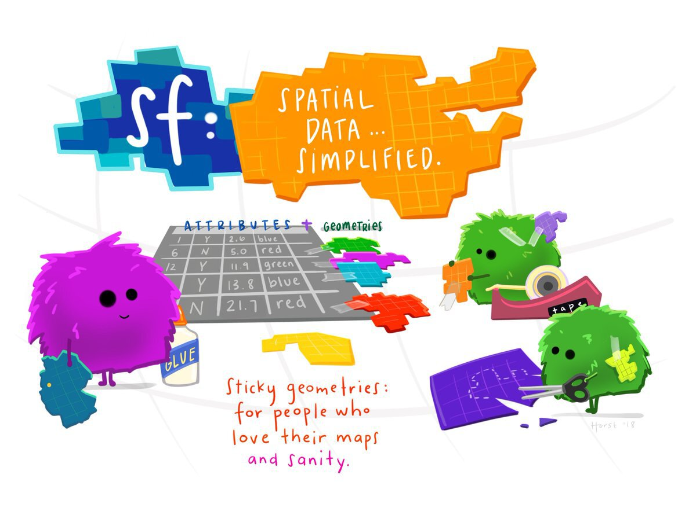
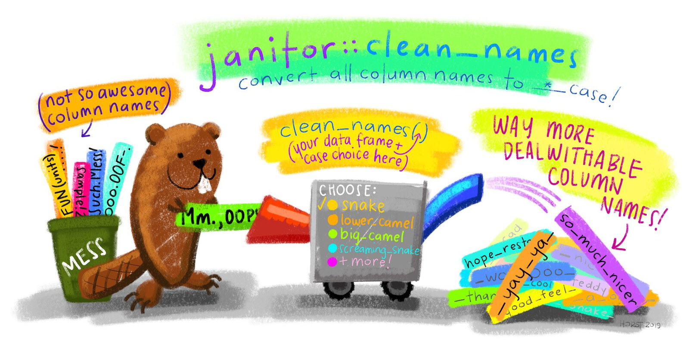
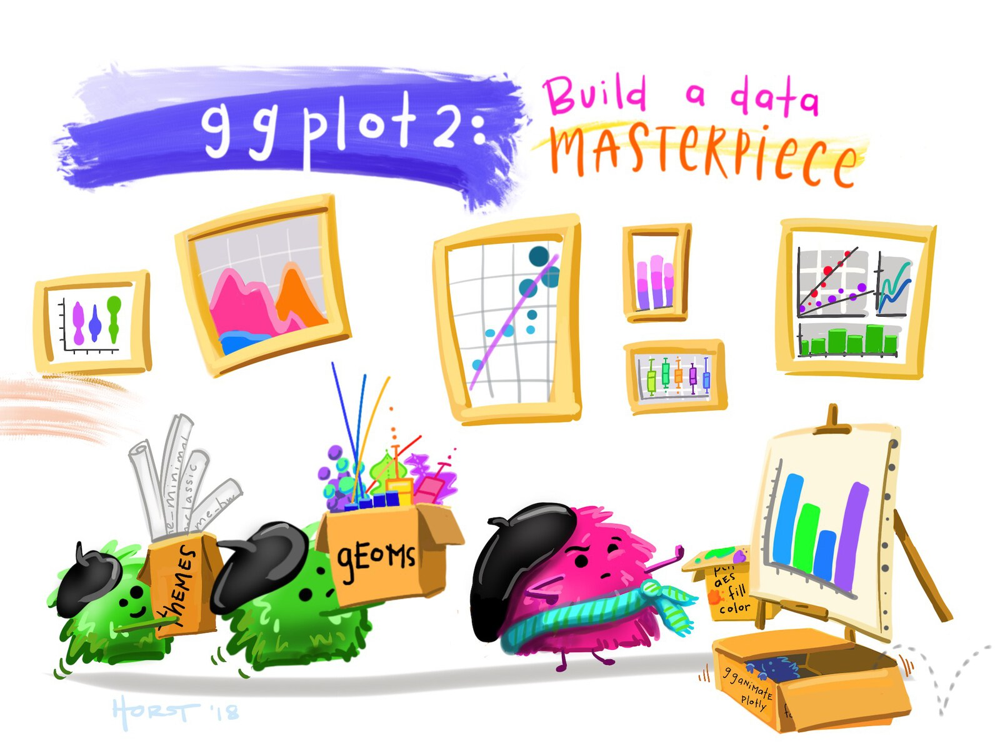

# Your second crime map {#sec-second-map}

::: {.abstract}
In @sec-first-map you learned the basics of creating a crime map in R. In this chapter we will create a second crime map, this time focusing a bit more on the details. You will learn more about working with spatial data, including how to load data and convert it into a format suitable for mapping. By the end of this chapter you'll be able to visualise crime data effectively, creating a clear and accurate map. Let's dive into the process and start mapping!
:::


::: {.callout-tip title="Before you start"}

1. Open Positron or -- if you already have Positron open -- start a new R session by clicking the **Restart R** (**&#10227;**) button in the **Console** panel. This makes sure no code you ran previously will interfere with the work you do in this chapter.
2. Make sure you are working in the crime mapping project workspace you created in @sec-create-project. In the top-right corner of the Positron window, you should see a folder icon and the words `crime-mapping`. If not, click the **File** menu, then **Open Folder ...** and choose the `crime-mapping` folder.
:::


```{r}
#| label: setup
#| echo: false
#| include: false

# Load packages
pacman::p_load(ggspatial, here, httr2, patchwork, sf, tidyverse)
```


## Introduction

In @sec-first-map we produced a simple map of a particular type of crime in a neighbourhood, but we skipped over a lot of the details of how to do it. In this chapter we will make another crime map, this time focusing more on each step in the process. We will then build on this in @sec-mapping-patterns to make a better crime map.

In this chapter we will make a map of bicycle thefts in Vancouver in 2020. By the end of the chapter, you will have produced this map:

```{r}
#| label: show-final-map
#| echo: false
#| message: false
#| fig-align: center
#| fig-alt: "A point map of bicycle thefts in Vancouver in 2020. Many semi-transparent points overlap, especially in the north-central part of the city, making the overall pattern difficult to interpret."
#| file: "../R/chapter_04.R"
#| out-width: 80%
```

This isn't a finished map, because it's missing some of the vital elements that we'll learn about in @sec-mapping-patterns. But this map is a useful step on your journey towards being an experienced crime mapper.

By the end of this chapter, you will have learned how to:

- describe how points, lines, polygons and rasters represent spatial data;
- explain why spatial data need a co-ordinate reference system;
- convert co-ordinate columns into an SF object;
- filter an SF object to select particular crimes; and
- create and style a basic crime map using ggplot2.

The process we will use to produce the map has four main stages:

::::: {.process}

:::: {.item color="#3182bd"}
Download

::: annotation
from the internet
:::
::::

:::: {.item color="#3182bd"}
Load

::: annotation
from a file into an R object
:::
::::

:::: {.item color="#3182bd"}
Wrangle

::: annotation
into the correct format for mapping
:::
::::

:::: {.item color="#3182bd"}
Visualise

::: annotation
map based on wrangled data
:::
::::

:::::


## Handling spatial data

Maps are visual representations of spatial data. Spatial data is special because each row in the data is associated with some geographic feature such as a building, a street or the boundary of a neighbourhood. This adds some quirks that we have to understand to work with spatial data successfully.

Maps are made up of multiple layers of spatial data that are styled to represent features of interest and then stacked on top of one another to make the finished map. Watch this video to learn more about spatial layers and the different types of data that we can use in maps.




::: {.callout-quiz .callout title="Spatial data"}

```{r}
#| label: spatial-data-quiz
#| echo: false

spatial_data_quiz1 <- c(
  "Points, polygons, and events",
  answer = "Points, lines, and polygons",
  "Layers, rasters, and vectors",
  "Features, base maps, and grid cells"
)

spatial_data_quiz2 <- c(
  "To provide a single layer showing all features on a map",
  "To allow individual access to points, lines, and polygons",
  "To replace all other map layers",
  answer = "To simplify data by combining and styling different features"
)

spatial_data_quiz3 <- c(
  "The map becomes easier to interpret",
  "The map’s layers automatically simplify",
  answer = "The data becomes harder to work with and visualise effectively",
  "The map’s scale adjusts to include all details"
)

spatial_data_quiz4 <- c(
  "A dataset storing only lines and polygons",
  answer = "A grid of cells that simplifies data by representing features with single values",
  "A detailed layer that preserves all original data",
  "A stack of feature layers"
)

spatial_data_quiz5 <- c(
  "Most files cannot handle large amounts of data",
  "It is easier to create maps with fewer data files",
  answer = "In most spatial data formats, each file is limited to storing points, lines, or polygons, not all three",
  "Storing all features in one file makes maps less detailed"
)
```


**Which of the following best describes the three ways computers store spatial features?**

`r webexercises::longmcq(spatial_data_quiz1)`


**What is the purpose of a base map in mapping?**

`r webexercises::longmcq(spatial_data_quiz2)`


**What happens when too much detail is included on a map?**

`r webexercises::longmcq(spatial_data_quiz3)`


**What is a raster layer?**

`r webexercises::longmcq(spatial_data_quiz4)`


**Why is it common to store data about different types of features in separate files?**

`r webexercises::longmcq(spatial_data_quiz5)`


:::


Points, lines and polygons in spatial data are known as *geometric objects* or simply *geometries*. Spatial data is data that has a geometric object (e.g. a pair of co-ordinates representing a crime location) associated with each row.


### Representing places on the earth

With any spatial data, we need a way of describing where on the earth a particular point (such as the location of a crime or the corner of a building) is located. Watch this video to find out about the different co-ordinate systems we can use to do this.




::: {.callout-quiz .callout title="Representing places on Earth"}

```{r}
#| label: places-quiz
#| echo: false

places_quiz1 <- c(
  "To measure the distance between two locations",
  answer = "To specify a location on the Earth’s surface relative to a reference point",
  "To calculate the area of a geographic region",
  "To determine the altitude of a point on the Earth"
)

places_quiz2 <- c(
  "Latitude and altitude",
  "Longitude and elevation",
  "Latitude and grid distances",
  answer = "Latitude and longitude"
)

places_quiz3 <- c(
  "They are too small to measure accurately",
  "They are not precise enough for spatial analysis",
  answer = "They do not correspond to easily understandable units like metres",
  "They only work in polar regions"
)

places_quiz4 <- c(
  answer = "The map may have errors or show distorted features",
  "The map will automatically adjust to the correct region",
  "The dataset will not load",
  "The co-ordinates will convert to the nearest global standard"
)

places_quiz5 <- c(
  "Guess based on the region it represents",
  "Check the size of the dataset file",
  answer = "Ask the person or organization that provided the data",
  "Compare it with another dataset from a different region"
)
```


**What are co-ordinates used for?**

`r webexercises::longmcq(places_quiz1)`


**What is the geographic co-ordinate system based on?**

`r webexercises::longmcq(places_quiz2)`


**Why are degrees of latitude and longitude difficult to use for everyday measurements?**

`r webexercises::longmcq(places_quiz3)`


**What can happen if you use a co-ordinate system designed for a different part of the globe?**

`r webexercises::longmcq(places_quiz4)`


**What is a practical way to find out which co-ordinate system a dataset uses if it’s not embedded in the file?**

`r webexercises::longmcq(places_quiz5)`


:::


## Spatial data in R

<p class="full-width-image"></p>

<a href="https://r-spatial.github.io/sf/" aria-label="Visit the sf package website"></a>

There are several packages that handle raster map data from different sources – one of them is the [ggspatial package](https://paleolimbot.github.io/ggspatial/) that we have already used to load the base map of Atlanta for the homicide map we made in @sec-first-map. One of the most important spatial packages is the [sf package](https://r-spatial.github.io/sf/), which we use to handle spatial vector data. _SF_ stands for 'simple features', which is a standard for storing spatial data. SF objects are data frames that have a special column to hold the geometry (point, line or polygon) associated with each row in the data. SF objects also understand what co-ordinate system the geometry are described in. This means SF objects can be transformed between co-ordinate systems and combined together in layers on a map.

There are lots of functions in the sf package for handling spatial data. Almost all of these functions begin with the letters `st_` (e.g. `st_read()`), which makes it easy to identify that those functions are designed to be used on SF objects.


::: {.callout-important title="Functions in the sf package start with the letters `st_`"}

The names of almost all functions in the sf package start with the letters `st_`, _not_ the letters `sf_`.
:::


### Reading spatial data

To get started, create a new R script file to hold the permanent code for this analysis. Give the file the name `chapter_04.R` and save it in the same directory as the R script files we created in previous chapters. You can remind yourself how to do that by looking back to @sec-permanent-code.

Now add the code needed to load the packages we will use for this map, then run that line of code. You can remind yourself how to load packages and run code in Positron by looking back to @sec-loading-packages.

```{r}
#| filename: "chapter_04.R"

# Load packages
pacman::p_load(here, httr2, sf, tidyverse)
```

The special features of spatial data -- needing to store geometries, details of the projection used etc. -- mean that spatial data is often stored in special file formats. There are lots of spatial-data formats, but fortunately almost all of them can be read by the `st_read()` function. This means we do not need to learn a different function for each spatial-data format.

While datasets with line or polygon geometries must almost always be stored in specific spatial-data formats, point data can also be stored in common data formats such as Excel and <abbr title="comma-separated values">CSV</abbr> files. The [data for this chapter](https://geodash.vpd.ca/opendata/) is provided by the Vancouver Police Department in a CSV file (gzipped to reduce the file size).

As in @sec-load-data, we will use R to download the file into the `data/raw` folder before we read it. This makes the analysis more reproducible: the script records where the data came from, and the local copy remains available if the website is temporarily unavailable later.

::: {.callout-quiz .callout title="Downloading and loading data from a CSV file"}

Thinking back to what we learned in @sec-load-data, add code to `chapter_04.R` that downloads the dataset to `data/raw/vancouver_thefts.csv.gz`, then loads the local file and stores the data in an object called `thefts`. If you need help, you can click the 'Solution' button below.

`r webexercises::hide()`

We can use `request()` and `req_perform()` from the httr2 package to download the file, then use `read_csv()` from the readr package to load the local copy. The assignment operator `<-` stores the loaded data in the object `thefts`.

```{r}
#| filename: "chapter_04.R"
#| output: false

# Download data to a local file
request(
  "https://mpjashby.github.io/crimemappingdata/vancouver_thefts.csv.gz"
) |>
  req_perform(path = here("data", "raw", "vancouver_thefts.csv.gz"))

# Load the data into R
thefts <- read_csv(here("data", "raw", "vancouver_thefts.csv.gz"))
```
  


`r webexercises::unhide()`

:::

::: {.callout-tip collapse="true" title="What does the `.gz` at the end of the file name mean?"}

CSV files can hold very large amounts of data, but at the cost of the size of the file becoming very large. We can reduce the size of a CSV file (or most other types of file) by compressing the file. You may be familiar with `.zip` compressed files. [Gzip](https://en.wikipedia.org/wiki/Gzip) is another way of compressing files. Gzipped files have the file extension `.gz`. `read_csv()` can automatically decompress gzipped files, so we can treat a gzipped CSV file just the same as an uncompressed CSV file.
:::

::: {.callout-quiz .callout title="Viewing the first few rows of a dataset"}

Now that you have stored the data in the `thefts` object, what code is needed to view the first few rows of data? Type the code into the R Console (_not_ the script file -- see @sec-permanent-code) and run it. Click the 'Solution' button to check your code.

`r webexercises::hide()`

```{r}
#| eval: false
#| filename: "R Console"

head(thefts)
```

`r webexercises::unhide()`

:::


### Reading data files from your computer

The Vancouver thefts dataset consists of `r scales::comma(nrow(thefts))` rows, each representing one theft. Before we can map this data, we will need to do some minor data wrangling to get it into the format we want.

In the previous section, we downloaded the Vancouver theft data and then loaded the local file from `data/raw`. To load any file stored on our computer, R needs a _file path_ that specifies where the file is stored.

You might have encountered file paths before, but you may not. A typical file path looks like this on a Mac or Linux computer:

```{r}
#| eval: false
#| filename: "Do not run this code"
#| classes: "bad_code"

/Users/john_smith/Documents/crime-mapping/data/raw/vancouver_thefts.csv
```

or like this on Windows:

```{r}
#| eval: false
#| filename: "Do not run this code"
#| classes: "bad_code"

C:\Users\john_smith\Documents\crime-mapping\data\raw\vancouver_thefts.csv
```

The important thing to note here is that computers store files such as `vancouver_thefts.csv` in folders (also called directories), which are themselves often stored inside larger folders, etc. A file path tells a computer where to find a particular file. The file paths above can be read as telling the computer to open the `Users` directory, then the `john_smith` directory, then the `Documents` directory, then the `crime-mapping` directory (which you created in @sec-create-project), and finally the file `vancouver_thefts.csv`.

The two file paths shown above are called _absolute_ file paths, because they show the full location of a particular file on the computer. Absolute file paths on Windows start with `X:\` (where `X` is a letter representing which disk drive the file is on) and with `/` on Mac and Linux. But there are two problems with absolute paths: they can be very long so they clutter up your code, and (more importantly) they are only correct for a specific computer. If you write an R script that includes either of the file paths above, then you give that file for me to run, the code will immediately produce an error because there is no directory `/Users/john_smith` on my computer.

::: {.callout-important title="Never put absolute file paths in your code"}

Including absolute file paths in your code drastically increases the chances of errors when you or someone else tries to run the code on a different computer, or when you try to re-run the code later when the locations of files on your computer have changed. Always use relative file paths instead.

:::


We can deal with that problem in a few ways. Fortunately, it's quite simple to do as long as we always remember to:

- work inside the project folder we created in @sec-create-project, and
- use the `here()` function from the here package to specify the location of files as _relative paths_, where 'relative' means relative to the project folder.

When you open the `crime-mapping` workspace in Positron, R knows to interpret relative file paths as being relative to the workspace folder. You can confirm the current working directory by running the function `getwd()` in the R Console (the 'WD' in `getwd()` means 'working directory').

We can construct a file path in two ways using the `here()` function. The first, which we've been using up to now, is to specify each nested folder or file as a separate argument to the `here()` function. For example, to open the file `vancouver_thefts.csv` in the `raw` folder that is itself inside the `data` folder, we would use:

```{r}
#| filename: "R Console"
#| eval: false

here("data", "raw", "vancouver_thefts.csv")
```

Alternatively, we can specify the file path as a single string, with each folder separated by a forward slash (`/`). For example:

```{r}
#| filename: "R Console"
#| eval: false

here("data/raw/vancouver_thefts.csv")
```

You'll notice that when you run this code in the R Console, R prints the full file path to the file on your computer. That means you can pass the result of the `here()` function to any function that needs a file path, and R will know where to find the file. We have already done this in the code that loads the Vancouver thefts dataset, where we used `here("data", "raw", "vancouver_thefts.csv.gz")` as the file path to the local copy of the data.

Since both ways of using the `here()` function give the same result, you can choose to use either.

### Cleaning column names

<p class="full-width-image"></p>

Typos are one of the most frequent causes of errors in any coding language. One way to avoid typos is to follow some basic rules when we write code. We will learn more about these rules in @sec-code-style, but for now we can just learn one rule: column names in datasets should use what is known as `snake_case`, i.e. they should be all lower case and words should be separated by underscore characters (`_`). This makes your code easier to read and means you don't have to remember whether you called a column `crime_count`, `crimecount`, `CrimeCount` or `CRIMECOUNT`. 

<a href="https://sfirke.github.io/janitor/" aria-label="Visit the janitor package website"></a>

At the moment, the column names in the `thefts` dataset are upper-case letters. Rather than having to remember this, we can easily convert them to snake case using the `clean_names()` function from the [janitor package](https://sfirke.github.io/janitor/). 

To use a function from a package, we usually first load the package using the `pacman::p_load()` function at the very start of a script. In this case, we probably won't want to use any other functions from the `janitor` package, so instead of loading the whole package we will use this one function directly. To do this, we write the function name with the package name added to the front, separated by two colons `::`.

```{r}
#| filename: "R Console"

janitor::clean_names(thefts)
```

Since we always want the column names to be snake case, there's no need for us to create a version of the data that holds the column names before we've cleaned them. Instead, we can use the pipe operator to add `janitor::clean_names()` to the code that we have already written to load the data from the CSV file. This means that the data will be loaded and the column names cleaned in one step, and we can store the result in the `thefts` object.

```{r}
#| filename: "chapter_04.R"
#| output: false

# Load the data into R
thefts <- here("data", "raw", "vancouver_thefts.csv.gz") |> # <1>
  read_csv() |> # <2>
  janitor::clean_names() # <3>
```
1. Find the location of the Vancouver thefts dataset on the specific computer you are using.
2. Load the data from the CSV file into R.
3. Clean the column names so they are in `snake_case`.

Add the code above to the `chapter_04.R` file and run that line of code. If you now run `head(thefts)` in the R Console, you will see that the data has stayed the same but all the column names are now in snake case. `clean_names()` would also have replaced any spaces with underscores, tried to separate words in the variable names and cleaned up several other potential problems. For this reason it is common to call `janitor::clean_names()` straight away after loading a dataset so that you can be confident that the column names will be in the format you expect.

If we wanted to use the `clean_names()` function again, we would have to include the package name and `::` each time, so if our code was going to make repeated use of the function then it would probably be easier to load the package using
the `pacman::p_load()` function as we have done in previous chapters.


### Converting our data to an SF object

At present, the data in the `thefts` object is just a regular tibble. We could not use it to make a map because R does not know which columns represent the geometry, or what co-ordinate system the locations are recorded in. We can deal with this by converting the data to an SF object using the `st_as_sf()` function from the `sf` package.

The data provided by the Vancouver Police use the UTM zone 10N co-ordinate system. <abbr title="Universal Transverse Mercator">UTM</abbr> is a system for assigning co-ordinates to any location on earth relative to a designated local reference point for the UTM zone covering that part of the planet. The 'N' at the end of the zone name 10N refers to the northern hemisphere.

::: {.callout-important title="Co-ordinate reference systems are specific to one part of the globe"}

In almost all cases, co-ordinate reference systems only work for the part of the world that they were designed for. So we should not use the UTM zone 10N co-ordinate system to map data outside the area for which it was designed (broadly speaking, the west coast of North America from Los Angeles to Vancouver, and the part of Canada directly north of Vancouver extending most of the way to the north pole). If we were to use the UTM zone 10N co-ordinate system for data from another part of the world, we would be very likely to get error messages or strange results.
:::


```{r}
#| label: make-utm-map
#| eval: false
#| echo: false

vancouver <- st_point(c(-123.1207, 49.2827), dim = "XY") |> 
  st_sfc(crs = 4326) |> 
  st_as_sf() |> 
  mutate(name ="Vancouver")

land <- suppressMessages(rnaturalearth::ne_download(
  scale = 50, type = "land", category = "physical", returnclass = "sf"
)) |> 
 
 
 
  filer(scalerank == 0)

utm_zones <- st_read("https://opendata.arcgis.com/datasets/b294795270aa4fb3bd25286bf09edc51_0.geojson") |> 
  janitor::clean_name
  s() |> 

  mutate(
    hemisphere = ifelse(row %in% LETTERS[1:13], "southern", "northern")
  ) |> 
  selet(zone, hemisphere, geometry) |> 
  group_by(zone, hemisphere) |> 
  summarise()

bbox <- utm_zones |> 
  filter(zone %in% 812, hemisphere == "northern") |> 
  st_buffer(1) |> 
  st_bbox()

utm_centroids <- utm_zones |> 
  st_centroid() |> 
  mutate(
    zone_label = str_glue("zone {zone}{str_to_upper(str_sub(hemisphere, 1, 1))}")
  ) |> 
      
    
  st_cop(bbox)

utm_vancouver <- ggplot() +
  geom_sf(data = st_crop(land, bbox), colour = NA) +
  geom_sf(
    data = st_crop(st_cast(utm_zones, "LINESTRING"), bbox), 
    colour = "grey50", 
    fill = NA, 
    linetype ="24"
  ) +
  geom_sf(
    data = st_crop(filter(utm_zones, zone == 10, hemisphere == "northern"), bbox),
    colour = "black
      ", 
     
    
    fill = NA
  ) +
  geom_sf(data = vancouver) +
  geom_sf_text(aes(label = zone_label), data = utm_centroids) +
  geom_sf_label(
    aes(label = name), 
    data = vancouver, 
    fill = "grey90", 
    hjust = 0, 
    nudge_x = .3, 
    label.size = 0
  ) +
  scale_x_continuous(expand = c(0, 0)) +
  scale_y_continuous(limits = c(41, 51), expand = c(0, 0)) +
  labs(
    title = "Vancouver in UTM zone 10N", 
    x = NULL, 
    y = NULL,
    caption = "Made with Natural Earth. Free vector and raster map data @ naturalearthdata.com"
  ) +
  theme_minimal() +
  theme(plot.caption = element_text(colour = "grey50"))

ggsave(
  here::here("images/utm_vancouver.jpg"), 
  utm_vancouver, 
  width = 800 / 50, 
  height = 500 / 150 
  dpi = 150
)
```

```{r}
#| label: utm-map
#| echo: false
#| fig-align: center
#| fig-alt: "A map showing Vancouver in UTM zone 10N. The neighbouring UTM zones 8N to 12N are also shown as vertical strips across western North America."
#| out-width: 80%

knitr::include_graphics(here::here("images/utm_vancouver.jpg"))
```

We can convert the `thefts` tibble to an SF object using the `st_as_sf()` function (remember, all functions in the `sf` package start with `st_`, which can sometimes make the function names a little confusing). We specify which columns in the data represent the geometry (in this case, the `x` and `y` columns), and what co-ordinate system the data uses. 

Co-ordinate systems can be specified in lots of ways (some very complicated), but the easiest is to specify the <abbr title="European Petroleum Survey Group">EPSG</abbr> code for the relevant system. An EPSG code is a unique reference number for a particular co-ordinate system that R can look up in a database to get the information needed to display the data on a map. The EPSG code for the UTM zone 10N is `EPSG:32610`.

We only need the version of the thefts data that is a spatial dataset, so we can again add the code needed to convert the `thefts` tibble to an SF object to the pipeline we have already created. This means that the data will be loaded, cleaned and converted to an SF object in one step, and we can store the result in the `thefts` object.

Change the existing code in `chapter_04.R` so that it includes the `st_as_sf()` function in the pipeline, and run that line of code. 

```{r}
#| filename: "chapter_04.R"

# Load the data into R
thefts <- here("data", "raw", "vancouver_thefts.csv.gz") |> # <1>
  read_csv() |> # <2>
  janitor::clean_names() |> # <3>
  st_as_sf(coords = c("x", "y"), crs = "EPSG:32610") # <4>
```
1. Find the location of the Vancouver thefts dataset on the specific computer you are using.
2. Load the data from the CSV file into R.
3. Clean the column names so they are in `snake_case`.
4. Convert the tibble to an SF object, specifying which columns represent the geometry and what co-ordinate system the data uses.

If you look at the contents of the `thefts` object by running `head(thefts)` in the R Console, you'll see that there is a new column called `geometry`. This column contains the co-ordinates of each bike theft. But crucially, it stores those co-ordinates in a format that R recognises represent specific locations on the surface of the earth, which means the co-ordinates can be used to make maps.


::: {.callout-important title="Only convert non-spatial data with `st_as_sf()`"}

It is important to remember that we should only use `st_as_sf()` to convert a *non-spatial* dataset (such as a tibble) into a spatial dataset (an SF object). If we use `st_as_sf()` on an object that is already an SF object, this can have unexpected results and lead to errors in your code.

The easy way to think about this is that if you have loaded a dataset with `read_sf()` or `st_read()` then you have already created an SF object, so you don't need `st_as_sf()`. If you have loaded a dataset with any other function that reads data (such as `read_csv()` or `read_excel()`) then you will need to use `st_as_sf()` if you want to plot the data on a map. Most importantly, do not use `st_as_sf()` if you loaded a dataset with `read_sf()` or `st_read()`.
:::


### Finding bike thefts in our data


::: {.callout-quiz .callout title="Choosing only some rows in a dataset"}

If you look through the contents of the `thefts` object by running `head(thefts)` in the R Console, you will see that not all of the rows relate to bicycle thefts. The `type` column shows that the dataset also includes thefts from vehicles, for example. To choose only those rows containing bicycle thefts, which function from the dplyr package would we use? If you need help, you can think back to @sec-wrangling-data or have a look at the [Data transformation with dplyr cheat sheet](https://rstudio.github.io/cheatsheets/html/data-transformation.html).

**Which function from the `dplyr` package should we use to remove all the rows from our dataset except those for bicycle thefts?**

```{r}
#| label: filter-quiz
#| echo: false

filter_quiz <- c(
  "`select()`",
  answer = "`filter()`",
  "`mutate()`",
  "`summarise()`"
)
```

`r webexercises::longmcq(filter_quiz)`

Add code to the `chapter_04.R` file to create a new object called `bike_thefts` that contains only the rows in the `thefts` object that relate to bicycle theft. If you get stuck, you can hit the 'Hint' button below to get help, but try to find the answer on your own first! Once you've finished the code, click the 'Solution' button to check your code.

`r webexercises::hide("Hint")`

Use the `filter()` function to choose particular rows in a dataset. The syntax for `filter()` is `filter(dataset, column_name == "value")`. Replace `dataset` with the name of the SF object we created above, `column_name` with the name of the column containing the offence type and `value` with the offence type for bicycle theft.

`r webexercises::unhide()`

`r webexercises::hide()`

The correct code to store only bicycle thefts in a new object is:

```{r}
#| filename: "chapter_04.R"

bike_thefts <- filter(thefts, type == "Theft of Bicycle")
```

`r webexercises::unhide()`

:::

Our data is now ready for us to make our crime map!

::: {.callout-quiz .callout title="Spatial data in R"}

```{r}
#| label: sf-quiz
#| echo: false

sf_quiz1 <- c(
  "It changes every co-ordinate into a place name",
  "It removes all non-spatial columns from the data",
  answer = "It stores the geometry and co-ordinate system alongside the other columns",
  "It automatically adds a base map"
)

sf_quiz2 <- c(
  "`read_csv()`",
  "`clean_names()`",
  answer = "`st_as_sf()`",
  "`filter()`"
)

sf_quiz3 <- c(
  "It chooses which rows contain bicycle thefts",
  answer = "It tells R which co-ordinate reference system the locations use",
  "It sets the number of points shown on the map",
  "It gives the new SF object a name"
)
```

**What is special about an SF object?**

`r webexercises::longmcq(sf_quiz1)`

**Which function converts the tibble into an SF object?**

`r webexercises::longmcq(sf_quiz2)`

**What does the `crs` argument in `st_as_sf()` do?**

`r webexercises::longmcq(sf_quiz3)`

:::


## Producing maps in R

Now that we have our data, we can use it to create a map of bicycle theft in Vancouver. Before we start, let's take another look at our dataset so that we know which columns contain which data. 

```{r}
#| filename: "R Console"

head(bike_thefts)
```


### Introduction to ggplot2

<p class="full-width-image"></p>

A map is a specialised type of chart, so we can make maps using the [ggplot2 package](https://ggplot2.tidyverse.org/) that is widely used to create other types of chart in R. ggplot2 charts are made up of layers, so they're well suited to making maps.

<a href="https://ggplot2.tidyverse.org/" aria-label="Visit the ggplot2 package website"></a>

The most-basic crime map that we can make simply plots the locations of crimes with no context. However, this almost never makes a *good* crime map because if there are more than a few crimes it becomes hard to see patterns in the data. But we can use a basic dot map as the foundation on which we can build a better map later on.

ggplot2 plots work by building up a chart using different functions, each of which adds or modifies some part of the chart. Building a plot starts with calling the `ggplot()` function, with each subsequent function being added to 
the plot definition using the `+` operator. Note that while the package is called ggplot2, the function in that package used to create plots is called `ggplot()`, *not* `ggplot2()`.

The most-important of the ggplot2 functions are those beginning with `geom_`, which add graphical elements to the chart. If you want to add a layer to your chart showing a scatter plot, you use the `geom_point()` function, while if you 
want to make a line chart you use `geom_line()`.

```{r}
#| label: example-charts
#| echo: false
#| fig-align: center
#| fig-alt: "Two example charts. The chart on the left is a scatter plot made from points; the chart on the right is a line chart joining ten values."
#| out-width: 80%

set.seed(2026)

ex_point <- tibble(x = rnorm(50, 10, 1), y = rnorm(50, 10, 1)) |>
  ggplot() +
  aes(x = x, y = y) +
  geom_point() +
  labs(title = "A scatter plot using geom_point()") +
  theme_minimal()

ex_line <- tibble(x = 1:10, y = rpois(10, 5)) |>
  ggplot() +
  aes(x = x, y = y) +
  geom_line() +
  scale_y_continuous(limits = c(0, NA)) +
  labs(title = "A line chart using geom_line()") +
  theme_minimal()

wrap_plots(ex_point, ex_line, ncol = 2)
```

There are lots of `geom_` functions available for representing data on charts in different ways. For maps, we can use the `geom_sf()` function that is designed to add spatial data (in the form of an SF object such as our `bike_thefts` data) to a chart, making it into a map. So to simply plot the points in our bicycle-theft data, we can use the code:

```{r}
#| filename: "R Console"
#| fig-alt: "A basic point map of bicycle thefts in Vancouver. The many black points overlap heavily, especially in the north-central part of the city."

ggplot() +
  geom_sf(data = bike_thefts)
```


      
     
    
::: {.callout-important title="`geom_sf()` only works with SF objects"}

`geom_sf()` only works on SF objects, which is why we needed to convert the original tibble of data to an SF object using `st_as_sf()`. If you try to use `geom_sf()` on a dataset that is not stored as an SF object, R will produce an error.

:::


By convention, each function that we add to `ggplot()` to change the appearance of our map goes on a new line (this makes the code easier to read) and all but the first line is indented by two spaces. Positron does this indenting automatically if the previous line ends with a `+` symbol, since Positron then understands that there is more code to come on the next line.

The map above shows the bike-theft data, but it is obviously not a very useful map. Fortunately, we can use the features of the ggplot2 package to build on this basic map.


::: {.callout-important title="Avoid dot maps"}

Unless we want to produce a map of only a very small number of crimes (like the Atlanta downtown homicides map we produced in @sec-first-map), it is unlikely that a point map will be very useful. 

In fact, **if you find yourself making a map with each crime represented by a separate point, you should probably stop and ask yourself if that is really the best way to achieve your goal** -- it will almost always be better to map the data in another way.

We are only creating a dot map in this chapter because it is a simple way to introduce the ggplot2 package and the basic principles of making maps in R. In @sec-mapping-patterns we will learn how to make more useful maps that show the density of crime rather than just the locations of individual crimes.
:::


### Controlling aesthetics

We can change the appearance of the points by specifying various arguments to the `geom_sf()` function. These arguments are called *aesthetics*, because they control the aesthetic appearance of the geometric objects (points, lines etc.) that are produced by a `geom_` function. There are lots of aesthetics, but some of the most common are:

  * `colour` controls the colour of points and lines (for polygons, it controls the colour of the border around the polygon edge) – you can also use the spelling `color` for this argument and get an identical result,
  * `fill` controls the colour used to fill polygons or points that use a shape capable of having different colours in the centre and around the edge (`fill` has no meaning for lines),
  * `shape` controls the shape (circle, triangle, square etc.) of points (it has no meaning for lines or polygons),
  * `size` controls the size of points and text,
  * `linewidth` controls the width of lines, including the borders around the edges of polygons, and
  * `alpha` controls the transparency of a layer (`alpha = 1` equals fully opaque, `alpha = 0` means fully transparent).

`colour` and `fill` can be specified using [any one of 657 R colour names](https://stat.ethz.ch/R-manual/R-devel/library/grDevices/html/colors.html) or using a [hexadecimal ('hex') colour code](https://htmlcolorcodes.com/#color-codes). Values of `size` don't relate to any common unit of size (e.g. millimetres or points), so it's easiest to set the size of points and text by trial and error.

There are 25 built-in shapes for points in R (shape 16 is the default):

```{r}
#| echo: false
#| fig-align: center
#| fig-alt: "A grid displaying R point shapes numbered from 0 to 24. Shapes include squares, circles, triangles, diamonds and crosses."
#| out-width: 80%

ggplot(data.frame(shape = 0:24), aes(0, 0, shape = shape)) +
  geom_point(
    aes(colour = "darkblue", fill = "lightblue", shape = shape),
    size = 5
  ) +
  scale_colour_identity(aesthetics = c("colour", "fill")) +
  scale_shape_identity() +
  labs(
    title = "Available shapes in R",
    subtitle = str_wrap(
      "Shapes 0 to 20 use the colour aesthetic. Shapes 21 to 24 have separate values of the colour and fill aesthetics",
      90
    )
  ) +
  facet_wrap(vars(shape)) +
  theme_void()
```
  


We use aesthetics such as `colour`, `fill`, etc. to change the appearance of layers on a map by adding the aesthetic as an argument to the `geom_*()` function that creates the relevant layer. For example, we could change the points on our map to be red squares rather than the default black circles using this code:

```{r}
#| filename: "R Console"
#| fig-alt: "A point map of bicycle thefts in Vancouver drawn using red square symbols. The points overlap heavily."

ggplot() +
  geom_sf(data = bike_thefts, shape = 15, colour = "red")
```

As we have said, this basic map is not very useful. We can see that there seems to be a cluster of bike thefts towards the top (north) of the map, but it is difficult to see how important this cluster is because so many of the points overlap. Overlapping points are a particular problem in maps, because if there are multiple crimes at the same location then the points representing those crimes will be exactly on top of one another and it will be impossible to see whether there is one crime at a particular location or 100.

One way to deal with this problem is to make the points semi-transparent so that overlapping points appear darker. This often works better if we also make the points slightly smaller at the same time. We can use the `alpha` and `size` 
aesthetics to make the points smaller (relative to the default for points of `size = 1`) and semi-transparent.

Add this code to your script file:

```{r}
#| filename: "chapter_04.R"
#| fig-alt: "A point map of bicycle thefts in Vancouver. Smaller semi-transparent points reveal some concentration in the north-central part of the city, but extensive overlap still makes the pattern difficult to interpret."

# Create a basic crime map
ggplot() +
  geom_sf(data = bike_thefts, size = 0.75, alpha = 0.1)
```

Making the points semi-transparent goes _some_ way to making it easier to see where bike theft is most common in Vancouver, but the pattern is not clear and it is not possible to tell which darker points represent a handful of crimes at the same location and which represent hundreds of crimes at the same location. 

To make our map truly useful, we need to use a different technique. In chapter @sec-mapping-patterns we will learn how to identify crime patterns by mapping the _density_ of crime.

::: {.callout-quiz .callout title="Producing maps in R"}

```{r}
#| label: mapping-quiz
#| echo: false

mapping_quiz1 <- c(
  "`ggplot()`",
  "`geom_point()`",
  answer = "`geom_sf()`",
  "`st_as_sf()`"
)

mapping_quiz2 <- c(
  "It changes the co-ordinate reference system",
  "It removes points outside the map",
  answer = "It makes points semi-transparent",
  "It changes the point shape"
)

mapping_quiz3 <- c(
  "A dot map always hides the location of individual crimes",
  answer = "Many overlapping points can make the number and pattern of crimes difficult to interpret",
  "`geom_sf()` cannot display more than 100 points",
  "Dot maps can only display polygon data"
)
```

**Which function adds an SF object as a layer on a ggplot2 map?**

`r webexercises::longmcq(mapping_quiz1)`

**What is the effect of setting `alpha` to a value below 1?**

`r webexercises::longmcq(mapping_quiz2)`

**Why should we be cautious about using a dot map for a large crime dataset?**

`r webexercises::longmcq(mapping_quiz3)`

:::

Save `chapter_04.R` by pressing . Then start a new R session by clicking the **Restart R** (**&#10227;**) button in Positron's **Console** panel. This creates a blank canvas for the next chapter.


## In summary

In this chapter we have learned more about some of the specific steps in the process of creating a basic crime map. Concepts such as co-ordinate reference systems and EPSG codes can be hard to understand at first, but you will get used to them as you use them to make more maps, so that by the end of this book you will be confident applying those ideas in a wide range of contexts.

You can now:

- distinguish between point, line, polygon and raster spatial data;
- explain why spatial data need an appropriate co-ordinate reference system;
- download a raw-data file without overwriting an existing copy;
- use project-relative paths to load local data;
- convert co-ordinate columns into an SF object;
- use a pipeline to prepare spatial data; and
- draw and style spatial points using `ggplot()` and `geom_sf()`.

At the moment, your script file should look like this.

```{r}
#| eval: false
#| file: "../R/chapter_04.R"
#| filename: "chapter_04.R"
```

::: {.callout-important title="The limitations of this map"}
At the moment, it isn't very easy to see patterns on this map, since so many of the points overlap. In @sec-mapping-patterns, we will learn how to make this map much better by converting it into a density map. 

Remember: whenever you create a dot map, ask yourself if a density map would be more useful.
:::


::: {.box .reading}

You can find out more about some of the things we have covered in this chapter using these resources:

  * Understand more about the history of trying to develop accurate map 
    projections in this short video: [Why all world maps are wrong](https://youtu.be/kIID5FDi2JQ).
  * Find out more about making all sorts of charts (not just maps) with the 
    `ggplot2` package in the [Data Visualisation chapter of *R for Data Science*](https://r4ds.hadley.nz/data-visualize.html)
    by Hadley Wickham, Mine Çetinkaya-Rundel and Garrett Grolemund.
  * Learn more about making maps using simple features in [Chapter 1 of *Spatial Data Science*](https://r-spatial.org/book/01-hello.html)
    by Edzer Pebesma and Roger Bivand.

:::


::: {.callout-quiz .callout title="Revision questions"}

Answer these questions to check you have understood the main points covered in this chapter. Write between 50 and 100 words to answer each question.

1. What is spatial data, and how does it differ from other types of data? Provide examples of spatial features commonly used in crime mapping.
2. Explain the role of coordinate systems in mapping. Why is it important to use the correct coordinate system for a specific dataset?
3. Discuss the challenges of using file paths in R scripts and how relative file paths improve code portability.
4. Why is it helpful to use the pipe operator (`|>` in R) when working with multiple functions? Provide an example from the chapter.
5. What information does `st_as_sf()` need to convert a non-spatial dataset into an SF object, and why is each part needed?
:::


<p class="credits"><a href="https://allisonhorst.com/">Artwork by Allison Horst</a></p>
