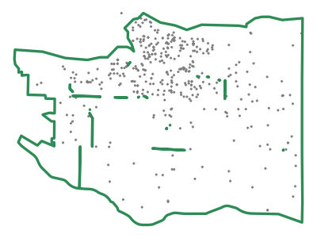
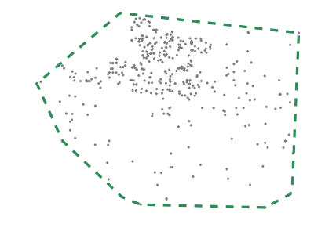
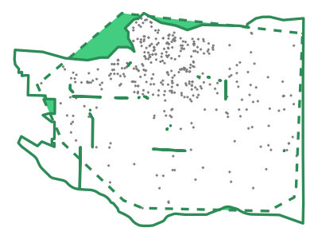
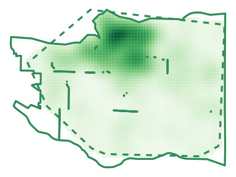

# Mapping crime patterns {#sec-mapping-patterns}

::: {.abstract}
This chapter introduces techniques for mapping concentrations of recorded crime using a technique called kernel density estimation (KDE). By the end of this chapter, you will be able to produce a clear density map that shows where crime is most concentrated.
:::

::: {.callout-tip title="Before you start"}

1. Open Positron or -- if you already have Positron open -- start a new R session by clicking the **Restart R** (**&#10227;**) button in the **Console** panel. This makes sure no code you ran previously will interfere with the work you do in this chapter.
2. Make sure you are working in the crime mapping project workspace you created in @sec-create-project. In the top-right corner of the Positron window, you should see a folder icon and the words `crime-mapping`. If not, click the **File** menu, then **Open Folder ...** and choose the `crime-mapping` folder.
:::


```{r}
#| label: setup
#| echo: false
#| include: false

# Load packages
pacman::p_load(ggspatial, patchwork, sf, sfhotspot, tidyverse)
```


## Introduction

In @sec-second-map, we created a map showing bike thefts in the City of Vancouver. It was hard to see the overall pattern because many of the points representing theft locations overlapped. Dot maps can be useful when there are relatively few events or when exact locations matter, but density maps are often more effective for showing patterns in large point datasets. In this chapter we will learn how to estimate the density of recorded bike thefts and show it on a map.

By the end of the chapter, you will have produced this map:

```{r}
#| label: make-final-map
#| include: false
#| file: "../R/chapter_06.R"
```

```{r}
#| label: save-final-map
#| include: false

# Save the map
ggsave(
  here("images", "vancouver_bike_thefts.jpg"),
  width = 1000 / 150,
  dpi = 150
)
```

```{r}
#| label: show-final-map
#| echo: false
#| fig-align: center
#| fig-alt: "A density map of recorded bicycle thefts in Vancouver in 2020. The highest estimated densities are in and around the Downtown and West End neighbourhoods. Neighbourhood boundaries and labels appear over a pale base map."
#| out-width: 100%

knitr::include_graphics(here("images", "vancouver_bike_thefts.jpg"))
```

By the end of this chapter, you will have learned how to:

- estimate a density layer using `hotspot_kde()`;
- adjust grid-cell size and bandwidth;
- choose an appropriate sequential colour scale;
- clip a density layer to the area covered by the data using `hotspot_clip()`; and
- add a base map, boundaries and neighbourhood labels.

The process we will use to produce the map has four main stages:

:::::: {.process}

::::: {.item color="#3182bd"}
Load

::: annotation
download data from the internet and load it into an R session
:::
:::::

::::: {.item color="#3182bd"}
Wrangle

::: annotation
data into the format we need
:::
:::::

::::: {.item color="#3182bd"}
Model

::: annotation
data using kernel density estimation
:::
:::::

::::: {.item color="#3182bd"}
Visualise

::: annotation
density on a map
:::
:::::

::::::

In Chapter 5 you created `chapter_05.R`, which contains the code needed to download, load and prepare the Vancouver bike-theft data. We will make a copy of that script and add the code needed for this chapter:

1. In Positron's **Explorer** panel, expand the `R` folder if necessary.
2. Right-click `chapter_05.R` and choose **Copy**.
3. Right-click the `R` folder and choose **Paste**.
4. Right-click the copied file, choose **Rename**, type `chapter_06.R` and press .

Take care to copy the file rather than renaming the original. Keep `chapter_06.R` in the `R` folder throughout this chapter.

Open `chapter_06.R` and update the line that loads packages so that it includes two new packages that we will need for this chapter: [ggspatial](https://paleolimbot.github.io/ggspatial/) and [sfhotspot](https://pkgs.lesscrime.info/sfhotspot/).

```{r}
#| output: false
#| filename: "chapter_06.R"

# Load packages
pacman::p_load(ggspatial, here, httr2, sf, sfhotspot, tidyverse)
```

Run this line by clicking anywhere on it and pressing  on your keyboard.


## Mapping crime density

When we speak about the _density_ of crime, we mean the relative concentration of points in each part of the area we are studying, i.e. how many points (in this case, representing bike thefts) are there in each part of the map _relative to all the other areas of the map_.

To estimate the density of points in different areas of the map, R uses a technique called _kernel density estimation_ (KDE). To do this, R must:

1. divide the map into a grid of cells, each the same size,
2. count the number of points in each cell,
3. for each cell, count the number of points in nearby cells, but give less weight to (i.e. systematically undercount) those cells that are further away,
4. for each cell, total up the count of points in that cell and the (weighted) count of points in nearby cells – this is the estimate of the density of points in that cell.


```{r}
#| label:  kde-explanation
#| eval: false
#| echo: false

random_points <- tibble(x = rnorm(50, sd = 50), y = rnorm(50, sd = 50)) |>
  filter(between(x, -40 * 3, 40 * 3), between(y, -40 * 3, 40 * 3)) |>
  # Choose any projected CRS
  st_as_sf(coords = c("x", "y"), crs = "EPSG:27700")

# Create the grid separately, so we can be sure what limits it will have
random_points_grid <- tibble(
  x = c(-40 * 3, 40 * 3, 40 * 3, -40 * 3),
  y = c(-40 * 3, 40 * 3, -40 * 3, 40 * 3)
) |>
  st_as_sf(coords = c("x", "y"), crs = "EPSG:27700") |>
  hotspot_grid(cell_size = 40)

random_points_kde <- random_points |>
  hotspot_kde(grid = random_points_grid, quiet = TRUE) |>
  mutate(
    label_n = if_else(n > 0, n, NA_real_),
    label_kde = scales::number(kde, accuracy = 0.1)
  )

random_points_kde[, c("coord_x", "coord_y")] <- random_points_kde |>
  st_centroid() |>
  st_coordinates()

kde_explanation <- list()

kde_explanation[["1"]] <- ggplot(random_points_kde) +
  geom_sf(data = random_points, colour = "grey50") +
  geom_sf(fill = NA) +
  labs(
    title = str_wrap(
      "1. Create a grid of cells covering the area covered by the points",
      width = 36
    )
  ) +
  theme_void() +
  theme(
    plot.title = element_text(lineheight = 0.9, size = 10)
  )

kde_explanation[["2"]] <- ggplot(random_points_kde) +
  geom_sf(data = random_points, colour = "grey75") +
  geom_sf(fill = NA) +
  geom_sf_label(
    aes(label = label_n),
    na.rm = TRUE,
    fill = NA,
    label.size = NA,
    size = 2.25
  ) +
  labs(
    title = str_wrap(
      "2. Count the number of points in each cell",
      width = 36
    )
  ) +
  theme_void() +
  theme(
    plot.title = element_text(lineheight = 0.9, size = 10)
  )

kde_aw <- arrow(length = unit(1.5, "mm"), type = "closed")

kde_explanation[["3"]] <- ggplot() +
  geom_sf(data = random_points_kde, fill = NA) +
  geom_sf(
    data = filter(
      random_points_kde,
      between(coord_x, -20, 20),
      between(coord_y, -20, 20)
    ),
    colour = "darkred",
    fill = NA,
    linewidth = 1
  ) +
  geom_sf_label(
    aes(label = n),
    data = filter(
      random_points_kde,
      between(coord_x, -40, 40),
      between(coord_y, -40, 40)
    ),
    na.rm = TRUE,
    fill = NA,
    label.size = NA,
    size = 2.25
  ) +
  geom_circle(
    aes(x0 = x, y0 = y, r = r),
    data = tibble(x = 0, y = 0, r = 40 * 1.5),
    colour = "darkred",
    fill = NA,
    linetype = "23",
    size = 1.5
  ) +
  # Right
  annotate(
    "segment",
    x = 12,
    y = 0,
    xend = 32,
    yend = 0,
    arrow = kde_aw,
    colour = "grey40"
  ) +
  # Lower right
  annotate(
    "segment",
    x = 10,
    y = -10,
    xend = 30,
    yend = -30,
    arrow = kde_aw,
    colour = "grey40"
  ) +
  # Bottom
  annotate(
    "segment",
    x = 0,
    y = -12,
    xend = 0,
    yend = -32,
    arrow = kde_aw,
    colour = "grey40"
  ) +
  # Lower left
  annotate(
    "segment",
    x = -10,
    y = -10,
    xend = -30,
    yend = -30,
    arrow = kde_aw,
    colour = "grey40"
  ) +
  # Left
  annotate(
    "segment",
    x = -12,
    y = 0,
    xend = -32,
    yend = 0,
    arrow = kde_aw,
    colour = "grey40"
  ) +
  # Upper left
  annotate(
    "segment",
    x = -10,
    y = 10,
    xend = -30,
    yend = 30,
    arrow = kde_aw,
    colour = "grey40"
  ) +
  # Top
  annotate(
    "segment",
    x = 0,
    y = 12,
    xend = 0,
    yend = 32,
    arrow = kde_aw,
    colour = "grey40"
  ) +
  # Upper right
  annotate(
    "segment",
    x = 10,
    y = 10,
    xend = 30,
    yend = 30,
    arrow = kde_aw,
    colour = "grey40"
  ) +
  labs(
    title = str_wrap(
      "3. Identify the counts in the cells surrounding each cell",
      width = 36
    )
  ) +
  theme_void() +
  theme(
    plot.title = element_text(lineheight = 0.9, size = 10)
  )

kde_explanation[["4"]] <- ggplot(random_points_kde) +
  geom_sf(fill = NA) +
  geom_sf_label(
    aes(label = label_kde),
    na.rm = TRUE,
    fill = NA,
    label.size = NA,
    size = 2.25
  ) +
  labs(
    title = str_wrap(
      "4. Use those counts to estimate the underlying density",
      width = 36
    )
  ) +
  theme_void() +
  theme(
    plot.title = element_text(lineheight = 0.9, size = 10)
  )

kde_explanation_plot <- wrap_plots(kde_explanation, ncol = 2)

ggsave(
  here::here("images/kde_explanation.jpg"),
  kde_explanation_plot,
  width = 800 / 150,
  height = 800 / 150,
  dpi = 150
)
```

```{r}
#| label: kde-explanation-map
#| echo: false
#| fig-align: center
#| fig-alt: "Four diagrams explaining kernel density estimation: create a grid, consider the event points around each cell, give closer events more influence than distant events, and store the resulting density estimate for every cell."
#| out-width: 80%

knitr::include_graphics(here::here("images/kde_explanation.jpg"))
```

<a href="https://github.com/mpjashby/sfhotspot/" aria-label="Visit the sfhotspot package website"></a>

There are several ways we can make density maps in R. In this course we will use the [sfhotspot package](https://pkgs.lesscrime.info/sfhotspot/) because it makes reasonable default decisions about how density maps should look, while still giving us control over their appearance if we want it. sfhotspot also has other useful functions that we will use in future chapters.

To create a density map using sfhotspot, we first use the `hotspot_kde()` function to convert a dataset of offence locations to an estimate of the density of offences for each cell in a grid. `hotspot_kde()` automatically chooses how big the cells in the grid should be (but we can set this ourselves if we want to).

Add this code to the script file for this chapter and then run that line of code:

```{r}
#| filename: "chapter_06.R"

# Estimate density of bike thefts
bike_theft_density <- hotspot_kde(
  bike_thefts,
  bandwidth_adjust = 0.5,
  quiet = TRUE
)
```

::: {.callout-tip collapse="true" title="Why did we specify `quiet = TRUE`?"}

The `quiet = TRUE` argument to the `hotspot_*()` family of functions (including `hotspot_kde()`) stops the function from producing progress messages as we go along. If you experience any problems using the `hotspot_kde()` function, the best place to start in working out what has happened is to run the code again with the `quiet = TRUE` argument removed.
:::

As usual, we can use the `head()` function to check what the resulting object looks like:

```{r}
#| filename: "R Console"

head(bike_theft_density)
```

The `bike_theft_density` object created by `hotspot_kde()` contains three columns: `n` contains the count of bike thefts in each cell, `kde` contains the estimate of the density of thefts in each cell, and `geometry` contains the outline of each grid cell.

Since `hotspot_kde()` produces an SF object, we can add it to a map using the `geom_sf()` function. We can also use the `fill` aesthetic to specify that the fill colour of each grid cell should be determined based on the values of the `kde` column in the `bike_theft_density` object.

```{r}
#| filename: "R Console"
#| fig-alt: "A basic density map of recorded bicycle thefts in Vancouver. Grid cells with higher KDE values are pale blue and cells with lower values are dark blue."

ggplot() +
  geom_sf(aes(fill = kde), data = bike_theft_density, colour = NA)
```

We have already seen that we can set aesthetics such as colour and shape manually, but the `aes()` function allows us to specify that the values of different aesthetics should be controlled by columns in the data. The `aes()` function takes as its arguments pairs of values (combined with an `=` symbol) where the first value is an aesthetic and the second value is the name of a column in the data. For example, to use the colour of points on a map to represent different types of crime that were stored in a column in the data called `type`, we could use `aes(colour = type)`. In the map above, we use `aes(fill = kde)` to specify that the fill colour of the grid cells on the map should be controlled by the `kde` column in the data. This is called _mapping_ a column to an aesthetic.


::: {.callout-important title="When to specify values inside or outside `aes()`"}

When should you specify the values of aesthetics inside `aes()` and when should you do it outside `aes()`?

  * If you want an aesthetic to have a constant value for all the points, lines or other shapes in a layer, control the aesthetic _outside_ `aes()`. For example, you could use `geom_sf(data = bike_thefts, colour = "mediumblue")` to make all the shapes in that layer blue.
  * If you want to vary the appearance of shapes according to values in the data, you should control the aesthetic _inside_ `aes()`. For example, you could use `geom_sf(aes(colour = month), data = bike_thefts)` to vary the colour of shapes in a layer according to values of the `month` column in the data.

If you specify a constant value for an aesthetic (e.g. `colour = "mediumblue"`) this will override any mapping for that aesthetic provided by the `aes()` function (e.g. `aes(colour = month)`). If you have used `aes()` to specify that an aesthetic should be controlled based on a column in the data but find that the aesthetic is not changing based on the data, check you have not also specified a constant value for that aesthetic.

`aes()` should normally be the first argument in a `geom_*()` function. If you want to specify the arguments in a different order then you must give the name of each argument, which means that for the `aes()` function you must specify `mapping = aes(...)` when `aes()` is not the first argument to whatever `geom_*()` function you are using.

:::


In this map, instead of seeing each crime as a separate point, we see the density of crime as the filled colour of cells in a grid. By comparing this density map to the point map we produced before, we can see that the density map makes the areas with the highest frequency of thefts slightly easier to identify (although we will improve it much further below).

You can also see that our map now has a legend, showing that higher densities of bike thefts are shown on the map in light blue and lower densities are shown in dark blue. The exact values shown in the legend are not particularly meaningful, so we can ignore these for now.


::: {.callout-quiz .callout title="Density mapping"}

```{r}
#| label: density-quiz
#| echo: false

density_quiz1 <- c(
  answer = "It helps make spatial patterns in data more apparent.",
  "It shows the exact location of each crime point.",
  "It allows for interactive maps that users can click on.",
  "It removes crime data points from the map."
)

density_quiz2 <- c(
  "`ggplot()`",
  "`hotspot_density()`",
  answer = "`hotspot_kde()`",
  "`st_point_to_kde()`"
)

density_quiz3 <- c("`colour`", answer = "`fill`", "`shape`", "`size`")

density_quiz4 <- c(
  answer = "Inside `aes()`",
  "Outside `aes()`",
  "Inside `ggplot()` but outside `geom_sf()`",
  "Inside `labs()`"
)
```


**What is a key advantage of using KDE over dot maps for crime data?**

`r webexercises::longmcq(density_quiz1)`


**Which R function is used to create a density layer from point data?**

`r webexercises::longmcq(density_quiz2)`


**Which argument in `geom_sf()` is used to specify that the fill colour of grid cells should be determined by the KDE values?**

`r webexercises::longmcq(density_quiz3)`


**Where should you specify `fill = kde` when fill colour should vary according to values in the `kde` column?**

`r webexercises::longmcq(density_quiz4)`


:::


### Fine-tuning cell size and bandwidth

We can control the appearance of KDE maps in several ways. For example, we can vary the number of cells in the grid and the definition of what cells the kernel density estimation process should consider to be 'nearby' for the purposes of calculating weighted counts. Cells are considered to be 'nearby' to a particular cell if they are closer to that cell than a distance known as the KDE *bandwidth*.

By default, `hotspot_kde()` chooses the cell size and the bandwidth automatically. The maps below show how changing these defaults changes the appearance of our map (with the legend and axes removed to make the small maps clearer).

```{r}
#| label: make-kde-bandwidth-map
#| eval: false
#| echo: false

default_cell_size <- bike_thefts |>
  hotspot_grid(quiet = TRUE) |>
  slice_head(n = 1) |>
  st_area() |>
  sqrt() |>
  as.numeric()

bw_plot <- tibble(
  cell_size = rep(c(1, 2, 4), 5),
  bw = rep(c(4, 2, 1, 0.5, 0.25), each = 3)
) |>
  pmap(function(cell_size, bw) {
    bike_thefts |>
      hotspot_kde(
        cell_size = default_cell_size * cell_size,
        bandwidth_adjust = bw,
        quiet = TRUE
      ) |>
      ggplot() +
      geom_sf(aes(fill = kde), colour = NA) +
      labs(
        subtitle = str_glue(
          "{cell_size}x default cell size\n{bw}x default bandwidth"
        )
      ) +
      theme_void() +
      theme(
        legend.position = "none",
        plot.subtitle = element_text(size = 10)
      )
  }) |>
  wrap_plots(ncol = 3)

ggsave(
  here::here("images/bandwidth.jpg"),
  bw_plot,
  width = 800 / 150,
  height = 1200 / 150,
  dpi = 150
)
```

```{r}
#| label: kde-bandwidth-map
#| echo: false
#| fig-align: center
#| fig-alt: "Fifteen small density maps compare three grid-cell sizes and five bandwidths. Larger cells produce blockier maps; larger bandwidths produce smoother maps; and very small bandwidths produce fragmented patterns."
#| out-width: 100%

knitr::include_graphics(here::here("images/bandwidth.jpg"))
```

By looking at the maps on the right-hand side, you can see that reducing the number of grid cells leads to a map that looks blocky and lacks information. Looking at the maps towards the top of the figure above, you can see that increasing the bandwidth relative to the default makes the density surface smoother. The smoother the surface, the less detail we can see about where crime is most concentrated, until on the top row we can see almost no information at all. On the other hand, if we reduce the bandwidth too much (the bottom row of maps), each estimate is influenced by only the closest events, so the surface becomes fragmented and it is more difficult to identify broader patterns.

In many cases, you will not need to change the cell size used in calculating the density of points on a map, but if you do then you can do this using the `cell_size` argument to `hotspot_kde()`. A cell size of about 200 metres is often a good choice for maps showing a whole city, such as our map of Vancouver. However, for larger cities you might want to use a larger cell size and for maps of neighbourhoods you will usually want to use a smaller cell size.

Although you can set the bandwidth manually using the `bandwidth` argument to `hotspot_kde()`, you will almost never want to do this. Instead, you can vary the bandwidth relative to the automatically chosen default bandwidth by using the `bandwidth_adjust` argument. For example, if you wanted to see more detail in your map by using a smaller bandwidth, you could use `bandwidth_adjust = 0.75` or `bandwidth_adjust = 3/4` to set the bandwidth to be three-quarters of the default bandwidth.


::: {.callout-important title="Start with `bandwidth_adjust = 0.5`"}

I recommend using a slightly smaller bandwidth than the default, so that your maps show a bit more detail. Try setting `bandwidth_adjust = 0.5` whenever you produce a density layer using `hotspot_kde()`, but remember to look at the map to see if you are happy with the result. If you are not happy, try varying the value of `bandwidth_adjust`. It is possible to set a value greater than 1, but it is very unlikely that this would produce the most-informative possible map.
:::


### Using colour to show density

The final way we can control the appearance of our density layer is to change the colour scheme used to represent density. To do this, we can use another type of function from the ggplot2 package: _scales_. Functions in the `scale_*()` family of functions allow us to control how the mapping between a column in the data and an aesthetic (colour, size, etc.) is represented visually. For example, which colour scheme is used to represent the density of thefts on our map.

There are many `scale_*()` functions, but the `scale_fill_distiller()` function produces several different colour scales that are specifically designed to be effective on maps. 

Colour schemes can be divided into three types:

  * *sequential* colour schemes are useful for showing values that vary from low to high,
  * *diverging* colour schemes are useful for showing values relative to a meaningful central point, and
  * *qualitative* colour schemes are useful for showing separate categories that can appear in any order and still be meaningful.

In crime mapping we're usually interested in showing how crime varies from low to high, so we need to use a _sequential_ colour palette. There are `r nrow(filter(RColorBrewer::brewer.pal.info, colorblind, category == "seq"))` colour-blind-friendly sequential colour schemes (or _palettes_) available in `scale_fill_distiller()`, each with a name:

```{r}
#| label: kde-colours
#| echo: false
#| fig-alt: "Eighteen panels show colour-blind-friendly sequential palettes. Each palette runs from a pale colour for low values to a dark colour for high values."
#| out-width: 100%

RColorBrewer::brewer.pal.info |>
  rownames_to_column(var = "name") |>
  filter(colorblind, category == "seq") |>
  pmap(function(...) {
    current <- tibble(...)
    ggplot() +
      geom_raster(aes(x = 1:9, y = 1, fill = as.factor(1:9))) +
      scale_fill_brewer(palette = current$name) +
      labs(subtitle = current$name) +
      theme_void() +
      theme(
        legend.position = "none",
        plot.subtitle = element_text(size = 8)
      )
  }) |>
  wrap_plots()
```


::: {.callout-important title="Choosing the right type of colour scale"}

It is important to **only use the right type of colour scale in the right circumstances**, since using the wrong type of scale could end up misleading people reading your map. For example, a diverging colour scale gives the strong impression that the central point in the scale is meaningful. 

In some circumstances this might be useful, for example if you wanted to show areas in which crime had increased in shades of one colour and areas in which crime had decreased in shades of another colour. In that case, a diverging scale would be appropriate because the central point represents something meaningful: no change in crime. If the central point is not meaningful, use a sequential colour scheme instead.

If you want to represent a categorical variable, you should use a categorical colour scale unless the categories have a natural order. For example, if you wanted to show ethnic groups on a map you would use a categorical colour scale, since there is no one order of ethnic groups that is any more meaningful than any other. If you wanted to represent days of the week with colour, then you might want to use a sequential colour scheme since the days of the week have a meaningful order.
:::


By default, `scale_fill_distiller()` sets the _lowest_ values to have the darkest colour. This does not work well for density maps, since most people tend to interpret sequential colour schemes as if the palest or least-saturated colours represent the lowest values and the darkest or most-saturated colours represent the highest values. If we design maps that meet that expectation, people will generally find them easier to interpret. Fortunately we can do that by setting the argument `direction = 1`.

```{r}
#| label: direction-map
#| echo: false
#| fig-align: center
#| fig-alt: "Two density maps compare colour-scale direction. With direction minus one, lower densities are dark and higher densities are pale. With direction one, lower densities are pale and higher densities are dark."
#| out-width: 80%

direction_map_neg <- ggplot() +
  geom_sf(aes(fill = kde), data = bike_theft_density, colour = NA) +
  scale_fill_distiller(direction = -1) +
  labs(title = "direction = –1 (the default)") +
  theme_void() +
  theme(legend.position = "bottom")

direction_map_pos <- ggplot() +
  geom_sf(aes(fill = kde), data = bike_theft_density, colour = NA) +
  scale_fill_distiller(direction = 1) +
  labs(title = "direction = 1") +
  theme_void() +
  theme(legend.position = "bottom")

direction_map_neg + direction_map_pos
```

You can think of all the functions that we can add to `ggplot()` as being like a stack of pancakes, with each new function being placed on the top of the stack. To change the colour of our map, we just add `scale_fill_distiller()` to the existing stack. Add this code to `chapter_06.R`:

```{r}
#| label: map-exercise8
#| exercise: true
#| fig-alt: "A density map of recorded bicycle thefts in Vancouver using a sequential orange colour scale. Darker cells have higher estimated density."
#| filename: "chapter_06.R"

# Plot density map
ggplot() +
  geom_sf(aes(fill = kde), data = bike_theft_density, colour = NA) +
  scale_fill_distiller(palette = "Oranges", direction = 1)
```


You can see that on this map it's intuitively easier to see which areas have the highest density of bike thefts. But there is still more that we can do to improve this map.


::: {.callout-quiz .callout title="Making density maps"}


```{r}
#| label: map-quiz
#| echo: false

map_quiz1 <- c(
  "dplyr",
  "ggplot2",
  "sf",
  answer = "sfhotspot"
)

map_quiz2 <- c(
  answer = "Adjusting the bandwidth of the density layer, relative to the default bandwidth",
  "Adjusting the cell size of the density layer, relative to the default cell size",
  "Adjusting the colour scheme used to represent density on the map",
  "Adjusting the bandwidth of the density layer, relative to a bandwidth of zero"
)

map_quiz3 <- c(
  "To represent variation in a variable from low to high",
  answer = "To represent variation in a variable above and below a meaningful mid-point",
  "To represent variation in a variable from high to low",
  "To represent categories in a categorical variable"
)

map_quiz4 <- c(
  "It highlights low-density areas more clearly.",
  answer = "It can mislead the viewer by suggesting a central point of significance.",
  "It makes the map look too colourful, which can be distracting.",
  "It hides the areas with the highest crime density."
)
```

**What R package do we use to make density maps using the `hotspot_kde()` function?**

`r webexercises::longmcq(map_quiz1)`


**What is the `bandwidth_adjust` argument of the function `hotspot_kde()` used for?**

`r webexercises::longmcq(map_quiz2)`


**In what circumstances is it appropriate to use a diverging colour scale, e.g. one that goes from blue to white to red?**

`r webexercises::longmcq(map_quiz3)`


**Why is it a bad idea to use a diverging colour scheme for crime density maps?**

`r webexercises::longmcq(map_quiz4)`


:::


## Clipping map layers

There is one limitation of the KDE layer on our map that we need to deal with.
The area covered by the KDE layer is determined by the area covered by the point
data that we provided to `hotspot_kde()`. More specifically, `hotspot_kde()` 
will calculate density values for every cell in the _convex hull_ around the 
point data, i.e. for the smallest polygon that contains all the points in the 
data.

This can be a problem in some circumstances, because we do not necessarily have
crime data for all the areas within the convex hull of the data, even though KDE
values will be calculated for those areas. This could be misleading, since it
will look like such areas have low crime density, when in fact we do not know
what the density of crime in such areas is because they are outside the area for which we have crime data..

Fortunately, we can easily deal with this problem by _clipping_ the KDE layer to
the boundary of the area for which we have crime data. This means we will only
show densities for cells for which we actually have data.

```{r}
#| label: make-clipping-explanation-map
#| eval: false
#| echo: false

vancouver_boundary <- vancouver_nbhds |> st_buffer(100) |> st_union()

bike_thefts_sample <- sample_frac(bike_thefts, 0.2)
bike_theft_hull <- bike_thefts_sample |>
  st_union() |>
  st_convex_hull()
bike_theft_sample_kde <- hotspot_kde(
  bike_thefts_sample,
  bandwidth_adjust = 0.5,
  quiet = TRUE
)


# First map ----

hull_map_1 <- ggplot() +
  geom_sf(data = bike_theft_hull, colour = NA, fill = NA) +
  geom_sf(data = vancouver_boundary, colour = NA, fill = NA) +
  geom_sf(data = bike_thefts_sample, colour = "grey50", size = 0.1) +
  geom_sf(
    data = vancouver_boundary,
    colour = "seagreen",
    fill = NA,
    linewidth = 0.75
  ) +
  theme_void()

ggsave(
  here::here("images/hull_clipping_1.jpg"),
  hull_map_1,
  width = 400 / 150,
  height = 300 / 150,
  dpi = 150
)


# Second map ----

hull_map_2 <- ggplot() +
  geom_sf(data = bike_theft_hull, colour = NA, fill = NA) +
  geom_sf(data = vancouver_boundary, colour = NA, fill = NA) +
  geom_sf(data = bike_thefts_sample, colour = "grey50", size = 0.1) +
  geom_sf(
    data = bike_theft_hull,
    colour = "seagreen",
    fill = NA,
    linetype = "33",
    linewidth = 0.75
  ) +
  theme_void()

ggsave(
  here::here("images/hull_clipping_2.jpg"),
  hull_map_2,
  width = 400 / 150,
  height = 300 / 150,
  dpi = 150
)


# Third map ----

hull_map_3 <- ggplot() +
  geom_sf(data = bike_theft_hull, colour = NA, fill = NA) +
  geom_sf(data = vancouver_boundary, colour = NA, fill = NA) +
  geom_sf(
    data = st_difference(bike_theft_hull, vancouver_boundary),
    colour = NA,
    fill = "seagreen3"
  ) +
  geom_sf(data = bike_thefts_sample, colour = "grey50", size = 0.1) +
  geom_sf(
    data = vancouver_boundary,
    colour = "seagreen",
    fill = NA,
    linewidth = 0.75
  ) +
  geom_sf(
    data = bike_theft_hull,
    colour = "seagreen",
    fill = NA,
    linetype = "33",
    linewidth = 0.75
  ) +
  theme_void()

ggsave(
  here::here("images/hull_clipping_3.jpg"),
  hull_map_3,
  width = 400 / 150,
  height = 300 / 150,
  dpi = 150
)


# Fourth map ----

hull_map_4 <- ggplot() +
  geom_sf(data = bike_theft_hull, colour = NA, fill = NA) +
  geom_sf(data = vancouver_boundary, colour = NA, fill = NA) +
  geom_sf(
    aes(fill = kde),
    data = hotspot_clip(
      bike_theft_sample_kde,
      vancouver_boundary,
      quiet = TRUE
    ),
    colour = NA
  ) +
  geom_sf(
    data = vancouver_boundary,
    colour = "seagreen",
    fill = NA,
    linewidth = 0.75
  ) +
  geom_sf(
    data = bike_theft_hull,
    colour = "seagreen",
    fill = NA,
    linetype = "33",
    linewidth = 0.75
  ) +
  scale_fill_distiller(palette = "Greens", direction = 1) +
  theme_void() +
  theme(
    legend.position = "none"
  )

ggsave(
  here::here("images/hull_clipping_4.jpg"),
  hull_map_4,
  width = 400 / 150,
  height = 300 / 150,
  dpi = 150
)
```

::::: {.clipping-comparison}

:::: {.clipping-panel}

A. We only have data on bike thefts from the City of Vancouver, so all the bike 
thefts in the data necessarily occurred within the city. We do not know what the
density of recorded bike theft outside the city is.

{fig-alt="A sample of recorded bike-theft locations inside the green City of Vancouver boundary." width=100%}

::::


:::: {.clipping-panel}

B. The KDE function only knows the theft locations, not the area in which thefts 
could have occurred. So the convex hull created by the KDE layer will not 
necessarily match the area of the data.

{fig-alt="The dashed convex hull around the sampled theft locations extends beyond parts of the city boundary." width=100%}

::::


:::: {.clipping-panel}

C. In this case, that means some areas (shaded) will be included in the KDE 
layer even though they are outside the area covered by the data, which
could be misleading.

{fig-alt="Green shading identifies parts of the convex hull outside the City of Vancouver boundary." width=100%}

::::


:::: {.clipping-panel}

D. To avoid suggesting we know the density of crimes in areas for which we do 
not have data, we should clip the KDE layer to the boundary of the area for 
which we have data.

{fig-alt="A green KDE layer clipped to the City of Vancouver boundary, with the dashed convex hull shown for comparison." width=100%}
::::


:::::


To clip the KDE layer to the boundary of the area for which we have data, we need a new dataset that contains the boundary of the City of Vancouver. Fortunately this dataset is available online in a spatial format known as a [GeoJSON](https://en.wikipedia.org/wiki/GeoJSON) file. GeoJSON is a spatial file format, so we can load it in R using the `read_sf()` function from the sf package.

As we did for the theft data in Chapter 5, we will first download the boundary data into `data/raw`, then read the local copy. This records where the data came from while keeping the analysis available if the website is temporarily unavailable later. Add this code immediately after the existing code that downloads the theft data but _above_ the code that loads and wrangles the data.

```{r}
#| output: false
#| filename: "chapter_06.R"

# Download Vancouver neighbourhood boundaries
request(
  "https://mpjashby.github.io/crimemappingdata/vancouver_neighbourhoods.geojson"
) |>
  req_perform(
    path = here("data", "raw", "vancouver_neighbourhoods.geojson")
  )
```

Add the following code after the pipeline that loads and wrangles the bike-theft data and before the code that creates `bike_theft_density`:

```{r}
#| filename: "chapter_06.R"

# Load Vancouver neighbourhood boundaries
vancouver_nbhds <- here("data", "raw", "vancouver_neighbourhoods.geojson") |>
  read_sf() |>
  st_transform("EPSG:32610")
```

You might have noticed that as well as loading the boundary data with `read_sf()`, we have transformed the data to use the same co-ordinate system (EPSG:32610) as is used for the `bike_thefts` object. This is because we can only clip datasets that use the same co-ordinate system.

Before we clip the density layer to the city boundary, check that your file `chapter_06.R` looks like this:

```{r}
#| eval: false
#| filename: "chapter_06.R"

# Load packages
pacman::p_load(ggspatial, here, httr2, sf, sfhotspot, tidyverse)

# Download the raw data
request(
  "https://mpjashby.github.io/crimemappingdata/vancouver_thefts.csv.gz"
) |>
  req_perform(path = here("data", "raw", "vancouver_thefts.csv.gz"))

request(
  "https://mpjashby.github.io/crimemappingdata/vancouver_neighbourhoods.geojson"
) |>
  req_perform(
    path = here("data", "raw", "vancouver_neighbourhoods.geojson")
  )

# Load and wrangle bike theft data
thefts <- read_csv(here("data", "raw", "vancouver_thefts.csv.gz")) |>
  janitor::clean_names() |>
  st_as_sf(coords = c("x", "y"), crs = "EPSG:32610")

bike_thefts <- filter(thefts, type == "Theft of Bicycle")

# Load Vancouver neighbourhood boundaries
vancouver_nbhds <- here("data", "raw", "vancouver_neighbourhoods.geojson") |>
  read_sf() |>
  st_transform("EPSG:32610")

# Estimate density of bike thefts
bike_theft_density <- hotspot_kde(
  bike_thefts,
  bandwidth_adjust = 0.5,
  quiet = TRUE
)

# Plot density map
ggplot() +
  geom_sf(aes(fill = kde), data = bike_theft_density, colour = NA) +
  scale_fill_distiller(palette = "Oranges", direction = 1)
```


We can clip the KDE layer produced by `hotspot_kde()` to the boundary of the City of Vancouver using the `hotspot_clip()` function from sfhotspot. `hotspot_clip()` keeps the parts of the KDE cells that fall inside the area covered by the boundary layer and removes the rest.

We will now add the code needed to clip the KDE layer to the city boundary to `chapter_06.R`. Since we do not need the unclipped version of the KDE layer in the final map, we can combine `hotspot_kde()` and `hotspot_clip()` in one pipeline. Replace the code that creates `bike_theft_density` with this code:

```{r}
#| filename: "chapter_06.R"

# Estimate density of bike thefts and clip result
bike_theft_density_clip <- bike_thefts |> # <1>
  hotspot_kde(bandwidth_adjust = 0.5, quiet = TRUE) |> # <2>
  hotspot_clip(vancouver_nbhds) # <3>
```
1. take the `bike_thefts` object, _and then_
2. use it to estimate the density of thefts _and then_
3. clip the resulting density object to the boundary stored in the `vancouver_nbhds` object.

If you aren't comfortable with how the pipe operator works, you might want to refer back to @sec-pipe-operator.


::: {.callout-important title="Both layers must use the same co-ordinate system"}

`hotspot_clip()` requires both spatial layers to use the same co-ordinate system. If the layers use different co-ordinate systems, transform one of them with `st_transform()` so that it uses the same system as the other layer.

If you do not know which co-ordinate systems the layers use, you can use the `st_crs()` function to extract the co-ordinate system from one layer and pass that value as the second argument to `st_transform()`. For example:

```r
st_transform(bike_theft_density, crs = st_crs(vancouver_nbhds))
```

:::

We can quickly check the effect of clipping the density layer to the city boundary by producing a very basic map that shows both layers in separate colours. Run this code in the R Console:


```{r}
#| filename: "R Console"
#| fig-alt: "A diagnostic map comparing the original blue KDE grid with the green clipped grid. Blue cells extend beyond the black city boundary, while green cells stop at it."

ggplot() +
  # Add convex hull of bike thefts to map
  geom_sf(data = bike_theft_density, fill = "blue") +
  # Add clipped density layer to map
  geom_sf(data = bike_theft_density_clip, fill = "green") +
  # Add city boundary to map for comparison
  geom_sf(data = vancouver_nbhds, colour = "black", fill = NA, linewidth = 1)
```

From this map, we can see that while the `bike_theft_density` object (shown in blue) contains cells outside the black city boundary, the `bike_theft_density_clip` object (shown in green) contains only cells inside the boundary.


::: {.callout-quiz .callout title="Clipping map layers"}

```{r}
#| label: clipping_quiz
#| echo: false

clipping_quiz1 <- c(
  "To transform one dataset into another co-ordinate system.",
  answer = "To clip a dataset to the boundary of another spatial layer.",
  "To merge multiple spatial layers into one.",
  "To calculate the centroid of spatial objects."
)

clipping_quiz2 <- c(
  "To remove unnecessary layers.",
  "To reduce the overall size of the dataset.",
  "To improve the map’s aesthetic appearance.",
  answer = "To avoid showing incorrect density estimates for areas without data."
)
```


**What is the purpose of the `hotspot_clip()` function?**

`r webexercises::longmcq(clipping_quiz1)`


**Why is it important to clip a KDE layer to a relevant boundary in crime mapping?**

`r webexercises::longmcq(clipping_quiz2)`


:::


## Adding a base map {#sec-base-maps}

The density map we have made is much more effective than a point map at allowing us to identify where the highest number of bike thefts in Vancouver occur. However, it's still quite difficult to know *where* those places are, because we cannot easily work out where in the city these places are. We can make this much easier by adding a *base map* underneath the density layer.

We can add a base map using the `annotation_map_tile()` function from the [ggspatial package](https://paleolimbot.github.io/ggspatial/). We can add `annotation_map_tile()` to a `ggplot()` stack in the same way that we would add `geom_*()` functions. Since we want the base map to appear _under_ the density layer, we add the base map layer to the `ggplot()` stack _first_. So that we can see the base map underneath the density layer, we will also make the density layer semi-transparent using the `alpha` argument to `geom_sf()`.

Replace the existing `ggplot()` stack in the `chapter_06.R` file with this code and then run it:

```{r}
#| filename: "chapter_06.R"
#| fig-alt: "A purple density layer of recorded bicycle thefts over a street base map of Vancouver. Darker areas show higher estimated density."

ggplot() +
  annotation_map_tile(zoomin = 0, progress = "none") +
  geom_sf(
    aes(fill = kde),
    data = bike_theft_density_clip,
    alpha = 0.7,
    colour = NA
  ) +
  scale_fill_distiller(palette = "Purples", direction = 1)
```

The base maps returned by `annotation_map_tile()` are available at many different [zoom levels](https://wiki.openstreetmap.org/wiki/Zoom_levels), from level 1 that is useful for mapping the whole world in one map, to level 20 that can be used to map a single building. By default, `annotation_map_tile()` downloads tiles with slightly less detail than we might want, but we can fix this by using the argument `zoomin = 0`. We could also set a specific zoom level using the `zoom` argument, but it's usually best to use `zoomin` instead. If you make a map and find the base map doesn't look right, check that you haven't accidentally set `zoom = 0` instead of `zoomin = 0`.

We can see some of the different zoom levels available by looking at these maps, which show the same area around the UCL Jill Dando Institute with base maps at different zoom levels.

```{r}
#| label: make-zoom-map
#| eval: false
#| echo: false

jdi <- c(-0.12979747256628416, 51.52501948280652) |>
  st_point() |>
  st_sfc(crs = "EPSG:4326") |>
  st_transform("EPSG:27700") |>
  st_buffer(2000)

zoom_map <- map(8:16, function(zoom_level) {
  ggplot() +
    annotation_map_tile(zoom = zoom_level, progress = "none") +
    geom_sf(data = jdi, colour = NA, fill = NA) +
    labs(subtitle = str_glue("zoom level {zoom_level}")) +
    theme_void() +
    theme(
      panel.border = element_rect(colour = "black", fill = NA, linewidth = 1),
      plot.margin = unit(c(6, 6, 6, 6), "pt"),
      plot.subtitle = element_text(size = 10)
    )
}) |>
  wrap_plots(ncol = 3)

ggsave(
  here::here("images/zoom.jpg"),
  zoom_map,
  width = 1200 / 150,
  height = 900 / 150,
  dpi = 150
)
```

```{r}
#| label: zoom-map
#| echo: false
#| fig-align: center
#| fig-alt: "Nine street maps of the same area around the UCL Jill Dando Institute at zoom levels 8 to 16. Lower zoom levels are pixelated, while higher levels show progressively more local detail."
#| out-width: 100%

knitr::include_graphics(here::here("images/zoom.jpg"))
```

Choosing the right zoom level is a matter of balancing the level of detail in the map and the clarity of the image. In the maps above, zoom levels less than 12 tend to have pixelated images because they do not contain enough detail, while zoom levels greater than 13 contain too much detail and so the information is hard to read. But if this map covered a smaller or larger area, a different zoom level might be better. In general, setting `zoomin = 0` and _not_ setting any value for the `zoom` argument -- so that `annotation_map_tile()` chooses the zoom level automatically -- will produce an acceptable map.

`annotation_map_tile()` also gives us access to several different types of base map. The default style (seen in the maps above) is called 'osm' because it is the default style used by OpenStreetMap, the organisation that provides the map data. We can specify which style of base map we want using the `type` argument to `annotation_map_tile()`.

```{r}
#| label: make-basemaps-map
#| eval: false
#| echo: false

basemaps_map <- c(
  "osm",
  "opencycle",
  "hotstyle",
  "stamenbw",
  "stamenwatercolor",
  "osmtransport",
  "thunderforestlandscape",
  "thunderforestoutdoors",
  "cartodark",
  "cartolight"
) |>
  map(function(x) {
    ggplot() +
      annotation_map_tile(type = x, zoom = 12, progress = "none") +
      geom_sf(data = jdi, colour = NA, fill = NA) +
      labs(subtitle = if_else(x == "osm", "osm (default)", x)) +
      theme_void() +
      theme(
        panel.border = element_rect(colour = "black", fill = NA, linewidth = 1),
        plot.margin = unit(c(6, 6, 6, 6), "pt"),
        plot.subtitle = element_text(size = 10)
      )
  }) |>
  wrap_plots(ncol = 3)

ggsave(
  here::here("images/basemaps.jpg"),
  basemaps_map,
  width = 1200 / 150,
  height = 1200 / 150,
  dpi = 150
)
```

```{r}
#| label: basemaps-map
#| echo: false
#| fig-align: center
#| fig-alt: "Ten small maps compare available base-map styles, including OpenStreetMap, cycling, transport, landscape, outdoors, watercolour, light and dark designs."
#| out-width: 100%

knitr::include_graphics(here::here("images/basemaps.jpg"))
```

You may want to experiment with different base map styles by using the `type` argument to `annotation_map_tile()`, e.g. using `annotation_map_tile(type = "cartolight", zoomin = 0, progress = "none")`.

One final note about the `annotation_map_tile()` function: you might have noticed that when we have used it above we have always set the argument `progress = "none"`. This stops the function from printing a progress bar while it is downloading the map tiles. The progress bar can sometimes be useful, but when you include the output from an R function in a report (as you will learn to do in @sec-reports), the output from the progress bar is likely to interfere with the formatting of the report. To prevent that, we use the `progress = "none"` argument.


::: {.callout-quiz .callout title="Base maps"}

```{r}
#| label: base_map_quiz
#| echo: false

base_map_quiz1 <- c(
  "To provide information about socio-economic conditions in different places.",
  answer = "To provide context on the locations of concentrations of crime.",
  "To stop the map from appearing too visually cluttered",
  "To make a map more visually attractive."
)

base_map_quiz2 <- c(
  "`ggplot2`",
  "`ggmap`",
  answer = "`ggspatial`",
  "`sfhotspot`"
)

base_map_quiz3 <- c(
  answer = "To ensure that it does not distract from the crime data.",
  "To fit the base map to the full extent of the dataset.",
  "To remove all geographic details and focus only on crime locations.",
  "To add unnecessary elements to the map."
)
```


**What is the purpose of adding a base map to a crime map in R?**

`r webexercises::longmcq(base_map_quiz1)`


**Which R package is commonly used for adding base maps to crime maps?**

`r webexercises::longmcq(base_map_quiz2)`


**Why might you need to be careful in choosing the right base map when creating a crime map?**

`r webexercises::longmcq(base_map_quiz3)`


:::


## Adding more layers {#sec-other-layers}


Adding a base map underneath our density layer makes it easier to understand where in Vancouver the highest densities of bike theft are. But our map could make it easier still to see where clusters of thefts occur. We could, for example, add the names of different neighbourhoods in the city, and show the city limits so that we can tell which areas have no crime because crimes in those areas are not included in our data.

In an earlier section I suggested we can think of ggplot charts, including maps, as being like stacks of pancakes -- each function we use to amend the appearance of our chart is added to the top of the stack. So to add another layer to our map, we just add another `geom_` function to our plot.

<a href="https://stringr.tidyverse.org/" aria-label="Visit the stringr package website"></a>

At the same time, we can also add labels to the plot at the centre of each neighbourhood using the `geom_sf_label()` function. `geom_sf_label()` works like `geom_sf()` in that it adds a spatial dataset to a map, but instead of adding the points, lines or polygons themselves, `geom_sf_label()` instead adds labels for those features. 

We use the `aes()` function to specify which column in the `vancouver_nbhds` dataset we want to use for the label text. If we used `head(vancouver_nbhds)` to look at the columns in the data, we would see the neighbourhood names are contained in the column called `name`. Normally, we would use the code `aes(label = name)` to do this because the label aesthetic is used to set the label text. But in this case we also want to wrap the labels so that they don't overlap adjacent neighbourhoods. To do this we can use `str_wrap()` from the [stringr package](https://stringr.tidyverse.org) (part of the tidyverse), so that instead our call to the `aes()` function becomes `aes(label = str_wrap(name, width = 10))`.

To see how `geom_sf_label()` works, let's create a quick map in the R Console. Paste the following code into the Console and run it:

```{r}
#| filename: "R Console"
#| fig-alt: "A map of Vancouver neighbourhood polygons labelled with their names. Longer names wrap onto multiple lines."

ggplot() +
  geom_sf(data = vancouver_nbhds) +
  geom_sf_label(aes(label = str_wrap(name, width = 10)), data = vancouver_nbhds)
```

Now let's add these labels to the map in our script file. At the same time we will change the style of the labels so that they look better on the map. To do this, we will add several more arguments to `geom_sf_label()`, which are explained after the next piece of code.

Replace the existing `ggplot()` stack in the `chapter_06.R` file with this stack and then run that code:

```{r}
#| filename: "chapter_06.R"
#| fig-alt: "A density map of recorded bicycle thefts in Vancouver in 2020. The highest estimated densities are in and around the Downtown and West End neighbourhoods. Neighbourhood boundaries and labels appear over a pale base map."

# Plot density map
ggplot() +
  # Add base map
  annotation_map_tile(type = "cartolight", zoomin = 0, progress = "none") +
  # Add density layer
  geom_sf(
    aes(fill = kde),
    data = bike_theft_density_clip,
    alpha = 0.75,
    colour = NA
  ) +
  # Add neighbourhood boundaries
  geom_sf(data = vancouver_nbhds, colour = "seagreen3", fill = NA) +
  # Add neighbourhood names
  geom_sf_label(
    aes(label = str_wrap(name, 10)),
    data = vancouver_nbhds,
    alpha = 0.5, # <1>
    colour = "seagreen", # <2>
    lineheight = 1, # <3>
    size = 2.5, # <4>
    linewidth = NA # <5>
  ) +
  # Set the colour scale
  scale_fill_distiller(direction = 1)
```
1. `alpha = 0.5` to make the label background semi-transparent so that we can see the density layer underneath it,
2. `colour = "seagreen"` to slightly reduce the prominence of the label text to avoid distracting attention from the density layer,
3. `lineheight = 1` to reduce the gap between lines in each label,
4. `size = 2.5` to slightly reduce the size of the label text,
5. `linewidth = NA` to remove the default border around the label background.


From this map, we can see that recorded bike theft in Vancouver is heavily concentrated in a handful of neighbourhoods, particularly Downtown and the West End. This map makes the broad pattern easier to see than the point map in @sec-second-map, and shows how the concentrations relate to different areas of the city.


::: {.callout-quiz .callout title="Adding map layers"}

```{r}
#| label: map-layers-quiz
#| echo: false

map_layers_quiz1 <- c(
  answer = "Before the density layer, so that it appears underneath",
  "After the density layer, so that it covers the density values",
  "Inside `scale_fill_distiller()`",
  "The order of layers does not affect the map"
)

map_layers_quiz2 <- c(
  "`geom_sf()`",
  answer = "`geom_sf_label()`",
  "`annotation_map_tile()`",
  "`hotspot_clip()`"
)

map_layers_quiz3 <- c(
  "It changes the neighbourhood names to lower case.",
  "It removes neighbourhood names longer than ten characters.",
  answer = "It wraps longer neighbourhood names onto multiple lines.",
  "It changes the order of the neighbourhoods."
)
```

**Where should the base-map layer appear in a `ggplot()` stack?**

`r webexercises::longmcq(map_layers_quiz1)`

**Which function adds labels at the locations of spatial features?**

`r webexercises::longmcq(map_layers_quiz2)`

**What does `str_wrap(name, width = 10)` do to the neighbourhood labels?**

`r webexercises::longmcq(map_layers_quiz3)`

:::


::: {.callout-tip title="Tips for producing effective density maps"}

- Make density layers semi-transparent so that readers can see the base map underneath. Try `alpha = 0.7` in `geom_sf()`, then adjust the value until both the density layer and the geographic context are clear.
- Produce separate density layers for different types of crime. Combining offences can hide distinct spatial patterns and will make the result more strongly influenced by whichever offence is most numerous.
- Be cautious about mapping offences that are mainly found through police activity, such as drug or weapon possession. Their recorded locations can reflect where officers patrol as much as where offences occur.
- Remember that a KDE map shows concentrations of recorded events, not the risk that an event will happen to a person or place. Interpreting risk also requires information about the relevant population or opportunities and will be covered in @sec-mapping-hotspots.

:::


## In summary

In this chapter you learned how KDE can make broad patterns in a large point dataset easier to see. A density map can help practitioners explore where recorded events are concentrated, but it should not determine decisions by itself: the result can also reflect reporting, opportunities, population and police activity.

You can now:

- estimate density with `hotspot_kde()`;
- adjust grid-cell size and bandwidth;
- map density using an appropriate sequential colour scale;
- clip a density layer with `hotspot_clip()`; and
- add a base map, boundaries and labels in the correct layer order.

Your complete script should now look like this:

```{r}
#| eval: false
#| file: "../R/chapter_06.R"
#| filename: "chapter_06.R"
```

The script is in a logical order: it loads packages, downloads and prepares data, estimates and clips density, then produces the map. It includes only the permanent code needed to repeat the analysis, and comments identify each task.

Save `chapter_06.R` by pressing . To check that the analysis is reproducible, restart R using the **Restart R** (**&#10227;**) button in Positron's **Console** panel, then run the script from beginning to end. Keep the script in the `R` folder and the downloaded source files in `data/raw`.


::: {.box .reading}

You can learn more about:

- the arguments and output of [`hotspot_kde()`](https://pkgs.lesscrime.info/sfhotspot/reference/hotspot_kde.html) in the sfhotspot documentation;
- adding base maps and other spatial elements with the [ggspatial package](https://paleolimbot.github.io/ggspatial/);
- choosing and using colour schemes in [_Working with colours in R_](https://nrennie.rbind.io/blog/colours-in-r/); and
- exploring palettes using the [Color Palette Finder](https://r-graph-gallery.com/color-palette-finder).

:::


::: {.callout-quiz .callout title="Revision questions"}

Answer these questions to check you have understood the main points covered in this chapter. Write between 50 and 100 words to answer each question.

1. What is kernel density estimation (KDE), and why is it useful for mapping crime patterns? Explain the process briefly.
2. Why can density maps be more effective than point maps for visualising patterns in large crime datasets?
3. What are the main factors to consider when adjusting grid-cell size and bandwidth? How can these adjustments affect a KDE map?
4. Why is it important to clip a density layer to the boundary of the area covered by the data, and which function should you use?
5. How does the choice of colour scale affect the interpretation of a density map? When should you use sequential, diverging and qualitative colour schemes?

:::
