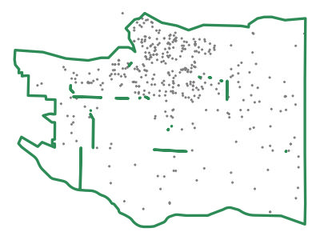
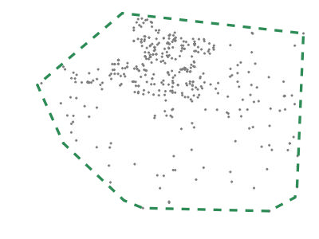
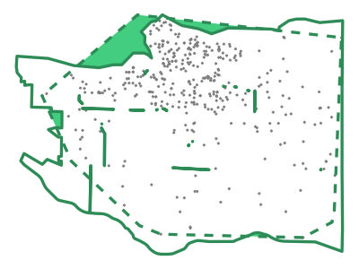
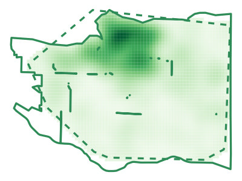
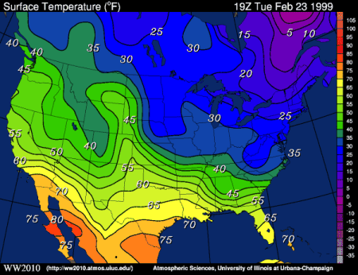

# Mapping crime patterns {#sec-mapping-patterns}

{fig-alt="Students compare point locations with broad purple density bands on a map." width=100%}

::: {.abstract}
This chapter introduces techniques for mapping concentrations of recorded crime using a technique called kernel density estimation (KDE). We will learn how to produce a clear density map that shows where crime is most concentrated.
:::




```{r}
#| label: setup
#| echo: false
#| include: false

# Load packages
pacman::p_load(crsuggest, ggspatial, patchwork, sf, sfhotspot, tidyverse)
```


## Introduction

In @sec-second-map, we created a map showing bike thefts in the City of Vancouver. It was hard to see the overall pattern because many of the points representing theft locations overlapped. Dot maps can be useful when there are relatively few events or when exact locations matter, but density maps are often more effective for showing patterns in large point datasets. In this chapter we will learn how to estimate the density of recorded bike thefts and show it on a map.

By the end of the chapter, you will have produced this map:

```{r}
#| label: make-final-map
#| include: false
#| file: "../R/chapter_06.R"
```

```{r}
#| label: save-final-map
#| include: false

# Save the map
ggsave(
  here("images", "vancouver_bike_thefts.jpg"),
  width = 1000 / 150,
  dpi = 150
)
```

::: {#map-vancouver-bicycle-theft-density-introduction}

```{r}
#| label: show-final-map
#| echo: false
#| fig-align: center
#| fig-alt: "Density map of recorded bicycle thefts in Vancouver in 2020. Darker blue indicates higher estimated density, strongest on the Downtown peninsula and around the north-central neighbourhoods south of False Creek. Density is lower towards the southern edge. Green neighbourhood boundaries and labels provide location context on a pale street map."
#| out-width: 100%

knitr::include_graphics(here("images", "vancouver_bike_thefts.jpg"))
```

:::

In this chapter, we will learn how to:

- estimate a density layer using `hotspot_kde()`;
- choose an appropriate projected coordinate reference system;
- adjust grid-cell size and bandwidth;
- choose an appropriate sequential colour scale;
- clip a density layer to the area covered by the data using `hotspot_clip()`; and
- add neighbourhood boundaries and labels.

The process we will use to produce the map has four main stages:

:::::: {.process role="img" aria-label="Workflow diagram with four stages in order: download and load data; wrangle it into the required format; model crime density using kernel density estimation; visualise the estimated density on a map."}

::::: {.item color="#3182bd"}
Load

::: annotation
download data from the internet and load it into an R session
:::
:::::

::::: {.item color="#3182bd"}
Wrangle

::: annotation
data into the format we need
:::
:::::

::::: {.item color="#3182bd"}
Model

::: annotation
data using kernel density estimation
:::
:::::

::::: {.item color="#3182bd"}
Visualise

::: annotation
density on a map
:::
:::::

::::::

In @sec-second-map you created `chapter_05.R`, which contains the code needed to download, load and prepare the Vancouver bike-theft data. We will make a copy of that script and add the code needed for this chapter:

1. In Positron's **Explorer** panel, expand the `R` folder if necessary.
2. Right-click `chapter_05.R` and choose **Copy**.
3. Right-click the `R` folder and choose **Paste**.
4. Right-click the copied file, choose **Rename**, type `chapter_06.R` and press .

Take care to copy the file rather than renaming the original. Keep `chapter_06.R` in the `R` folder throughout this chapter.

Update the comment at the top of `chapter_06.R` to explain that this script produces a density map of bicycle thefts in Vancouver in 2020.

Open `chapter_06.R` and remove the final line, which uses `hotspot_map()` to produce the previous dot map of bike thefts. During this chapter we will add new code to the `chapter_06.R` file to produce a map of crime density.

After you have removed the final line from the code, run the rest of the code in the file by selecting all the code and pressing  on your keyboard.


## Mapping crime density {#sec-kde}

When we speak about the _density_ of crime, we mean the relative concentration of points in each part of the area we are studying, i.e. how many points (in this case, representing bike thefts) are there in each part of the map _relative to all the other areas of the map_.

To estimate the density of points in different areas of the map, R uses a technique called _kernel density estimation_ (KDE). To do this, R must:

1. divide the map into a grid of cells, each the same size,
2. count the number of points in each cell,
3. for each cell, count the number of points in nearby cells, but give less weight to (i.e. systematically undercount) those cells that are further away,
4. for each cell, total up the count of points in that cell and the (weighted) count of points in nearby cells – this is the estimate of the density of points in that cell.


```{r}
#| label: kde-explanation
#| eval: false
#| echo: false

random_points <- tibble(x = rnorm(50, sd = 50), y = rnorm(50, sd = 50)) |>
  filter(between(x, -40 * 3, 40 * 3), between(y, -40 * 3, 40 * 3)) |>
  # Choose any projected CRS
  st_as_sf(coords = c("x", "y"), crs = "EPSG:27700")

# Create the grid separately, so we can be sure what limits it will have
random_points_grid <- tibble(
  x = c(-40 * 3, 40 * 3, 40 * 3, -40 * 3),
  y = c(-40 * 3, 40 * 3, -40 * 3, 40 * 3)
) |>
  st_as_sf(coords = c("x", "y"), crs = "EPSG:27700") |>
  hotspot_grid(cell_size = 40)

random_points_kde <- random_points |>
  hotspot_kde(grid = random_points_grid, quiet = TRUE) |>
  mutate(
    label_n = if_else(n > 0, n, NA_real_),
    label_kde = scales::number(kde, accuracy = 0.1)
  )

random_points_kde[, c("coord_x", "coord_y")] <- random_points_kde |>
  st_centroid() |>
  st_coordinates()

kde_explanation <- list()

kde_explanation[["1"]] <- ggplot(random_points_kde) +
  geom_sf(data = random_points, colour = "grey50") +
  geom_sf(fill = NA) +
  labs(
    title = str_wrap(
      "1. Create a grid of cells covering the area covered by the points",
      width = 36
    )
  ) +
  theme_void() +
  theme(
    plot.title = element_text(lineheight = 0.9, size = 10)
  )

kde_explanation[["2"]] <- ggplot(random_points_kde) +
  geom_sf(data = random_points, colour = "grey75") +
  geom_sf(fill = NA) +
  geom_sf_label(
    aes(label = label_n),
    na.rm = TRUE,
    fill = NA,
    linewidth = 0,
    size = 2.25
  ) +
  labs(
    title = str_wrap(
      "2. Count the number of points in each cell",
      width = 36
    )
  ) +
  theme_void() +
  theme(
    plot.title = element_text(lineheight = 0.9, size = 10)
  )

kde_aw <- arrow(length = unit(1.5, "mm"), type = "closed")

kde_explanation[["3"]] <- ggplot() +
  geom_sf(data = random_points_kde, fill = NA) +
  geom_sf(
    data = filter(
      random_points_kde,
      between(coord_x, -20, 20),
      between(coord_y, -20, 20)
    ),
    colour = "darkred",
    fill = NA,
    linewidth = 1
  ) +
  geom_sf_label(
    aes(label = n),
    data = filter(
      random_points_kde,
      between(coord_x, -40, 40),
      between(coord_y, -40, 40)
    ),
    na.rm = TRUE,
    fill = NA,
    linewidth = 0,
    size = 2.25
  ) +
  geom_circle(
    aes(x0 = x, y0 = y, r = r),
    data = tibble(x = 0, y = 0, r = 40 * 1.5),
    colour = "darkred",
    fill = NA,
    linetype = "23",
    size = 1.5
  ) +
  # Right
  annotate(
    "segment",
    x = 12,
    y = 0,
    xend = 32,
    yend = 0,
    arrow = kde_aw,
    colour = "grey40"
  ) +
  # Lower right
  annotate(
    "segment",
    x = 10,
    y = -10,
    xend = 30,
    yend = -30,
    arrow = kde_aw,
    colour = "grey40"
  ) +
  # Bottom
  annotate(
    "segment",
    x = 0,
    y = -12,
    xend = 0,
    yend = -32,
    arrow = kde_aw,
    colour = "grey40"
  ) +
  # Lower left
  annotate(
    "segment",
    x = -10,
    y = -10,
    xend = -30,
    yend = -30,
    arrow = kde_aw,
    colour = "grey40"
  ) +
  # Left
  annotate(
    "segment",
    x = -12,
    y = 0,
    xend = -32,
    yend = 0,
    arrow = kde_aw,
    colour = "grey40"
  ) +
  # Upper left
  annotate(
    "segment",
    x = -10,
    y = 10,
    xend = -30,
    yend = 30,
    arrow = kde_aw,
    colour = "grey40"
  ) +
  # Top
  annotate(
    "segment",
    x = 0,
    y = 12,
    xend = 0,
    yend = 32,
    arrow = kde_aw,
    colour = "grey40"
  ) +
  # Upper right
  annotate(
    "segment",
    x = 10,
    y = 10,
    xend = 30,
    yend = 30,
    arrow = kde_aw,
    colour = "grey40"
  ) +
  labs(
    title = str_wrap(
      "3. Identify the counts in the cells surrounding each cell",
      width = 36
    )
  ) +
  theme_void() +
  theme(
    plot.title = element_text(lineheight = 0.9, size = 10)
  )

kde_explanation[["4"]] <- ggplot(random_points_kde) +
  geom_sf(fill = NA) +
  geom_sf_label(
    aes(label = label_kde),
    na.rm = TRUE,
    fill = NA,
    linewidth = 0,
    size = 2.25
  ) +
  labs(
    title = str_wrap(
      "4. Use those counts to estimate the underlying density",
      width = 36
    )
  ) +
  theme_void() +
  theme(
    plot.title = element_text(lineheight = 0.9, size = 10)
  )

kde_explanation_plot <- wrap_plots(kde_explanation, ncol = 2)

ggsave(
  here::here("images/kde_explanation.jpg"),
  kde_explanation_plot,
  width = 800 / 150,
  height = 800 / 150,
  dpi = 150
)
```

```{r}
#| label: kde-explanation-map
#| echo: false
#| fig-align: center
#| fig-alt: "Four diagrams explaining kernel density estimation: create a grid, consider the event points around each cell, give closer events more influence than distant events, and store the resulting density estimate for every cell."
#| out-width: 80%

knitr::include_graphics(here::here("images/kde_explanation.jpg"))
```

<a href="https://github.com/mpjashby/sfhotspot/" aria-label="Visit the sfhotspot package website" class="no-external"></a>

There are several ways we can make density maps in R. In this course we will use the [sfhotspot package](https://pkgs.lesscrime.info/sfhotspot/) because it makes reasonable default decisions about how density maps should look, while still giving us control over their appearance if we want it. sfhotspot also has other useful functions that we will use in @sec-mapping-hotspots.

To create a density map using sfhotspot, we first use the `hotspot_kde()` function to convert a dataset of offence locations to an estimate of the density of offences for each cell in a grid. `hotspot_kde()` automatically chooses how big the cells in the grid should be (but we can set this ourselves if we want to).

Add this code to the script file for this chapter and then run that line of code:

```{r}
#| label: script-06-initial-density
#| lst-label: lst-mapping-crime-patterns-script-06-initial-density
#| lst-cap: ""
#| filename: "chapter_06.R"

# Estimate density of bike thefts
bike_theft_density <- hotspot_kde(
  bike_thefts,
  bandwidth_adjust = 0.5,
  quiet = TRUE
)
```

::: {.callout-tip collapse="true" title="Why did we specify `quiet = TRUE`?"}

The `quiet = TRUE` argument to the `hotspot_*()` family of functions (including `hotspot_kde()`) stops the function from producing progress messages as we go along. If you experience any problems using the `hotspot_kde()` function, the best place to start in working out what has happened is to run the code again with the `quiet = TRUE` argument removed.
:::

As usual, we can use the `head()` function to check what the resulting object looks like:

```{r}
#| label: head-bike-theft-density
#| lst-label: lst-mapping-crime-patterns-head-bike-theft-density
#| lst-cap: ""
#| filename: "R Console"

head(bike_theft_density)
```

The `bike_theft_density` object created by `hotspot_kde()` contains three columns: `n` contains the count of bike thefts in each cell, `kde` contains the estimate of the density of thefts in each cell, and `geometry` contains the outline of each grid cell.

`hotspot_kde()` produces an object that `hotspot_map()` recognises and can use to automatically produce a density map. We will need to customise this map somewhat to make it useful, but for now we can use `hotspot_map()` to produce a basic density map of bike thefts in Vancouver:

::: {#map-vancouver-bicycle-theft-density-basic}

```{r}
#| label: draw-vancouver-bicycle-theft-density-basic
#| lst-label: lst-mapping-crime-patterns-draw-vancouver-bicycle-theft-density-basic
#| lst-cap: ""
#| filename: "R Console"
#| fig-alt: "Grid-based density map of recorded bicycle thefts in Vancouver in 2020 over a coloured street map. Darker blue cells indicate higher estimated density, concentrated on the Downtown peninsula and just south of False Creek. Paler cells extend across the city, with lower density towards the south."

hotspot_map(bike_theft_density)
```

:::


In this map, instead of seeing each crime as a separate point, we see the density of crime as the filled colour of cells in a grid. By comparing this density map to the point map we produced before, we can see that the density map makes the areas with the highest frequency of thefts slightly easier to identify (although we will improve it much further below).

You can also see that our map now has a legend, showing that higher densities of bike thefts are shown on the map in dark blue and lower densities are shown in light blue.


::: {.callout-quiz .callout title="Density mapping"}

```{r}
#| label: density-quiz
#| echo: false

density_quiz1 <- c(
  answer = "It helps make spatial patterns in data more apparent.",
  "It shows the exact location of each crime point.",
  "It allows for interactive maps that users can click on.",
  "It removes crime data points from the map."
)

density_quiz2 <- c(
  "`hotspot_map()`",
  "`hotspot_density()`",
  answer = "`hotspot_kde()`",
  "`st_point_to_kde()`"
)
```


**What is a key advantage of using KDE over dot maps for crime data?**

`r webexercises::longmcq(density_quiz1)`


**Which R function is used to create a density layer from point data?**

`r webexercises::longmcq(density_quiz2)`

:::


### Choosing a projected coordinate reference system {#sec-choosing-projected-crs}

As we learned in @sec-second-map, spatial data can use different coordinate reference systems (CRSs). Data that use a geographic CRS usually store locations as longitude and latitude measured in decimal degrees. Decimal degrees are difficult to use for parameters that represent distances: for example, a cell size of `0.002` degrees is much less intuitive than a cell size of 200 metres. A _projected_ CRS designed for the part of the world we are analysing will often use familiar units such as metres, making distances easier to specify and interpret.

The `hotspot_kde()` function automatically transforms data to a suitable projected CRS in the background if necessary, so you do not need to transform longitude and latitude data before using that function. Other spatial functions do not always do this automatically, however, and we will sometimes want to choose a projected CRS ourselves.

The `suggest_crs()` function from the crsuggest package can identify projected CRSs designed for the area covered by a spatial dataset. Run this code in the R Console to see suitable CRSs for the Vancouver bike-theft data:

```{r}
#| label: suggest-crs-bike-thefts
#| lst-label: lst-mapping-crime-patterns-suggest-crs-bike-thefts
#| lst-cap: ""
#| filename: "R Console"

crsuggest::suggest_crs(bike_thefts)
```

`suggest_crs()` returns a table of possible coordinate systems. The `crs_code` column gives the EPSG code that we can use with `st_transform()`, while `crs_name` describes the coordinate system and `crs_units` shows the units it uses. In general, we can use the CRS in the first row as long as its units are metres. If it uses unfamiliar units, we can choose the first suggested CRS that uses metres instead.

The Vancouver data already use UTM zone 10N (`EPSG:32610`), an appropriate projected CRS whose coordinates are measured in metres, so we do not need to transform them. When a transformation is needed, we can pass the chosen code to `st_transform()`. For example, `bike_thefts |> st_transform("EPSG:3153")` would transform the Vancouver data to the first CRS suggested in the table.


### Fine-tuning cell size and bandwidth {#sec-mapping-crime-patterns-fine-tuning-cell-size-and-bandwidth}

We can control the appearance of KDE maps in several ways. For example, we can vary the number of cells in the grid and the definition of what cells the kernel density estimation process should consider to be 'nearby' for the purposes of calculating weighted counts. Cells are considered to be 'nearby' to a particular cell if they are closer to that cell than a distance known as the KDE *bandwidth*.

By default, `hotspot_kde()` chooses the cell size and the bandwidth automatically. The panels in @map-vancouver-kde-cell-size-and-bandwidth show how changing these defaults changes the appearance of our map (with the legend and axes removed to make the small maps clearer).

```{r}
#| label: make-kde-bandwidth-map
#| eval: false
#| echo: false

default_cell_size <- bike_thefts |>
  hotspot_grid(quiet = TRUE) |>
  slice_head(n = 1) |>
  st_area() |>
  sqrt() |>
  as.numeric()

bw_plot <- tibble(
  cell_size = rep(c(1, 2, 4), 5),
  bw = rep(c(4, 2, 1, 0.5, 0.25), each = 3)
) |>
  pmap(function(cell_size, bw) {
    bike_thefts |>
      hotspot_kde(
        cell_size = default_cell_size * cell_size,
        bandwidth_adjust = bw,
        quiet = TRUE
      ) |>
      ggplot() +
      geom_sf(aes(fill = kde), colour = NA) +
      labs(
        subtitle = str_glue(
          "{cell_size}x default cell size\n{bw}x default bandwidth"
        )
      ) +
      theme_void() +
      theme(
        legend.position = "none",
        plot.subtitle = element_text(size = 10)
      )
  }) |>
  wrap_plots(ncol = 3)

ggsave(
  here::here("images/bandwidth.jpg"),
  bw_plot,
  width = 800 / 150,
  height = 1200 / 150,
  dpi = 150
)
```

::: {#map-vancouver-kde-cell-size-and-bandwidth}

```{r}
#| label: kde-bandwidth-map
#| echo: false
#| fig-align: center
#| fig-alt: "Fifteen Vancouver bicycle-theft density maps form five rows and three columns. Cell size increases left to right and bandwidth decreases top to bottom. Larger cells make the surface blockier; larger bandwidths merge concentrations into smooth broad patches; the smallest bandwidth fragments them. A description of the panel settings follows."
#| out-width: 100%

knitr::include_graphics(here::here("images/bandwidth.jpg"))
```

:::

::: {.callout-note collapse="true" title="Map description: cell size and bandwidth comparison"}

All fifteen panels use the same Vancouver bicycle-theft locations. Columns use one, two and four times the default cell size, from left to right. Rows use four, two, one, one half and one quarter of the default bandwidth, from top to bottom.

Across a row, larger grid cells turn smooth-looking shapes into visible blocks. Down a column, reducing bandwidth separates a broad northern concentration into several smaller patches; at the smallest bandwidth, many isolated pale spots appear. Changing these settings changes how the same events are represented, rather than changing where the thefts occurred.

:::


By looking at the maps on the right-hand side, you can see that reducing the number of grid cells leads to a map that looks blocky and lacks information. Looking at the maps towards the top of @map-vancouver-kde-cell-size-and-bandwidth, you can see that increasing the bandwidth relative to the default makes the density surface smoother. The smoother the surface, the less detail we can see about where crime is most concentrated, until on the top row we can see almost no information at all. On the other hand, if we reduce the bandwidth too much (the bottom row of maps), each estimate is influenced by only the closest events, so the surface becomes fragmented and it is more difficult to identify broader patterns.

In many cases, you will not need to change the cell size used in calculating the density of points on a map, but if you do then you can do this using the `cell_size` argument to `hotspot_kde()`. A cell size of about 200 metres is often a good choice for maps showing a whole city, such as our map of Vancouver. However, for larger cities you might want to use a larger cell size and for maps of neighbourhoods you will usually want to use a smaller cell size.

Although you can set the bandwidth manually using the `bandwidth` argument to `hotspot_kde()`, you will almost never want to do this. Instead, you can vary the bandwidth relative to the automatically chosen default bandwidth by using the `bandwidth_adjust` argument. For example, if you wanted to see more detail in your map by using a smaller bandwidth, you could use `bandwidth_adjust = 0.75` or `bandwidth_adjust = 3/4` to set the bandwidth to be three-quarters of the default bandwidth.


::: {.callout-important title="Start with `bandwidth_adjust = 0.5`"}

I recommend using a slightly smaller bandwidth than the default, so that your maps show a bit more detail. Try setting `bandwidth_adjust = 0.5` whenever you produce a density layer using `hotspot_kde()`, but remember to look at the map to see if you are happy with the result. If you are not happy, try varying the value of `bandwidth_adjust`. It is possible to set a value greater than 1, but it is very unlikely that this would produce the most-informative possible map.
:::


::: {.callout-quiz .callout title="Making density maps"}


```{r}
#| label: map-quiz
#| echo: false

map_quiz1 <- c(
  "dplyr",
  "ggplot2",
  "sf",
  answer = "sfhotspot"
)

map_quiz2 <- c(
  answer = "Adjusting the bandwidth of the density layer, relative to the default bandwidth",
  "Adjusting the cell size of the density layer, relative to the default cell size",
  "Adjusting the colour scheme used to represent density on the map",
  "Adjusting the bandwidth of the density layer, relative to a bandwidth of zero"
)

map_quiz3 <- c(
  "To represent variation in a variable from low to high",
  answer = "To represent variation in a variable above and below a meaningful mid-point",
  "To represent variation in a variable from high to low",
  "To represent categories in a categorical variable"
)

map_quiz4 <- c(
  "It highlights low-density areas more clearly.",
  answer = "It can mislead the viewer by suggesting a central point of significance.",
  "It makes the map look too colourful, which can be distracting.",
  "It hides the areas with the highest crime density."
)
```

**What R package do we use to make density maps using the `hotspot_kde()` function?**

`r webexercises::longmcq(map_quiz1)`


**What is the `bandwidth_adjust` argument of the function `hotspot_kde()` used for?**

`r webexercises::longmcq(map_quiz2)`


**In what circumstances is it appropriate to use a diverging colour scale, e.g. one that goes from blue to white to red?**

`r webexercises::longmcq(map_quiz3)`


**Why is it a bad idea to use a diverging colour scheme for crime density maps?**

`r webexercises::longmcq(map_quiz4)`


:::


## Clipping map layers {#sec-clipping-map-layers}

There is one limitation of the KDE layer on our map that we need to deal with.
The area covered by the KDE layer is determined by the area covered by the point
data that we provided to `hotspot_kde()`. More specifically, `hotspot_kde()` 
will calculate density values for every cell in the _convex hull_ around the 
point data, i.e. for the smallest polygon that contains all the points in the 
data.

This can be a problem in some circumstances, because we do not necessarily have
crime data for all the areas within the convex hull of the data, even though KDE
values will be calculated for those areas. This could be misleading, since it
will look like such areas have low crime density, when in fact we do not know
what the density of crime in such areas is because they are outside the area for which we have crime data..

Fortunately, we can easily deal with this problem by _clipping_ the KDE layer to
the boundary of the area for which we have crime data. This means we will only
show densities for cells for which we actually have data.

```{r}
#| label: make-clipping-explanation-map
#| eval: false
#| echo: false

vancouver_boundary <- vancouver_nbhds |> st_buffer(100) |> st_union()

bike_thefts_sample <- sample_frac(bike_thefts, 0.2)
bike_theft_hull <- bike_thefts_sample |>
  st_union() |>
  st_convex_hull()
bike_theft_sample_kde <- hotspot_kde(
  bike_thefts_sample,
  bandwidth_adjust = 0.5,
  quiet = TRUE
)


# First map ----

hull_map_1 <- ggplot() +
  geom_sf(data = bike_theft_hull, colour = NA, fill = NA) +
  geom_sf(data = vancouver_boundary, colour = NA, fill = NA) +
  geom_sf(data = bike_thefts_sample, colour = "grey50", size = 0.1) +
  geom_sf(
    data = vancouver_boundary,
    colour = "seagreen",
    fill = NA,
    linewidth = 0.75
  ) +
  theme_void()

ggsave(
  here::here("images/hull_clipping_1.jpg"),
  hull_map_1,
  width = 400 / 150,
  height = 300 / 150,
  dpi = 150
)


# Second map ----

hull_map_2 <- ggplot() +
  geom_sf(data = bike_theft_hull, colour = NA, fill = NA) +
  geom_sf(data = vancouver_boundary, colour = NA, fill = NA) +
  geom_sf(data = bike_thefts_sample, colour = "grey50", size = 0.1) +
  geom_sf(
    data = bike_theft_hull,
    colour = "seagreen",
    fill = NA,
    linetype = "33",
    linewidth = 0.75
  ) +
  theme_void()

ggsave(
  here::here("images/hull_clipping_2.jpg"),
  hull_map_2,
  width = 400 / 150,
  height = 300 / 150,
  dpi = 150
)


# Third map ----

hull_map_3 <- ggplot() +
  geom_sf(data = bike_theft_hull, colour = NA, fill = NA) +
  geom_sf(data = vancouver_boundary, colour = NA, fill = NA) +
  geom_sf(
    data = st_difference(bike_theft_hull, vancouver_boundary),
    colour = NA,
    fill = "seagreen3"
  ) +
  geom_sf(data = bike_thefts_sample, colour = "grey50", size = 0.1) +
  geom_sf(
    data = vancouver_boundary,
    colour = "seagreen",
    fill = NA,
    linewidth = 0.75
  ) +
  geom_sf(
    data = bike_theft_hull,
    colour = "seagreen",
    fill = NA,
    linetype = "33",
    linewidth = 0.75
  ) +
  theme_void()

ggsave(
  here::here("images/hull_clipping_3.jpg"),
  hull_map_3,
  width = 400 / 150,
  height = 300 / 150,
  dpi = 150
)


# Fourth map ----

hull_map_4 <- ggplot() +
  geom_sf(data = bike_theft_hull, colour = NA, fill = NA) +
  geom_sf(data = vancouver_boundary, colour = NA, fill = NA) +
  geom_sf(
    aes(fill = kde),
    data = hotspot_clip(
      bike_theft_sample_kde,
      vancouver_boundary,
      quiet = TRUE
    ),
    colour = NA
  ) +
  geom_sf(
    data = vancouver_boundary,
    colour = "seagreen",
    fill = NA,
    linewidth = 0.75
  ) +
  geom_sf(
    data = bike_theft_hull,
    colour = "seagreen",
    fill = NA,
    linetype = "33",
    linewidth = 0.75
  ) +
  scale_fill_distiller(palette = "Greens", direction = 1) +
  theme_void() +
  theme(
    legend.position = "none"
  )

ggsave(
  here::here("images/hull_clipping_4.jpg"),
  hull_map_4,
  width = 400 / 150,
  height = 300 / 150,
  dpi = 150
)
```

::::: {.clipping-comparison}

:::: {.clipping-panel}

A. We only have data on bike thefts from the City of Vancouver, so all the bike 
thefts in the data necessarily occurred within the city. We do not know what the
density of recorded bike theft outside the city is.

::::: {#map-vancouver-clipping-stage-points}

{fig-alt="Map of a sample of Vancouver bicycle-theft locations as grey dots inside a solid green city boundary. The dots are most tightly grouped towards the north; scattered points extend further south and west. The irregular boundary marks the area for which crime data are available." width=100%}

:::::

::::


:::: {.clipping-panel}

B. The KDE function only knows the theft locations, not the area in which thefts 
could have occurred. So the convex hull created by the KDE layer will not 
necessarily match the area of the data.

::::: {#map-vancouver-clipping-stage-convex-hull}

{fig-alt="Dashed green convex hull around a sample of Vancouver bicycle-theft locations. Straight edges form the smallest convex polygon enclosing every grey point; the polygon fills gaps between outlying points, including areas where no incidents are plotted. The city boundary is not shown in this panel." width=100%}

:::::

::::


:::: {.clipping-panel}

C. In this case, that means some areas (shaded) will be included in the KDE 
layer even though they are outside the area covered by the data, which
could be misleading.

::::: {#map-vancouver-clipping-stage-outside-boundary}

{fig-alt="Map combining the solid green Vancouver city boundary and dashed convex hull around sampled bicycle-theft points. Green-filled areas, especially along the northern edge, lie inside the hull but outside the city. Estimating density there would suggest information about places not covered by the crime data." width=100%}

:::::

::::


:::: {.clipping-panel}

D. To avoid suggesting we know the density of crimes in areas for which we do 
not have data, we should clip the KDE layer to the boundary of the area for 
which we have data.

::::: {#map-vancouver-clipping-stage-clipped-density}

{fig-alt="Density surface for sampled Vancouver bicycle thefts, clipped to the solid green city boundary. Darker green grid cells mark higher density in the north-central concentration. The dashed convex hull extends beyond the city in places, but the shaded density layer stops at the city boundary rather than covering those gaps." width=100%}

:::::
::::


:::::


You might see from these maps that there is another problem: some areas _within_ the City of Vancouver are not covered by the KDE layer. We'll deal with that problem in @sec-map-context. But for now, to clip the KDE layer to the boundary of the area for which we have data, we need a new dataset that contains the boundary of the City of Vancouver. Fortunately this dataset is available online in a spatial format known as a [GeoJSON](https://en.wikipedia.org/wiki/GeoJSON) file. GeoJSON is a spatial file format, so we can load it in R using the `read_sf()` function from the sf package.

As we did for the theft data in @sec-your-second-crime-map-reading-spatial-data, we will first download the boundary data into `data/raw`, then read the local copy. This records where the data came from while keeping the analysis available if the website is temporarily unavailable later. Add this code immediately after the existing code that downloads the theft data but _above_ the code that loads and wrangles the data.

```{r}
#| label: script-06-download-boundaries
#| lst-label: lst-mapping-crime-patterns-script-06-download-boundaries
#| lst-cap: ""
#| output: false
#| filename: "chapter_06.R"

# Download Vancouver neighbourhood boundaries
request(
  "https://mpjashby.github.io/crimemappingdata/vancouver_neighbourhoods.geojson"
) |>
  req_perform(
    path = here("data", "raw", "vancouver_neighbourhoods.geojson")
  )
```

Add @lst-mapping-crime-patterns-script-06-load-boundaries after the pipeline that loads and wrangles the bike-theft data and before the code that creates `bike_theft_density`:

```{r}
#| label: script-06-load-boundaries
#| lst-label: lst-mapping-crime-patterns-script-06-load-boundaries
#| lst-cap: ""
#| filename: "chapter_06.R"

# Load Vancouver neighbourhood boundaries
vancouver_nbhds <- here("data", "raw", "vancouver_neighbourhoods.geojson") |>
  read_sf() |>
  st_transform("EPSG:32610")
```

You might have noticed that as well as loading the boundary data with `read_sf()`, we have transformed the data to use the same coordinate system (EPSG:32610) as is used for the `bike_thefts` object. This is because we can only clip datasets that use the same coordinate system.

Before we clip the density layer to the city boundary, check that your file `chapter_06.R` looks like this:

```{r}
#| label: script-06-checkpoint
#| lst-label: lst-mapping-crime-patterns-script-06-checkpoint
#| lst-cap: ""
#| eval: false
#| filename: "chapter_06.R"

# This script produces a density map of bicycle thefts in Vancouver in 2020.

# Load packages
pacman::p_load(here, httr2, sf, sfhotspot, tidyverse)

# Download the raw data to a local file
request(
  "https://mpjashby.github.io/crimemappingdata/vancouver_thefts.csv.gz"
) |>
  req_perform(path = here("data", "raw", "vancouver_thefts.csv.gz"))

# Download Vancouver neighbourhood boundaries
request(
  "https://mpjashby.github.io/crimemappingdata/vancouver_neighbourhoods.geojson"
) |>
  req_perform(
    path = here("data", "raw", "vancouver_neighbourhoods.geojson")
  )

# Load and wrangle bike theft data
thefts <- here("data", "raw", "vancouver_thefts.csv.gz") |>
  read_csv() |>
  janitor::clean_names() |>
  st_as_sf(coords = c("x", "y"), crs = "EPSG:32610")

bike_thefts <- filter(thefts, type == "Theft of Bicycle")

# Load Vancouver neighbourhood boundaries
vancouver_nbhds <- here("data", "raw", "vancouver_neighbourhoods.geojson") |>
  read_sf() |>
  st_transform("EPSG:32610")

# Estimate density of bike thefts
bike_theft_density <- hotspot_kde(
  bike_thefts,
  bandwidth_adjust = 0.5,
  quiet = TRUE
)
```


We can clip the KDE layer produced by `hotspot_kde()` to the boundary of the City of Vancouver using the `hotspot_clip()` function from sfhotspot. `hotspot_clip()` keeps the parts of the KDE cells that fall inside the area covered by the boundary layer and removes the rest.

We will now add the code needed to clip the KDE layer to the city boundary to `chapter_06.R`. Since we do not need the unclipped version of the KDE layer in the final map, we can combine `hotspot_kde()` and `hotspot_clip()` in one pipeline. Replace the code that creates `bike_theft_density` with this code:

```{r}
#| label: script-06-initial-clip
#| lst-label: lst-mapping-crime-patterns-script-06-initial-clip
#| lst-cap: ""
#| filename: "chapter_06.R"

# Estimate density of bike thefts and clip the result
bike_theft_density_clip <- bike_thefts |> # <1>
  hotspot_kde(bandwidth_adjust = 0.5, quiet = TRUE) |> # <2>
  hotspot_clip(vancouver_nbhds) # <3>
```
1. take the `bike_thefts` object, _and then_
2. use it to estimate the density of thefts _and then_
3. clip the resulting density object to the boundary stored in the `vancouver_nbhds` object.

If you aren't comfortable yet with how the pipe operator works, you might want to refer back to @sec-pipe-operator.


::: {.callout-important title="Both layers must use the same coordinate system"}

`hotspot_clip()` requires both spatial layers to use the same coordinate system. If the layers use different coordinate systems, transform one of them with `st_transform()` so that it uses the same system as the other layer.

If you do not know which coordinate systems the layers use, you can use the `st_crs()` function to extract the coordinate system from one layer and pass that value as the second argument to `st_transform()`. For example:

```r
st_transform(bike_theft_density, crs = st_crs(vancouver_nbhds))
```

:::

::: {.callout-quiz .callout title="Clipping map layers"}

```{r}
#| label: clipping-quiz
#| echo: false

clipping_quiz1 <- c(
  "To transform one dataset into another coordinate system.",
  answer = "To clip a dataset to the boundary of another spatial layer.",
  "To merge multiple spatial layers into one.",
  "To calculate the centroid of spatial objects."
)

clipping_quiz2 <- c(
  "To remove unnecessary layers.",
  "To reduce the overall size of the dataset.",
  "To improve the map’s aesthetic appearance.",
  answer = "To avoid showing incorrect density estimates for areas without data."
)
```


**What is the purpose of the `hotspot_clip()` function?**

`r webexercises::longmcq(clipping_quiz1)`


**Why is it important to clip a KDE layer to a relevant boundary in crime mapping?**

`r webexercises::longmcq(clipping_quiz2)`


:::


## Specifying a grid for kernel density estimation

By default, `hotspot_kde()` calculates density estimates (KDE values) for every grid cell within the area (the convex hull) covered by the crime data. This is fine when at least a few crimes have occurred in all the parts of the area for which we have data. But if crime is heavily concentrated in a few places and there are large areas with no crimes, the density layer will not cover the whole area for which we have data. You can see this in @map-vancouver-clipping-stage-clipped-density -- some areas on the outskirts of the city are not covered by the convex hull of the `bike_thefts` data. When this is the case, it is important to extend the density layer manually to make it clear that the apparent low density of crime in some places is due to a genuine lack of recorded crime there, rather than because we do not have data for those places.

We can do this by providing `hotspot_kde()` with a grid of cells for which KDE values should be calculated, rather than letting `hotspot_kde()` create the grid automatically. The easiest way to do this is to use the `hotspot_grid()` function to create a grid that covers all the areas within a set boundary, such as a city boundary. 

In the `chapter_06.R` file, replace the code that creates `bike_theft_density_clip` with this code:

```{r}
#| label: script-06-final-density
#| lst-label: lst-mapping-crime-patterns-script-06-final-density
#| lst-cap: ""
#| filename: "chapter_06.R"

# Estimate density of bike thefts and clip the result
bike_theft_density_clip <- bike_thefts |>
  hotspot_kde(
    grid = hotspot_grid(vancouver_nbhds, quiet = TRUE),
    bandwidth_adjust = 0.5,
    quiet = TRUE
  ) |>
  hotspot_clip(vancouver_nbhds)
```

You'll see below that the `bike_theft_density_clip` object now contains a grid that covers the whole of Vancouver and no areas outside Vancouver. This stops the density layer from possibly conveying misleading information.


## Isobands

KDE maps are extremely useful because they allow us to visualise overall _patterns_ of crime much more easily than if we simply plot crimes on a dot map. But the density layers produced by `hotspot_kde()` can sometimes be hard to interpret on a map. One alternative way to visualise density is to convert the density surface to _isobands_. Isobands are polygons that represent areas of equal crime density. You might have seen them on weather maps, where they are sometimes used to visualise areas that are expected to have the same temperature:

{fig-alt="Weather map of surface temperatures across the contiguous United States. Labelled contour lines connect equal temperatures in degrees Fahrenheit, with coloured bands between them. The north is mostly cooler blue and purple, while the south is warmer green, yellow and orange. The example shows how contour lines and shaded bands represent a continuous surface." width=80%}

We can convert the output produced by `hotspot_kde()` to isobands using the `hotspot_isoband()` function from sfhotspot. This function takes a KDE layer and converts it to a set of polygons that represent areas of equal density. We can then plot these polygons on a map instead of the KDE layer. For example, we can just add `hotspot_isoband()` to the end of the code pipeline we used to create the clipped KDE layer, and then plot the result.

::: {#map-vancouver-bicycle-theft-density-isobands}

```{r}
#| fig-alt: "Density map of recorded bicycle thefts in Vancouver in 2020, using seven shaded bands instead of individual grid cells. Darker bands represent higher estimated density, concentrated around Downtown and the neighbourhoods south of False Creek. Curved band boundaries join places with similar density and are clipped to Vancouver."
#| label: map-isoband
#| lst-label: lst-mapping-crime-patterns-map-isoband
#| lst-cap: ""
#| filename: "R Console"

# Estimate density of bike thefts, clip result, and convert to isobands
bike_theft_density_isoband <- bike_thefts |>
  hotspot_kde(bandwidth_adjust = 0.5, quiet = TRUE) |>
  hotspot_isoband(breaks = 7) |> #<1>
  hotspot_clip(vancouver_nbhds)

# Plot density map
hotspot_map(bike_theft_density_isoband)
```

:::
1. It is important to add `hotspot_isoband()` to the pipeline _before_ `hotspot_clip()`, since otherwise `hotspot_isoband()` is likely to produce an error.

One potential drawback of using isobands is that they create the risk of the environmental fallacy: all the locations on the map within a particular isoband look on the map like they have exactly the same density of crime, when fact there will be some variation within each band because each band represents a _range_ of values. How big this problem is depends on how wide the range of values is in each isoband. We can control this by specifying how many different bands the range of KDE values should be split into. By default, `hotspot_isoband()` splits the range of values into 5 bands, but we can change this using the `breaks` argument. For example, if we wanted to split the range of values into 10 bands, we could use `hotspot_isoband(breaks = 10)`.

Whether to visualise KDE values or generalise them into isobands first is up to you. Both are valid ways to visualise the density of a particular type of crime. You might want to experiment with both approaches to see which one better communicates the information you want to show on your map. In this book, we will generally visualise KDE layers rather than isobands to keep the code examples short, but you should feel free to experiment with both approaches.


## Adding more layers {#sec-other-layers}

<!--  -->

One way make our density map more useful would be to add the boundaries of different neighbourhoods in Vancouver so that users could see where the different areas of high crime are located. This would also have the benefit of showing the outline of the city (the area for which we have data). 

<a href="https://ggplot2.tidyverse.org/" aria-label="Visit the ggplot2 package website" class="no-external"></a>

To add more layers to our map we need to learn about another R package: ggplot2. In the background, `hotspot_map()` uses functions from the ggplot2 package to put together the different parts of a map. That means we can use other functions from the ggplot2 package to build upon the map that `hotspot_map()` produces. Over the next few chapters we will learn about several families of functions that ggplot2 provides so that we can fine-tune the appearance of a map.


::: {.callout-tip title="Why do we combine `hotspot_map()` with functions from ggplot2?" collapse="true"}
The ggplot2 package is the most popular package for making visualisations of all types in R. ggplot2 gives us lots of control over how visualisations appear, but that high level of control can sometimes mean the code needed to produce a visualisation is long and complicated. 

Since there are elements that are common to almost all maps, behind the scenes the `hotspot_map()` function uses ggplot2 (and another package called ggspatial) to produce a map quickly and easily. This means that we can use `hotspot_map()` to make maps quickly and easily, and then use functions from ggplot2 to fine-tune the appearance of those maps. 

In the background, `hotspot_map()` sets up the basic combination of ggplot2 functions that are needed to produce a particular type of map. The combination of functions that is required depends on the type of map that we are making. For example, a density map requires a different combination of functions than a dot map. The `hotspot_map()` function takes care of this for us, so that we can focus on the parts of the map that we want to change. For example, when we run the code:

```{r}
#| label: show-hotspot-map-stack
#| lst-label: lst-mapping-crime-patterns-show-hotspot-map-stack
#| lst-cap: ""
#| eval: false

hotspot_map(bike_theft_density)
```

in the background `hotspot_map()` combines these functions from ggplot2:

```{r}
#| label: show-equivalent-ggplot-stack
#| lst-label: lst-mapping-crime-patterns-show-equivalent-ggplot-stack
#| lst-cap: ""
#| eval: false

ggplot() +
  ggspatial::annotation_map_tile(zoomin = 0, progress = "none") +
  geom_sf(aes(fill = kde), data = bike_theft_density, colour = NA) +
  scale_fill_distiller(
    type = "seq",
    palette = "Blues",
    direction = 1,
    breaks = range(pull(bike_theft_density, kde)),
    labels = c("low", "high"),
    na.value = "transparent"
  ) +
  labs(
    caption = "© OpenStreetMap contributors",
    fill = "density"
  ) +
  theme_void()
```

As you can see, the code `hotspot_map(bike_theft_density)` conceals quite a lot of complexity, so we can focus on other jobs. We will learn more about how ggplot2 works in @sec-no-maps, but for now we will just learn enough to be able to add more layers to our maps.
:::


We can add functions from the ggplot2 package to `hotspot_map()` by using the `+` operator. This works in a very similar way to the pipe operator (`|>`) that we've already learned about -- it's just a quirk of ggplot2 that it uses `+` instead of `|>`. By convention, each function that we add to `hotspot_map()` to change the appearance of our map goes on a new line (this makes the code easier to read) and all but the first line is indented by two spaces. Positron does this indenting automatically if the previous line ends with a `+` symbol, since Positron then understands that there is more code to come on the next line.

The first family of functions we will learn about is the `geom_*()` family. The `geom_` functions are used to add _data_ -- such as points, lines or polygons -- to a map. Since map data is usually stored in an SF object, we use the `geom_sf()` function to add a spatial dataset to a map.

Add this map-plotting code to the end of `chapter_06.R`:


::: {#map-vancouver-bicycle-theft-density-boundaries}

```{r}
#| fig-alt: "Density map of recorded bicycle thefts in Vancouver in 2020 clipped to the city boundary. Darker blue indicates higher density around Downtown and south of False Creek; southern areas are paler. Green neighbourhood outlines have been added over the pale street map, but neighbourhood names are not yet labelled."
#| label: script-06-boundary-map
#| lst-label: lst-mapping-crime-patterns-script-06-boundary-map
#| lst-cap: ""
#| filename: "chapter_06.R"

# Plot density map
hotspot_map(bike_theft_density_clip, basemap_type = "cartolight") +
  # Add neighbourhood boundaries
  geom_sf(data = vancouver_nbhds, colour = "seagreen3", fill = NA)
```

:::


It would also be useful to add labels showing the names of the different neighbourhoods. The challenge with adding labels to maps is to make sure those labels are legible while not obscuring the data layer, so we'll have to do this carefully.

We can add labels to a map using the `geom_sf_label()` function from ggplot2. But to do that, we need to learn about another aspect of the ggplot2 ecosystem: specifying aspects of the appearance of a map based on columns in a dataset. You might remember that the `vancouver_nbhds` dataset contains a column called `name` that contains the names of the different neighbourhoods:


```{r}
#| label: head-vancouver-nbhds
#| lst-label: lst-mapping-crime-patterns-head-vancouver-nbhds
#| lst-cap: ""
#| filename: "R Console"

head(vancouver_nbhds)
```

We can use the values in the `name` column to specify the text of the labels we want to add to the map. To do this, we need to use the `aes()` function from ggplot2, which is used to specify _aesthetics_. We mentioned aesthetics briefly in @sec-aesthetics, but in that section we only covered specifying static aesthetics that applied equally to all the elements in a layer. For example, we used `colour = "red"` to set the colour of all the points in a layer. In this case, we need to control the appearance of the labels based on the values in a column in the dataset, so we need to use _dynamic_ aesthetics. We can do that by using the `aes()` function to specify which column in the dataset we want to use for each aesthetic.

The `aes()` function takes as its arguments pairs of values (combined with an `=` symbol) where the first value is an aesthetic and the second value is the name of a column in the data. For example, to use the colour of points on a map to represent different types of crime that were stored in a column in the data called `type`, we could use `aes(colour = type)`. This is called _mapping_ a column to an aesthetic.


::: {.callout-important title="When to specify values inside or outside `aes()`"}

When should you specify the values of aesthetics inside `aes()` and when should you do it outside `aes()`?

  * If you want an aesthetic to have a constant value for all the points, lines or other shapes in a layer, control the aesthetic _outside_ `aes()`. For example, you could use `hotspot_map(bike_thefts, colour = "mediumblue")` to make all the shapes in that layer blue.
  * If you want to vary the appearance of shapes according to values in the data, you should control the aesthetic _inside_ `aes()`. For example, you could use `geom_sf(aes(colour = month), data = bike_thefts)` to vary the colour of shapes in a layer according to values of the `month` column in a dataset.

If you specify a constant value for an aesthetic (e.g. `colour = "mediumblue"`) this will override any mapping for that aesthetic provided by the `aes()` function (e.g. `aes(colour = month)`). If you have used `aes()` to specify that an aesthetic should be controlled based on a column in the data but find that the aesthetic is not changing based on the data, check you have not also specified a constant value for that aesthetic.

`aes()` should normally be the first argument in a `geom_*()` function. If you want to specify the arguments in a different order then you must give the name of each argument, which means that for the `aes()` function you must specify `mapping = aes(...)` when `aes()` is not the first argument to whatever `geom_*()` function you are using.

:::

<a href="https://stringr.tidyverse.org/" aria-label="Visit the stringr package website" class="no-external"></a>

Since we want the text of the labels to be the names of the neighbourhoods, we can use `aes(label = name)` to map the `name` column in the `vancouver_nbhds` dataset to the label aesthetic. This will make the text of each label equal to the value in the `name` column for that neighbourhood. However, some of the neighbourhood names are quite long, and so we will need to wrap the text of those labels onto multiple lines so that they do not overlap adjacent neighbourhoods. We can do this using the `str_wrap()` function from the [stringr package](https://stringr.tidyverse.org), which is part of the tidyverse. `str_wrap()` takes a string and wraps it onto multiple lines if it is longer than a specified width. We can use `str_wrap()` inside the `aes()` function to wrap the text of the labels based on the values in the `name` column. For example, we could use `aes(label = str_wrap(name, width = 10))` to wrap any neighbourhood names that are longer than 10 characters onto multiple lines.

Replace the existing `hotspot_map()` stack in the `chapter_06.R` file with this stack and then run that code. You will see that as well as specifying the label aesthetic using `aes()`, we have also specified several other aesthetics outside of `aes()` to make sure the labels are less visually prominent than the density layer (because the most-important element on a map is always the data layer).

::: {#map-vancouver-bicycle-theft-density-labelled}

```{r}
#| label: script-06-final-map
#| lst-label: lst-mapping-crime-patterns-script-06-final-map
#| lst-cap: ""
#| filename: "chapter_06.R"
#| fig-alt: "Density map of recorded bicycle thefts in Vancouver in 2020. Darker blue indicates higher estimated density, strongest on the Downtown peninsula and around the north-central neighbourhoods south of False Creek. Density is lower towards the southern edge. Green neighbourhood boundaries and labels provide location context on a pale street map."

# Plot density map
hotspot_map(bike_theft_density_clip, basemap_type = "cartolight") +
  # Add neighbourhood boundaries
  geom_sf(data = vancouver_nbhds, colour = "seagreen3", fill = NA) +
  # Add neighbourhood names
  geom_sf_label(
    aes(label = str_wrap(name, 10)),
    data = vancouver_nbhds,
    alpha = 0.5, # <1>
    colour = "seagreen", # <2>
    fill = "white", #<3>
    lineheight = 1, # <4>
    size = 2.5, # <5>
    linewidth = NA # <6>
  )
```

:::
1. `alpha = 0.5` makes the label background semi-transparent so that we can see the density layer underneath it,
2. `colour = "seagreen"` slightly reduces the prominence of the label text to avoid distracting attention from the density layer,
3. `fill = "white"` makes the label background white so that it is legible against the base map and density layer, remembering that since we have set `alpha = 0.5` the background will be semi-transparent,
4. `lineheight = 1` reduces the gap between lines in each label,
5. `size = 2.5` slightly reduces the size of the label text,
6. `linewidth = NA` removes the default border around the label background.


From this map, we can see that recorded bike theft in Vancouver is heavily concentrated in a handful of neighbourhoods, particularly Downtown and the West End. This map makes the broad pattern easier to see than the point map in @sec-second-map, and shows how the concentrations relate to different areas of the city.


::: {.callout-quiz .callout title="Adding map layers"}

```{r}
#| label: map-layers-quiz
#| echo: false

map_layers_quiz2 <- c(
  "`geom_sf()`",
  answer = "`geom_sf_label()`",
  "`annotation_map_tile()`",
  "`hotspot_clip()`"
)

map_layers_quiz3 <- c(
  "It changes the neighbourhood names to lower case.",
  "It removes neighbourhood names longer than ten characters.",
  answer = "It wraps longer neighbourhood names onto multiple lines.",
  "It changes the order of the neighbourhoods."
)
```

**Which function adds labels at the locations of spatial features?**

`r webexercises::longmcq(map_layers_quiz2)`

**What does `str_wrap(name, width = 10)` do to the neighbourhood labels?**

`r webexercises::longmcq(map_layers_quiz3)`

:::


::: {.callout-tip title="Tips for producing effective density maps"}

- Produce separate density layers for different types of crime. Combining offences can hide distinct spatial patterns and will make the result more strongly influenced by whichever offence is most numerous.
- Be cautious about mapping offences that are mainly found through police activity, such as drug or weapon possession. Their recorded locations can reflect where officers patrol as much as where offences occur.
- Remember that a KDE map shows concentrations of recorded events, not the risk that an event will happen to a person or place. Interpreting risk also requires information about the relevant population or opportunities and will be covered in @sec-mapping-hotspots.

:::


## In summary

In this chapter we explored how KDE can make broad patterns in a large point dataset easier to see. A density map can help practitioners explore where recorded events are concentrated, but it should not determine decisions by itself: the result can also reflect reporting, opportunities, population and police activity.

We have practised how to:

- estimate density with `hotspot_kde()`;
- choose an appropriate projected coordinate reference system;
- adjust grid-cell size and bandwidth;
- map density using an appropriate sequential colour scale;
- clip a density layer with `hotspot_clip()`; and
- add boundaries and labels in the correct layer order.

Your complete script should now look like this:

```{r}
#| label: show-chapter-06-script
#| lst-label: lst-mapping-crime-patterns-show-chapter-06-script
#| lst-cap: ""
#| eval: false
#| file: "../R/chapter_06.R"
#| filename: "chapter_06.R"
```

The script is in a logical order: it loads packages, downloads and prepares data, estimates and clips density, then produces the map. It includes only the permanent code needed to repeat the analysis, and comments identify each task.

Save `chapter_06.R` by pressing .



Keep the script in the `R` folder and the downloaded source files in `data/raw`.


::: {.box .reading}

You can learn more about:

- the arguments and output of [`hotspot_kde()`](https://pkgs.lesscrime.info/sfhotspot/reference/hotspot_kde.html) in the sfhotspot documentation;
- choosing and using colour schemes in [_Working with colours in R_](https://nrennie.rbind.io/blog/colours-in-r/); and
- exploring palettes using the [Color Palette Finder](https://r-graph-gallery.com/color-palette-finder).

:::


::: {.callout-quiz .callout title="Revision questions"}



1. What is kernel density estimation (KDE), and why is it useful for mapping crime patterns? Explain the process briefly.
2. Why can density maps be more effective than point maps for visualising patterns in large crime datasets?
3. What are the main factors to consider when adjusting grid-cell size and bandwidth? How can these adjustments affect a KDE map?
4. Why is it important to clip a density layer to the boundary of the area covered by the data, and which function should you use?
5. How does the choice of colour scale affect the interpretation of a density map? When should you use sequential, diverging and qualitative colour schemes?

:::

::: {.credits}
Isotherm map courtesy of the [University of Illinois WW2010 Project](http://ww2010.atmos.uiuc.edu/%28Gh%29/abt/usrgd/cntnt/prdct.rxml).
:::

