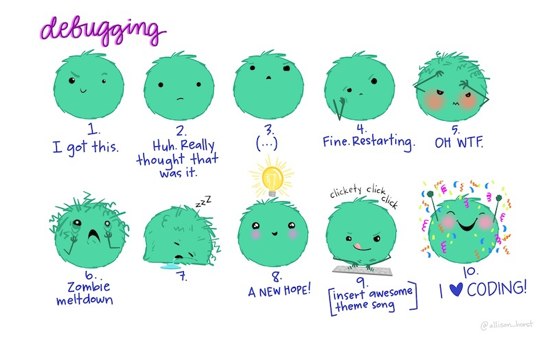
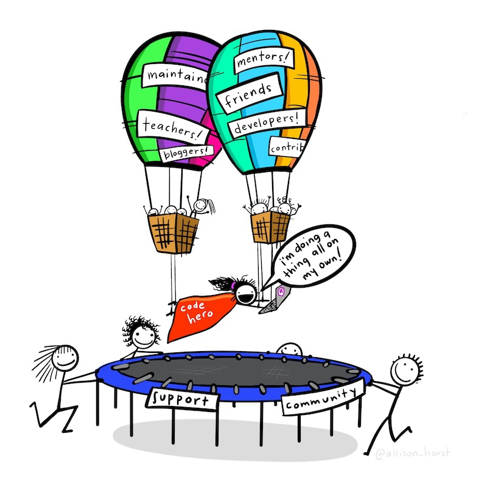
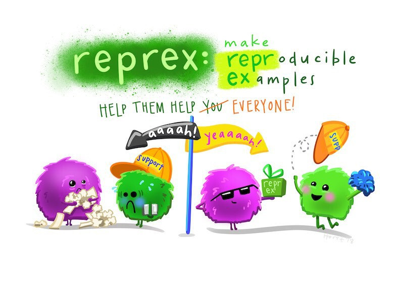
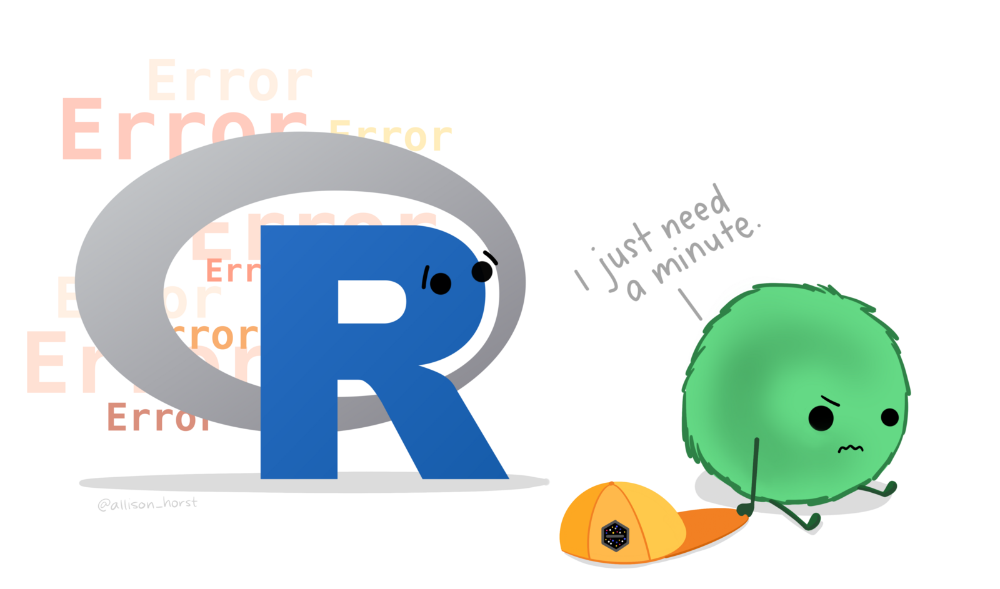

# Handling bugs in your code {#sec-bugs}

::: {.abstract}
This chapter will teach you how to identify and fix bugs in your R code. You will learn how to interpret messages, warnings and errors, and how to distinguish between different types of error. The chapter also introduces a systematic debugging process that you can use to find a fix problems. By the end of the chapter, you will be better prepared to diagnose problems in your code and to ask others for help when you need it.
:::


::: {.callout-tip title="Before you start"}

1. Open Positron or -- if you already have Positron open -- start a new R session by clicking the **Restart R** (**&#10227;**) button in the **Console** panel. This makes sure no code you ran previously will interfere with the work you do in this chapter.
2. Make sure you are working in the crime mapping project workspace you created in @sec-create-project. In the top-right corner of the Positron window, you should see a folder icon and the words `crime-mapping`. If not, click the **File** menu, then **Open Folder ...** and choose the `crime-mapping` folder.
:::


## Introduction

In this chapter we will learn how to deal with bugs in the R code that we write. Bugs in code are inevitable. Everyone who writes code makes mistakes. But even when no-one has made a mistake, there are lots of other reasons why code that previously worked well eventually does not. Learning how to identify and fix bugs is part of the process of learning to code.

By the end of this chapter, you will have learned how to:

- distinguish messages, warnings and errors;
- recognise syntax errors, runtime errors and logic errors;
- find the smallest piece of code that produces a problem;
- inspect the data used and produced by each step in an analysis;
- use R manual pages to understand functions;
- create a reproducible example when asking for help; and
- assess suggestions from online sources and generative AI critically.


::: {.callout-tip title="But can't I just use AI to fix my code?"}
Whether an AI tool such as ChatGPT or Gemini can fix your code depends on the nature of the problem, the information you provide and the features available to you. AI tools can solve many problems well, but they can also produce plausible suggestions that are wrong.

It's not always possible to rely on AI to fix problems with our code, and even when it is possible, it is still useful to understand the solution the AI is suggesting. We'll come back to using AI to help us fix bugs in our code later in this chapter.
:::


## Preventing bugs {#sec-preventing-bugs}

The easiest bug to fix is one that never reaches your code. Good working habits cannot prevent every mistake, but they make mistakes less likely and make the remaining bugs much easier to find.

- **Keep files organised.** Work inside the `crime-mapping` workspace, store original data in `data/raw`, processed data in `data/processed`, scripts in `R` and analytical output in `output` (see @sec-create-project to remind yourself about this if necessary). Use relative paths rather than paths that work only on your computer (see @sec-spatial-data).
- **Give files informative names.** Use lower-case letters, numbers and underscores, and add padded numbers where several scripts must run in order. See @sec-file-names.
- **Give objects meaningful names.** Use lower-case snake case and choose a name that describes what the object contains. Do not reuse the names of functions or overwrite an existing object with unrelated contents. See @sec-naming-objects.
- **Write readable scripts.** Use comments to explain the purpose of a script and its main stages, and use blank lines or section headings to separate distinct tasks. See @sec-comments.
- **Use consistent formatting.** Air formats R code automatically when you save it, making inconsistent spacing and indentation easier to avoid. If Air cannot format a file, check first for an incomplete expression or syntax error. See the Air setup in @sec-create-project.
- **Keep the complete analysis in a script.** Permanent code belongs in a named script, while temporary inspection code belongs in the Console. Restart R and run the complete script from beginning to end before relying on its results. See @sec-permanent-code.

These practices do not merely make code look tidy. They reduce ambiguity and complexity in your code, both of which are common underlying causes of code bugs. When files, objects and stages have predictable names and structure, unexpected code stands out and the source of a problem is easier to isolate.

::: {.callout-quiz .callout title="Preventing bugs"}

```{r}
#| label: preventing-bugs-quiz
#| echo: false

preventing_bugs_quiz1 <- c(
  "Run each permanent line directly in the Console and do not save it",
  "Use a different naming style for each object so that names stand out",
  answer = "Keep permanent code in a named script and run the complete script from a new R session",
  "Store downloaded data in the same folder as R scripts"
)

preventing_bugs_quiz2 <- c(
  "It prevents every possible bug",
  answer = "It makes unusual or incomplete code easier to notice",
  "It allows R to guess what incomplete code should do",
  "It automatically corrects logic errors"
)
```

**Which habit makes an analysis easier to check and reproduce?**

`r webexercises::longmcq(preventing_bugs_quiz1)`

**Why does consistent formatting help with debugging?**

`r webexercises::longmcq(preventing_bugs_quiz2)`

:::

In this chapter we will look at examples of errors using a dataset of frauds in Kansas City in the United States. To get started, download the file and load it into R:


```{r}
#| filename: "R Console"
#| output: false

# Load packages
pacman::p_load(here, httr2, tidyverse)

# Download the data and store the original file
request(
  "https://mpjashby.github.io/crimemappingdata/kansas_city_frauds.csv.gz"
) |>
  req_perform(path = here("data", "raw", "kansas_city_frauds.csv.gz"))

# Load the local file
frauds <- read_csv(here("data", "raw", "kansas_city_frauds.csv.gz"))
```


::: {.callout-tip collapse="true" title="Why did we run this code in the R Console?"}

Normally when we load packages and data, we do it in an R script file. We do that because this code is needed as part of the complete script that produces a particular map. In this chapter we won't be creating a map, just looking at examples of errors, so we won't need to keep any of the code for later.
:::


This is what the first few lines of the dataset look like:

```{r}
#| echo: false

frauds |>
  knitr::kable(caption = "Example rows from the Kansas City fraud dataset")
```

In this chapter we will go through the process of debugging -- identifying, understanding and fixing errors in your code. Sometimes fixing issues with your code can feel like a bit of a roller coaster, but (like most things) it becomes much easier with practice, and if you approach errors in a systematic way.

<p class="full-width-image"></p>


## Errors, warnings and messages

When something is not quite right, or just when there is an issue in your code that you should be aware of, R has three ways of communicating with you: messages, warnings and errors (these are collectively sometimes called _conditions_).


### Messages

*Messages* are usually for information only and typically don't require you to take any action. For example, the function `get_crime_data()` from the `crimedata` package issues a message to tell you what data it is downloading. It does this because downloading data sometimes takes a few seconds and without a message you might wonder if the code was working.

```{r}
#| label: crimedata-example
#| filename: "Don't run this code"

mesa_crimes <- crimedata::get_crime_data(cities = "Mesa", quiet = FALSE)
```

Messages appear in the **Console** panel along with other output from R. When R prints a message about your code, any code underneath the code that generated the message will still run. For example, if you run these three lines of code (the second of which prints a message, using the `message()` function), the line after the message will run as expected:

```{r}
#| label: messages-still-run
#| eval: false
#| filename: "R Console"

2 * 2
message("This is a message. Make sure you understand it.")
2 / 2
```

```{r}
#| echo: false

2 * 2
message("This is a message. Make sure you understand it.")
2 / 2
```


### Warnings

*Warnings* are generated when there is a potential problem with your code, but the problem was not serious enough to stop your code running entirely. For example, ggplot2 functions like `geom_point()` will send a warning if some of the rows in your data contain missing values (e.g. if some crimes have missing co-ordinates).

Warnings are important and you should take time to read and understand them, but it is _possible_ that having done so it will be safe to not take any action. *Whether* it is safe to take no action will often depend on exactly what you are trying to do, which is why it is important that you understand each warning that you see. For example, if you already know that some rows in your data contain missing values and are happy to plot the remaining values, it will be safe to ignore the warning produced by `geom_point()`. But if your dataset should not have any missing values in it, you will need to investigate why `geom_point()` is warning you about missing values and whether those values have been accidentally introduced by some part of your code.


::: {.callout-important title="It is not safe to simply ignore warnings"}

**It is not safe to ignore warnings** unless you are sure why they occurred and certain that you don't need to take any action. If your code produces a warning, it is not safe to 'leave it until later' and carry on writing the rest of your code: work out straight away if you need to take any action.

One particularly dangerous scenario is where your code produces warnings but still produces what looks like a reasonable result. In these circumstances it can be tempting to ignore the warnings and assume that everything is fine, since the code still produced roughly what you were expecting. However, it's possible that the plausible answer is nevertheless wrong because of whatever problem is generating the warning in R. Do not assume that warnings are safe to ignore just because they don't stop your code running.

:::

As with messages, warnings will not stop your code running. This means that if the warning signalled a genuine problem with your code, the results of the lines underneath the warning might not be reliable. That is why it is important to understand warnings when you see them.


### Errors

*Errors* are generated when R cannot complete the current operation. An error might occur, for example, because `read_csv()` could not open a requested file. Errors are generally used for more-serious issues that prevent an operation from running successfully, so an error occurring stops the code being run at that point. When you run a complete script that has an error in it, R will stop running the script at the point where the error occurred. That means any code above the error will still have run, but code below the error will not have done.


## Types of code bugs

Much like their animal namesakes, bugs in code come in many different varieties. We can divide bugs into three categories to make them easier to think about: _syntax errors_, _runtime errors_ and _logic errors_.

### Syntax errors

Syntax errors happen when R cannot interpret your code because of a mistake in how it has been typed. For example, if you forget to put a comma between the arguments of a function, you will get this error:

```{r}
#| error: true
#| filename: "R Console"

c("A" "B")
```

This error is caused by a missing comma between the two arguments `"A"` and `"B"` -- the code should have been `c("A", "B")`.

When you run a complete script, R first checks whether the script can be interpreted as valid R code. A syntax error can therefore stop the script before any of it runs. When you run one expression at a time in Positron, code above a later syntax error may still run. Positron will often underline syntax errors in the **Editor**. Another indication there is a syntax error in your code is that a syntax error will usually mean the Air formatter is unable to format a script. Syntax errors are often caused by missing commas, quote marks or closing parentheses. Since syntax errors stop your script from running entirely, it's usually immediately apparent that a syntax error has occurred. Syntax errors are usually quite quick to fix, since they are usually caused by typos.

### Runtime errors

Runtime errors happen when R can read the code (i.e. there are no syntax errors) but cannot complete the steps that the code sets out. For example, R can read the code `3 * "A"` (`*` in R means 'multiply by'). But R cannot multiply the number `3` by the character value `"A"` -- trying to multiply a number by a letter makes no sense.

```{r}
#| error: true
#| filename: "R Console"

3 * "A"
```

::: {.callout-tip collapse="true" title="What is a 'binary operator', and what are its arguments?"}
The phrase "non-numeric argument to binary operator" might be a bit confusing. A binary operator is an operator that takes two arguments, such as `+`, `-`, `*` or `/`. Operators in R don't look like functions, but they act a lot like them. But whereas the arguments to a function are specified within parentheses, the arguments to a binary operator are specified on either side of the operator. In this case, the two arguments to the `*` operator are `3` and `"A"`. The error message is telling us that one of the arguments is not numeric, so R cannot complete the calculation.
:::

Trying to load data from a missing file, trying to refer to a non-existent column name or trying to use a function on the wrong type of object are other issues that can cause runtime errors.

When R runs a complete script file, it checks the syntax before evaluating the expressions in that script. But since every step in your code depends on the steps before it, R cannot tell whether a particular expression may cause a runtime error until the expressions before it have run successfully. That's why these are called _runtime_ errors -- they only happen when your code is run. If your code contains multiple issues that will cause runtime errors, R will typically only tell you about the first one because it cannot reach any later errors until the first has been fixed. That makes runtime errors harder to manage than syntax errors.


### Logic errors

There is a saying in programming that a computer will do exactly what you tell it to do, but that that may not be the same as what you _wanted_ it to do. A logic error happens when the code runs but produces a result that is incorrect in some way. For example, we might inadvertently write code that accidentally filters out some rows in a dataset that we actually needed to keep. There is no way for R to know that you didn't intend to filter out those rows, so it will happily follow your instructions even though they will lead to the wrong result. For that reason, logic errors often don't cause an R error message. They are often only visible because they cause unexpected results later on in a script.

Logic errors are often the hardest bugs to find because there may be no error messages in the R console and the output produced by a script can look plausible, even if it's wrong. To identify logic errors, you must inspect the data produced at each important stage and compare the result with what you expected. Simple checks using functions such as `head()`, `nrow()`, `count()` and `summary()` can expose unexpected results before they affect later parts of an analysis.

Now we know what messages, warnings and errors are, we need to find out how to deal with them when they happen.


::: {.callout-quiz .callout title="Messages, warnings and errors"}

```{r}
#| label: messages-quiz
#| echo: false

messages_quiz1 <- c(
  answer = "A message",
  "A warning",
  "An error",
  "A condition"
)

messages_quiz2 <- c(
  "It is generally okay not to worry about warnings produced by R code -- in most cases you won't need to take any action anyway",
  answer = "While you will often not need to take any action in response to a warning produced by your R code, it is still important to understand what caused the warning just in case you need to take action"
)

messages_quiz3 <- c(
  "A syntax error",
  "A runtime error",
  answer = "A logic error",
  "A message"
)

messages_quiz4 <- c(
  answer = "A syntax error stops R interpreting the code, while a runtime error occurs when R cannot complete an operation",
  "A syntax error produces an incorrect result, while a runtime error always produces a warning",
  "A syntax error occurs only in the Console, while a runtime error occurs only in scripts",
  "There is no difference between syntax errors and runtime errors"
)
```


**Which of the following terms is used in R to describe the way of communicating something for information only?**

`r webexercises::longmcq(messages_quiz1)`


**Which of these statements is true?**

`r webexercises::longmcq(messages_quiz2)`

**What type of bug occurs when code runs but produces the wrong result?**

`r webexercises::longmcq(messages_quiz3)`

**What is the difference between a syntax error and a runtime error?**

`r webexercises::longmcq(messages_quiz4)`


:::


## Tracking down bugs {#sec-finding-bugs}

If an error or warning has a simple cause, such as trying to multiply a number by a character value, you can just fix the problem and re-run the code. Or if your code only has one line, it will probably be obvious where any problem lies.

For problems that are more difficult to handle, you will need to follow a step-by-step process to find and fix them. Think of this as like being a mechanic fixing a car -- first you work out what the problem is, then you fix it.

To identify the cause of bugs in our code we will use a four-step process:

::::::::: {.process}

::::: {.item color="#3182bd"}
Understand

::: annotation
messages, warnings and unexpected results
:::
:::::

::::: {.item color="#3182bd"}
Isolate

::: annotation
the smallest piece of code that produces the problem
:::
:::::

::::: {.item color="#3182bd"}
Inspect

::: annotation
the data used and produced by that code
:::
:::::

::::: {.item color="#3182bd"}
Get help

::: annotation
using a reproducible example
:::
:::::

:::::::::

Sometimes it won't be necessary to go through all the steps because the problem will be easy to fix, but it's still useful to follow the process from the start until we reach a solution.


### Step 1: Understand the problem

The first step in diagnosing a problem with our code is to reproduce it, then read _and understand_ any errors, warnings or messages produced. For simple bugs this will often be enough to solve the problem. For example, if you were to try to run this code with the `frauds` dataset we loaded earlier:

```{r}
#| eval: false
#| filename: "R Console"

select(frauds, offense_category)
```


You would see that R produced an error message saying something like:

```{r}
#| echo: false
#| error: true

select(frauds, offense_category)
```

In this case it is fairly easy to identify that the error message is telling us that one of the columns we have tried to select does not exist. Maybe we misremembered the name of the column. To find out what the correct column name is, the easiest thing to do is to print the first few rows of the object in the R Console:

```{r}
#| filename: "R Console"

head(frauds)
```

From this, we can see that the column we want to select is called `offense_type`, not `offense_category`.

In other cases, error messages will be harder to interpret. Imagine we wanted to break a long string of text into multiple lines. To do that we might use the `str_wrap()` function, which we previously used to format text in @sec-map-context. But if we run this code, we get a runtime error:

```{r}
#| error: true
#| filename: "R Console"

str_wrap("A line of text that we want to break into shorter lines", length = 20)
```

From the error message, it looks like there's nothing wrong with the string of text, but that there is an issue with the argument `length = 20`. One possibility is that we've got the name of this argument wrong. To understand the problem, we can check the manual page for the `str_wrap()` function. Functions provided by R and R packages normally have a manual page that explains what the function does, what arguments it takes and what value it returns. You can get a lot of help in understanding each function by referring to its manual page. You can access the manual page for a function in Positron by:

- typing a question mark followed by the function name (e.g. `?str_wrap`) into the R Console;
- typing the function name into the search box in the **Help** panel; or
- placing the cursor on the function name in your R code and pressing  on your keyboard.

Any of these options opens the manual page in Positron's **Help** panel. For example, you can load the manual page for `str_wrap()` from the stringr package by typing `?str_wrap` in the R Console.

All manual pages have the same format.

Description
: This section gives a short description of what the function does. If multiple related functions are described in a single manual page, this section will explain the differences between them.

Usage
: This section shows how to write a call to the function, including the names and default values of its arguments. For example, the manual page for `str_wrap()` shows that the default value of the `width` argument is `width = 80`.

Arguments
: This section gives a list of arguments and the values they can take. It is particularly important to note the type of value expected. For example, the `st_transform()` function from the sf package expects a spatial object, such as an SF object, as its first argument -- if you provide a non-spatial object such as a tibble, this will cause an error.

Value
: This section explains the type of value that the function will return, and whether this value might be of a different type depending on the values of particular arguments.

Examples
: This section gives more examples of how the function can be used.

Checking the manual page for a function can often help you understand why a particular piece of code is not working. In this case, we can see that `str_wrap()` doesn't have a `length` argument, which is why our code produced an error. The correct argument name is `width`, so we can fix the code by changing `length = 20` to `width = 20`.

```{r}
#| filename: "R Console"

str_wrap("A line of text that we want to break into shorter lines", width = 20)
```

::: {.callout-tip collapse="true" title="What should I do if an error mentions `rlang::last_trace()`?"}

Some errors produced by tidyverse packages suggest running `rlang::last_trace()`. This command shows the sequence of function calls that led to the error. The output can be long, so first look for a line that refers to your script or to a function you called. You do not need to understand the internal package functions listed in the trace.

:::


### Step 2: Isolate the code that produces the problem

If Step 1 isn't enough to resolve the issue, the second task is to work out exactly which function or other piece of code has caused the problem. For example, take this data-wrangling code that is designed to reduce the size of a dataset and sort it in date order:

```{r}
#| error: true
#| filename: "R Console"

frauds |>
  select(offense_type, date, longitude, latitude) |>
  filter(offence_type == "impersonation") |>
  arrange(date)
```

This code produces a structured error message. The first line tells us that the error occurred in `filter()`, the information line identifies the argument that caused the problem and the final line describes the immediate cause:

```
! object 'offence_type' not found
```

This suggests the error is on line 3 of the code, since that is the only line containing a reference to `offence_type`. To check this, we can *comment out* that line by placing a `#` symbol at the start of the line. One easy way to do that is to click anywhere on the line and then type . Do this and re-run the code above -- it should now run without a problem.

Now we know the problem is on the line `filter(offence_type == "impersonation")`, we can look at that line in more detail. Can you spot the problem with that line?

The error message in this case has been caused by a typo -- the code `offence_type == "impersonation"` uses the British spelling of the word 'offence' but in the dataset the variable is spelled using the American English 'offense' (you can see the US spelling in the line of code above the line that is causing the error). Fix the typo and re-run the code above in Positron.

Sometimes a bug is introduced on one line but only becomes visible later. Consider this separate example, in which `select()` removes a column that is needed by `arrange()` later in the pipeline:

```{r}
#| error: true
#| filename: "R Console"

frauds |>
  select(offense_code, longitude, latitude) |>
  filter(offense_code == "26A") |>
  arrange(date)
```

The message seems to tell us that the error occurs in `arrange()`. But looking at that line of code, there is nothing obviously wrong. `arrange()` is a function in a package that we've loaded (`arrange()` is in the dplyr package, which was loaded automatically when we loaded the tidyverse package), and `date` is a column in the original `frauds` dataset. So why is R producing an error message? We could look at the manual page by typing `?arrange` in the R Console, but let's imagine we've done that already and it didn't help.

A useful next step in these circumstances is to look at the _inputs_ a function is receiving. This can be important because while the error message suggests the problem is in `arrange()`, it's possible that the _cause_ of the error is some problem with a previous part of our code and that `arrange()` is just the first function to notice the problem. In cases like that, an error message can be technically correct but somewhat misleading.

A good way to identify which line of a code pipeline is causing the problem is to comment out all the lines except the first one, then run the code and see if it produces an error. If no error appears and the result produced by that line looks reasonable, then we continue to uncomment one line at a time until we find the problem.

Re-run the code above, but comment out all the lines except the first one by putting `# ` at the start of each line. Remember to remove the `|>` from the end of the last _uncommented_ line of code, since otherwise you will find the code does not run as expected. Your code should now look like this:

```{r}
#| eval: false
#| filename: "R Console"

frauds
# select(offense_code, longitude, latitude) |>
# filter(offense_code == "26A") |>
# arrange(date)
```

If you run this code, it will simply print the first few lines of the dataset. Remove the `# ` comment symbol from the second line of the code and run it again, remembering to replace the pipe operator (`|>`) at the end of line 1 and remove the `|>` at the end of line 2.

```{r}
#| eval: false
#| filename: "R Console"

frauds |>
  select(offense_code, longitude, latitude)
# filter(offense_code == "26A") |>
# arrange(date)
```

Again, the code does not produce an error -- but the result now has only three columns. Checking the output at this stage shows that the `date` column has been removed. Add `date` to the list of columns that are included in `select()` before continuing.

Uncommenting one line at a time is useful for runtime errors, but it is equally important to look for unexpected output. The following code runs without an error:

```{r}
#| filename: "R Console"

frauds |>
  select(offense_code, date, longitude, latitude) |>
  filter(offense_code == "26E")
```

There is no error message, but there are no rows left in the result. This is a logic error because we expected the result to contain frauds. There are no rows for which `offense_code` has the value `"26E"`. If we use `count()` to list the unique values of `offense_code`, we can see that the only values are `r knitr::combine_words(map_chr(sort(unique(pull(frauds, "offense_code"))), \(x) str_glue('"{x}"')))`:

```{r}
#| filename: "R Console"

count(frauds, offense_code)
```

Uncommenting one line at a time until you find an error or unexpected output is a useful way to isolate problems, but it will not always work. In particular, it will not identify code that is missing entirely. For example, the following pipeline omits the step that changes the tibble into an SF object before using `st_transform()`:

```{r}
#| error: true
#| filename: "R Console"

frauds |>
  select(offense_code, longitude, latitude) |>
  filter(offense_code == "26A") |>
  sf::st_transform("EPSG:3603")
```

In these cases it is particularly useful to check every argument that you have used in a function, using its manual page as described in Step 1.


### Step 3: Inspect the data used and produced by each step

Not all runtime errors are caused by problems with the code itself. Some bugs are caused by a mismatch between the structure your data actually has and the structure you thought it had when you wrote the code. We have already seen this in the code that referred to a column called `offense_category` in a dataset without that column.

Bugs caused by a mismatch between the data you think you have and the data you actually have can be particularly frustrating because you cannot identify them by looking only at your code. Look at both the data used as input and the data produced by each important step. We used this technique above to find that `filter()` had removed every row because the value we specified was not present.

Finding data problems is one of the reasons why we have used the `head()` function so often in previous chapters to look at the data at each step in writing a block of code. Looking at the results of a particular block of code before moving on to writing the next block can often save you from frustrating errors later on.

`head()` only shows the first few rows of a dataset, so it will not reveal every possible problem. You can use the `view()` function instead to open a complete version of the dataset in Positron's **Data Explorer**. The Data Explorer lets you inspect values, sort and temporarily filter rows, and see summaries for each column. These changes affect only the view and do not alter the object in R.

There are many other functions available for inspecting data. For a large dataset, functions such as `count()`, `distinct()`, `glimpse()` and `summary()` are often more useful than trying to inspect every row. You can use `slice_sample(frauds, n = 10)` to inspect ten random rows or `slice_sample(frauds, prop = 0.1)` to inspect 10% of the rows. However, a random sample can miss rare values, including the value causing a bug, so do not assume that a sample represents every part of the data.

::: {.callout-quiz .callout title="Finding and understanding bugs"}

```{r}
#| label: understanding-bugs-quiz
#| echo: false

understanding_bugs_quiz1 <- c(
  "Change several arguments at once so that one of them is likely to work",
  "Inspect only the final result because intermediate results do not matter",
  answer = "Run the code one stage at a time and inspect the result after each stage",
  "Ignore a result with zero rows if R did not produce an error"
)

understanding_bugs_quiz2 <- c(
  "Only the name of the package containing the function",
  answer = "The inputs a function expects, its arguments and the value it returns",
  "A guarantee that the function is suitable for your analysis",
  "A list of every bug that the function can produce"
)
```

**What is a useful way to find where a bug was introduced?**

`r webexercises::longmcq(understanding_bugs_quiz1)`

**What can a function's manual page help you check?**

`r webexercises::longmcq(understanding_bugs_quiz2)`

:::


### Step 4: Get help using a reproducible example {#sec-reprex}

If you cannot fix a bug using the techniques we have already covered, it may be time to get some help from someone else. R has a large online community and generative AI tools can provide a lot of help, but people and bots can only help if they have enough information.



One of the things that makes it much more likely that you will find useful help with your problem is if you phrase your plea for help in a way that makes it easier to help you. We can do this by providing a *reproducible example* of our problem (also sometimes called a *reprex* or a *minimum working example*).

Producing a reprex makes it much easier for someone (or an AI tool) to understand your issue. Asking why some code did not work without showing the code and data is like asking why your attempts to bake a cake failed without providing a copy of the recipe. A reprex provides the equivalent of the recipe and the result, allowing someone else to investigate the same problem.

To make a reprex, we have to do three things:

1. Remove everything from the code that does not contribute to the problem. Keep only the code needed to produce the same error or unexpected result -- this is why a reproducible example is sometimes called a *minimal* working example.
2. Make sure someone can run the example on their computer. This might involve using a dataset built into an R package or creating a small example dataset that has the same relevant structure as your data.
3. Remove confidential, personal or otherwise sensitive information. Never share sensitive crime data, passwords, API keys or other credentials in a reprex.

To practise making a reproducible example, create a new R script that we know will produce an error. Click **File**, then **New File ...** and choose **R File**. Save the file as `chapter_08.R` in the `R` folder of your crime mapping workspace, then paste the following code into it:

```{r}
#| echo: false

# This code creates a CSV file that users can download and then reference in
# their code as a local file (which is important in the narrative, since it
# makes the example non-reproducible)
Seatbelts |>
  as_tibble() |>
  mutate(
    year = 1969 + floor(row_number() / 12.0001),
    month = rep(1:12, 16),
    month_beginning = as.Date(str_glue("{year}-{month}-01"))
  ) |>
  select(month_beginning, everything(), -year, -month) |>
  write_csv(here::here("data", "road_deaths_data.csv"))
```

```{r}
#| eval: false
#| filename: "chapter_08.R"

# Load packages
pacman::p_load(here, tidyverse)

# Load a dataset from your computer and wrangle it
road_deaths <- read_csv(here("data", "raw", "road_deaths_data.csv")) |>
  janitor::clean_names() |>
  rename(ksi_drivers = drivers, ksi_pass_front = front, ksi_pass_rear = rear) |>
  select(-petrol_price, -van_killed) |>
  mutate(
    law = as.logical(law),
    ksi_driver_rate = ksi_drivers / (kms / 1000)
  )

# Make a time-series chart of two continuous variables, coloured by a
# categorical variable, then add a trend line
road_deaths +
  ggplot(aes(x = month_beginning, y = ksi_driver_rate)) +
  geom_point(aes(colour = law)) +
  geom_smooth() +
  scale_x_date(date_breaks = "2 years", date_labels = "%Y") +
  scale_y_continuous(labels = scales::comma_format(), limits = c(0, NA)) +
  scale_colour_brewer(type = "qual") +
  labs(
    x = NULL,
    y = "drivers killed or seriously injured per 1,000km travelled",
    colour = "after seat belts made mandatory"
  ) +
  theme_minimal() +
  theme(
    axis.line.x = element_line(colour = "grey90"),
    axis.ticks = element_line(colour = "grey90"),
    panel.grid.major.x = element_blank(),
    panel.grid.minor.x = element_blank(),
    legend.position = "bottom"
  )
```

At the moment, you can't run this code because you don't have the `road_deaths_data.csv` file. Download the file using the following link and save it in the `data/raw` folder. Keeping the downloaded file separate from the script follows the workspace structure introduced in @sec-create-project.

<p class="center"><a href="../data/road_deaths_data.csv" download class="btn btn-info">Download the road deaths data file</a></p>

Now run all the code in the `chapter_08.R` file. You should see this error:

```{r}
#| echo: false
#| error: true

# Load packages
pacman::p_load(here, tidyverse)

# Load a dataset from your computer and wrangle it
road_deaths <- read_csv(
  here("data", "road_deaths_data.csv"),
  show_col_types = FALSE
) |>
  janitor::clean_names() |>
  rename(ksi_drivers = drivers, ksi_pass_front = front, ksi_pass_rear = rear) |>
  select(-petrol_price, -van_killed) |>
  mutate(
    law = as.logical(law),
    ksi_driver_rate = ksi_drivers / (kms / 1000)
  )

# Make a time-series chart of two continuous variables, coloured by a
# categorical variable, then add a trend line
road_deaths +
  ggplot(aes(x = month_beginning, y = ksi_driver_rate)) +
  geom_point(aes(colour = law)) +
  geom_smooth() +
  scale_x_date(date_breaks = "2 years", date_labels = "%Y") +
  scale_y_continuous(labels = scales::comma_format(), limits = c(0, NA)) +
  scale_colour_brewer(type = "qual") +
  labs(
    x = NULL,
    y = "drivers killed or seriously injured per 1,000km travelled",
    colour = "after seat belts made mandatory"
  ) +
  theme_minimal() +
  theme(
    axis.line.x = element_line(colour = "grey90"),
    axis.ticks = element_line(colour = "grey90"),
    panel.grid.major.x = element_blank(),
    panel.grid.minor.x = element_blank(),
    legend.position = "bottom"
  )
```

As you can see, this error is not easy to decipher, so we might need help to deal with it. 


#### Reproducible code

The first step in producing a reprex is to remove every line from our code that isn't necessary to produce the error. To do that, we start with the _last_ line of code and remove it, then re-run the code. If the code produces _the same error_, we know that the error wasn't caused or affected by anything on the line that we have removed. In that case, we don't need to include that line of code in the reprex. On the other hand, if the error message disappears and the code runs successfully, _or_ the error message changes to a different error, we know that the line of code we removed influenced the error in some way. In that case, we need to include that line of code in the reprex.

Following this process line by line, it is actually possible to remove a lot of the original code and still produce the same error. In fact, we only need to keep five lines of the original code:

```{r}
#| eval: false
#| filename: "chapter_08.R"

# Load packages
pacman::p_load(here, tidyverse) #<<

# Load a dataset from your computer and wrangle it
road_deaths <- read_csv(here("data", "raw", "road_deaths_data.csv")) |> #<<
  janitor::clean_names() |>
  rename(ksi_drivers = drivers, ksi_pass_front = front, ksi_pass_rear = rear) |>
  select(-petrol_price, -van_killed) |>
  mutate(
    law = as.logical(law),
    ksi_driver_rate = ksi_drivers / (kms / 1000)
  )

# Make a time-series chart of two continuous variables, coloured by a
# categorical variable, then add a trend line
road_deaths + #<<
  ggplot(aes(x = month_beginning, y = ksi_driver_rate)) + #<<
  geom_point(aes(colour = law)) + #<<
  geom_smooth() +
  scale_x_date(date_breaks = "2 years", date_labels = "%Y") +
  scale_y_continuous(labels = scales::comma_format(), limits = c(0, NA)) +
  scale_colour_brewer(type = "qual") +
  labs(
    x = NULL,
    y = "drivers killed or seriously injured per 1,000km travelled",
    colour = "after seat belts made mandatory"
  ) +
  theme_minimal() +
  theme(
    axis.line.x = element_line(colour = "grey90"),
    axis.ticks = element_line(colour = "grey90"),
    panel.grid.major.x = element_blank(),
    panel.grid.minor.x = element_blank(),
    legend.position = "bottom"
  )
```

That means we can remove:

1. The comments (lines 1, 4, 14 and 15, above).
2. The code that wrangles the data in ways that don't affect the error (lines 6--12).
3. The code that adds a trend line to the chart (line 19).
4. The code that fine-tunes the appearance of the chart (lines 20--35).

We cannot remove the code that loads necessary packages (line 2), loads the data (line 5) or produces the basic unformatted chart (lines 16--18), because if we remove any of those then the error message either changes or disappears.

This leaves us with much shorter code that produces the same error. Because we have removed the data-wrangling code, we must use the original column name `drivers` instead of the new name `ksi_driver_rate`. We also remove pipe and `+` operators that no longer connect to another line of code.

Removing the lines we don't need to reproduce the error leaves `chapter_08.R` looking like this:

```{r}
#| error: true
#| message: false
#| filename: "R Console"

pacman::p_load(here, tidyverse)

road_deaths <- read_csv(here("data", "raw", "road_deaths_data.csv"))

road_deaths +
  ggplot(aes(x = month_beginning, y = drivers)) +
  geom_point(aes(colour = law))
```


::: {.callout-important title="If the error message changes, keep that line of code"}

If we forgot to change `y = ksi_driver_rate` to `y = drivers`, or to remove an operator at the end of a shortened expression, the code could produce a different error. The purpose of producing a reprex is to find the minimum code that still produces _the same problem_ we are interested in. If you remove a line and the problem changes, put that line back.

:::


Even though we have removed most of the previous code, this shorter code still produces the same error message. The bug must therefore be in one of the few remaining expressions. This makes the problem much easier to understand than it was in the original script.


::: {.callout-tip collapse="true" title="But wouldn't this chart look very different?"}

If this shortened code ran successfully rather than producing an error, the resulting chart would look very different to the original chart we wanted. But that does not matter, because what we are interested in is isolating the lines of code that produce the specific error we want to find and fix.
:::


#### Reproducible data

Our shortened code would make a useful example except for one thing: the data file `road_deaths_data.csv` only exists on your computer. Someone trying to run the code elsewhere would instead get an error saying that the file could not be found.

You might not be able to share the original data that your code uses, for example if it is sensitive or too large to share. Fortunately, many R packages include small datasets for learning and testing. You can see a list of the datasets available in loaded packages by typing `data()` in the R Console.

To use one of these datasets, refer to its name as you would any other R object. One commonly used example is `mpg` from the ggplot2 package, which contains fuel-economy data for 38 models of car.

The data are on a different topic, but that does not matter for this particular error because the bug is in the way we combine the data and `ggplot()`. For a data-dependent bug, a substitute dataset must preserve the relevant column types and problematic values or the bug might disappear. We can inspect `mpg` using `head()` as usual.

```{r}
#| filename: "R Console"

head(mpg)
```

From this, we can see that there is: 

- a `year` variable that we can use instead of `month_beginning`;
- a numeric variable called `hwy` that we can use instead of `drivers`; and
- a categorical variable called `trans` that we can use instead of `law`.

This means we can use this data instead of our own data, knowing that anyone on any computer with the ggplot2 package installed can run the code and should get the same result. It also makes our code slightly shorter still, since we no longer need to load the data from a file with `read_csv()`. All we need to do is load the ggplot2 package and replace the reference to the `road_deaths` object on line 5 of our shortened code to a reference to the built-in `mpg` object:


```{r}
#| error: true
#| filename: "R Console"

library(ggplot2)

mpg +
  ggplot(aes(x = year, y = hwy)) +
  geom_point(aes(colour = trans))
```

We have reduced the original script to four lines and made the example reproducible using a widely available dataset. The shorter code still produces the same error but is much easier to read.

Most of the time, the act of producing a reprex will be enough for us to find and fix the error without any external help. Can you see the problem with our code that is making this error happen? If not, we will reveal it at the end of this chapter.


#### Checking your reprex is reproducible

Now that you have the minimum code needed to reproduce the error, it's almost time to share it with people who can help you. But before you do that, it's worth checking that the code is truly reproducible. To do this we will use the reprex package, which is part of the tidyverse suite of packages you already have installed.

<p class="full-width-image"></p>

<a href="https://reprex.tidyverse.org/" aria-label="Visit the reprex package website"></a>

Make sure the `chapter_08.R` file now only contains the four-line minimal working example above, then save the file. Now run this command in the R Console:

```{r}
#| eval: false
#| filename: "R Console"

reprex::reprex(input = here("R", "chapter_08.R"))
```

The reprex package runs the example in a separate R session (to avoid conflicts with your current workspace) and produces a preview containing both the code and its output. If clipboard support is available on your computer, it also copies the formatted code to your clipboard so that you can paste it into a message, web form or chat bot.

::: {.callout-important title="Check for sensitive information before sharing"}

Read the complete reprex before sharing it. Check the code, data, file paths, output and error message for personal information, confidential crime data, usernames, credentials or any other information that should not be public.

:::

::: {.callout-quiz .callout title="Reproducible examples and asking for help"}

```{r}
#| label: reprex-help-quiz
#| echo: false

reprex_help_quiz1 <- c(
  "The complete analysis and the original confidential dataset",
  answer = "The smallest code and non-sensitive data needed to reproduce the same problem",
  "Only a screenshot of the error message",
  "Every package installed on your computer"
)

reprex_help_quiz2 <- c(
  "Post the question on as many websites as possible",
  "Use a title such as 'R problem' so that it applies broadly",
  answer = "Explain the expected result and include a checked reprex",
  "Remove the error message because it might distract readers"
)
```

**What should a reprex contain?**

`r webexercises::longmcq(reprex_help_quiz1)`

**What makes a request for debugging help easier to answer?**

`r webexercises::longmcq(reprex_help_quiz2)`

:::


::: {.box .reading}

For more information on writing reproducible examples, see:

- Watch the webinar [Creating reproducible examples with reprex](https://reprex.tidyverse.org/articles/learn-reprex.html) by Jenny Bryan.
- Read the [Reprex do's and don'ts](https://reprex.tidyverse.org/articles/reprex-dos-and-donts.html) on the reprex package website.

:::


## Using generative AI to help with debugging


Now we've created a reprex, the next step is to share it with someone who can help. If you are being taught R by an instructor, use the support routes provided for your course first. But in many cases, the easiest way to get help will be by using a generative AI tool based on a large language model (LLM).

One useful application for tools such as ChatGPT, Gemini and Claude that are based on LLMs is helping to write and debug code. Having access to an AI tool doesn't mean that you don't need to know how to code. No AI tool is perfect, so you need to know enough to check that its suggestions are correct for your data and analytical goal. But LLMs can be very helpful in many circumstances.

There are many different LLM services available, and they are constantly changing. Some are free to use, while others require a paid subscription. Some are designed for general-purpose use, while others are specifically designed for coding. Some are designed to be used in a web browser, while others can be integrated directly into software such as Positron.

Most people's starting point with AI tools will be a web-based chat bot service such as ChatGPT or Microsoft Copilot. These services are designed to be easy to use. They can only use the code, files or connected sources that you make available to them. Some services can run code or inspect uploaded files, but these capabilities vary by service, account and configuration.

Much more useful for helping write and debug code are AI tools that are specifically designed for that purpose. There are many of these available, such as Open AI Codex, Claude Code and GitHub Copilot. Once set up, these tools have access to the code and data in a project, so they can base their answers on much more information. The way all LLM tools work means that the more information you provide, the more likely it is that the tool will give you a useful answer, so these tools can be much more helpful than a general-purpose chat bot. The main limitation of these tools is that they are not free (some are very expensive!) and that they often require some technical skill to set up and use.


::: {.callout-tip title="Eligible students can use GitHub Copilot without paying"}
Verified students can apply for GitHub Copilot Student. The features and usage allowances may change, so check the [current GitHub instructions for student access](https://docs.github.com/en/copilot/how-tos/copilot-on-github/set-up-copilot/enable-copilot/set-up-for-students) before signing up.
:::

The rest of this section focuses on using a web-based chat bot service to help with debugging, since this is likely to be the most familiar option. The same principles apply to other LLM services, but the details of how you use them will differ.

### Protecting sensitive information

Never submit sensitive crime data, personal information, passwords, API keys or other credentials to a generative-AI service. The service might send information to an external provider or retain it according to terms that you have not checked. If you are not certain that sharing particular information is authorised, do not share it.

Crime mapping can influence decisions about people and places, so analytical accuracy matters. If you use an LLM to support debugging, you remain responsible for understanding the code, checking the results and ensuring that the analysis is appropriate.

AI tools are more likely to provide a useful answer if you give them the same information that would make a good question for a person:

- what you were trying to achieve;
- the smallest code that produces the problem (i.e. a reprex);
- the exact text of the error, warning or unexpected result;
- what you expected to happen; and
- relevant package versions, if you know them.

For example, a useful prompt might be:

> I am learning R and using ggplot2. I want this code to make a scatter plot, but it produces the error pasted below. Explain the cause in beginner-friendly language, then suggest one change for me to test. Do not rewrite the whole script.
>
> ```
> library(ggplot2)
>
> mpg +
>   ggplot(aes(x = year, y = hwy)) +
>   geom_point(aes(colour = trans))
> ```
>
> `Error in mpg + ggplot(...): non-numeric argument to binary operator`

Asking for an explanation and one change helps you remain in control of the debugging process. Read the explanation, check it against the relevant R manual page, make the change yourself and then inspect the result. Do not accept code merely because it looks convincing or runs without an error: it could still contain a logic error.


### Why AI suggestions can be wrong

LLMs generate responses from patterns learned from large collections of text and code. They can produce plausible explanations and code without verifying that these are correct for your data, package versions or analytical goal. Different services -- or the same service on different occasions -- can also return different responses to the same prompt.

Treat an AI suggestion in the same way as advice from an unfamiliar online tutorial. Make sure you understand it, check the relevant documentation, change one thing at a time and verify the result from a new R session.

::: {.callout-quiz .callout title="Using generative AI for debugging"}

```{r}
#| label: ai-debugging-quiz
#| echo: false

ai_debugging_quiz1 <- c(
  "Ask the LLM to replace the complete analysis without explaining its changes",
  answer = "Provide a non-sensitive reprex, the expected result and the exact problem",
  "Upload the original crime dataset so that the LLM has maximum context",
  "Accept any suggestion that runs without an error"
)

ai_debugging_quiz2 <- c(
  "An LLM checks every suggestion against the current package documentation",
  "Code that runs cannot contain a logic error",
  answer = "An LLM can produce a plausible suggestion that is wrong for your analysis",
  "Different LLMs always return the same answer to a prompt"
)
```

**What is the safest way to ask an LLM for debugging help?**

`r webexercises::longmcq(ai_debugging_quiz1)`

**Why must you verify code suggested by an LLM?**

`r webexercises::longmcq(ai_debugging_quiz2)`

:::


<p class="full-width-image"></p>

### Why AI suggestions can be out of date

AI tools are trained on large collections of text and code, for example blog posts and forum discussions about how to fix problems with R code. However, some of the information that these tools have learned is now out of date. R and its packages change over time, so advice that was correct when it was written may no longer be correct. This can cause problems with your code, either now or if you adapt the code in the future. @sec-functions-to-avoid explains some obsolete R functions that you should avoid using if you see them suggested by AI tools or elsewhere.

Before answering the following questions, read @sec-functions-to-avoid. Use that appendix to check why each function is discouraged and which alternative is recommended.

::: {.callout-quiz .callout title="Some R functions to avoid"}

```{r}
#| label: functions-to-avoid-quiz
#| echo: false

functions_to_avoid_quiz1 <- c(
  "It deletes all the objects in your R environment",
  "It makes it impossible for you to share your code with anyone else",
  answer = "It makes it hard to keep track of which values are stored in which dataset",
  "It has been superseded by the `if_else()` function"
)

functions_to_avoid_quiz2 <- c(
  "`pluck()`",
  "`mod()`",
  "`pull()`",
  answer = "`|>`"
)

functions_to_avoid_quiz3 <- c(
  "The numeric value `100` is returned",
  answer = "The value `NA` is returned",
  'The text value `"100"` is returned',
  "R crashes"
)
```


**Why should you avoid using the `attach()` function?**

`r webexercises::longmcq(functions_to_avoid_quiz1)`


**What function should you generally use instead of `%>%`?**

`r webexercises::longmcq(functions_to_avoid_quiz2)`


**What happens if you try to run the code `as.numeric("100 degrees")`?**

`r webexercises::longmcq(functions_to_avoid_quiz3)`


:::


::: {.box .reading}

For more detailed guidance, read [Twelve quick tips for AI-assisted coding in science](https://doi.org/10.1371/journal.pcbi.1014428).

:::


## What caused the error in our reproducible example? {.unnumbered}

The error in our reproducible example was very simple, but quite difficult to spot. On line 3 of the code below, we try to add the `ggplot()` function to the `mpg` object using the `+` operator when what we wanted to do was pass the `mpg` object to the `ggplot()` function using the `|>` operator. R does not know how to add a dataset to a function in this way, so it produced an error message.

If you replaced `+` with `|>` on line 3 of the code below, the code would now run normally. Since we have removed almost all of our original code to make a reproducible example, the resulting plot looks nothing like what we wanted. This does not matter -- when we are producing a reprex we only care about reliably producing *the same* error. Now that we have fixed the error, we could go back and fix the original code to produce the chart we wanted.

```{r}
#| eval: false
#| filename: "R Console"

library(ggplot2)

mpg + # <---- THE `+` OPERATOR HERE SHOULD BE A `|>` OPERATOR INSTEAD
  ggplot(aes(x = year, y = hwy)) +
  geom_point(aes(colour = trans))
```

The mistake in this code is easy to make because what `+` does inside a `ggplot()` stack is similar to what `|>` does in passing the result of one function to the next function in a data-wrangling pipeline. Remember that we use `+` to combine layers inside a `ggplot()` stack and `|>` to pass an object to a function.


## How to fix some common errors

There are some mistakes that it is common for people to make when writing code. As you get more experience in writing R code and dealing with error messages, you are likely to start to recognise some simple errors (especially those caused by typos) and know how to fix them quickly. One useful way to quickly find help on common errors is to check if the error appears in the list of common errors and how to fix them at @sec-common-errors.

Before answering the following questions, read @sec-common-errors and use it to identify the likely cause of each error message.


::: {.callout-quiz .callout title="Fixing common errors"}

```{r}
#| label: common-errors-quiz
#| echo: false

common_errors_quiz1 <- c(
  "You have loaded packages in the wrong order",
  "You have mis-typed the name of the `blah` object",
  answer = "You have not loaded the package that contains the `blah()` function",
  "You have tried to use a generic function with a type of object the function does not know how to use"
)

common_errors_quiz2 <- c(
  "You have tried to use a function as if it is an object",
  answer = "You have tried to use a mathematical operator such as `+` or `-` with a non-numeric value such as a character value",
  "You have used an argument name in a function that does not understand it",
  "You have either mis-typed the function name or the package containing that function is not loaded"
)
```


**What might cause the error message `could not find function "blah"`?**

`r webexercises::longmcq(common_errors_quiz1)`


**What might cause the error message `non-numeric argument to binary operator`?**

`r webexercises::longmcq(common_errors_quiz2)`


:::


## In summary

In this chapter, you've learned how to find and fix a wide range of bugs in your code. Remember that bugs are inevitable in all programming. Often you can prevent bugs with good coding practice, but it's also important to know how to find and fix them when they occur.

You can now:

- distinguish messages, warnings and errors;
- recognise syntax errors, runtime errors and logic errors;
- reproduce and isolate a problem systematically;
- inspect intermediate data and compare results with what you expected;
- use manual pages and common-error guidance;
- create and check a non-sensitive reprex; and
- assess debugging suggestions from people, online resources and generative AI critically.

You can use the checklist in @sec-checklist-errors whenever you encounter a problem in your code.

The corrected complete script from the reprex exercise is shown below. Replace the contents of `chapter_08.R` with this script. It uses the pipe operator to pass `road_deaths` to `ggplot()`.

```{r}
#| label: complete-script
#| eval: false
#| file: "../R/chapter_08.R"
#| filename: "chapter_08.R"
```

Save `chapter_08.R` by pressing . To check that the analysis is reproducible, restart R using the **Restart R** (**&#10227;**) button in Positron's **Console** panel and run the complete script from beginning to end.


::: {.callout-quiz .callout title="Revision questions"}

Answer these questions to check you have understood the main points covered in this chapter. Write between 50 and 100 words to answer each question.

1. What are the key differences between messages, warnings, and errors in R? Provide an example of each and explain how they affect the execution of code.
2. Explain the differences between syntax errors, runtime errors and logic errors in R. Why can logic errors be particularly difficult to identify?
3. Why is it important to check each line of code when debugging a block of R code? Describe a method for systematically isolating problematic lines.
4. What role do R manual pages play in understanding and fixing errors? How can you access these pages, and what key sections should you focus on?
5. Why is it dangerous to ignore warnings in your R code? Provide an example of how a warning could indicate a significant problem with your analysis.
6. What information should you include in a reprex or an AI prompt when asking for debugging help? Explain how you would protect sensitive information and verify any suggested code.
:::

<p class="credits"><a href="https://allisonhorst.com/">Artwork by Allison Horst</a></p>
