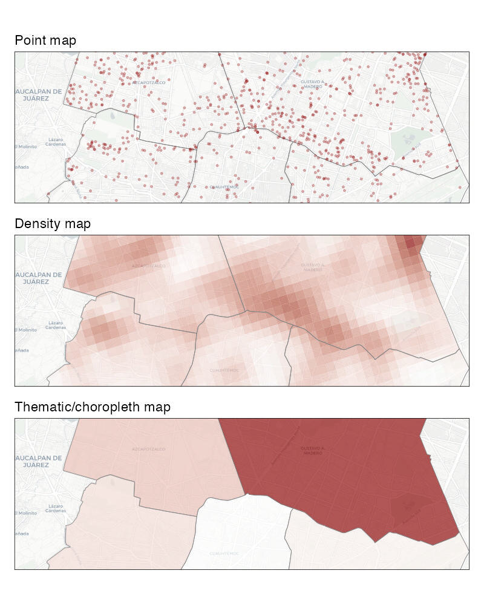

# Mapping area data {#sec-mapping-area-data}


::: {.abstract}
In this chapter, you will learn how to create crime maps that display data for geographic areas rather than individual crime locations. We will explore how to count crimes within predefined areas, visualize these counts using thematic (choropleth) maps, and understand the challenges of interpreting area-based data. You will also be introduced to interactive maps, crime rate calculations, and important spatial concepts like the ecological fallacy.
:::


::: {.callout-tip title="Before you start"}

1. Open Positron or -- if you already have Positron open -- start a new R session by clicking the **Restart R** (**&#10227;**) button in the **Console** panel. This makes sure no code you ran previously will interfere with the work you do in this chapter.
2. Make sure you are working in the crime mapping project workspace you created in @sec-create-project. In the top-right corner of the Positron window, you should see a folder icon and the words `crime-mapping`. If not, click the **File** menu, then **Open Folder ...** and choose the `crime-mapping` folder.
:::


```{r}
#| label: setup
#| echo: false
#| include: false

pacman::p_load(ggspatial, here, httr2, leaflet, sf, sfhotspot, tidyverse)
```


## Introduction

In previous chapters we have produced maps based on the locations of individual crimes, either showing the individual locations directly on a point map or showing patterns derived from the individual points on a density map. Data that includes the locations of individual crimes is sometimes known as _point data_ because we know the point in space at which each crime occurred. 

Another type of crime data is _area data_. The most common type of area data used for crime mapping is data that does not include the locations of individual crimes but instead consists of _counts_ of the number of crimes occurring in one or more _areas_. Maps of area data can be useful for several purposes:

  * We might want to compare the number of crimes in different areas, such as police districts. We might want to do this to decide which district to allocate extra funds to.
  * We might want to estimate the relative risk of a crime occurring in different places by calculating crime rates using counts of crimes and population data for local areas.
  * We might only have been given access to counts of crimes for different areas, rather than the location of each crime, perhaps in order to protect the privacy of crime victims.
    
In all these cases we need to make maps of crimes for _areas_, rather than showing the locations of individual crimes or the density of crimes generated from datasets of individual crime locations. A map in which areas are shaded according to data values is called a *choropleth map* (in English, 'choropleth' is usually pronounced 'kor-o-pleth'). A choropleth map is one type of *thematic map*: a map designed to show a particular topic or theme.

In the first analysis in this chapter, you will produce this map of carjacking offences in Mexico City:

```{r}
#| label: make-final-carjacking-map
#| include: false
#| file: "../R/chapter_09a.R"
```

```{r}
#| label: prepare-uttar-pradesh-analysis
#| include: false
#| file: "../R/chapter_09b.R"
```

```{r}
#| label: show-final-carjacking-map
#| echo: false
#| fig-alt: "A choropleth map of carjacking offences in Mexico City in 2019. Darker orange boroughs have more recorded offences, with Gustavo A. Madero having the highest count."
#| out-width: 90%

car_jacking_map
```

Gustavo A. Madero has the highest count, with 545 recorded offences. The map allows us to compare borough totals, but it hides the variation in offence locations within each borough. The following comparison shows how the same underlying data can look very different depending on the type of map we choose.

<p class="full-width-image"></p>

By the end of this chapter, you will have learned how to:

- count points within predefined areas using `hotspot_count()`;
- create static and interactive choropleth maps;
- join tabular data to area boundaries and check the result;
- calculate and map crime rates;
- distinguish incidence, prevalence and concentration rates; and
- recognise the ecological fallacy and the modifiable areal unit problem.

The process we will use has five main stages:

::::::: {.process}

::::: {.item color="#3182bd"}
Download

::: annotation
source data into the `data/raw` folder
:::
:::::

::::: {.item color="#3182bd"}
Load

::: annotation
crime, boundary and population data into R
:::
:::::

::::: {.item color="#3182bd"}
Combine

::: annotation
count points within areas or join datasets using district names
:::
:::::

::::: {.item color="#3182bd"}
Check

::: annotation
unmatched records, missing values and unexpected results
:::
:::::

::::: {.item color="#3182bd"}
Visualise

::: annotation
counts or rates using a static or interactive choropleth map
:::
:::::

:::::::


::: {.callout-important title="Don't create area maps unless you need to"}

**Do not aggregate point-level crime data to counts of crimes for areas unless you have a good reason to do so**.

Choropleth maps have several shortcomings that we will look at in this chapter. If you have data on the locations of individual crimes then you should typically present those either as individual points (if there are only a few crimes) or using a kernel density map. If you have point-level crime data, you should only use a choropleth map if you need to compare administrative areas or because you want to calculate crime risk and you only have population data for areas.
:::


## Counting crimes

Sometimes we will want to know how many crimes have occurred in different formal areas within a city. For example, we might want to know how many crimes of a particular type had occurred in each neighbourhood in a city as part of a review of the performance of different police teams, or to decide which neighbourhoods should be given more crime-prevention funding.

To calculate counts of crimes for areas, we need 

  1. a dataset representing the crime locations and 
  2. a dataset representing the boundaries of the areas that we want to calculate counts for. 

In this chapter, we will count how many carjacking offences occurred in each alcaldía (borough) of Mexico City in 2019. The result will be an SF object containing the outline of each borough and its carjacking count:

```{r car-jacking_table}
#| echo: false
#| fig-align: "center"

cdmx_car_jacking |>
  sfhotspot::hotspot_count(grid = cdmx_alcaldias, quiet = TRUE) |>
  sf::st_drop_geometry() |>
  head() |>
  knitr::kable()
```


::: {.callout-tip collapse="true" title="What is carjacking?"}

Carjacking is robbery in which a vehicle is stolen using violence or the threat of violence. It differs from other types of vehicle theft because it involves taking the vehicle from the owner while they are using it, rather than breaking into a vehicle that has been left unattended. Because carjacking involves violence, it is considered more serious than other vehicle-related theft.

[Find out more about carjacking](https://doi.org/10.1146/annurev-criminol-030421-042141)
:::


### Load the data

Create a new R script in Positron and save it as `chapter_09a.R` in the `R` folder. Write a comment at the top explaining that the script will show the number of carjacking offences in each alcaldía in Mexico City in 2019. Keep all the permanent code for this first analysis in this file.

Add a line to the script file (with an appropriate comment above it) to load the ggspatial, here, httr2, sf, sfhotspot and tidyverse packages. If you need help with that code, look back to @sec-loading-packages.

We need two datasets for this script: a dataset of carjackings and one of alcaldía boundaries. First download both original files into `data/raw`, then load the local files. Keeping the source files in `data/raw` makes the analysis easier to repeat and ensures that we do not accidentally edit the original data.

In your script file, write the code needed to download this dataset, then load it into an object called `cdmx_car_jacking` (CDMX is a common Spanish-language abbreviation for Mexico City, short for Ciudad de México).

```
https://mpjashby.github.io/crimemappingdata/cdmx_car_jacking.gpkg
```

When you are writing this code, think about what sort of file you are trying to load and which function you should use to do it. If you need help, look at @sec-load-functions. Make sure your code has comments that explain what it does.

Now write the code needed to download this dataset, then load it and store it in an object called `cdmx_alcaldias`:

```
https://mpjashby.github.io/crimemappingdata/cdmx_alcaldias.gpkg
```

Once you have written the code to load the packages and data, click the **Solution** button below to check your code.


`r webexercises::hide()`

```{r}
#| filename: "chapter_09a.R"

# This script counts carjacking offences in each alcaldía in Mexico City in
# 2019 and produces a choropleth map of those counts.

# Load packages
pacman::p_load(ggspatial, here, httr2, sf, sfhotspot, tidyverse)

# Download the raw data
request(
  "https://mpjashby.github.io/crimemappingdata/cdmx_car_jacking.gpkg"
) |>
  req_perform(path = here("data", "raw", "cdmx_car_jacking.gpkg"))

request(
  "https://mpjashby.github.io/crimemappingdata/cdmx_alcaldias.gpkg"
) |>
  req_perform(path = here("data", "raw", "cdmx_alcaldias.gpkg"))

# Load carjacking and alcaldía data
cdmx_car_jacking <- here("data", "raw", "cdmx_car_jacking.gpkg") |>
  read_sf()

cdmx_alcaldias <- here("data", "raw", "cdmx_alcaldias.gpkg") |>
  read_sf()
```

`r webexercises::unhide()`


### Count crimes in each borough

Now that we have loaded our data, the next step is to count the number of offences in each borough and produce an R object that contains the boundaries of the boroughs together with the number of offences in each one. We can use the `hotspot_count()` function from the sfhotspot package to do this.

By default, `hotspot_count()` produces counts of points in cells in a grid (we saw this when we used `hotspot_kde()` in @sec-mapping-patterns). This is often useful, but in this case we instead want to produce a count for each alcaldía. To do that, we can pass the `cdmx_alcaldias` object to the `grid` argument of `hotspot_count()`. Add this code to your script file: 

```{r}
#| eval: false
#| filename: "chapter_09a.R"

car_jacking_counts <- hotspot_count(cdmx_car_jacking, grid = cdmx_alcaldias)
```

Run this code now. When you run it, you will see warnings appear in the R Console:

```{r}
#| echo: false

car_jacking_counts <- hotspot_count(cdmx_car_jacking, grid = cdmx_alcaldias)
```

This means that some of the points in the `cdmx_car_jacking` object are outside the area covered by the `cdmx_alcaldias` object. This is a common issue with crime data. Sometimes the authorities for an area (e.g. the police agency for a city) will record a small number of crimes that occurred outside their area of responsibility if they are linked to a larger series of crimes they are investigating. On other occasions points will appear outside the area we would expect due to processing errors. 

If any error happened before you were given the data, there is probably little you can do to fix it. But it is still important to check to make sure you understand _why_ there is a problem with the data. We can usually do that by producing a very basic map showing the data we are using on a base map.

Run this code in the R Console:

```{r}
#| fig-asp: 0.3
#| fig-alt: "A world map showing most carjacking records clustered in Mexico City and a smaller group at latitude and longitude zero in the Gulf of Guinea, a location known as Null Island."
#| filename: "R Console"

ggplot(cdmx_car_jacking) + annotation_map_tile(progress = "none") + geom_sf()
```

This map shows that the points in the `cdmx_car_jacking` dataset are located in two parts of the world, which is not what we would expect. Some points appear in Mexico as we would expect, but some appear in the Gulf of Guinea off the coast of West Africa. These points are located on 'Null Island', which we will learn more about in @sec-null-island.

There are `r nrow(cdmx_car_jacking) - sum(pull(car_jacking_counts, "n"))` points outside the boundary of Mexico City out of `r nrow(cdmx_car_jacking)` in total (`r scales::percent(1 - (sum(pull(car_jacking_counts, "n")) / nrow(cdmx_car_jacking)), accuracy = 0.1)`). All these points are excluded from the borough counts. We can continue with this example, but we should document the exclusion rather than assuming it has no effect. In a real analysis, we would also investigate how the errors arose and whether excluded records differ systematically from the records with valid locations.


::: {.callout-quiz .callout title="Counting crimes"}

```{r counting-crimes-quiz}
#| echo: false

counting_crimes_quiz1 <- c(
  "To combine crime counts with other data that is only available for pre-set areas, e.g. population data",
  answer = "Because point crime data is inherently unreliable",
  "Because it is often useful for police to know how many crimes occurred in different administrative areas",
  "To understand how counts of crimes in an area change over time"
)

counting_crimes_quiz2 <- c(
  answer = "A map that uses shading to represent data values across different areas",
  "A map that shows individual points for crime locations",
  "A 3D model of crime distribution",
  "A type of bar chart"
)

counting_crimes_quiz3 <- c(
  "Errors in data recording",
  "Errors in data processing",
  "All incidents in a crime series being recorded by one agency, wherever each incident occurred",
  answer = "To preserve victim privacy"
)
```


**Which of the following is _not_ a common reason why crime analysts might choose to count the number of crimes in different areas?**

`r webexercises::longmcq(counting_crimes_quiz1)`


**What is a choropleth map?**

`r webexercises::longmcq(counting_crimes_quiz2)`


**Which of the following is _not_ a reason some crime locations might be recorded outside the area covered by the agency doing the crime recording?**

`r webexercises::longmcq(counting_crimes_quiz3)`


:::


## Mapping areas

Maps showing data (such as counts of crimes) for different _areas_ are extremely common in all types of spatial analysis. Watch this video for an introduction to some of the issues you should be aware of when mapping areas.




::: {.callout-quiz .callout title="Mapping areas"}

```{r boundaries-quiz}
#| echo: false

boundaries_quiz1 <- c(
  "A map that shows streets and buildings in high detail",
  answer = "A map where areas are shaded to represent different values of data",
  "A map that shows individual data points for each incident",
  "A map that shows only statistical areas, not administrative boundaries"
)

boundaries_quiz2 <- c(
  "It is more accurate at the local level",
  "It allows emergency services to respond more quickly",
  answer = "It helps ensure the privacy of individuals",
  "It reduces the cost of data collection"
)

boundaries_quiz3 <- c(
  answer = "Drawing a conclusion about individuals from data that describes an area as a whole",
  "The assumption that environmental factors affect statistical data",
  "The assumption that all choropleth maps are inaccurate",
  "The assumption that larger areas always contain more people"
)

boundaries_quiz4 <- c(
  "They believe that the maps are drawn inaccurately",
  "They ignore differences in shading",
  "They assume all data is outdated",
  answer = "They assume that boundaries between areas reflect sharp differences in data"
)
```

**What is a choropleth map?**

`r webexercises::longmcq(boundaries_quiz1)`


**Why is statistical data often published for areas rather than individual streets?**

`r webexercises::longmcq(boundaries_quiz2)`


**What is the ecological fallacy?**

`r webexercises::longmcq(boundaries_quiz3)`


**What is the key mistake people often make when interpreting choropleth maps?**

`r webexercises::longmcq(boundaries_quiz4)`


:::


Because so much of the data that we might use in crime mapping is only available for pre-defined areas, we often have no choice about which areas to use. But whether we choose the areas or not, area data can only tell us about each area as a whole. It cannot tell us that every person or place within an area has the area's average characteristics.

Drawing a conclusion about individuals from data that describes groups or areas is known as the *ecological fallacy*. For example, a map might show that boroughs with more poverty have higher crime rates, but that does not prove that the people who experience poverty are the people committing those crimes. The map describes relationships between boroughs, not relationships between individuals.


::: {.callout-important title="Area data cannot describe individuals"}

The ecological fallacy is an error in how we interpret data, rather than something that every choropleth map automatically commits. Nevertheless, choropleth maps create a particular risk of this error because they visually emphasise differences between whole areas. Whenever we plan to use a choropleth map, it is worth asking whether another type of map would represent the data more effectively.

Nevertheless, in some circumstances a choropleth map will be the best choice either because we only have data for pre-defined areas or because we are specifically interested in comparing areas (e.g. in working out if there is more crime in one neighbourhood or police district than another).

:::


### Boundaries can change the pattern

The pattern shown on a choropleth map also depends on the boundaries used to divide the study area. If the same point data were counted using neighbourhoods, police districts or a regular grid, each set of areas would group the points differently and could produce a different-looking pattern. Results can also change when small areas are combined into larger ones.

This is known as the *modifiable areal unit problem* (MAUP). It has two related parts:

- the *scale effect*: results change when we use larger or smaller areas; and
- the *zoning effect*: results change when boundaries are drawn in different places, even if the areas remain roughly the same size.

The MAUP cannot be removed from an analysis that uses area data. We should therefore explain which boundaries we used, avoid treating them as natural divisions between communities and, where possible, check whether our conclusions change when we use a different set of areas.


::: {.callout-quiz .callout title="The modifiable areal unit problem"}

```{r maup-quiz}
#| echo: false

maup_quiz1 <- c(
  "It proves that choropleth maps should never be used",
  "It occurs only when boundary data contain errors",
  answer = "A spatial pattern can change when the same data are grouped using different boundaries",
  "It means every person in an area has the same level of risk"
)
```

**What does the modifiable areal unit problem mean for a choropleth map?**

`r webexercises::longmcq(maup_quiz1)`

:::


We have already loaded the data we need to create a map of carjackings in Mexico City, and counted how many offences occurred in each alcaldía. The `car_jacking_counts` object we created is an SF object, which means we can use `geom_sf()` to plot it on a map.

```{r}
#| filename: "chapter_09a.R"
#| fig-asp: 1
#| fig-alt: "A basic map of Mexico City alcaldía boundaries. Every borough has the same grey fill, so the map does not yet show the number of carjacking offences."
#| out-width: "90%"

ggplot(car_jacking_counts) +
  annotation_map_tile(type = "cartolight", zoomin = 0, progress = "none") +
  geom_sf() +
  theme_void()
```

There are at least two problems with this map: 

  1. we cannot tell how many carjacking offences there were in each alcaldía, and
  2. we cannot see the base map under the polygons representing the alcaldías.

We can solve these two problems by changing the aesthetics for the `geom_sf()` layer in our code. Specifically, we can make the alcaldía polygons semi-transparent by setting the `alpha` argument to `geom_sf()` to a value of less than one, while also using `aes(fill = n)` to specify that the fill colour of the polygons should depend on the number of carjackings in each alcaldía. We will use `scale_fill_distiller()` to apply a sequential colour scheme, in which darker shades represent larger counts. The legend is essential because colour alone does not tell a reader the values.

```{r}
#| filename: "chapter_09a.R"
#| fig-asp: 1
#| fig-alt: "A choropleth map of carjacking offences in Mexico City in 2019. Darker orange boroughs have more recorded offences, with Gustavo A. Madero having the highest count."
#| out-width: "90%"

ggplot(car_jacking_counts) +
  annotation_map_tile(type = "cartolight", zoomin = 0, progress = "none") +
  # Add the alcaldía layer with colour controlled by the number of crimes
  geom_sf(aes(fill = n), alpha = 0.67) +
  # Use a better colour scheme than the default
  scale_fill_distiller(palette = "Oranges", direction = 1) +
  # Add some labels
  labs(
    title = "Carjacking offences in Mexico City, 2019",
    fill = "number of\noffences",
    caption = str_glue(
      "Carjacking data: Mexico City Attorney General's Office (2019)\n",
      "Basemap: © CARTO; © OpenStreetMap contributors (ODbL),\n",
      "https://carto.com/attribution | https://openstreetmap.org/copyright"
    )
  ) +
  theme_void()
```

We could build on this map in several ways. For example, in @sec-calculating-rates we will learn how to show crime _rates_ on a map, as an alternative to crime counts. But in the next section, we will learn how to make interactive crime maps.

Your complete script for this analysis should now look like this:

```{r}
#| eval: false
#| file: "../R/chapter_09a.R"
#| filename: "chapter_09a.R"
```

Save `chapter_09a.R` by pressing . Keep this script in the `R` folder and the original downloaded files in `data/raw`.


## Making an interactive map


So far in this course, all the maps we have made using `ggplot()` have been static images. These are useful for lots of different circumstances, and are usually the only choice if we want to produce a written report as a Word document or PDF. But in some circumstances it may be useful to produce a map that you can interact with by zooming in or panning around different areas. This can be useful when readers might want to look at areas of the map in more detail than is possible without zooming in.

In this section we will make an interactive map of counts of murders in each district in the state of Uttar Pradesh in northern India in 2014. Uttar Pradesh is India's most populous state, with more than 200 million residents.


### Combining datasets

Restart R using the **Restart R** (**&#10227;**) button in Positron's **Console** panel. Create a new R script and save it as `chapter_09b.R` in the `R` folder. Keep all the permanent code for the Uttar Pradesh analysis in this file.

Paste the following code into `chapter_09b.R`, then run it by pressing  followed by . The code downloads untouched copies of the source data into `data/raw`, then loads those local files.

```{r}
#| eval: false
#| filename: "chapter_09b.R"

# This script produces interactive maps of murder counts and murder rates in
# districts in Uttar Pradesh, India, in 2014.

# Load packages
pacman::p_load(here, httr2, leaflet, sf, tidyverse)

# Download the raw data
request(
  "https://mpjashby.github.io/crimemappingdata/uttar_pradesh_murders.csv"
) |>
  req_perform(path = here("data", "raw", "uttar_pradesh_murders.csv"))

request(
  "https://mpjashby.github.io/crimemappingdata/uttar_pradesh_districts.gpkg"
) |>
  req_perform(path = here("data", "raw", "uttar_pradesh_districts.gpkg"))

# Load murder counts and district boundaries
murders <- here("data", "raw", "uttar_pradesh_murders.csv") |>
  read_csv(show_col_types = FALSE)

districts <- here("data", "raw", "uttar_pradesh_districts.gpkg") |>
  read_sf()
```


You can see from this code that we are loading two datasets:

* a CSV file called `uttar_pradesh_murders.csv` containing counts of murders in each district, and
* a geopackage file called `uttar_pradesh_districts.gpkg` containing the boundaries of each district.

The murder counts were published by the Government of India, while the boundary data were compiled by Hindustan Times Labs. Identifying the organisations responsible for source data helps readers assess how the data were produced and what limitations they may have.

To start, let's look at the two datasets in the R Console:


```{r}
#| filename: "R Console"
#| results: hold

head(murders)
```


```{r}
#| filename: "R Console"

head(districts)
```


This output shows us that both datasets include a column that contains the name of each district in Uttar Pradesh. In the `murders` dataset that column is called `district` while in the `districts` dataset that column is called `district_name`. We can also see that only the `murders` object contains a count of murders in each district (in the `murder` column) and only the `districts` object contains the outlines of each district boundary (in the `geom` column). To make a choropleth map of the murder counts, we will need to _join_ the two datasets so we have a single SF object that contains all the data we need.

There are several ways to join data in R. In this case, we want to join the two datasets based on the value of a column in both datasets that stores the same information (in this case, the district names). To do that we use the `left_join()` function, one of a family of joining functions in the `dplyr` package that join two objects together based on the values of particular columns. 

To understand how left-joins work, imagine we had two datasets called `x` and `y`:

| `key` | `x_value` |
|------:|:----------|
| 1     | x1        |
| 2     | x2        |
| 3     | x3        |

: Dataset `x`

| `key` | `y_value` |
|------:|:----------|
| 1     | y1        |
| 2     | y2        |
| 4     | y4        |

: Dataset `y`

We could use `left_join(x, y, by = "key")` to merge them into one combined dataset. This function has _left_ in the name because it joins the two datasets by adding matching rows from the right-hand dataset (`y`) to each row in the left-hand dataset (`x`). The result would be:

| `key` | `x_value` | `y_value` |
|------:|:----------|:----------|
| 1     | x1        | y1        |
| 2     | x2        | y2        |
| 3     | x3        | `NA`      |

: Result of `left_join(x, y, by = "key")`

The result includes all the rows from `x`. Key 3 has no match in `y`, so its `y_value` is missing (`NA`). Key 4 appears only in `y`, so it is not included in the result.

In our case, we want the combined dataset to include exactly one row for each district in `districts`. Since we want to keep all those rows, we use `districts` as the first argument to `left_join()`, i.e. `left_join(districts, murders)`. If a district has no matching row in `murders`, the resulting murder count will be `NA`. This means “no matching information”, not automatically “zero murders”. We should only replace that value with zero if the data documentation confirms that omitted districts represent genuine zero counts.

By default, `left_join()` will match the rows in the `districts` and `murders` objects using all the column names that are present in both datasets. This can sometimes have unexpected results, so it is safer to specify which columns we want to match to be based on using the `by` argument to `left_join()`. There are lots of ways we could join two datasets, so we will use the `join_by()` helper function to assist with this.

Copy this code into your script file and run it.


```{r}
#| filename: "chapter_09b.R"

# Join murder counts to district boundaries
district_murders <- left_join(
  districts,
  murders,
  by = join_by(district_name == district)
)
```

To check the result produced by this code, run `head(district_murders)` in the R Console. The output should look like this:


```{r}
#| echo: false

head(district_murders)
```

If you want to view the whole dataset, run `View(district_murders)` in the R Console instead. You can see that `district_murders` contains all the columns from the `districts` object and the `murder` column from the `murders` dataset. It does _not_ contain the `district` column from the `murders` dataset, since this has been merged into the existing
`district_name` column.

Joining datasets in any programming language (or even using functions like `VLOOKUP()` in Microsoft Excel) can be complicated. It is particularly important that you understand in each case (a) which dataset you are going to merge data into (in this case, `districts`), (b) which dataset columns are going to be taken from (in this case, `murders`) and (c) which columns are going to be used as the basis for the join (in this case, `district_name` and `district`). Thinking about what you are trying to achieve before writing the code will prevent many problems later.


::: {.callout-important title="Always check a join"}

`left_join()` warns about some potential problems, such as an unexpected many-to-many relationship, but it does not detect every mistake. An unmatched row can produce `NA` without any warning. After every join, check:

- whether the result has the expected number of rows;
- whether the joining columns contain duplicate values; and
- whether important columns contain unexpected missing values.

For the current data, the result has 75 rows (one for each district), no duplicated district names and no missing murder counts. If you receive a warning or a check gives an unexpected result, investigate it before continuing. See @sec-bugs if you need help.
:::


### Interactive choropleth maps

Static maps (and other types of chart) in R are made using the ggplot2 package. But interactive maps are made using a different package: leaflet. The functions in the leaflet package work in a similar way to ggplot2, but with a few differences.

To make maps with leaflet, we create a stack of functions in a similar way to the `ggplot()` stacks we have already created. Note that while the concept of a stack is similar, we cannot use functions from the ggplot2 package in a leaflet stack, or vice versa. Also, we construct leaflet stacks using the pipe operator `|>` rather than the plus operator `+` that we use in ggplot2.

We can create a very basic leaflet map using the `leaflet()` function to create the stack, the `addProviderTiles()` function to add a base map and the `addPolygons()` function to add the district outlines. We have already loaded the leaflet package in our script file, so we can run this code in the R Console to create our first interactive map.

::: {aria-label="Basic interactive map showing district boundaries in Uttar Pradesh"}
```{r}
#| filename: "R Console"
#| fig-asp: 1
#| out-width: "100%"

# Create interactive map
leaflet(district_murders) |>
  # Add base map
  addProviderTiles("CartoDB.Voyager") |>
  # Add district polygons
  addPolygons(fillOpacity = 0.75)
```
:::


You can interact with this map by clicking the buttons to zoom in and out, and by moving around the map area. For example, you can zoom out to see where Uttar Pradesh is relative to other places, or zoom in to see where particular cities are within Uttar Pradesh. This could be very useful in helping people understand the context of crime data.

In this map we use the CartoDB.Voyager style of base map, but leaflet can use a large number of different base maps that you can [view in this online gallery](https://leaflet-extras.github.io/leaflet-providers/preview/).

However, this map isn't very useful because it doesn't show how many murders there were in each district. To do that, we need to specify that each district should be coloured according to the values in the `murder` column of the `district_murders` object. With a `ggplot()` map, we would do this with a function such as `scale_fill_distiller()`, but with a leaflet map the code we need is slightly more complicated and has two separate stages.

The first stage is to create a custom function that converts the values in the `murder` column of the `district_murders` object into colours. To do this, we use the `colorNumeric()` function from the leaflet package. Yes, this means that we are using a function to create a function, which we will then later use to set an argument of another function -- programming languages are very powerful, but that sometimes means they are complicated.

The `colorNumeric()` function (note the spelling of "color") allows us to specify the colour scheme using the `palette` argument. The `domain` argument specifies the values to which that scheme will be applied. Setting an explicit domain makes sure a particular value is always assigned the same colour. The `palette` argument accepts the same values as the palette argument to the `scale_fill_distiller()` function from ggplot2:


```{r}
#| echo: false
#| fig-alt: "Nine horizontal sequential colour palettes suitable for colour-vision deficiencies. Each palette progresses from a very light shade to a dark shade of one or more colours."
#| out-width: "100%"

RColorBrewer::brewer.pal.info |>
  rownames_to_column(var = "name") |>
  filter(colorblind, category == "seq") |>
  pmap(function(...) {
    current <- tibble(...)
    ggplot() +
      geom_raster(aes(x = 1:9, y = 1, fill = as.factor(1:9))) +
      scale_fill_brewer(palette = current$name) +
      labs(subtitle = current$name) +
      theme_void() +
      theme(
        legend.position = "none",
        plot.subtitle = element_text(size = 8)
      )
  }) |>
  patchwork::wrap_plots()
```


To create the custom colour palette function, we use the `<-` operator to assign the result produced by `colorNumeric()` to a name, just as we would with an object. We can give this custom function any name we like, but in the code below we'll call it `murder_colours`.

Once we have created a custom colour palette function using `colorNumeric()`, we can use that function to create the appropriate values for the `fillColor` argument of the `addPolygons()` function in our existing `leaflet` stack. Since we want the map colours to be controlled by the `murder` column in the `district_murders` object, we specify `murder` as the only argument to the `murder_colours()` palette function we have created.

Let's see this in action: add this code to the `chapter_09b.R` script file:

::: {aria-label="Interactive map with districts in Uttar Pradesh shaded by murder count, without a legend or labels"}
```{r}
#| filename: "chapter_09b.R"
#| fig-asp: 1
#| out-width: 100%

# Create a custom colour palette function
murder_colours <- colorNumeric(
  palette = "Reds",
  domain = district_murders$murder
)

# Create interactive map
leaflet(district_murders) |>
  # Add base map
  addProviderTiles("CartoDB.Voyager") |>
  # Add district polygons coloured by number of murders
  addPolygons(
    fillColor = ~ murder_colours(murder),
    fillOpacity = 0.75,
    weight = 2,
    color = "black"
  )
```
:::


::: {.callout-tip title="`fillColor` needs a tilde"}

One slight quirk of `leaflet` is that in order for `murder_colours()` to have access to the columns in the `district_murders` object, we need to add a tilde (`~`) symbol before the function name, so that the `fillColor` argument is `fillColor = ~ murder_colours(murder)` rather than `fillColor = murder_colours(murder)`. If you forget to add the `~`, you will see
an error saying:

```r
Error in murder_colours(murder) : object 'murder' not found
```
:::

There are three improvements we can make to this interactive map. The first is to add a legend, using the `addLegend()` function. `addLegend()` needs three arguments:

  * `pal` specifies which custom palette function controls the legend colours. This should be the same function as used in the `fillColor` argument of the `addPolygons()` function.
  * `values` specifies which column in the data the legend will show. Once again, the column name should be preceded by a `~` operator.
  * `title` specifies the legend title.

Change the code in your script file to add the `addLegend()` function to the end of the stack:

```{r}
#| eval: false
#| filename: "chapter_09b.R"

# Create interactive map
leaflet(district_murders) |>
  # Add base map
  addProviderTiles("CartoDB.Voyager") |>
  # Add district polygons coloured by number of murders
  addPolygons(
    fillColor = ~ murder_colours(murder),
    fillOpacity = 0.75,
    weight = 2,
    color = "black"
  ) |>
  # Add legend
  addLegend(
    pal = murder_colours,
    values = ~murder,
    title = "number of murders"
  )
```

Next, we can add an inset map in the corner of the main map. This is useful for interactive maps because if we zoom in to show only a small area, we will be able to use the inset map to stay aware of the wider context.

We can do this by adding the `addMiniMap()` function to the leaflet stack. We will add the argument `toggleDisplay = TRUE` to add the ability to minimise the inset map if necessary.

Update the leaflet stack in `chapter_09b.R` again to add the call to `addMiniMap()`:

```{r}
#| eval: false
#| filename: "chapter_09b.R"

# Create interactive map
leaflet(district_murders) |>
  # Add base map
  addProviderTiles("CartoDB.Voyager") |>
  # Add district polygons coloured by number of murders
  addPolygons(
    fillColor = ~ murder_colours(murder),
    fillOpacity = 0.75,
    weight = 2,
    color = "black"
  ) |>
  # Add legend
  addLegend(
    pal = murder_colours,
    values = ~murder,
    title = "number of murders"
  ) |>
  # Add inset map
  addMiniMap(toggleDisplay = TRUE)
```

Finally, we can add labels to the districts, which will appear when we move the pointer over a district or select it on some touchscreens. We do this by adding the `label` argument to the existing `addPolygons()` function. The label will contain both the district name and murder count, so readers are not expected to estimate values from colour alone.

Change the existing call to `addPolygons()` to add the district labels:

::: {aria-label="Interactive choropleth map of murder counts in districts in Uttar Pradesh in 2014"}
```{r}
#| filename: "chapter_09b.R"
#| fig-asp: 1
#| out-width: "100%"

# Create interactive map
leaflet(district_murders) |>
  # Add base map
  addProviderTiles("CartoDB.Voyager") |>
  # Add district polygons coloured by number of murders
  addPolygons(
    fillColor = ~ murder_colours(murder),
    fillOpacity = 0.75,
    label = ~ paste0(district_name, ": ", murder, " murders"),
    weight = 2,
    color = "black"
  ) |>
  # Add legend
  addLegend(
    pal = murder_colours,
    values = ~murder,
    title = "number of murders"
  ) |>
  # Add inset map
  addMiniMap(toggleDisplay = TRUE)
```
:::


Now we have added the extra layers to the map, we can compare districts and use the labels to read their names and values. Meerut has the highest count in this dataset, with 226 murders. Stating this in the text ensures the main result is available even to someone who cannot use the interactive map.

::: {.callout-quiz .callout title="Interactive maps"}

```{r interactive-maps-quiz}
#| echo: false

interactive_maps_quiz1 <- c(
  "Interactive maps are illegal in some areas",
  answer = "Static maps are easier to use in printed reports",
  "Static maps show more data",
  "Interactive maps do not allow zooming"
)

interactive_maps_quiz2 <- c(
  "Most functions from the ggplot2 package can also be used to make interactive maps with leaflet",
  "ggplot2 and leaflet are completely separate packages so none of the knowledge you might have from making ggplot2 maps can be used to make maps with leaflet",
  answer = "The ggplot2 and leaflet packages share similar ideas (e.g. making maps using a stack of functions), but the functions in the two packages are different",
  "The leaflet package can be used to make both interactive and static maps, so the ggplot2 package is redundant"
)

interactive_maps_quiz3 <- c(
  answer = "Users can zoom in and explore data dynamically",
  "Interactive maps are always more accurate than static maps",
  "Interactive maps require less data",
  "It eliminates all data errors"
)
```


**Why might a static crime map be preferred over an interactive map?**

`r webexercises::longmcq(interactive_maps_quiz1)`


**Which of these statements is true about the relationship between the ggplot2 and leaflet packages?**

`r webexercises::longmcq(interactive_maps_quiz2)`


**What is one advantage of interactive crime maps?**

`r webexercises::longmcq(interactive_maps_quiz3)`


:::


## Calculating crime rates {#sec-calculating-rates}

The map of murders in Uttar Pradesh has a major limitation: it counts murders at district level, but it does not take into account that the number of people living in each district is different. For example, the district of `r pluck(slice_max(district_pop, order_by = population, n = 1), "district")` has a population of `r scales::number(pluck(slice_max(district_pop, order_by = population, n = 1), "population"), scale = 1/10^6, accuracy = 0.1, suffix = " million")` while the district of `r pluck(slice_min(district_pop, order_by = population, n = 1), "district")` has a population of `r scales::number(pluck(slice_min(district_pop, order_by = population, n = 1), "population"), scale = 1/10^6, accuracy = 0.1, suffix = " million")`. It's therefore not surprising that some districts have more murders than others.

When we have crime counts for areas with populations of different sizes, it is often more useful to map crime _rates_ instead of crime _counts_. A crime rate is an expression of the frequency of crime that in some way controls for the population that is exposed to crime. We often use choropleth maps for this because we typically only have population counts for areas, rather than having access to data on where each individual person lives.


### Types of crime rate

There are three common types of crime rate, each of which measures risk in a different way. The most common, and the type of rate that people almost always mean if they talk about a 'crime rate' without specifying another type, is the *incidence rate*. This is the number of crimes in an area divided by the number of people, households or places against which a crime could occur. For example, the incidence rate of burglary in an area might be calculated as the number of crimes per 1,000 households, while the incidence rate of homicide might be expressed as the number of homicides per 100,000 people.

$$
\textrm{incidence per } k = \frac{\textrm{crimes}}{\textrm{population}} \times k
$$

Here, $k$ is the scale used to make the result easy to understand, such as 1,000 households or 100,000 residents.

Incidence rates and counts are each useful in different circumstances. For example, if you were advising a police commander on which district to allocate more homicide detectives to, the _number_ of murders in a district is probably more useful than the incidence rate. But the opposite would be true if you were advising a politician on which district to add extra funding to for homicide prevention, since in that case you would probably want to focus on areas with the highest risk of homicide.


::: {.callout-important title="'Incidence' vs 'incident'"}

In crime analysis, you will hear people use two very similar terms that have different meanings. When a crime analyst talks about 'incidence' they almost always mean 'incidence rate' as defined above. But when they talk about 'incidents' they are usually talking about the _count_ of offences. “Which area has the most incidents?” asks about the number of offences, while “which area has the highest incidence?” asks about the rate.
:::


Incidence rates are useful for comparing areas with each other, but they tell us a little about how likely an individual person is to be a victim of crime because crime is heavily concentrated against a few victims (think back to the law of crime concentration we discussed in @sec-getting-started). To understand the average risk of an individual person being a victim of crime once or more, we calculate the *prevalence rate*. This is the number of people, households, etc. who were victims at least once, divided by the total number of people, households, etc. in the area. Prevalence rates are usually expressed as a percentage, so we might say that 1% of the population has been a victim of a particular crime at least once during a year.

$$
\textrm{prevalence} = \frac{\textrm{victims}}{\textrm{population}}
$$

The final type of rate is the *concentration rate*. This tells us how concentrated crime is, and is usually expressed as a single number, e.g. if the concentration rate for a crime is 2.5 then we can say that everyone who was a victim of that crime at least once was on average victimised 2.5 times. This is particularly useful for understanding how important repeat victimisation is to driving up the frequency of crime in an area. This, in turn, might lead us to focus crime-prevention efforts on work to protect recent victims of crime from being victimised again.

$$
\textrm{concentration} = \frac{\textrm{crimes}}{\textrm{victims}}
$$


::: {.callout-important title="Crime rates are averages"}

All three types of crime rate are average values for an area as a whole, so we are always at risk of committing the ecological fallacy. Remember that while rates are useful for describing areas, that does not imply everyone in an area faces the same risk from crime.
:::


### Choosing a population measure

To calculate a crime rate, we need to be able to measure the population that is at risk from that crime. It is very common for analysts to calculate rates based on the number of people who live in an area, not least because that information is often easily available. However, there are many situations in which the residential population of an area is a poor measure of the population at risk for crime there. For example:

  * Robberies in a shopping area where most of the victims do not live in the area but instead travel from elsewhere to go shopping. This can lead to vastly inflated crime rates for commercial and entertainment districts that have very small residential populations but very large numbers of people coming into the area to work, shop or visit. Crime rates based on residential population almost always give misleading rates for city centres, airports or business districts.
  * Assaults on public transport where victims happen to be passing through a given area at the time they are victimised but are doing so as part of a longer journey through several areas, with the crime potentially occurring in any one of them. These crimes are known as [interstitial offences](https://doi.org/10.1186/2193-7680-3-1).
  * Residential burglaries where the targets of crime are homes, not people, so the crime rate may be influenced by the number of people in each household.

In all these cases, the residential population is a poor measure of the population at risk from crime. Unfortunately, other measures of population (such as counts of people on public transport or walking along a shopping street) are often expensive or difficult to obtain. This is known as the *denominator dilemma*: should we use residential population to calculate crime rates just because it is the only data that is available?


### Calculating murder rates in Uttar Pradesh

Residential population is a conventional denominator for homicide rates and is a reasonable starting point for this example, but it is not perfect. Some victims will be killed in a different district from the one in which they live, and population counts may refer to a different year from the crime data. A detailed investigation should assess both issues before interpreting small differences between districts.

The murder counts used here are for 2014, while the population dataset contains counts from India's 2011 census, published by the Registrar General and Census Commissioner of India. The resulting rates therefore use the closest population data available in this example, rather than the exact population in 2014. This limitation should be reported alongside the map.

To calculate an incidence rate, we once again need to join two datasets together. This time, we need to add population data for districts in Uttar Pradesh. Add this code to `chapter_09b.R` alongside the code that downloads and loads the other two datasets:


```{r}
#| eval: false
#| filename: "chapter_09b.R"

# Download district population counts
request(
  "https://mpjashby.github.io/crimemappingdata/uttar_pradesh_population.csv"
) |>
  req_perform(path = here("data", "raw", "uttar_pradesh_population.csv"))

# Load district population counts
district_pop <- here("data", "raw", "uttar_pradesh_population.csv") |>
  read_csv(show_col_types = FALSE)
```


If we look at the column names in this new dataset, we will see that it includes a column called `district` that contains the district names. Just as we did before, we can use the `left_join()` function to add the columns from the `district_pop` dataset to the combined dataset we have already produced. To do that, let's create a pipeline that combines all the datasets one after the other:


```{r}
#| filename: "chapter_09b.R"

# Join murder counts and population to district boundaries
district_murders <- districts |>
  # Join murder counts
  left_join(murders, by = join_by(district_name == district)) |>
  # Join population counts
  left_join(district_pop, by = join_by(district_name == district))
```


Add this code to your script file in place of the previous code that joined together the `districts` and `murders` datasets. Now look at the new `district_murders` object you've just created:

```{r}
#| filename: "R Console"

head(district_murders)
```

As with the result of the previous join, you can see that the `district_murders` object contains all the columns from the `districts` object, followed by the `murder` column from the `murders` dataset and then all the columns from the `district_pop` object _except_ the `district` column. 

Now that we have a single dataset containing all the variables we need, we can calculate the incidence of murders per 100,000 people. To do that, we can add another line of code to the end of the pipeline we have just created. Update your script file with this code:


```{r}
#| filename: "chapter_09b.R"

# Join murder counts and population to district boundaries
district_murders <- districts |>
  # Join murder counts
  left_join(murders, by = join_by(district_name == district)) |>
  # Join population counts
  left_join(district_pop, by = join_by(district_name == district)) |>
  # Calculate murder rate
  mutate(murder_rate = murder / population * 100000)
```


### Mapping crime rates

To create a choropleth map of the murder rate using `leaflet`, we simply use the code from our previous interactive map but specify that the `murder_rate` column be used to determine the colour of each district polygon rather than the `murder` column. We will also change the base map to a different style.


::: {.callout-important title="Be clear about how you calculated a crime rate"}

Whenever we map a crime _rate_, it is important that we are explicit about how that rate was calculated. For example, using a legend title such as "rate of murders" would not give enough information to allow readers to understand how to interpret the map. A much better legend title would be "murders per 100,000 residents" or something similar.
:::


Whenever we need to use a longer legend title, or other text, it can be useful to break the text over multiple lines. Since leaflet maps are built using the same technologies as web pages, the way we wrap text is slightly different to how we do it for maps created with ggplot2. Rather than using the new-line character (`\n`) or the `str_wrap()` function, we will instead use the HTML new-line separator `<br>` and wrap the whole legend title in the `HTML()` function from the `htmltools` package.

Add this code to `chapter_09b.R`. Then read through the notes below it to understand how it differs from the map of murder counts.

::: {aria-label="Interactive choropleth map of murder rates in districts in Uttar Pradesh in 2014"}
```{r}
#| filename: "chapter_09b.R"
#| fig-asp: 1
#| out-width: "100%"

# Create a colour palette for murder rates
murder_rate_colours <- colorNumeric(
  palette = "Reds",
  domain = district_murders$murder_rate
)

# Create an interactive map of murder rates
leaflet(district_murders, elementId = "murder-rate-map") |>
  # Add base map
  addProviderTiles(
    "Esri.WorldImagery", #<1>
    options = providerTileOptions(opacity = 0.3) #<2>
  ) |>
  # Add district polygons coloured by number of murders
  addPolygons(
    fillColor = ~ murder_rate_colours(murder_rate), #<3>
    fillOpacity = 0.75,
    label = ~ paste0(
      district_name,
      ": ",
      round(murder_rate, 1),
      " murders per 100,000 residents"
    ),
    weight = 2,
    color = "black"
  ) |>
  # Add legend
  addLegend(
    pal = murder_rate_colours,
    values = ~murder_rate,
    title = htmltools::HTML("murders per<br>100,000 residents") #<4>
  ) |>
  # Add inset map
  addMiniMap(toggleDisplay = TRUE)
```
:::
1. This map uses a different style of base map to the previous map.
2. The base map style used in this map is quite colourful, so we will make it semi-transparent to reduce its visual prominence.
3. We want the map colour scheme to be controlled by the `murder_rate` column in the `district_murders` dataset.
4. We use the map legend title to specify how the murder rate was calculated.

We now have all the code we need to load the necessary data, calculate crime
rates and make an interactive map of murders in districts in Uttar Pradesh.

Meerut has the highest rate in this dataset, at about 6.6 murders per 100,000 residents, followed by Baghpat at about 6.4. These values are stated in the text so that the main finding does not depend on a reader being able to distinguish colours or operate the interactive map.


### Publishing crime maps ethically

Crime maps can help people understand patterns and make decisions, but publishing them can also cause harm. Before sharing a map, consider:

- **Privacy:** could a point, label or small count allow someone to identify a victim, suspect or address? Aggregating data can reduce this risk, although very small counts may still be revealing.
- **Stigma:** could the title, labels or accompanying text unfairly portray everyone in an area as dangerous? Describe recorded events and avoid making claims about individual residents from area-level data.
- **Data limitations:** could patterns reflect reporting, recording, missing locations or the population measure used? State these limitations and avoid presenting uncertain differences as facts.
- **Purpose and proportionality:** is publishing a detailed map necessary for the intended purpose, or would a less detailed map communicate the result with less risk?
- **Accessibility:** can readers obtain the main information without relying only on colour, pointer movement or an interactive control? Provide clear legends, descriptive text and, where useful, an accompanying table.

An ethical map does more than avoid disclosing identities. It gives readers enough context to interpret the pattern fairly and does not imply that an area-level result describes every person or place within the area.


::: {.callout-quiz .callout title="Mapping crime rates and publishing maps"}

```{r rates-quiz}
#| echo: false

rates_quiz1 <- c(
  "Crime counts are more reliable than crime rates",
  "Crime counts always show higher numbers",
  "Crime rates do not tell the audience anything about the actual crime numbers",
  answer = "Crime rates adjust for population size, while crime counts do not"
)

rates_quiz2 <- c(
  "concentration rate",
  "incidence rate",
  "incident rate",
  answer = "prevalence rate"
)

rates_quiz3 <- c(
  "concentration rate",
  answer = "incidence rate",
  "incident rate",
  "prevalence rate"
)

rates_quiz4 <- c(
  answer = "concentration rate",
  "incidence rate",
  "incident rate",
  "prevalence rate"
)

rates_quiz5 <- c(
  "To make the rates as similar as possible to crime counts, since counts are more accurate",
  answer = "Choosing an inappropriate population measure can lead to misleading crime rates",
  "To make the crime rates as high as possible",
  "Accurate crime rates should always be the same regardless of the population measure chosen"
)

rates_quiz6 <- c(
  "Remove the legend so that the map takes up less space",
  "Publish exact victim addresses whenever they are available",
  answer = "Explain data limitations and consider whether the map could identify or stigmatise people",
  "Assume an area-level rate applies equally to every resident"
)
```


**What is the main difference between crime counts and crime rates?**

`r webexercises::longmcq(rates_quiz1)`


**What type of rate describes the chances of a person being a victim of a crime at least once in a given period?**

`r webexercises::longmcq(rates_quiz2)`


**What type of rate describes the frequency of crime after controlling for some measure of the population at risk?**

`r webexercises::longmcq(rates_quiz3)`


**What type of rate describes the average number of times each victim of a particular crime is victimised?**

`r webexercises::longmcq(rates_quiz4)`


**Why is choosing the right population measure important when calculating crime rates?**

`r webexercises::longmcq(rates_quiz5)`


**Which action is part of publishing a crime map ethically?**

`r webexercises::longmcq(rates_quiz6)`


:::


## In summary

In this chapter you learned how to calculate the number of points in different areas, join different sources of data together, and map both crime counts and crime rates using static and interactive maps. Choropleth maps can be useful, but their interpretation depends on the chosen boundaries and they only describe areas as a whole.

You can now:

- count points within predefined areas using `hotspot_count()`;
- create static and interactive choropleth maps;
- join tabular data to area boundaries and check for missing or duplicated matches;
- calculate and clearly label incidence rates;
- choose a population measure while recognising the denominator dilemma;
- explain the ecological fallacy and modifiable areal unit problem; and
- identify privacy, stigma, data-quality and accessibility issues before publishing a crime map.

Your complete `chapter_09b.R` script should now look like this:

```{r}
#| eval: false
#| file: "../R/chapter_09b.R"
#| filename: "chapter_09b.R"
```

Save `chapter_09b.R` by pressing . To check that both analyses are reproducible, restart R using the **Restart R** (**&#10227;**) button in Positron's **Console** panel, then run `chapter_09a.R` and `chapter_09b.R` from beginning to end. Keep the scripts in the `R` folder and the downloaded source files in `data/raw`.


::: {.box .reading}

To find out more about the topics covered in this chapter:

  * Read the article [Crime seen through a cone of resolution](https://doi.org/10.1177/000276427602000207) by Paul Brantingham, Delmar Dyreson and Patricia Brantingham for more detail about how the spatial units used in an analysis affect what we see.
  * Read the article [Smallest is Better? The Spatial Distribution of Arson and the Modifiable Areal Unit Problem](https://doi.org/10.1007/s10940-016-9297-6) for an example of the modifiable areal unit problem in studying crime.

:::


::: {.callout-quiz .callout title="Revision questions"}

Answer these questions to check you have understood the main points covered in this chapter. Write between 50 and 100 words to answer each question.

1. If you have access to point-level crime data, why is a density map generally a better choice than a choropleth map? In what circumstances might you choose to produce a choropleth map even though you have access to the locations of individual crimes?
2. Why is the ecological fallacy a concern when interpreting crime data on choropleth maps?
3. How can crime rates provide more useful insights than simple crime counts when comparing crime levels across different areas?
4. How does choosing an appropriate population measure affect crime rate calculations?
5. Discuss the ethical considerations involved in publishing crime maps.
:::
