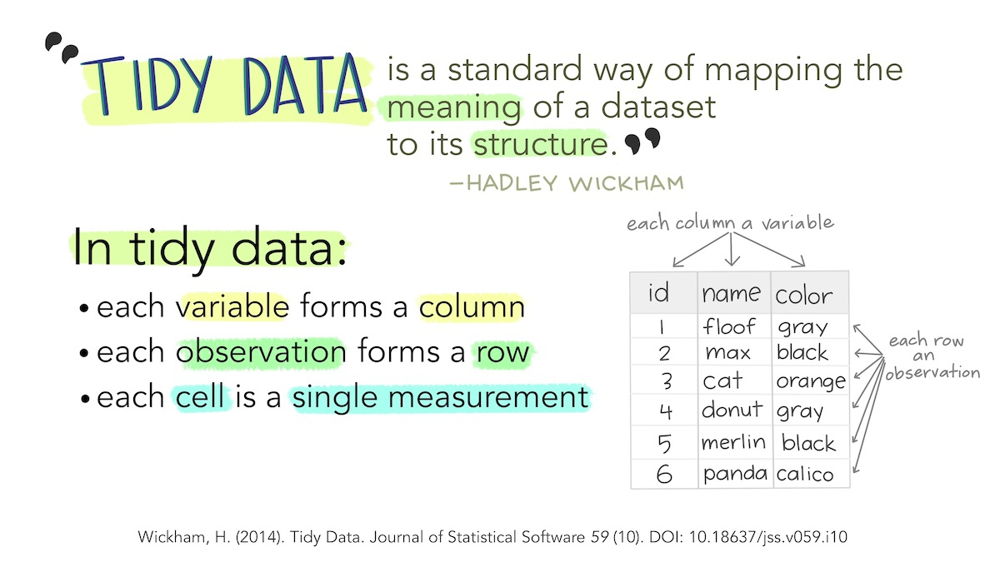
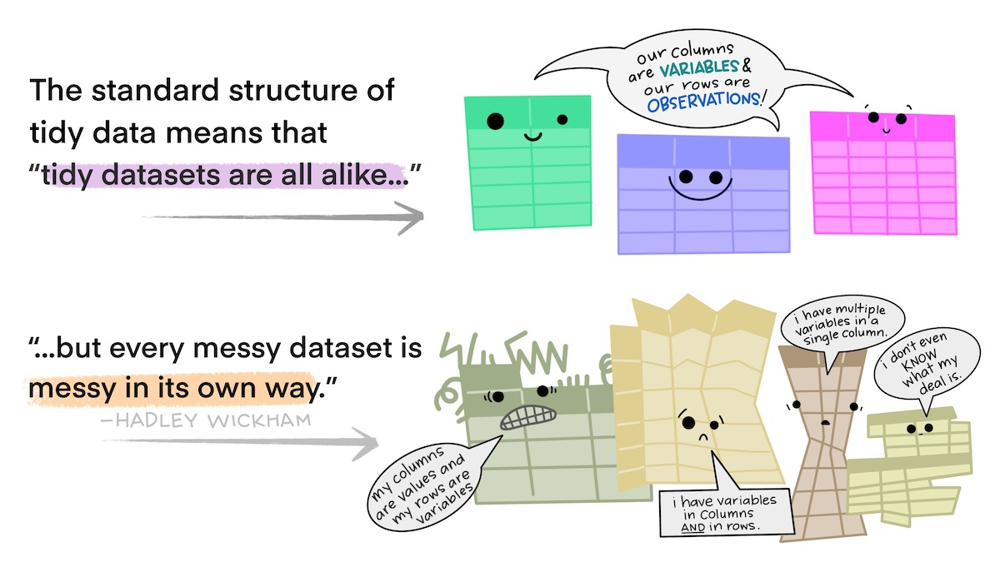
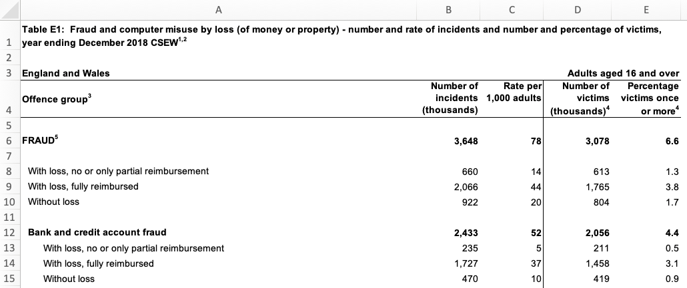
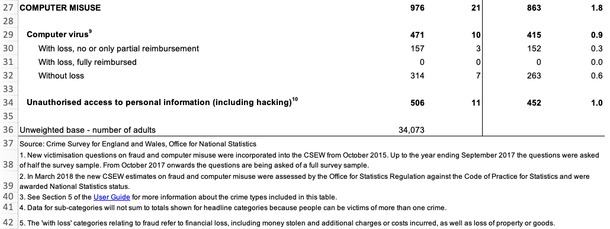
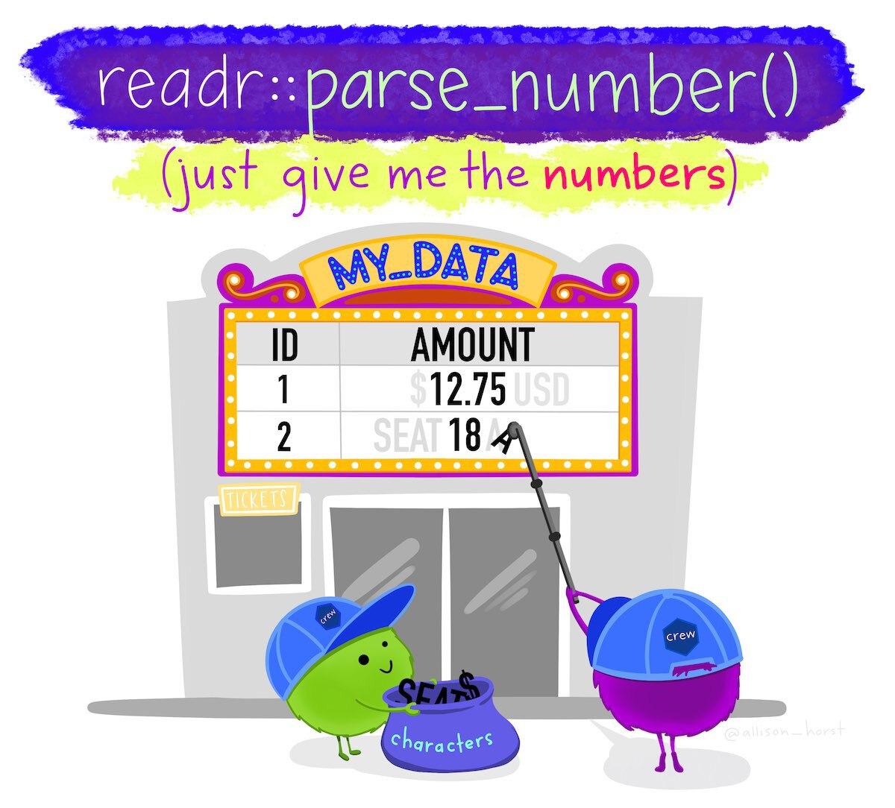
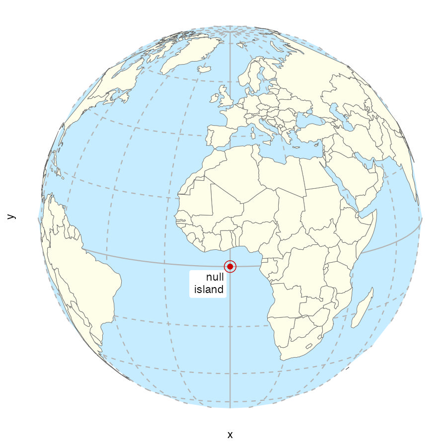
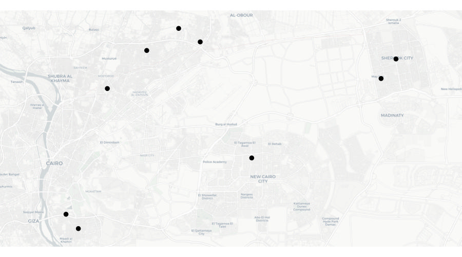
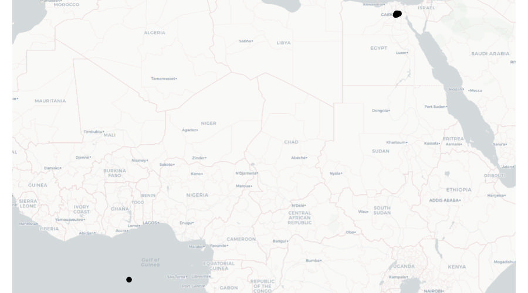

# Handling messy data {#sec-messy-data}


::: {.abstract}
Data is at the core of crime mapping, but data isn't always provided in the best format for analysis. This chapter introduces some ways we can tidy and prepare datasets for analysis in R. This includes restructuring data, dealing with missing values, separating variables and geocoding locations. By the end of this chapter you'll be able to prepare many common forms of messy data for analysis.
:::


::: {.callout-tip title="Before you start"}

1. Open Positron or -- if you already have Positron open -- start a new R session by clicking the **Restart R** (**&#10227;**) button in the **Console** panel. This makes sure no code you ran previously will interfere with the work you do in this chapter.
2. Make sure you are working in the crime mapping project workspace you created in @sec-create-project. In the top-right corner of the Positron window, you should see a folder icon and the words `crime-mapping`. If not, click the **File** menu, then **Open Folder ...** and choose the `crime-mapping` folder.
:::

```{r}
#| label: setup
#| echo: false
#| include: false

pacman::p_load(
  ggspatial,
  here,
  httr2,
  janitor,
  readxl,
  rnaturalearth,
  sf,
  sfhotspot,
  tidygeocoder,
  tidyverse
)

# Download the ONS spreadsheet if it is not already available locally. This
# allows the executable examples to run in a fresh copy of the book repository.
cybercrime_path <- here("data", "raw", "cybercrime.xlsx")

if (!file.exists(cybercrime_path)) {
  dir.create(dirname(cybercrime_path), recursive = TRUE, showWarnings = FALSE)

  request(
    "https://www.ons.gov.uk/file?uri=/peoplepopulationandcommunity/crimeandjustice/datasets/crimeinenglandandwalesexperimentaltables/yearendingdecember2018/additionalfraudandcybercrimetablesyearendingdecember2018correction.xlsx"
  ) |>
    req_perform(path = cybercrime_path)
}
```


## Introduction

Data is the foundation of everything we do in crime mapping. Making a crime map requires data on the locations and types of crimes; data on roads, buildings and natural features to make up a base map; and data on other features (such as particular types of facility) that might be relevant to why crime happens in a particular place.

<p class="full-width-image"></p>

Until now, all the data we have used has been *tidy data*. Data is tidy if it comes in a particular format where every *variable* (e.g. the date on which a crime occurred) is stored in a separate *column* and data for every *observation* (e.g. all the data about a particular crime, a particular offender etc.) is stored in a separate *row*. For typical crime data, that means each crime is represented by one row in the data and each thing that we know about that crime is stored in a separate column.

Unfortunately, not all the data we might like to use in crime mapping is available in a tidy format. The people, organisations and systems that produce data store it in many formats, which are often not tidy and not easy to analyse. Messy data is more difficult to work with because every messy dataset has a unique structure, which we have to remember every time we want to work with it.

Tidy data, on the other hand, is easier to work with because its format is familiar and consistent. Many R functions are also designed to work with tidy data, so tidying our datasets often makes analysis quicker, too.

The first step to analysing messy data is therefore to wrangle it into a tidy format. We have already seen this principle at work when we use the `clean_names()` function from the janitor package to convert column names into a consistent format so that we don't have to keep remembering which unique format the column names are in.

In this chapter we will learn how to tidy messy data to make it easier to work with. It's sometimes easier to learn the principles of tidying data using small datasets that we can easily inspect in the R Console, so in this chapter we will create and work with a series of small 'toy' datasets. We can create datasets using the `tribble()` function from the tibble package, which is one of the packages loaded automatically when we load the tidyverse package.

By the end of this chapter, you will have learned how to:

- reshape data between long and wide formats;
- remove rows that are not part of a dataset;
- separate columns containing multiple variables;
- clean text, numeric and categorical values;
- recognise and handle missing or invalid values without discarding useful data;
- geocode addresses into spatial coordinates.

Although every messy dataset presents different problems, it is useful to follow the same general workflow whenever we tidy data. The workflow has five main stages:

::::::::::: {.process}

::::: {.item color="#3182bd"}
Inspect

::: annotation
the structure and content of the data
:::
:::::

::::: {.item color="#3182bd"}
Reshape

::: annotation
rows and columns into a tidy structure
:::
:::::

::::: {.item color="#3182bd"}
Clean

::: annotation
values into consistent forms
:::
:::::

::::: {.item color="#3182bd"}
Check

::: annotation
missing, invalid or unexpected values
:::
:::::

::::: {.item color="#3182bd"}
Use

::: annotation
the prepared data for mapping or analysis
:::
:::::

:::::::::::


Let's get started by loading the packages we will need. We will mainly be working in the R Console in this chapter, so we will load the packages there rather than creating a script file at this stage:

```{r}
#| filename: "R Console"

pacman::p_load(httr2, janitor, readxl, tidyverse)
```


::: {.callout-quiz .callout title="Tidy data"}

```{r}
#| label: tidy-data-quiz
#| echo: false

tidy_data_quiz1 <- c(
  "It minimises the number of columns in a dataset",
  "It ensures all data is stored as character strings",
  answer = "It follows a consistent structure that makes analysis easier",
  "It eliminates the need for data wrangling"
)

tidy_data_quiz2 <- c(
  "Each column contains multiple variables",
  answer = "Each row represents a single observation",
  "Column names are always numeric",
  "The data must be stored in alphabetical order"
)

tidy_data_quiz3 <- c(
  answer = "Data producers often structure it for human readability rather than analysis",
  "All government datasets are always tidy by default",
  "R requires data to be stored in JSON format",
  "Messy data is a requirement for proper statistical analysis"
)
```


**Why is tidy data preferred for analysis in R?**

`r webexercises::longmcq(tidy_data_quiz1)`


**What is a characteristic of tidy data?**

`r webexercises::longmcq(tidy_data_quiz2)`


**Why might a dataset be messy when obtained from an external source?**

`r webexercises::longmcq(tidy_data_quiz3)`

:::


## Tidying the structure of data

<p class="full-width-image"></p>


### Reshaping data between long and wide formats

Every messy dataset is messy in its own unique way, but often messiness comes from the _structure_ of data not being tidy. Tabular data can come in two general formats: *long* and *wide*. For example, imagine a dataset showing counts of several different types of crime in several different areas. We could store this data in _wide_ format, where there is a column for the name of the area and then a column for each type of crime.

```{r}
#| label: wide-table
#| echo: false

tibble::tribble(
  ~area        , ~assault , ~robbery , ~burglary ,
  "Northville" ,        4 ,        2 ,        10 ,
  "Middletown" ,        6 ,        5 ,        20 ,
  "Southam"    ,       10 ,        0 ,        10
) |>
  knitr::kable()
```

Wide-format data are often useful for _presenting_ data -- you might often see a table like this in a report or article. But wide data are less useful for analysis because one of the variables -- 'type of crime' -- is being stored not as a variable but in the various column names. The important question is not which structure (long or wide) is always best, but which structure is suitable for the task we want to complete.

It is usually better to have the names of different categories stored as a single variable rather than as the names of several variables because they are easier to work with that way. For example, if the data are in long format you could sort the categories alphabetically using `arrange(crime_counts, type)`, or you could transform the names to title case using `mutate(crime_counts, type = str_to_title(type))`. Both these operations would be harder to do if the data were in wide format.

One sign that your data has this problem of variables hiding in column names is if several of the columns form a group of columns, separate from the others. In the dataset above, there is a group of columns that show crime counts that is different from the other column that shows the area name. When your data includes a group of columns, consider whether a variable is 'hiding' in the column names.

Fortunately, we can easily convert this data (which we can create and store in the object `crime_counts`) into long format using the `pivot_longer()` function from the tidyr package (another of the packages loaded automatically when we load the tidyverse package). To use `pivot_longer()`, we have to specify which columns we want to _gather_ together into one column to store the category names. We do this using the `cols` argument. We can specify the columns we want to gather as a vector, i.e. `c(assault, burglary, robbery)`.

```{r}
#| filename: "R Console"

# Create a dataset of crime counts in 'wide' format
crime_counts <- tribble(
  ~area        , ~assault , ~robbery , ~burglary ,
  "Northville" ,        4 ,        2 ,        10 ,
  "Middletown" ,        6 ,        5 ,        20 ,
  "Southam"    ,       10 ,        0 ,        10
)

# Convert the dataset to 'long' format
pivot_longer(crime_counts, cols = c(assault, burglary, robbery))
```


::: {.callout-tip collapse="true" title="How does the `tribble()` function work?"}
We can use the `tribble()` function to create new tibbles to contain data. This is generally only useful for small datasets, because for larger datasets it becomes more challenging to keep the function arguments organised.

Every argument provided to the `tribble()` function becomes either a column name or a cell in the new dataset. There are 16 arguments in the call to `tribble()` above. The first four arguments are names preceded by the `~` operator, which is what tells `tribble()` to treat that argument as a column name. The remaining 12 arguments are values that are placed in those columns. `tribble()` fills up the columns in each row in the order they are provided. That means we must be careful that (a) the number of value arguments is a multiple of the number of columns we have provided, and (b) all the values that will be placed in each column are of the same type (character, numeric, etc.).
:::


By default, `pivot_longer()` calls the new column of category names `name` and the new column of values `value`. We can specify more-descriptive names using the `names_to` and `values_to` arguments.

```{r}
#| filename: "R Console"

# Convert dataset to 'long' format with custom column names
pivot_longer(
  crime_counts,
  cols = c(assault, burglary, robbery),
  names_to = "type",
  values_to = "count"
)
```

The opposite operation is sometimes useful, too. `pivot_wider()` converts data from long format to wide format. We will use this function in @sec-no-maps to help us present crime counts in a table.

To use `pivot_wider()`, we must specify:

1. which existing column contains the values that should become new column _names_, using the `names_from` argument, and
2. which existing column contains the _values_ to put in those columns, using the `values_from` argument.

```{r}
#| filename: "R Console"

# Store the long-format data
crime_counts_long <- pivot_longer(
  crime_counts,
  cols = c(assault, burglary, robbery),
  names_to = "type",
  values_to = "count"
)

# Convert the data back to wide format
pivot_wider(crime_counts_long, names_from = type, values_from = count)
```


`pivot_wider()` sometimes introduces missing (`NA`) values into a dataset. This happens when there are no rows in the long dataset that correspond to one of the new columns that are created by `pivot_wider()`. For example, if we create a tiny dataset in long format:

```{r}
#| label: pivot-wider-missing1
#| filename: "R Console"

crime_counts_tiny <- tribble(
  ~area        , ~crime_type , ~count ,
  "Northville" , "fraud"     ,     35 ,
  "Northville" , "extortion" ,      2 ,
  "Southam"    , "fraud"     ,     42
)
```

If we convert this data to wide format, we'll see that the `extortion` column for the row containing counts for Southam has a missing value:


```{r}
#| label: pivot-wider-missing2
#| filename: "R Console"

pivot_wider(crime_counts_tiny, names_from = crime_type, values_from = count)
```


This occurs because the original long dataset doesn't contain a row specifying the count of extortion offences in Southam. There are at least two potential reasons for this. First, the original long-format data could be incomplete in some way. Maybe the police in Southam aren't very good at recording extortion offences. If that's the reason for the missing count, then the `NA` value represents a genuinely missing piece of information.

The second reason is that it's possible that no extortion offences occurred in Southam in the period covered by the crime counts, and whatever system or process generated the data doesn't include a crime type in a dataset when zero crimes of that type have occurred. We can see this might be a possibility, particularly because the crime counts for Northville suggest extortion is much less common than fraud. If that's the reason for the missing count, then the `NA` value actually represents a count of zero for extortion offences in Southam.

There is no way for us to know solely by looking at the data which of these two reasons is the explanation for the missing extortion count. To work out which is the reason, we would have to ask whomever provided us with the data. Going back to the data provider to clarify this sort of issue is a very common part of tidying and analysing data.

If, _and only if_, we have confirmed that the reason for the missing count is that exactly zero extortion offences occurred in Southam in the time period covered by the data, we can deal with that using the `values_fill` argument to `pivot_wider()`.

```{r}
#| label: pivot-wider-missing3
#| filename: "R Console"

pivot_wider(
  crime_counts_tiny,
  names_from = crime_type,
  values_from = count,
  values_fill = 0
)
```

::: {.callout-important title="Only replace missing values if you know what they represent"}
If the reason for the missing value is that no-one knows how many extortion offences occurred in Southam (e.g. because they weren't recorded correctly), we _must not_ use `values_fill` to replace the missing value. In that case, the missing value represents a genuinely missing piece of information and it is important that we represent that genuine missingness in the data and any analysis we do with it.
:::

A common reason for data to be stored in wide format is where repeated observations are made of some value over time. For example, we might have monthly counts of crimes for different areas.


```{r}
#| label: monthly-table
#| echo: false

tribble(
  ~area        , ~jan_2020 , ~feb_2020 , ~mar_2020 , ~apr_2020 , ~may_2020 ,
  "Northville" ,        13 ,        10 ,        12 ,         9 ,        10 ,
  "Middletown" ,        21 ,        19 ,        22 ,        19 ,        20 ,
  "Southam"    ,        15 ,        13 ,        16 ,        15 ,        14
) |>
  knitr::kable()
```

Storing data in this way is particularly awkward because variable names can only contain text, so R does not know that the column names represent dates. This means, for example, that we could not filter the dataset to only include data from after a certain date.

When we want to gather a large number of columns together, it can get tedious to type all the column names for the `cols` argument to `pivot_longer()`. Instead, since we want to gather all the columns except one, we can just specify that we should *not* gather the `area` column, which implicitly tells `pivot_longer()` to gather all the other columns. We tell `pivot_longer()` not to gather the area column by specifying `cols = -area` (note the minus sign in front of the column name).


```{r}
#| filename: "R Console"

# Create a dataset of monthly crime counts in wide format
monthly_counts <- tribble(
  ~area        , ~jan_2020 , ~feb_2020 , ~mar_2020 , ~apr_2020 , ~may_2020 ,
  "Northville" ,        13 ,        10 ,        12 ,         9 ,        10 ,
  "Middletown" ,        21 ,        19 ,        22 ,        19 ,        20 ,
  "Southam"    ,        15 ,        13 ,        16 ,        15 ,        14
)

# Convert dataset to 'long' format with custom column names
pivot_longer(
  monthly_counts,
  cols = -area,
  names_to = "month",
  values_to = "count"
)
```


There is still a problem with this data, which is that the `month` variable contains not date values but instead the month and year stored as text. We will learn how to deal with that issue in @sec-mapping-time.


### Skipping unwanted rows in imported data

Data released by government organisations are often designed to be viewed by humans rather than processed by statistical software. We can see this in this screenshot of a [dataset produced by the UK Office for National Statistics on cybercrime in the UK](https://www.ons.gov.uk/peoplepopulationandcommunity/crimeandjustice/datasets/crimeinenglandandwalesexperimentaltables) based on responses to the Crime Survey for England and Wales.

<p class="full-width-image"></p>

Looking at the row numbers on the left-hand side, we can see that the first row is taken up not with the column names (as they would be in a tidy dataset) but with the title of the dataset. The next row is blank, and the third row then contains some metadata to say that the data relates to England and Wales and to adults aged 16 and over. Only on row four do we see the column names. There are also blank rows within the data that are used to separate out different categories of data.

If we try to import this data using, for example, the `read_excel()` function from the `readxl` package, we will find various problems.

```{r}
#| eval: false
#| filename: "R Console"

# Download the original spreadsheet into the `data/raw` folder
request(
  "https://www.ons.gov.uk/file?uri=/peoplepopulationandcommunity/crimeandjustice/datasets/crimeinenglandandwalesexperimentaltables/yearendingdecember2018/additionalfraudandcybercrimetablesyearendingdecember2018correction.xlsx"
) |>
  req_perform(path = here("data", "raw", "cybercrime.xlsx"))

read_excel(here("data", "raw", "cybercrime.xlsx"), sheet = "Table E1")
```


```{r}
#| echo: false

read_excel(here("data", "raw", "cybercrime.xlsx"), sheet = "Table E1")
```


It's clear that this dataset has not loaded in the way that we want, because the first row doesn't contain the column names. Fortunately, we can deal with this problem using the `skip` argument to the `read_excel()` function. This allows us to specify a number of rows to ignore at the start of the dataset. In this case, we want to ignore the first three rows of the data (the table title, a blank line and the metadata line), so we can specify `skip = 3`. The same `skip` argument also exists in the `read_csv()` function for reading CSV data and the `read_tsv()` function for reading tab-separated data.


```{r}
#| eval: false
#| filename: "R Console"

read_excel(
  here("data", "raw", "cybercrime.xlsx"),
  sheet = "Table E1",
  skip = 3
)
```


```{r}
#| echo: false

read_excel(here("data", "raw", "cybercrime.xlsx"), sheet = "Table E1", skip = 3)
```


This has dealt with the problem caused by the extra rows at the top of the data. But if we look at the bottom of the dataset, we will see that there are also several rows of footnotes. These footnotes are important for us to have read so that we understand the data, but they aren't part of the data itself.

<p class="full-width-image"></p>

We can remove these extra rows at the end of our data using the `slice()` function from the `dplyr` package. `slice()` allows us to choose certain rows from our data by row number. Looking at the screenshot above, our data finishes on row 34 (row 36 looks like part of our data but the value there actually shows the number of people involved in the survey, not a number of incidents). But:

  * we have already removed the first three rows using the `skip` argument to `read_excel()`, and
  * row four of the original spreadsheet has become our column names,

so row 34 on the spreadsheet is actually row 30 in our loaded dataset. Knowing this, we can remove all the rows below row 30 using the `slice()` function from the dplyr package:

```{r}
#| eval: false
#| filename: "R Console"

cybercrime <- here("data", "raw", "cybercrime.xlsx") |>
  read_excel(sheet = "Table E1", skip = 3) |>
  slice(1:30)
```

```{r}
#| echo: false

cybercrime <- here("data", "raw", "cybercrime.xlsx") |>
  read_excel(sheet = "Table E1", skip = 3) |>
  slice(1:30)
```

It's important to check that we've sliced the correct number of rows, since it's easy to miscalculate and get this wrong. We can check by using `view()` to open the whole dataset in a separate tab in Positron, or use the `tail()` function to print the last few rows of the data in the R Console:

```{r}
#| filename: "R Console"

tail(cybercrime)
```

The final problem with the structure of this dataset is the blank rows that are used to separate different crime categories in the original table. We can deal with this using the `remove_empty()` function from the janitor package, which removes all rows and/or columns that contain only `NA` values. We will also clean the column names at the same time and then rename the columns to be shorter, which will make it easier to refer to them in our code.

```{r}
#| eval: false
#| filename: "R Console"

cybercrime <- here("data", "raw", "cybercrime.xlsx") |>
  read_excel(sheet = "Table E1", skip = 3) |>
  slice(1:30) |>
  remove_empty(which = "rows") |>
  clean_names() |>
  rename(
    offence = offence_group3,
    crimes = number_of_incidents_thousands,
    incidence = rate_per_1_000_adults,
    victims = number_of_victims_thousands_4,
    prevalence = percentage_victims_once_or_more4
  )

head(cybercrime)
```


```{r}
#| echo: false

cybercrime <- here("data", "raw", "cybercrime.xlsx") |>
  read_excel(sheet = "Table E1", skip = 3) |>
  slice(1:30) |>
  remove_empty(which = "rows") |>
  clean_names() |>
  rename(
    offence = offence_group3,
    crimes = number_of_incidents_thousands,
    incidence = rate_per_1_000_adults,
    victims = number_of_victims_thousands_4,
    prevalence = percentage_victims_once_or_more4
  )

head(cybercrime)
```

This dataset now has a tidy structure: each row represents an observation (in this case, data about a particular type of crime), each column represents a piece of information about the observation and each cell represents a single value. We still need to clean up the footnote numbers that appear in some of the values, but we will deal with that later in this chapter.


### Separating multiple variables stored in a single column

Sometimes datasets include multiple variables in a single column. For example, data about crime victims stored in an object called `victims` might include a single column representing both age and sex.


```{r}
#| label: victims-table
#| echo: false

tribble(
  ~first_name , ~last_name  , ~age_sex ,
  "Kareem"    , "David"     , "26/M"   ,
  "Lyda"      , "Gartrell"  , "40"     ,
  "Lisa"      , "Dean"      , "21/F"   ,
  "Melina"    , "Shehan"    , "25/F"   ,
  "Alfredo"   , "Matamoros" , "18/M"
) |>
  knitr::kable() |>
  kableExtra::kable_styling(full_width = FALSE)
```


It would be easier to wrangle this data (e.g. to filter by age) if the data in the `age_sex` column was stored in two separate columns. Making this change would also make sure our data meets the definition of being tidy: every variable should be stored in a separate column.

We can split the `age_sex` column into two using the `separate_wider_delim()` function from the tidyr package. We specify the existing column we want to split, the names of the new columns using the `names` argument and the character that separates the two pieces of data using the `delim` argument (in this case, `/`).

```{r}
#| error: true
#| filename: "R Console"

# Create an example dataset of fictional crime victims
victims <- tribble(
  ~first_name , ~last_name  , ~age_sex ,
  "Kareem"    , "David"     , "26/M"   ,
  "Lyda"      , "Gartrell"  , "40"     ,
  "Lisa"      , "Dean"      , "21/F"   ,
  "Melina"    , "Shehan"    , "25/F"   ,
  "Alfredo"   , "Matamoros" , "18/M"
)

# Separate `age_sex` column into separate columns for age and sex
separate_wider_delim(
  victims,
  cols = age_sex,
  delim = "/",
  names = c("age", "sex")
)
```

This code produces an error because the second row of the data contains only one of the two expected pieces -- we don't know the value of the new column called `sex` for the row of data for Lyda Gartrell. In this example, we want the value `40` to go into the `age` column and the missing `sex` value to be recorded as `NA`. We can do this by specifying `too_few = "align_start"`.

Because the original `age_sex` column stored text, both new columns initially contain text, too. Since age is numeric, we can convert it after separating the columns using `parse_number()`.

```{r}
#| filename: "R Console"

victims |>
  separate_wider_delim(
    cols = age_sex,
    delim = "/",
    names = c("age", "sex"),
    too_few = "align_start"
  ) |>
  mutate(age = parse_number(age))
```

We now know how to convert data into a tidy format using `pivot_longer()` and `pivot_wider()`, remove non-data rows using `slice()`, `remove_empty()` and the `skip` argument to functions such as `read_csv()`, and split columns with `separate_wider_delim()`. In the next section, we'll learn how to tidy the content of individual cells.


::: {.callout-quiz .callout title="Tidying the structure of data"}

```{r}
#| label: tidy-structure-quiz
#| echo: false

tidy_structure_quiz1 <- c(
  "It requires a greater number of observations",
  "It cannot store numeric values",
  answer = "It makes it harder to filter, sort or summarise data",
  "It eliminates missing values"
)

tidy_structure_quiz2 <- c(
  "All data is stored in a single column",
  "Each column represents a different data type (numeric, character, etc.)",
  "Each row represents a variable and each column represents an observation",
  answer = "Each row represents an observation and each column represents a variable"
)

tidy_structure_quiz3 <- c(
  "`spread()`",
  answer = "`pivot_longer()`",
  "`gather_rows()`",
  "`transpose()`"
)

tidy_structure_quiz4 <- c(
  "Use `pivot_longer()` because it creates more rows",
  answer = "Use `pivot_wider()` because values from one column should become several columns",
  "Use `separate_wider_delim()` because the data contains several crime types",
  "Use `remove_empty()` because wide tables must not contain missing values"
)
```


**What issue might arise when working with wide-format data?**

`r webexercises::longmcq(tidy_structure_quiz1)`


**Which of the following best describes a tidy dataset?**

`r webexercises::longmcq(tidy_structure_quiz2)`


**Which function is used to convert wide data to long format in R?**

`r webexercises::longmcq(tidy_structure_quiz3)`


**You want each crime type in a long dataset to become a separate column in a presentation table. What should you do?**

`r webexercises::longmcq(tidy_structure_quiz4)`


:::


## Tidying the content of cells

As well as data with a messy structure, you might be provided with data with messy content _inside_ some of the cells. In this section we will clean messy content, mostly using functions from the stringr package that is loaded automatically when we load tidyverse. Most of the main string-manipulation functions introduced here start with `str_`, which makes them easier to remember.

We can change the case of text using one of four `str_to_` functions:


```{r}
#| label: case-table
#| echo: false

tribble(
  ~input             , ~`function`           , ~output                             ,
  "A stRinG oF TeXT" , "`str_to_lower()`"    , str_to_lower("A stRinG oF TeXT")    ,
  "A stRinG oF TeXT" , "`str_to_upper()`"    , str_to_upper("A stRinG oF TeXT")    ,
  "A stRinG oF TeXT" , "`str_to_sentence()`" , str_to_sentence("A stRinG oF TeXT") ,
  "A stRinG oF TeXT" , "`str_to_title()`"    , str_to_title("A stRinG oF TeXT")
) |>
  knitr::kable() |>
  kableExtra::kable_styling(full_width = FALSE)
```


We can also remove unwanted text from within values. For example, if there is unwanted white-space (spaces, tabs, etc.) at the beginning or end of a string of characters, we can remove it with `str_trim()`. `str_squish()` does the same thing, but also reduces any repeated white-space characters in a string of text down to a single space. For example, `str_squish("  A string   of text")` produces the result ` `r str_squish("  A string   of text")` `.

<p class="full-width-image"></p>

Data from the UK police open data website includes the words 'on or near' at the start of every value in the `location` column of the data. This is to remind users that the locations of crimes are deliberately obscured by being 'snapped' to the centre of the street on which they occur to protect victims' privacy.

```{r}
#| label: uk-data-table
#| echo: false

tribble(
  ~month    , ~longitude , ~latitude , ~location                  , ~lsoa_name                 ,
  "2020-01" , -1.12      , 53.3      , "On or near Supermarket"   , "Bassetlaw 013C"           ,
  "2020-02" , -0.993     , 53.2      , "On or near Turner Lane"   , "Newark and Sherwood 001A" ,
  "2020-10" , -1.18      , 53.0      , "On or near Langley Close" , "Ashfield 013A"
) |>
  knitr::kable() |>
  kableExtra::kable_styling(full_width = FALSE)
```


We don't need this constant value for analysis, and for large datasets it can unnecessarily increase the size of the data when we save it to a file. For this reason we might want to remove this constant value using the `str_remove()` function. To see how this works, let's create a small example dataset similar to the UK police open data and then remove the constant text from the `location` column.


```{r}
#| filename: "R Console"

# Create example dataset similar to UK police open data
uk_data <- tribble(
  ~month    , ~longitude , ~latitude , ~location                  , ~lsoa_name                 ,
  "2020-01" , -1.12      , 53.3      , "On or near Supermarket"   , "Bassetlaw 013C"           ,
  "2020-02" , -0.993     , 53.2      , "On or near Turner Lane"   , "Newark and Sherwood 001A" ,
  "2020-10" , -1.18      , 53.0      , "On or near Langley Close" , "Ashfield 013A"
)

# Remove constant text from the location column
uk_data |> mutate(location = str_remove(location, "On or near "))
```


The `lsoa_name` code of this dataset includes the name of the small statistical area in which each crime occurred. Each name is made up of the name of the local government district covering the area followed by a unique code. If we wanted to extract just the district name (for example so we could count the number of crimes in each district) we can do that by removing the code that follows the district name. To do this we need to use a *regular expression*, which is a way of describing a pattern in a string of characters. Regular expressions can be used to find, extract or remove characters that match a specified pattern.

Regular expressions can be complicated, so we will only scratch the surface of what's possible here. You can find out much more about them in the [article on regular expressions included in the stringr package](https://stringr.tidyverse.org/articles/regular-expressions.html).

The coded description of the pattern of characters we need to match the code at the end of the `lsoa_name` column is `\\s\\w{4}$`. This is made up of three parts:

  * `\\s` means match exactly one white-space character (e.g. a space or a tab),
  * `\\w{4}` means match exactly four word characters (i.e. letters, numbers or underscores), and
  * `$` means match the end of the string.

So `\\s\\w{4}$` means match exactly one white-space character followed by exactly four word characters at the end of the string. We can use this pattern as the second argument to the `str_remove()` function to remove the characters matched by the pattern.


```{r}
#| filename: "R Console"

uk_data |>
  mutate(district = str_remove(lsoa_name, "\\s\\w{4}$")) |>
  # Extract two columns to make them easier to compare
  select(lsoa_name, district)
```


Instead of using a regular expression to remove characters, we could instead use regular expressions together with `str_extract()` to keep only the characters matched by the pattern, `str_replace()` to replace the first group of characters matched by the pattern and `str_replace_all()` to replace all the groups of characters matched by the pattern. For more tips on using regular expressions together with functions from the stringr package, see the [stringr package cheat sheet](https://github.com/rstudio/cheatsheets/blob/main/strings.pdf) or visit [regexr.com](https://regexr.com/).


### Converting between types of variable

Sometimes columns in your data will be stored as the wrong type of variable. `read_csv()` and other functions from the readr package try to guess what type of variable is contained in each column based on what is contained in the first few rows, but this does not always work. For example, a variable containing numbers might be stored as characters, meaning functions like `mean()` will not work.


```{r}
#| filename: "R Console"

# Some numbers stored as text (note the quote marks around each number)
numbers_as_text <- c("14", "6", "17")

# Trying to find the mean of these numbers stored as characters will produce
# `NA` and a warning
mean(numbers_as_text)
```


In cases like this, we can use the `parse_number()` function from the readr package (part of tidyverse) to convert the character variable into a numeric variable.


```{r}
#| filename: "R Console"

# If we use `parse_number()` then `mean()` now works
mean(parse_number(numbers_as_text))
```




We can use other functions in the `parse_*()` family to convert character values to other data types. For example, we can use `parse_logical()` to convert true/false values stored as text to `TRUE` and `FALSE` values. Be careful, though: if you try to convert a variable to a data type that makes no sense, you are likely to find all of your values replaced with `NA`.

Sometimes numbers will be stored alongside other values, such as when currency values are stored together with a currency symbol. We can also deal with values like these by using `parse_number()`, which strips all the non-numeric characters from a value and then converts the numeric characters to a number. For example, `parse_number("Room 14A")` produces the numeric value ` `r parse_number("Room 14A")` `.

::: {.callout-warning title="Check what `parse_number()` removes"}
`parse_number()` can sometimes throw away useful non-numeric information. In `"Room 14A"`, for example, the letter `A` might be an important part of the room identifier. Always check that the characters removed by `parse_number()` do not carry information that you need to keep.
:::

If there are multiple columns in a dataset that store non-text data as character values, we can also use the `type_convert()` function from the readr package to automatically convert them all.


### Recoding categorical variables

Crime data often includes categorical variables, such as crime types or location categories. It can be useful to change these categories, for example so that we can join two datasets or abbreviate category names for use in the axis labels of a chart.

We can use the `if_else()` function from the dplyr package to change particular values, but this only allows us to change a single value and can produce slightly untidy code. Instead we can use the `replace_values()` function from the dplyr package to change one or more values at the same time. For example, imagine we wanted to change the value `Supermarket` to `Shop` in the UK police data.


```{r}
#| filename: "R Console"

uk_data |>
  mutate(
    # Once again we will first remove the unnecessary 'On or near ' using
    # `str_remove()`
    location = str_remove(location, "On or near "),
    location = replace_values(
      location,
      "Supermarket" ~ "Shop"
    )
  )
```


The first argument to `replace_values()` is the name of the variable containing values to be replaced. That is followed by one or more formulas showing which values should be changed and what they should be changed to. The old and new values are separated by a tilde (`~`), with the old value on the left. Any values that do not match a formula keep their existing values.

We can use `replace_values()` to make more-complicated changes. For example, we can change multiple values at the same time, including merging different values into the same new value:

```{r}
#| filename: "R Console"

uk_data |>
  mutate(
    # Once again we will first remove the unnecessary 'On or near ' using
    # `str_remove()`
    location = str_remove(location, "On or near "),
    location = replace_values(
      location,
      "Supermarket" ~ "Shop",
      c("Bowden Avenue", "Langley Close") ~ "Bestwood Village"
    )
  )
```


### Missing values

We have already encountered the `NA` value, which R uses to represent a value that is missing from a dataset. While R uses `NA` to represent missing values, some data providers use other codes. For example, a data provider might use a dash (`-`) or two periods (`..`) to represent missing values. Fortunately, we can convert any value to `NA` so that we know that it represents a missing value.

Imagine that you have been provided with a dataset of burglaries that includes an estimate of the value of the goods that were stolen in British pounds. You have been told that when the value of the stolen goods wasn't known, this is recorded as the value `-1` in the data. If we use `mean()` to estimate the average value of property stolen, the value `-1` will give us an incorrect result.


```{r}
#| filename: "R Console"

# Create a dataset of burglary dates/times with the value of goods stolen
burglary_values <- tribble(
  ~crime_number , ~value ,
         182304 ,   1320 ,
         294715 ,    653 ,
         405826 ,   2068 ,
         516937 ,     -1 ,
         627048 ,    580
)

# Try to calculate the mean value -- no error, but the answer is wrong
# `pull()` is used to extract the `value` column from `burglary_values`
burglary_values |> pull("value") |> mean()
```


If we instead convert the value `-1` to `NA` first, `mean()` will know to ignore that value as long as we specify the argument `na.rm = TRUE`.


```{r}
#| filename: "R Console"

# Convert `-1` to `NA` first, now you get the correct mean value
burglary_values |>
  mutate(value = if_else(value == -1, NA, value)) |>
  # Calculate the mean value again, now excluding the missing value
  pull("value") |>
  mean(na.rm = TRUE)
```


Excluding the value `-1` makes a substantial difference to the mean, increasing it by over £100.

Sometimes a row cannot be used for a particular analysis because a value that the analysis needs is missing. The `drop_na()` function removes rows containing `NA` in the columns we specify. For example, this code removes only rows in which the `address` value is missing:

```{r}
#| filename: "R Console"

example_addresses <- tribble(
  ~incident , ~address          , ~category  ,
          1 , "10 HIGH STREET"  , "burglary" ,
          2 , NA                , "robbery"  ,
          3 , "25 STATION ROAD" , NA
)

drop_na(example_addresses, address)
```

The third row remains even though its `category` value is missing, because we specified only the `address` column. In contrast, `drop_na(example_addresses)` would remove every row containing an `NA` in any column, leaving only the first row.

Do not routinely remove every incomplete row. A missing value in one column does not necessarily make the rest of that row unusable. Remove a row only when a missing value means that the row cannot be used for the analysis you intend to carry out. In the geocoding example later in this chapter, an address is essential, so rows with missing addresses cannot be sent to the geocoding service.


### Null Island {#sec-null-island}

The problem of missing values being stored as numbers manifests itself in a particularly frustrating way when it comes to spatial data. People and organisations that produce spatial datasets sometimes record missing coordinates as being _zero_, instead of being _missing_. This is a problem because the longitude/latitude coordinates "0, 0" correspond to a real location on the surface of the earth, in the Gulf of Guinea off the coast of Ghana. This location is incorrectly recorded in spatial datasets so often that it's become known as _Null Island_. Watch this video to find out more about Null Island and the problems it causes.





```{r}
#| label: null-island-map
#| echo: false
#| eval: false
ortho <- "+proj=ortho +lon_0=0 +lat_0=15"

countries <- rnaturalearth::ne_countries(scale = 110, returnclass = "sf") |>
  filter(name != "Antarctica") |>
  st_cast("MULTILINESTRING") |>
  st_cast("LINESTRING", do_split = TRUE) |>
  st_cast("POLYGON")

null_island <- st_point(c(0, 0)) |>
  st_sfc(crs = "EPSG:4326") |>
  st_sf() |>
  st_set_geometry("geometry") |>
  st_transform(ortho) |>
  mutate(label = "Null\nIsland")

limits <- null_island |>
  st_buffer(10^6.5) |>
  st_bbox()

graticule <- st_graticule(
  x = c(-180, -80, 180, 80),
  crs = st_crs("EPSG:4326"),
  lon = seq(-180, 180, by = 20),
  lat = seq(-80, 80, by = 20)
) |>
  mutate(highlight = degree == 0)

graticule_labels <- tribble(
  ~label , ~geometry             ,
  "0º"   , st_point(c(-30, 0))   ,
  "40ºS" , st_point(c(-30, -40)) ,
  "20ºS" , st_point(c(-30, -20)) ,
  "20ºN" , st_point(c(-30, 20))  ,
  "40ºN" , st_point(c(-30, 40))  ,
  "60ºN" , st_point(c(-30, 60))  ,
  "0º"   , st_point(c(0, -50))   ,
  "20ºE" , st_point(c(-20, -50)) ,
  "20ºW" , st_point(c(20, -50))
) |>
  st_as_sf(crs = "EPSG:4326")

world_bg <- st_graticule() |>
  st_transform(ortho) |>
  st_convex_hull() |>
  summarise(geometry = st_union(geometry)) |>
  st_convex_hull()

null_island_map <- ggplot() +
  geom_sf(data = world_bg, colour = NA, fill = "#C6ECFF") +
  geom_sf(
    aes(colour = highlight, linetype = highlight),
    data = graticule,
    linewidth = 0.33
  ) +
  geom_sf(
    data = countries,
    colour = "grey60",
    fill = "#FEFEE9",
    linewidth = 0.2
  ) +
  geom_sf_text(
    aes(label = label),
    data = null_island,
    hjust = 1,
    lineheight = 0.9,
    nudge_x = -8^6,
    nudge_y = -8^6,
    vjust = 1
  ) +
  geom_sf(data = null_island, colour = "#CC0000", shape = 21, size = 5) +
  geom_sf(data = null_island, colour = "#CC0000", size = 2) +
  geom_sf_text(
    aes(label = label),
    data = graticule_labels,
    colour = "grey30",
    size = 2.75
  ) +
  scale_colour_manual(values = c(`TRUE` = "#CC0000", `FALSE` = "grey70")) +
  scale_linetype_manual(values = c(`TRUE` = "solid", `FALSE` = "62")) +
  labs(x = NULL, y = NULL) +
  coord_sf(crs = ortho) +
  theme_void() +
  theme(legend.position = "none")

ggsave(
  here::here("images", "null_island.jpg"),
  null_island_map,
  width = 900 / 150,
  height = 900 / 150,
  dpi = 150
)
```

So if you see any coordinates on your map located in the Gulf of Guinea, off the coast of West Africa, you know that there are almost certainly rows in your data that have coordinates located at Null Island.

<p class="full-width-image"></p>

When we make crime maps we are generally dealing with small areas such as cities and counties. So if you plot a dataset on a map and instead of seeing a map of the area you are interested in, you see a large area of the world with the place you are interested in in one corner and Null Island in the opposite corner, that almost certainly means some coordinates are located at Null Island.

As an example, imagine we were trying to create a map of the home addresses of several (fictional) suspects for bank fraud in and around Cairo, Egypt. The data contain 10 rows stored in an object called `cairo_suspects` that looks like this:

```{r}
#| label: cairo-suspects-table
#| echo: false

cairo_suspects <- tribble(
  ~name                      , ~address                                                                                           , ~lon       , ~lat       ,
  "Ahmed Hussein Ayman"      , "94, El Sheikh Abd El Jalil Issa Street, Al Banafseg 8, Banafseg Districts, New Cairo City, Cairo" , 31.4623637 , 30.049543  ,
  "Mohamed Ali Mohamed"      , "22, Noran Street, Al Salam First, Al Qalyubiya"                                                   , 31.4032012 , 30.1647536 ,
  "Mahmoud Mostafa Ali"      , "43, Tarek Gamal Street, Cairo"                                                                    , 31.296507  , 30.1184382 ,
  "Omar El-Badawi"           , "7, Abou Bakr Al Sediq Street, Al-Obour, Al Qalyubiya"                                             , 31.3784444 , 30.1781414 ,
  "Tarek Hazim Abdel-Rahman" , "16, Al Madina Al Mnoura Street, Ma‘ di, Cairo"                                                    , 31.2632149 , 29.9794155 ,
  "Youssef Sayyid"           , "18, Fathy Abou Wedn Street, Shubra al Khayma, Al Qalyubiya"                                       , 31.3417734 , 30.1562442 ,
  "Hussein El-Masri"         , "61, Al Ashgar Street, South West, El Shorouk City, May Fair, Cairo"                               , 31.6109636 , 30.1283769 ,
  "Mariam Abdel Mubarak"     , "15R, Mohamed Farid Street, EL Sheikh Mubarak, Cairo"                                              , 31.2490346 , 29.9936643 ,
  "Farah Youssef Anwar"      , "35, Al Sadat Road, Neighborhood 9, El Shorouk City, Sunrise, Cairo"                               , 31.6280994 , 30.1478049 ,
  "Nour El-Seifi"            , "23, Moustafa Kamel Street, Area 2, Badr, Cairo"                                                   ,  0         ,  0
)

cairo_suspects |>
  knitr::kable()
```


```{r}
#| label: cairo-suspects-maps
#| echo: false
#| eval: false
library(ggspatial)

cairo_suspects <- cairo_suspects |>
  st_as_sf(coords = c("lon", "lat"), crs = "EPSG:4326", remove = FALSE)

cairo_null_island_map1 <- cairo_suspects |>
  filter(lon != 0) |>
  ggplot() +
  annotation_map_tile(type = "cartolight", zoomin = 1, progress = "none") +
  geom_sf() +
  scale_x_continuous(expand = expansion(mult = 0.2)) +
  fixed_plot_aspect(16 / 9) +
  theme_void()

ggsave(
  here::here("images", "null_island_cairo1.jpg"),
  cairo_null_island_map1,
  width = 900 / 150,
  height = 500 / 150,
  dpi = 150
)

cairo_null_island_map2 <- cairo_suspects |>
  ggplot() +
  annotation_map_tile(type = "cartolight", zoomin = 1, progress = "none") +
  geom_sf() +
  fixed_plot_aspect(16 / 9) +
  theme_void()

ggsave(
  here::here("images", "null_island_cairo2.jpg"),
  cairo_null_island_map2,
  width = 900 / 150,
  height = 500 / 150,
  dpi = 150
)
```


If we plotted these locations on a map, we might expect to see something like this:

<p class="full-width-image"></p>

But look again at the final row of data in the table above -- the coordinates for the final row are both zero. There are several reasons why this might be. Perhaps the address was recorded incorrectly in a police database and that meant that when the addresses were run through geocoding software (which we will learn more about in the next section), no coordinates for that row could be found. What this means is that when we plot the data on a map, that map will actually look like this:

<p class="full-width-image"></p>

What we can see here is that most of the points on this map are correctly located in and around Cairo, but a single point is incorrectly located at Null Island.

We can deal with the problem of our data including points located at Null Island using the `hotspot_clip()` function that we previously used to clip datasets to the boundaries of other datasets. In this case, `hotspot_clip()` removes any rows from the data that are not within the area that the data is supposed to cover.

For example, we know that all the addresses of bank fraud suspects are supposed to be in Egypt, so we can safely clip the suspect data to the boundary of Egypt before mapping the data. There are lots of sources of data on the outlines of countries, but perhaps the most convenient to use in R is the data provided by the rnaturalearth package. We can use the `ne_countries()` function to retrieve the outline of Egypt as an SF object, which we can then use to clip the suspect dataset.


```{r}
#| label: null-island-exercise1
#| filename: "R Console"

# Create dataset of fictional fraud suspects in Cairo
# Note these lines are more than 80 characters long, since if we don't keep each
# row in the dataset on a single line of code, it becomes very difficult to work
# out which fields will end up in which rows
cairo_suspects <- tibble::tribble(
  ~name                      , ~address                                                                                           , ~lon       , ~lat       ,
  "Ahmed Hussein Ayman"      , "94, El Sheikh Abd El Jalil Issa Street, Al Banafseg 8, Banafseg Districts, New Cairo City, Cairo" , 31.4623637 , 30.049543  ,
  "Mohamed Ali Mohamed"      , "22, Noran Street, Al Salam First, Al Qalyubiya"                                                   , 31.4032012 , 30.1647536 ,
  "Mahmoud Mostafa Ali"      , "43, Tarek Gamal Street, Cairo"                                                                    , 31.296507  , 30.1184382 ,
  "Omar El-Badawi"           , "7, Abou Bakr Al Sediq Street, Al-Obour, Al Qalyubiya"                                             , 31.3784444 , 30.1781414 ,
  "Tarek Hazim Abdel-Rahman" , "16, Al Madina Al Mnoura Street, Ma‘ di, Cairo"                                                    , 31.2632149 , 29.9794155 ,
  "Youssef Sayyid"           , "18, Fathy Abou Wedn Street, Shubra al Khayma, Al Qalyubiya"                                       , 31.3417734 , 30.1562442 ,
  "Hussein El-Masri"         , "61, Al Ashgar Street, South West, El Shorouk City, May Fair, Cairo"                               , 31.6109636 , 30.1283769 ,
  "Mariam Abdel Mubarak"     , "15R, Mohamed Farid Street, EL Sheikh Mubarak, Cairo"                                              , 31.2490346 , 29.9936643 ,
  "Farah Youssef Anwar"      , "35, Al Sadat Road, Neighborhood 9, El Shorouk City, Sunrise, Cairo"                               , 31.6280994 , 30.1478049 ,
  "Nour El-Seifi"            , "23, Moustafa Kamel Street, Area 2, Badr, Cairo"                                                   ,  0         ,  0
) |>
  st_as_sf(coords = c("lon", "lat"), crs = "EPSG:4326")

# By default, `ne_countries()` does not return an SF object, so we have to
# specify that is what we want using the `returnclass = "sf"` argument
egypt_outline <- rnaturalearth::ne_countries(
  country = "Egypt",
  returnclass = "sf"
)

# Clip dataset to the boundary of Egypt
cairo_suspects_valid <- hotspot_clip(cairo_suspects, egypt_outline)
```

Now if we were to plot a map using the `cairo_suspects_valid` object, we would see the map covered only the Cairo area, as we originally wanted. Incidentally, you can see that `hotspot_clip()` knows that data with the coordinates 0,0 are usually a problem, and has warned us about this.


::: {.callout-quiz .callout title="Tidying the content of cells"}

```{r}
#| label: tidy-content-quiz
#| echo: false

tidy_content_quiz1 <- c(
  "It changes every value to upper case",
  answer = "It removes leading and trailing whitespace and reduces repeated whitespace to one space",
  "It converts character values to numbers",
  "It replaces every missing value with an empty string"
)

tidy_content_quiz2 <- c(
  "Every value that does not appear in a formula is replaced with `NA`",
  "Only one existing value can be changed in each call",
  answer = "Values that do not match a formula keep their existing values",
  "It can only be used with numeric variables"
)

tidy_content_quiz3 <- c(
  "Remove every row that contains any missing value",
  answer = "Remove a row only if the missing address makes it unusable for geocoding",
  "Replace the missing address with the address from the previous row",
  "Convert every value in the row to `NA`"
)

tidy_content_quiz4 <- c(
  "The coordinates use the wrong number of decimal places",
  answer = "Missing coordinates may have been recorded as zero",
  "The map has been transformed to a local coordinate system",
  "The dataset contains too many rows"
)
```


**What does `str_squish()` do?**

`r webexercises::longmcq(tidy_content_quiz1)`


**What happens to values that do not match a formula supplied to `replace_values()`?**

`r webexercises::longmcq(tidy_content_quiz2)`


**A row has no address but contains other useful information. What should you do?**

`r webexercises::longmcq(tidy_content_quiz3)`


**What is the most likely explanation if one point appears at Null Island?**

`r webexercises::longmcq(tidy_content_quiz4)`


:::


## Geocoding locations

Throughout this course we have used geographic data that includes locations stored as pairs of coordinates, e.g. latitude and longitude or easting and northing. Sometimes geographic data will not contain coordinates but instead store the locations of places or events as free-text addresses.


Address fields can be very messy indeed. This is because addresses can often be stored in different formats, include different abbreviations or use different spellings (including typos). For example, the official postal address 'Kelley's Grill & Bar, 15540 State Avenue, Basehor, Kansas 66007, United States' could be stored in a local police report as:

  * Kelly's Bar, 15540 US Highway 40, Basehor
  * Kelley's Grille, 15540 State
  * Kelley's, 15540 State Av
  * Kelley's Bar and Grill, 15540 State Ave
  * Kelley's Bar, State Av and 155th St
  * Kelly's Grill, State Ave btwn 155 and 158

All of these address descriptions would probably be good enough for local police officers to know which building the author intended to reference. But since all these different addresses relate to the same physical location, they would make it very hard to (for example) work out how many incidents had occurred at Kelley's Grill & Bar using `count()` or a similar function.

To make use of data containing addresses, it is typically necessary to *geocode* the locations, i.e. to convert the addresses into coordinates. The many ways to describe an address mean that geocoding is often quite hard.

<a href="https://jessecambon.github.io/tidygeocoder/" title="tidygeocoder website"></a>

We can geocode addresses in R using the [tidygeocoder package](https://jessecambon.github.io/tidygeocoder/), which provides an interface to several online geocoding services.

Running a geocoding service requires an organisation to maintain a database of many millions of addresses and process large numbers of queries. Providers may limit how many addresses can be geocoded, charge for access or require users to register. Coverage, prices and usage limits change, so always check the provider's current terms before choosing a service. The tidygeocoder website has an [up-to-date comparison of supported services](https://jessecambon.github.io/tidygeocoder/articles/geocoder_services.html).

For this small exercise we will use [Nominatim](https://nominatim.org/), which does not require registration and works worldwide. The public Nominatim server is intended for modest use, so read and follow its [usage policy](https://operations.osmfoundation.org/policies/nominatim/) before using it outside this exercise.

::: {.callout-important title="Do not send sensitive addresses to a public geocoding service"}

Geocoding sends address data to an external organisation. Do not use a public service to geocode confidential or sensitive records unless you have confirmed that doing so is permitted and appropriate. The data in this exercise are fictional.
:::

To illustrate the geocoding process, we will find coordinates for the addresses in the object `addresses`, which holds fictional data for 10 sexual assaults in Chicago. The incidents and their connection to these addresses are invented for teaching.

Create a new R script in Positron and save it as `chapter_10.R` in the `R` folder. Keep all the permanent code for the geocoding analysis in this file.

```{r}
#| echo: false
#| message: false

tribble(
  ~"offense_date"        , ~"location_type" , ~"address"             ,
  "2019-01-01T00:00:00Z" , "residence"      , "2400 W Carmen Ave"    ,
  "2019-01-01T00:00:00Z" , "residence"      , "2700 S TRIPP AVE"     ,
  "2019-01-01T11:44:00Z" , "residence"      , "3700 S PAULINA ST"    ,
  "2019-01-01T11:44:00Z" , "residence"      , "3700 S Paulina St"    ,
  "2019-01-01T16:37:00Z" , "government"     , "1100 S HAMILTON AVE"  ,
  "2019-01-02T17:09:00Z" , "gas station"    , NA                     ,
  "2019-01-02T17:09:00Z" , "gas station"    , "8200 S HALSTED ST"    ,
  "2019-01-05T00:01:00Z" , "residence"      , "1300 N HUDSON AVE"    ,
  "2019-01-05T14:00:00Z" , "other"          , "6200 N Claremont Ave" ,
  "2019-01-07T06:50:00Z" , "residence"      , "9500 S BELL AVE"      ,
) |>
  knitr::kable() |>
  kableExtra::kable_styling(full_width = FALSE)
```

Since most geocoding services limit the number of addresses you can look up at a time, the first step in geocoding is removing duplicate addresses and rows with missing address values. This avoids us geocoding identical addresses several times, which would otherwise unnecessarily increase our chance of hitting the limit on geocoding queries each day.

We will also add the city, state and country to the end of each address, since at the moment (as with much data produced by local organisations) it includes only the building number and street. Including the country applies the same principle that we would use when geocoding addresses outside the United States.


```{r}
#| eval: false
#| filename: "chapter_10.R"

# This script prepares and geocodes fictional incident addresses in Chicago.

# Load packages
pacman::p_load(ggspatial, sf, tidygeocoder, tidyverse)

# Create example dataset of addresses to be geocoded
addresses <- tribble(
  ~"offense_date"        , ~"location_type" , ~"address"             ,
  "2019-01-01T00:00:00Z" , "residence"      , "2400 W Carmen Ave"    ,
  "2019-01-01T00:00:00Z" , "residence"      , "2700 S TRIPP AVE"     ,
  "2019-01-01T11:44:00Z" , "residence"      , "3700 S PAULINA ST"    ,
  "2019-01-01T11:44:00Z" , "residence"      , "3700 S Paulina St"    ,
  "2019-01-01T16:37:00Z" , "government"     , "1100 S HAMILTON AVE"  ,
  "2019-01-02T17:09:00Z" , "gas station"    , NA                     ,
  "2019-01-02T17:09:00Z" , "gas station"    , "8200 S HALSTED ST"    ,
  "2019-01-05T00:01:00Z" , "residence"      , "1300 N HUDSON AVE"    ,
  "2019-01-05T14:00:00Z" , "other"          , "6200 N Claremont Ave" ,
  "2019-01-07T06:50:00Z" , "residence"      , "9500 S BELL AVE"      ,
)

addresses_for_geocoding <- addresses |>
  # Drop rows that have NA values in the `address` column
  drop_na(address) |>
  # Add city, state and country, then convert to upper case so that `distinct()`
  # will not treat identical addresses as different because of different cases,
  # e.g. 'ST' vs 'St' as abbreviations for 'Street'
  mutate(
    address = str_to_upper(str_glue("{address}, CHICAGO, IL, UNITED STATES"))
  ) |>
  # Select only the address column, since we won't send the other columns to the
  # geocoding function
  select(address) |>
  # Find all the unique rows in the data
  distinct(address)

head(addresses_for_geocoding)
```


```{r}
#| echo: false

# Create example dataset of addresses to be geocoded
addresses <- tribble(
  ~"offense_date"        , ~"location_type" , ~"address"             ,
  "2019-01-01T00:00:00Z" , "residence"      , "2400 W Carmen Ave"    ,
  "2019-01-01T00:00:00Z" , "residence"      , "2700 S TRIPP AVE"     ,
  "2019-01-01T11:44:00Z" , "residence"      , "3700 S PAULINA ST"    ,
  "2019-01-01T11:44:00Z" , "residence"      , "3700 S Paulina St"    ,
  "2019-01-01T16:37:00Z" , "government"     , "1100 S HAMILTON AVE"  ,
  "2019-01-02T17:09:00Z" , "gas station"    , NA                     ,
  "2019-01-02T17:09:00Z" , "gas station"    , "8200 S HALSTED ST"    ,
  "2019-01-05T00:01:00Z" , "residence"      , "1300 N HUDSON AVE"    ,
  "2019-01-05T14:00:00Z" , "other"          , "6200 N Claremont Ave" ,
  "2019-01-07T06:50:00Z" , "residence"      , "9500 S BELL AVE"      ,
)

addresses_for_geocoding <- addresses |>
  # Drop rows that have NA values in the `address` column
  drop_na(address) |>
  # Add city, state and country, then convert to upper case so that `distinct()`
  # will not treat identical addresses as different because of different cases,
  # e.g. 'ST' vs 'St' as abbreviations for 'Street'
  mutate(
    address = str_to_upper(str_glue("{address}, CHICAGO, IL, UNITED STATES"))
  ) |>
  # Select only the address column, since we won't send the other columns to the
  # geocoding function
  select(address) |>
  # Find all the unique rows in the data
  distinct(address)

addresses_for_geocoding
```


Since two addresses in the data were duplicates and one address was missing, we now have eight unique addresses, stored in a tibble with a single column. The `drop_na(address)` call removes only the row that cannot be geocoded, rather than discarding rows because values in unrelated columns are missing.

We can use this object as the input to the `geocode()` function from the tidygeocoder package. tidygeocoder sends address text to a geocoding service and returns matching coordinates. The `address` argument specifies which column contains the addresses and the `method` argument specifies which geocoding service to use. Nominatim is based on OpenStreetMap data, so we choose it by specifying `method = "osm"`.

```{r}
#| eval: false
#| filename: "chapter_10.R"

addresses_geocoded <- tidygeocoder::geocode(
  addresses_for_geocoding,
  address = "address",
  method = "osm"
)
```

```{r}
#| echo: false

# Store a fixed copy of the results so rendering the book does not repeatedly
# query the public Nominatim service
addresses_geocoded <- tribble(
  ~address                                           , ~lat , ~long ,
  "2400 W CARMEN AVE, CHICAGO, IL, UNITED STATES"    , 42.0 , -87.7 ,
  "2700 S TRIPP AVE, CHICAGO, IL, UNITED STATES"     , 41.8 , -87.7 ,
  "3700 S PAULINA ST, CHICAGO, IL, UNITED STATES"    , 41.8 , -87.7 ,
  "1100 S HAMILTON AVE, CHICAGO, IL, UNITED STATES"  , 41.9 , -87.7 ,
  "8200 S HALSTED ST, CHICAGO, IL, UNITED STATES"    , 41.7 , -87.6 ,
  "1300 N HUDSON AVE, CHICAGO, IL, UNITED STATES"    , 41.9 , -87.6 ,
  "6200 N CLAREMONT AVE, CHICAGO, IL, UNITED STATES" , 42.0 , -87.7 ,
  "9500 S BELL AVE, CHICAGO, IL, UNITED STATES"      , 41.7 , -87.7
)
```

```{r}
#| filename: "chapter_10.R"

addresses_geocoded
```

Now that we have the latitude and longitude for each address, we can join them back to the original data using the address column to match the two datasets together. To do this we will create a temporary column in the original `addresses` object that matches the formatting changes we made to the original address.

```{r}
#| filename: "chapter_10.R"

addresses_final <- addresses |>
  # Create a temporary address column to use in matching the geocoded addresses
  mutate(
    temp_address = str_to_upper(str_glue(
      "{address}, CHICAGO, IL, UNITED STATES"
    ))
  ) |>
  # `left_join()` keeps all the rows in the left-hand dataset (the original
  # `addresses` object) and matching rows in the right-hand dataset (the
  # geocoding results)
  left_join(addresses_geocoded, by = c("temp_address" = "address")) |>
  # Remove the temporary address column
  select(-temp_address)

addresses_final
```

Geocoding services return possible matches rather than guaranteed correct answers. Check for missing results and plot the returned coordinates to make sure they are in plausible locations before using them in an analysis.

We can now use this data as we would any other spatial data. We will convert `addresses_final` to an SF object using `st_as_sf()`. Geocoding services return longitude and latitude using the WGS84 coordinate reference system, so we specify `crs = "EPSG:4326"`. We first remove the row with the missing address, since it could not be geocoded and therefore has no coordinates.

```{r}
#| filename: "chapter_10.R"
#| fig-alt: "OpenStreetMap of Chicago showing the locations returned by geocoding eight fictional incident addresses."

addresses_sf <- addresses_final |>
  drop_na(long, lat) |>
  st_as_sf(coords = c("long", "lat"), crs = "EPSG:4326")

ggplot(addresses_sf) +
  annotation_map_tile(type = "osm", zoomin = 0, progress = "none") +
  geom_sf(colour = "#CC0000") +
  labs(caption = "Basemap: © OpenStreetMap contributors") +
  theme_void()
```

All eight points should appear within Chicago. A missing point or a point far outside the city would tell us that we need to inspect the corresponding address and geocoding result before continuing with the analysis.


::: {.callout-quiz .callout title="Geocoding locations"}

```{r}
#| label: geocoding-quiz
#| echo: false

geocoding_quiz1 <- c(
  "Send every row to the service so that no information is lost",
  "Remove duplicated rows from every column in the original dataset",
  answer = "Remove missing addresses and send each distinct address only once",
  "Convert every address to latitude and longitude manually"
)

geocoding_quiz2 <- c(
  "It retrieves all mapped buildings near an address",
  answer = "It sends address text to a service and returns possible coordinates",
  "It guarantees that every returned location is correct",
  "It converts an existing longitude and latitude to a different CRS"
)

geocoding_quiz3 <- c(
  "Accept every result because the service has already checked it",
  "Delete any result that is not an exact text match",
  answer = "Check for missing results and map the coordinates to assess whether they are plausible",
  "Round every coordinate to a whole number"
)
```

**How should you prepare a dataset before sending its addresses to a rate-limited geocoding service?**

`r webexercises::longmcq(geocoding_quiz1)`


**What does tidygeocoder do in this exercise?**

`r webexercises::longmcq(geocoding_quiz2)`


**What should you do with geocoding results before relying on them?**

`r webexercises::longmcq(geocoding_quiz3)`

:::


## In summary

In this chapter we have learned to tidy messy data to make it easier to work with. In real-world data analysis (not just crime mapping), you will often have to deal with data that is messy in different ways. R allows us to clean data reproducibly, so that we can inspect the code used to make every change and reduce the risk of introducing mistakes.

You can now:

- reshape data between long and wide formats using `pivot_longer()` and `pivot_wider()`;
- skip or remove rows that are not part of a dataset;
- separate multiple variables stored in one column;
- clean and recode text, numeric and categorical values;
- recognise missing or invalid values and remove rows only when necessary;
- prepare, geocode and check address data.

Your complete `chapter_10.R` script should now look like this:

```{r}
#| eval: false
#| file: "../R/chapter_10.R"
#| filename: "chapter_10.R"
```

Save `chapter_10.R` by pressing . To check that the analysis is reproducible, restart R using the **Restart R** (**&#10227;**) button in Positron's **Console** panel, then run the script from beginning to end. Keep the script in the `R` folder.


::: {.box .reading}

You can find out more about data cleaning and tidying with these
resources:

  * A [tutorial on using the `pivot_longer()` and `pivot_wider()` functions to
    convert data between long and wide format](https://tidyr.tidyverse.org/articles/pivot.html).
  * A more-detailed [Introduction to `tidygeocoder`](https://jessecambon.github.io/tidygeocoder/articles/tidygeocoder.html).
  * An [introduction to some other packages that can help you clean and tidy data](https://rfortherestofus.com/2019/12/how-to-clean-messy-data-in-r/).

:::


::: {.callout-quiz .callout title="Revision questions"}

Answer these questions to check you have understood the main points covered in this chapter. Write between 50 and 100 words to answer each question.

1. Why is tidy data important in crime mapping and data analysis? Explain the key principles of tidy data and discuss how its structure makes data analysis more efficient.
2. What are the differences between long and wide data formats? Give an example of when you would use `pivot_longer()` and when you would use `pivot_wider()`.
3. Describe how multiple variables stored in a single column can be separated into distinct columns, and what issues might arise in doing this.
4. Why can routinely removing every row that contains a missing value be harmful? Explain when using `drop_na()` is appropriate.
5. How does geocoding with tidygeocoder differ from retrieving mapped features from OpenStreetMap? What checks should you make after geocoding addresses?
:::

<p class="full-width-image"></p>

::: {.credits}
<a href="https://allisonhorst.com/">Artwork by Allison Horst</a>
:::
