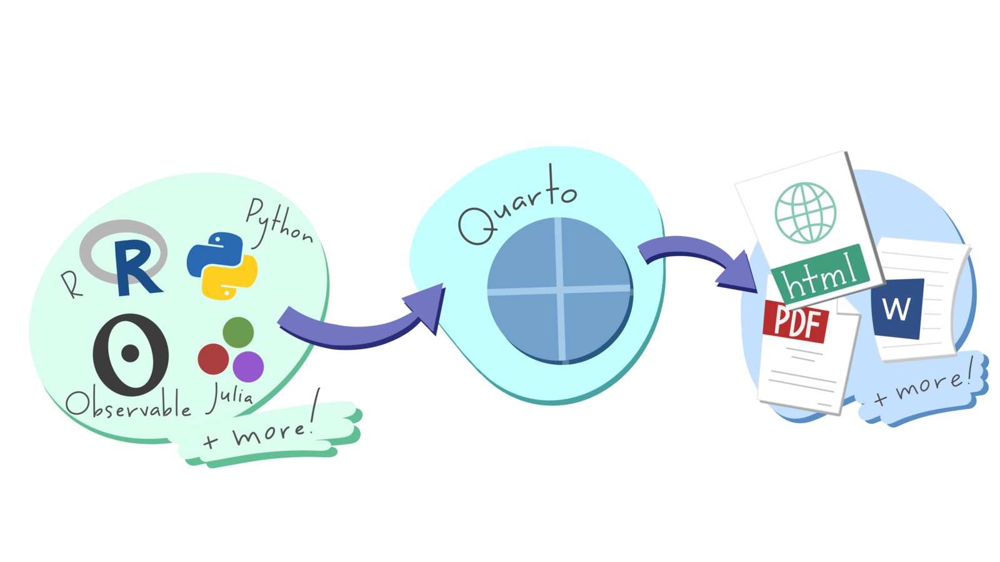
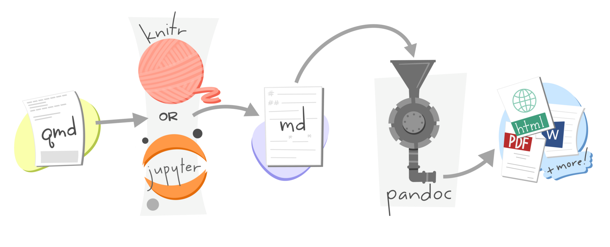
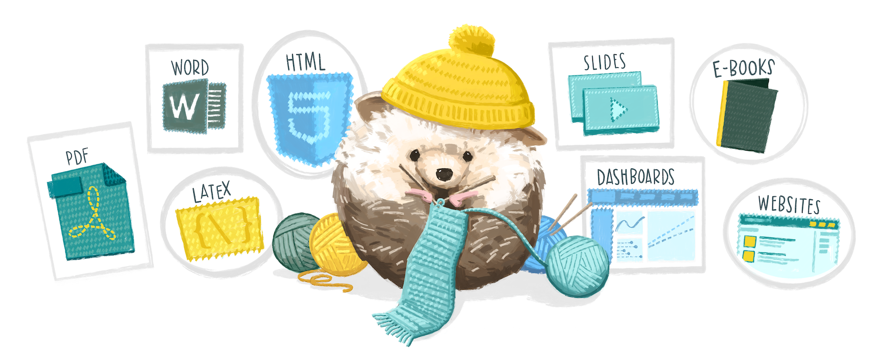

# Writing reports in R {#sec-reports}

::: {.abstract}
In previous chapters we've learned how to make crime maps, but almost every analysis also needs text, charts and other things to help the audience understand the main messages. In this chapter we will learn how to use a tool called Quarto to produce structured reports in Positron and export them to multiple formats, including HTML, Word and PDF.
:::


::: {.callout-tip title="Before you start"}

1. Open Positron or -- if you already have Positron open -- start a new R session by clicking the **Restart R** (**&#10227;**) button in the **Console** panel. This makes sure no code you ran previously will interfere with the work you do in this chapter.
2. Make sure you are working in the crime mapping project workspace you created in @sec-create-project. In the top-right corner of the Positron window, you should see a folder icon and the words `crime_mapping`. If not, click the **File** menu, then **Open Folder ...** and choose the `crime_mapping` folder.
:::


```{r}
#| include: false

pacman::p_load(here, httr2, sf, sfhotspot, tidyverse)
```


## Introduction

We have practised producing useful maps in R so that people can use them to make decisions about understanding and responding to crime problems. But maps are only one part of most spatial analysis. In practice, maps are usually part of a larger report in which you as an analyst will explain what your maps show and perhaps make recommendations about what decisions people should make.

You are probably used to creating graphics in one piece of software (such as a map in R or a chart in Excel) and then importing or pasting those graphics into another program (such as Word) to include them in a written report. This way of working is often fine, but it has some important shortcomings. For example, if you want to make a change to a graphic (maybe to correct a typo), you then have to import it into your writing program again. More importantly, it can become hard to keep track of which version of a graphic you need to import and you may end up including the wrong version of a file.


<p class="centered-image"></p>


The same problem applies to numbers that you might calculate in statistical software such as R. You might calculate a statistic such as the mean number of burglaries in local council wards, then paste the result into Word to include it in your report. But if you then realise later on that there is a problem with your data and re-run your code, it would be very easy (especially in a long
report) to forget that you needed to update the mean value presented in the report. The risk of making errors like this is particularly high if you are asked to update an existing report based on new data. Perhaps the worst aspect of this problem is that you will never know for sure if the numbers in your final report are correct, unless you go back and check every one of them in whatever program you used to generate the numbers in the first place. So whenever you present your analysis you will have the nagging doubt that some of the results might be incorrect.

We can describe this risk of a report containing obsolete charts or incorrect statistics by saying that it is not *reproducible* -- if we were asked to go back and demonstrate each stage in producing the report to prove that we had done everything correctly, it would be very hard to do so. This is important because the reports that analysts write about crime are so often used to make decisions about how to respond to crime. An error in copying and pasting a number from R or Excel into Word could lead to police officers being deployed to the wrong place, or the wrong local council being given funding to install crime-prevention measures.

Watch this video to learn more about writing reproducible documents using what is known as _literate coding_.





::: {.callout-quiz .callout title="Reproducibility"}

```{r}
#| label: reproducibility-quiz
#| echo: false

reproducibility_quiz1 <- c(
  "It separates code and natural language into different documents.",
  answer = "It intersperses code with natural language within the same document.",
  "It only supports Python as a programming language.",
  "It primarily focuses on graphical user interfaces rather than code execution."
)

reproducibility_quiz2 <- c(
  "It ensures that all steps, including steps done manually in external software, are documented",
  "It makes code execution optional in reports",
  answer = "It minimizes dependencies on undocumented steps by showing all steps in the analysis clearly",
  "It replaces all traditional forms of documentation with graphical representations"
)

reproducibility_quiz3 <- c(
  "They are a proprietary tool developed exclusively for use with the R programming language",
  "They can only be edited using Jupyter Notebook",
  "They do not allow mixing of prose and code chunks",
  answer = "They evolved from R Markdown and support multiple programming languages"
)
```


**What is a key feature of a computational notebook?**

`r webexercises::longmcq(reproducibility_quiz1)`


**Why is literate coding recommended for reproducible workflows?**

`r webexercises::longmcq(reproducibility_quiz2)`


**Which of the following best describes Quarto notebooks?**

`r webexercises::longmcq(reproducibility_quiz3)`

:::


In this chapter we will learn to use Quarto to write reports directly in Positron, integrating data, maps and statistics so that they remain up to date.

Reports made with Quarto can include lots of different calculations, graphics, etc. For example, the report [*Stop and Search in London*](https://discovery.ucl.ac.uk/id/eprint/10115766/1/2020-Q3.pdf) was created entirely in Quarto. This whole book is also written in Quarto. But in this chapter we'll keep things simple by producing a very short report that only includes one figure. You can [view the finished version of the report](../resources/reports/medellin_homicides_map.html) that we will use as an example in this chapter. The report combines a sentence of explanatory text, a map produced by R and an automatically numbered cross-reference.

In this chapter, we will learn how to:

- structure a report using Markdown;
- create and configure a Quarto document;
- add inline R code and R code chunks to Quarto documents;
- control which code and output appear in a finished report;
- label and cross-reference maps and tables; and
- render a reproducible report in different formats.


## Markdown

*Markdown* is a way of formatting plain text so that a computer can convert it into different file formats. For example, Quarto can convert Markdown documents into Word, PDF, PowerPoint and many other formats.

:::::: {.hierarchy .horizontal}
::::: item
a Markdown<br>document

:::: item
… can be <br>processed into …

::: item
Word
:::

::: item
PDF
:::

::: item
PowerPoint
:::

::: item
other formats
:::

::::

:::::

::::::

Markdown is extremely simple. It uses plain-text characters to represent common text formatting such as titles, emphasised text and so on. For example, the Markdown text:

```lang-md
# Introduction

In this chapter we will learn to use a tool called *Quarto* to write reports
directly in Positron.
```

produces the output:


::: {.faux-markdown}

<h1>Introduction</h1>

<p>In this chapter we will learn to use a tool called <em>Quarto</em> to write reports directly in Positron.</p>

:::


In this example, the character `#` _followed by a space_ at the start of a line means that line should be shown as a first-level heading and the asterisks (`*` -- we could also have used the underscore character `_`) around the word `Quarto` indicate that it should be emphasised (typically with *italic* text).


::: {.callout-important title="Spaces are important in Markdown headings"}

In Markdown we use the hash character `#` followed by a space to indicate that a line should be formatted as a top-level heading. The space after the `#` is important – if you write `#Introduction` instead of `# Introduction` then Quarto will not recognise that line as representing a heading and it will not be formatted properly.
:::


Markdown is designed to be easy to read and easy to write. It is perfectly possible, for example, to read the unformatted Markdown text in the example above. Since Markdown files (which have the file extension `.md`) are plain text, it's also possible to open them on virtually any computer. Markdown is very widely used on the web -- using underscores to mark out italic text
and asterisks to mark out bold text even works in messaging apps such as Telegram and WhatsApp.

In Markdown you describe the *structure* of a document, not its appearance. The appearance of the document (which fonts it uses, what margins the pages have and so on) is determined by the template Quarto uses to convert Markdown files into documents of different types. This can save you a lot of time, because you don't need to specify fonts and other formatting. Instead, you can concentrate on the structure of your argument rather than the details of formatting.

You can create your own templates for documents (for example if you want to create documents that match a particular corporate style), but in this course we will use Quarto's built-in formats.


::: {.callout-important title="Use Markdown to describe structure, not appearance"}

You should not try to fine-tune the visual appearance of a document produced from Markdown-formatted text by (for example) changing a second-level heading to a third-level heading because you want the heading text to be slightly smaller. Keeping the structure of your document (defined using Markdown) separate from its visual appearance has several benefits that are important, but not immediately obvious. For example, screen reading software used by blind or partially sighted people will read out the _structure_ of a document rather than the visual appearance. So if, for example, you were to use Markdown syntax for `code text` to change the font in the headings in a Markdown document, it is possible that would make the document much harder for people using a screen reader to make sense of.

If you want to change the visual appearance of a piece of Markdown-formatted text, you should change the template that is used to convert that text into a Word document, PDF, web page, etc.

**Use Markdown to describe the structure of a document, not its appearance**.
:::


### Markdown document structure

To create paragraphs in Markdown, you simply split text with a blank line. So this Markdown text:


```lang-md
In this chapter we will learn to use a tool called _Quarto_ to write reports
directly in Positron. Markdown is a way of formatting plain text so that a
computer can convert it into different file formats.
```

produces the output:


::: {.faux-markdown}
In this chapter we will learn to use a tool called _Quarto_ to write reports directly in Positron. Markdown is a way of formatting plain text so that a computer can convert it into different file formats.
:::


because there is no blank line between the first and second sentences. We can split this into two paragraphs just by adding a blank line:


```lang-md
In this chapter we will learn to use a tool called _Quarto_ to write reports
directly in Positron.

Markdown is a way of formatting plain text so that a computer can convert it
into different file formats.
```


which produces the output:


::: {.faux-markdown}
In this chapter we will learn to use a tool called _Quarto_ to write reports directly in Positron.

Markdown is a way of formatting plain text so that a computer can convert it into different file formats.
:::


#### Headings {.unnumbered}

There are six levels of headings available in Markdown documents, although it is very unlikely that you will need all six. Headings are specified by adding one or more `#` characters to the start of the line, followed by a space:


```lang-md
# First-level heading

## Second-level heading

### Third-level heading
```

produces:


::: {.faux-markdown}

<h1>First-level heading</h1>

<h2>Second-level heading</h2>

<h3>Third-level heading</h3>

:::


Headings should have at least one blank line above and below them, so that they stand out from the surrounding code. I usually leave three blank lines before a second-level heading and two blank lines before other headings, with exactly one blank line after every type of heading.


#### Lists {.unnumbered}

Markdown supports two types of list: ordered lists and unordered lists. You can make an ordered list by putting each list item on a new line and starting each line with a number followed by a full stop (`.`). You make an unordered list in the same way, but starting each line with an asterisk:

```lang-md
1. A list of items
2. for which the ordering
3. of items is important

* A list of items
* for which the ordering
* of items is *not* important
```

produces:


::: {.faux-markdown}

1. A list of items
2. for which the ordering
3. of items is important

* A list of items
* for which the ordering
* of items is *not* important

:::


#### Quotes {.unnumbered}

If you want to insert a quote into your Markdown document, you can do that by putting a greater-than (`>`) symbol followed by a space at the start of each line of the quote:

```lang-md
> In this chapter we will learn to use a tool called _Quarto_ to write reports
> directly in Positron.
```

produces


::: {.faux-markdown}

<blockquote>
In this chapter we will learn to use a tool called _Quarto_ to write reports directly in Positron.
</blockquote>

:::


### Inline elements

As well as using Markdown to describe the structure of a document, you can use it to mark up particular text within a paragraph. We've already seen how to do this using `_to emphasise text_` (usually displayed in _italics_). We can also `**strongly emphasise**` text, which will usually appear in **bold**. Note that the `_`, `*` or `**` characters must be touching a word on exactly one side:

  * `some _emphasised_ text` produces some _emphasised_ text
  * `some_emphasised_text` does not produce emphasised text
  * `some _ emphasised _ text` does not produce emphasised text

We can add links to a document using the format `[link text](URL)`. For example, the text:

```lang-md
[learn about the tidyverse](https://www.tidyverse.org/)
```

produces the link:


::: {.faux-markdown}

[learn about the tidyverse](https://www.tidyverse.org/)

:::


There are several other Markdown codes for describing different elements within a document, including images, videos and segments of code. You can find out more about what's possible with Markdown on the [Markdown Basics page of the Quarto website](https://quarto.org/docs/authoring/markdown-basics.html).


### Previewing Markdown in Positron

Positron can preview a Markdown document while you work. To try this:

1. Click the **File** menu, then click **New File ...**.
2. Type `markdown_practice.md` in the box marked **Select File Type or Enter File Name...**, then press .
3. Save the file in the `output` directory of your `crime_mapping` workspace.
4. Add some Markdown headings, paragraphs and lists using the syntax we have just learned.
5. Click the **Preview** button at the top-left of the editor.

As you edit the file, you can see an updated preview at any time by clicking the **Preview** button again.

By default, Positron renders Markdown files into HTML files (web pages). You can also produce many other formats. One common format you might want to produce is a PDF file. To create PDF files with Positron, your computer has to have a version of software called _TeX_ installed. If you've never heard of TeX, you can install it automatically using the tinytex R package. To install TeX, run this R code _once_ in the R Console:

```r
install.packages("tinytex")
tinytex::install_tinytex()
```

TeX should now be installed on your computer.

::: {.callout-important title="Install TeX only once"}
Note that you only have to install TeX once on each computer you use, so you should not include `tinytex::install_tinytex()` in any code scripts that you write.
:::


::: {.callout-quiz .callout title="Markdown"}

```{r}
#| label: markdown-quiz
#| echo: false

markdown_quiz1 <- c(
  "`**Heading 1**`",
  "`== Heading 1 ==`",
  answer = "`# Heading 1`",
  "`## Heading 1`"
)

markdown_quiz2 <- c(
  "Using numbers like `1. Item`",
  answer = "Using asterisks or dashes like `* Item`",
  "Using `**` around the text",
  "Using brackets like `[Item]`"
)

markdown_quiz3 <- c(
  "`_strongly emphasised text_`",
  "`-strongly emphasised text-`",
  "`#strongly emphasised text#`",
  answer = "`**strongly emphasised text**`"
)
```

**Which of the following is the correct way to create a first-level heading in Markdown?**

`r webexercises::longmcq(markdown_quiz1)`


**How do you create an unordered list in Markdown?**

`r webexercises::longmcq(markdown_quiz2)`


**What is the correct way to strongly emphasise text in Markdown?**

`r webexercises::longmcq(markdown_quiz3)`


:::


## Quarto

Markdown allows you to create static documents in Positron. But to create a report that includes maps, tables and other outputs from R, we need to use Quarto. Quarto is built into Positron, so you can create Quarto documents in much the same way as Markdown documents.

Quarto is a system that converts Markdown documents that contain chunks of code written in R or Python, runs the code and then integrates the Markdown text and the code results into one or more output files. Quarto can produce web pages, Word documents, PDF files, presentations, websites, e-books and other formats.

A Quarto file is just like a Markdown document except that it has the file extension `.qmd` rather than the extension `.md`. The `.qmd` extension tells Positron that a file will contain a mixture of text formatted with Markdown and code that produces tables, charts and so on.

In the rest of this chapter we will develop the code needed to create a report on homicides in Medellín, Colombia. To get started:

1. Click the **File** menu in Positron, then click **New File ...**.
2. Type `chapter_11.qmd` in the box marked **Select File Type or Enter File Name...**, then press .
3. Save the file in the `output` directory of your `crime_mapping` workspace.

Note that we are saving this file in the `output` directory, not the `R` directory. This is because Positron will save the outputs produced from a Quarto file in the same directory as the Quarto file itself.

Positron opens `.qmd` files in a source editor, where you can see the Markdown and code that make up the document. Keeping the source visible will help you understand exactly how the report is structured.

Quarto documents start with a *header* that provides some basic information about the document, such as the title. Replace the contents of `chapter_11.qmd` with this simple header:

```yaml
---
title:  "Medellín homicides map"
author: "[specify your name]"
date:   "today"
---
```

The header is written in yet another programming language called [YAML](https://en.wikipedia.org/wiki/YAML). You don't need to know the details of YAML to write headers for Quarto documents. Two things you do need to know, though:

  * The three dashes (`---`) are important, because they tell Quarto that the content inside the dashes is the document header. **These dashes must appear at the start of a line and be the only characters on that line.**
  * Indentation matters in YAML. Every line takes the form `key: value` and in most cases the key must be at the very start of the line. Lines in YAML are not limited to 80 characters, so you should _not_ break a single value (such as the document title) over multiple lines.


::: {.callout-quiz .callout title="Quarto"}

```{r}
#| label: quarto-quiz
#| echo: false

quarto_quiz1 <- c(
  "Markdown is only used for web pages",
  "Markdown does not support headings",
  answer = "Quarto supports embedding executable code",
  "Quarto is only used for PDF documents"
)

quarto_quiz2 <- c(
  "It contains the results of the analysis",
  answer = "It specifies document metadata like title, author, and output format",
  "It automatically saves the document",
  "It allows Markdown text to be rendered"
)

quarto_quiz3 <- c(
  "It eliminates the need for writing text",
  "It automatically corrects mistakes",
  "It does not require learning new skills",
  answer = "It allows integration of real-time R computations into the document"
)
```

**What is the key difference between a Markdown (`.md`) and a Quarto (`.qmd`) file?**

`r webexercises::longmcq(quarto_quiz1)`


**What is the main role of the YAML header in a Quarto document?**

`r webexercises::longmcq(quarto_quiz2)`


**What is one benefit of using Quarto over traditional word processors like Microsoft Word?**

`r webexercises::longmcq(quarto_quiz3)`


:::


### R code in Quarto

Quarto will process everything in a Quarto document after the header (marked with `---`) as Markdown text. The only exception is when you include sections of code in a Quarto document.

You can include R code inside a line of Markdown text (known as *inline* code) and the result of that code will be included in the document output. Inline R code begins with a backtick character (`` ` ``) followed by a lower-case `r` and a space, and ends with another backtick. For example, add the following sentence beneath the header in `chapter_11.qmd`:

```lang-md
This report was written on `r knitr::inline_expr('format(Sys.Date(), "%e %B %Y")')`.
```

Which would produce the output:


::: {.faux-markdown}
This report was written on `r format(Sys.Date(), "%e %B %Y")`
:::

::: {.callout-important title="Remember spacing is important in Quarto"}
Where you do (and don't) put spaces matters a lot when writing a Quarto document. For example, the inline R code above _must_ have a space after the `r` at the start of the code chunk but _must not_ have a space between the `` ` `` and the `r`, otherwise Quarto will not recognise it as inline R code. So `` `r `` works, but `` ` r `` does not.
:::

Putting R code inline is fine for simple pieces of code, but longer pieces of code included inline would become difficult to read (and therefore difficult to debug). Fortunately, we can put as much code as we like in a *code chunk*. To add an R code chunk to a Quarto document, type ```` ```{r} ```` (three backticks followed immediately by `{r}`) on a line on its own, add the R code on the following lines, then close the chunk with ```` ``` ```` (three more backticks) on a line on its own. Positron will highlight the chunk so that it stands out from the surrounding Markdown text.

We can use code chunks to run longer pieces of code that would be difficult to read if the code were inline. For example, if you wanted to load a data file of crime data, filter it for crimes occurring in a particular month and then count the number of rows, you could do the calculation in a code chunk and then include the result inline:

````{verbatim}
```{r}
#| label: count-homicides

# Count number of homicides in February 2019
homicide_count <- medellin_homicides |>
  filter(year(fecha_hecho) == 2019, month(fecha_hecho) == 2) |>
  nrow()
```

There were `r scales::comma(homicide_count)` homicides recorded in February 2019.
````

If Positron does not highlight a code chunk, check that you saved the file with a `.qmd` extension and typed the opening and closing backticks correctly.

To help keep track of code chunks, we can label them. Add `#| label:` immediately below the opening line of the chunk, followed by a short label containing letters, numbers and dashes (`-`). For example, we could label the chunk above by adding `#| label: count-all-crimes`. Labels appear in error messages and make it easier to find which part of a document needs attention.

The package that converts Quarto documents into other formats is called knitr -- actually, it's a bit more complicated than that, but one of the nice things about Quarto is you don't need to worry about what's happening behind the scenes.


<p class="full-width-image"></p>


The default Quarto template is set up so that the final document that is produced from your Quarto file will include both the code that you include in any code chunks *and* the output that the code produces. For example, we can use code like this to get our Medellín homicides report started:


```{r}
#| label: show-code-chunk-output
#| echo: false
#| classes: faux-markdown

cat(read_file("../resources/examples/quarto_show_code.qmd"))
```


But that code produces the following output. That's probably not what you want because it has the raw R code in it as well as the output from that code:


::: {.faux-output}
```{=html}
<iframe height="600" src="../resources/examples/quarto_show_code.html" title="The default output from a Quarto file includes a copy of the R code in the file" style="width: 100%;"></iframe>
```
:::


We can control the results of code chunks using *chunk options*, sometimes called *knitr options*. We put these on the first line of each code chunk, with each option on a separate line and each line starting with the characters `#| ` (referred to as a _hash-pipe_). Note that for Quarto to recognise a line of code as a Quarto chunk option, the line must come immediately after the opening line of the code chunk (```` ```{r} ````) with no blank lines between them, and `#|` _must_ be followed by a space.

To specify that the code in our R code chunks should not be printed in the final document, we can set the chunk option `#| echo: false`. To specify that both the R code and the _output_ produced by that code (e.g. charts, tables, etc.) should not be shown, we can set the chunk option `#| include: false`.

If we change the code in our previous example to set `#| include: false` to suppress both code and output from the first code chunk and set `#| echo: false` for the second code chunk, the output becomes much more like the report we want:


```{r}
#| label: show-no-echo-example
#| echo: false
#| classes: faux-markdown

cat(read_file("../resources/examples/quarto_hide_code.qmd"))
```


::: {.faux-output}
```{=html}
<iframe height="300" src="../resources/examples/quarto_hide_code.html" title="We can use chunk options to stop raw R code and output from appearing in a document" style="width: 100%;"></iframe>
```
:::


If a code chunk produces a chart or map, then we *do* want to show the output (although not the code), so in that case we should not set `#| include: false` -- we do not need to set `#| include: true` because it is the default.

Since we probably don't want any chunks in our code to include the code in our final document, we could end up setting the chunk option `#| echo: false` for every code chunk. In a long or complicated document, this would get tedious. Fortunately, we can set chunk options *globally* (i.e. for all chunks in a document) by setting them in the YAML document header. To do this, we add a key called `execute` to the header. Instead of giving the `execute` key a value such as `true` or `false`, we instead indent the _next_ line of the header by _exactly_ two spaces and then set the chunk option `echo: false`. If we wanted to set multiple global chunk options here, we would put each one on a new line, all of the lines indented by two spaces from the start of each document.


```yaml
---
title: "Medellín homicides map"
author: "John Smith"
date:   "today"
execute:
  echo: false
---
```

You might have noticed in the code above that instead of using `read_csv()` to load the data from the file `medellin_homicides.csv`, we are using a function called `read_csv2()`. That's because the file uses semicolons (`;`) to separate the columns, rather than commas. This is a common convention in countries that use a comma as the decimal mark (most countries in Europe and South America, as well as some elsewhere).

If you use `read_csv()` to load a semicolon-delimited file, the values from all the columns on each row appear together in a single column. When you load a dataset and unexpectedly see it has been loaded as one column containing many semicolons, inspect the original file and consider using `read_csv2()` instead.

Add the following setup chunk to `chapter_11.qmd`.

````{verbatim}
```{r}
#| label: setup
#| include: false

# Load packages
pacman::p_load(here, httr2, sf, sfhotspot, tidyverse)

# Download the original data
request(
  "https://mpjashby.github.io/crimemappingdata/medellin_homicides.csv"
) |>
  req_perform(path = here("data", "raw", "medellin_homicides.csv"))

request(
  "https://mpjashby.github.io/crimemappingdata/medellin_comunas.gpkg"
) |>
  req_perform(path = here("data", "raw", "medellin_comunas.gpkg"))

# Load data
medellin_homicides <- here("data", "raw", "medellin_homicides.csv") |>
  read_csv2() |>
  # Remove rows with missing coordinates
  drop_na(longitud, latitud) |>                                             #<1>
  # Convert the data to an SF object
  st_as_sf(coords = c("longitud", "latitud"), crs = "EPSG:4326")            #<2>

medellin_boundary <- here("data", "raw", "medellin_comunas.gpkg") |>
  read_sf() |>
  janitor::clean_names() |>
  st_transform("EPSG:3115")
```
````
1. Some rows in this dataset have missing coordinates. `st_as_sf()` will produce an error if there are missing coordinates, so we use `drop_na()` to remove them first.
2. Since the column names are called `longitud` and `latitud`, we know that we should use the WGS84 coordinate reference system, which has the CRS code EPSG:4326.

We transform the neighbourhood boundaries to EPSG:3115 because it is a suitable projected CRS for Medellín. See @sec-choosing-projected-crs for how to select a projected CRS whose units make distance-based parameters easy to specify.


::: {.callout-quiz .callout title="Loading semicolon-delimited data"}

```{r}
#| label: csv2-quiz
#| echo: false

csv2_quiz1 <- c(
  "`read_sf()` from the sf package",
  "`read_csv()` from the readr package",
  "`read.csv2()` from base R",
  answer = "`read_csv2()` from the readr package"
)

csv2_quiz2 <- c(
  "The file contains no observations",
  answer = "The file may use semicolons rather than commas as delimiters",
  "The file must contain spatial polygons",
  "The file can only be opened in spreadsheet software"
)
```

**Which function should you use to load a CSV file that uses semicolons to separate its columns?**

`r webexercises::longmcq(csv2_quiz1)`

**What does it usually mean if `read_csv()` loads every row into one column containing many semicolons?**

`r webexercises::longmcq(csv2_quiz2)`

:::


Some of the R code we write produces progress messages or warnings that we will not want to include in our Quarto documents. For example, `hotspot_kde()` normally prints progress messages while it estimates crime density. Those messages are useful to an analyst but would distract a reader of the finished report. When we need to run code that both:

1. produces messages that we _do not_ want to include in the final report, _and_
2. produces output that we _do_ want to include in the final report,

we can split the code into two separate code chunks, storing the result of the code in the first chunk in an object that we then refer to in the second chunk. The first chunk runs the code that produces the messages, but we set `#| include: false` so that neither the code nor the messages appear in the final report. The second chunk runs the code that produces the output we want to include in the report, and we do not set `#| include: false` for that chunk.

Add this code chunk to the `chapter_11.qmd` file. Note that for this chunk we are setting `#| include: false` to suppress the messages that would otherwise be produced by `hotspot_kde()`. Remember that there must be at least one blank line between each code chunk in Quarto documents.

````{verbatim}
```{r}
#| label: calculate-density
#| include: false

# Calculate crime density
medellin_homicide_density <- medellin_homicides |>
  st_transform("EPSG:3115") |>
  # `hotspot_kde()` prints progress messages by default, but `include: false`
  # prevents them from appearing in the finished report
  hotspot_kde(bandwidth_adjust = 0.33, cell_size = 500) |>
  hotspot_clip(medellin_boundary, quiet = TRUE)
```
````


::: {.callout-important title="The include option may suppress important warnings"}

Using `#| include: false` can be useful to stop an output document being littered with R messages and warnings. However, it will also stop you seeing warnings that might be important in highlighting problems you need to fix. If code in a Quarto code chunk is not producing the results you expect, the first thing you should do is remove `#| include: false` from the chunk so that you can see any warnings or messages that you might need to act upon. Once the code is running as you want it to, you can add `#| include: false` back again.
:::


### Maps, charts and tables in Quarto documents

Almost all the documents you produce in Quarto will include one or more maps, charts or tables. Quarto includes tools for providing captions for figures and tables, as well as the ability to refer to them elsewhere in a document.

Maps, charts and tables in Quarto documents are usually the output produced by a chunk of R code. For example, we might use `hotspot_map()` to make a map. To turn a code chunk into a figure we can reference, we need to add two chunk options at the start of the code chunk. We use the `#| label` chunk option to specify what text we will use throughout the rest of the document to refer to the figure or table produced by that code chunk. Note that chunk labels for figures and tables _must_ begin with either `fig-` for figures (charts and maps) or `tbl-` for tables. For example, we might label a map with the label `#| label: fig-homicides-map` or a table with the label `#| label: tbl-robbery-counts`. Note that chunk labels can contain letters, numbers and dashes (`-`), but not spaces or other characters.

The second chunk option we should add is either the `#| fig-cap` chunk option (for charts and maps) or the `#| tbl-cap` argument, to create a caption for the chart, map or table. Note that captions should be enclosed in quotes, e.g. `#| tbl-cap: "This is the table caption"`.

Add this code to the `chapter_11.qmd` Quarto file:

````{verbatim}
@fig-homicides shows the density of homicides in Medellín, Colombia, from 2010 to 2019.

```{r}
#| label: fig-homicides
#| message: false
#| fig-cap: "Density of homicides in Medellín, 2010 to 2019"
#| fig-alt: "Street map of Medellín showing estimated homicide density. The highest density is concentrated in the central part of the city."

# Note we don't have to set `#| include: true` for this code chunk, because that
# is the default. We do, however, have to set `#| message: false` to suppress
# the message about a coordinate system already being present when we add the
# boundary layer to the map.

# Plot a basic density map
hotspot_map(
  medellin_homicide_density,
  basemap_type = "cartolight",
  caption = "Homicide data: Alcaldía de Medellín (CC-BY-SA)"
) +
  geom_sf(data = medellin_boundary, colour = "grey25", fill = NA)
```
````

Once we have set the label and the caption for a code chunk, we can use that label to insert cross-references into our document. For example, in the code above you can see that the code chunk that creates the map of homicides in Medellín has the chunk option `#| label: fig-homicides`. Just above that code chunk, the figure produced by that chunk is referenced in the text using the code `@fig-homicides`. You can see in the output below that the cross-reference `@fig-homicides` has been changed to the text 'Figure 1', that the cross-reference is a hyperlink (to the part of the document containing the map) and that the map now has a caption that starts 'Figure 1'.


::: {.faux-output}
```{=html}
<iframe height="800" src="../resources/reports/medellin_homicides_map.html" title="An HTML file produced by Quarto that shows a figure with a caption and a cross-reference in the text." style="width: 100%;"></iframe>
```
:::


You might have noticed we also added the chunk option `#| fig-alt` to the code chunk that produces the map. This is because we are producing an HTML document, and HTML documents should be accessible to people who use assistive technology such as screen readers. The `#| fig-alt` chunk option allows us to provide a short description of the figure that will be read out by a screen reader. You can find out more about accessibility in Quarto documents on the [Quarto website](https://quarto.org/docs/publishing/accessibility.html). 


::: {.callout-quiz .callout title="Using code in Quarto documents"}

```{r}
#| label: quarto-code-quiz
#| echo: false

quarto_code_quiz1 <- c(
  answer = "The code is hidden, but the output is displayed",
  "The output is hidden, but the code is displayed",
  "Both code and output are hidden",
  "The document fails to render"
)

quarto_code_quiz2 <- c(
  "It speeds up code execution",
  "It automatically changes the output format",
  answer = "It makes debugging easier",
  "It is required for Quarto to run"
)

quarto_code_quiz3 <- c(
  "The code is hidden, but the output is displayed",
  "The output is hidden, but the code is displayed",
  answer = "Both code and output are hidden",
  "The document fails to render"
)
```

**What happens if you set the option `#| echo: false` in a Quarto code chunk?**

`r webexercises::longmcq(quarto_code_quiz1)`


**Why is it useful to name code chunks in Quarto?**

`r webexercises::longmcq(quarto_code_quiz2)`


**What happens if you set the option `#| include: false` in a Quarto code chunk?**

`r webexercises::longmcq(quarto_code_quiz3)`


:::


## Rendering Quarto

Once you've written the text for your document and added the code needed to produce statistics, tables and figures, it's time to convert your Quarto file to a document in the format you need. This process is called _rendering_ (or sometimes _knitting_) the document.


<p class="full-width-image"></p>


In Positron you can render a Quarto document by clicking the **Preview** button at the top-right of the editor. If you cannot see this button, check that you saved the file with a `.qmd` extension. By default, Quarto will produce an HTML file (a web page) and open it in Positron's Viewer.

You can control the output format by changing the `format:` value in the YAML header of your Quarto document. The default is `format: html`, but you can also use `format: pdf` to produce a PDF file, `format: docx` to produce a Word document, `format: epub` to produce an e-book or `format: pptx` to produce a PowerPoint presentation. There are [many other output formats available](https://quarto.org/docs/output-formats/all-formats.html).


::: {.callout-tip title="Use HTML output if possible"}

If you have a choice of which format to produce a report in, I would suggest you choose HTML because it can do things (like include interactive maps made with leaflet) that Word and PDF format cannot, and can easily be read on mobile devices. Well-formatted HTML documents are also much more accessible to people who need assistive technology such as screen readers for blind and partially sighted people. If, for whatever reason, you cannot choose HTML, I recommend choosing PDF format since it is readable on almost all computers, even those that do not have Word installed on them. Only produce reports in Word format if you are specifically required to submit something in that format.
:::


Whatever format you choose, the output file will be saved in the same folder as your `.qmd` file and will have the same file name but with a different file extension (`.html`, `.pdf`, `.docx`, etc.). If you render the document again, Quarto will overwrite the previous output file.

When you render a Quarto document, Quarto starts a fresh R session and runs all the code in the file so that it can combine the results with the document text. The document can use only packages loaded and objects created inside that document. Objects you created interactively in Positron's R Console are not available. This may be frustrating at first, but it reveals missing steps and helps keep the report reproducible.

Since rendering runs all the code in the document, that code may produce an error. The error will appear in the Terminal tab in Positron and will identify the code chunk in which the problem occurred. Meaningful chunk labels make these messages easier to follow. Read the message, find the named chunk and then use the techniques we learned in @sec-bugs to fix the issue.


### Making self-contained HTML documents

Web pages written in HTML typically make use of images, videos and other resources stored in separate files. In fact, the web page you're reading now makes use of resources stored in 51 separate files. This works well on the web, since it allows resources to be shared between lots of HTML files, which reduces how much data has to be stored and transmitted across networks. But it works less well when you want to send an HTML report to someone else over email, since it can be hard to keep track of all the external files associated with a particular HTML file.

To deal with this problem, we can tell Quarto that when it creates an HTML report, all the necessary data and other resources should be embedded inside the HTML file itself. This makes the HTML file larger, but easier to manage. To make HTML reports produced by Quarto self-contained in this way, we can change the `format` section of the header of a Quarto document from simply `format: html` to instead specify exactly what settings we want to be used to create that HTML file:


```yaml
format:
  html:
    embed-resources: true
```


There are lots of other ways we can use the `format` section of the header in a Quarto document to fine-tune how the resulting document works. You can find out more [in the HTML section of the Quarto website](https://quarto.org/docs/output-formats/html-basics.html).


::: {.callout-quiz .callout title="Rendering Quarto documents"}

```{r}
#| label: rendering-quiz
#| echo: false

rendering_quiz1 <- c(
  "It copies objects from the current Console session into the report",
  answer = "It starts a fresh R session and runs the code in the document",
  "It converts every code chunk into an image",
  "It changes the source file into a Word document"
)

rendering_quiz2 <- c(
  "It prevents R code from running",
  "It saves all resources in a separate folder",
  answer = "It stores resources inside the HTML file so it is easier to share",
  "It makes the report editable in Microsoft Word"
)
```

**What happens when Quarto renders a document containing R code?**

`r webexercises::longmcq(rendering_quiz1)`

**What does `embed-resources: true` do for an HTML report?**

`r webexercises::longmcq(rendering_quiz2)`

:::


## In summary

In this chapter we have learned how to use Markdown to create structured text and integrate that text with code and results in a Quarto report. This makes our work reproducible and reduces the risk of mistakes caused by copying statistics and graphics into software such as Word.

It also means we can produce periodic reports with updated data very easily, since we can just choose the data we want the report to be based on using `filter()` at the start of our file and render the document. This can save a huge amount of time in producing reports such as performance bulletins or monthly summaries of crime in an area.

We have practised how to:

- structure reports using Markdown headings, paragraphs, lists and inline elements;
- configure a Quarto document using a YAML header;
- add inline R code and labelled code chunks;
- control code, messages and output using chunk options;
- label and cross-reference figures and tables; and
- render self-contained reports in different formats.

To consolidate these skills, make the following changes to the `chapter_11.qmd` report you have developed throughout this chapter:

  1. Render the file as a self-contained HTML report.
  2. Render the file in at least one other format, such as Word. If you have installed tinytex, compare the PDF and HTML versions.
  3. Restart R, then render the document again to check that it does not depend on objects in your previous R session.

Your complete `chapter_11.qmd` file should now look like this:

```{r}
#| label: complete-chapter-report
#| echo: false
#| classes: faux-markdown

cat(read_file("../resources/reports/medellin_homicides_map.qmd"))
```

Save `chapter_11.qmd` by pressing .

You can also download [a second complete example report](../resources/reports/medellin_homicides_table.qmd), which produces a table rather than a map, to practise these skills with a different output. This file uses the gt package to make a professional table, which we will learn more about in @sec-no-maps. You can find these examples and reusable templates in @sec-resources.


::: {.box .reading}

There is a lot more you can do with Quarto. To find out more, refer to these resources.

  * [R for Data Science chapter on Quarto](https://r4ds.hadley.nz/quarto.html).
  * A [gallery of different documents, websites and presentations written with Quarto](https://quarto.org/docs/gallery/).
  * The Quarto guides to [Markdown basics](https://quarto.org/docs/authoring/markdown-basics.html), [code-cell options](https://quarto.org/docs/computations/execution-options.html) and [cross-references](https://quarto.org/docs/authoring/cross-references.html).

:::


::: {.callout-quiz .callout title="Revision questions"}

Answer these questions to check you have understood the main points covered in this chapter. Write between 50 and 100 words to answer each question.

1. Why is reproducibility important in writing reports, and why does non-reproducible analysis risk providing decision makers with the wrong information?
2. How does Markdown help structure a report, and what are some key Markdown formatting features?
3. What role does the YAML header play in a Quarto document, and how can it be customized?
4. What are chunk options in Quarto, and how do they affect the final output of a report?
5. How does Quarto improve the workflow of integrating tables, charts, and maps into reports?
:::


::: {.credits}
<a href="https://allisonhorst.com/">Artwork by Allison Horst</a>
:::
