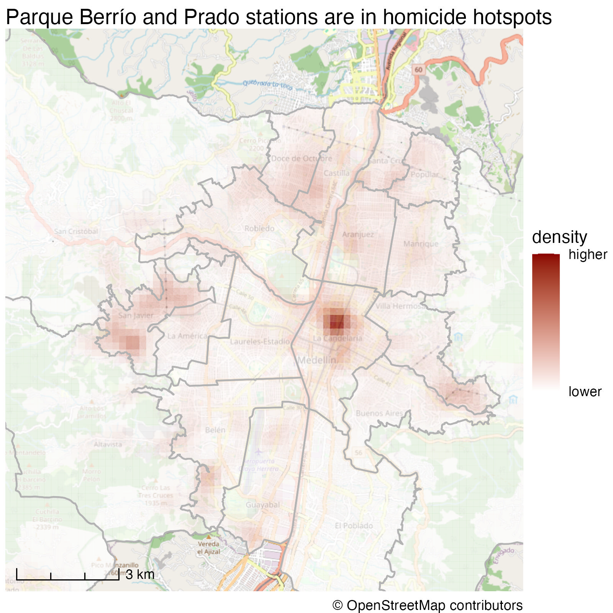
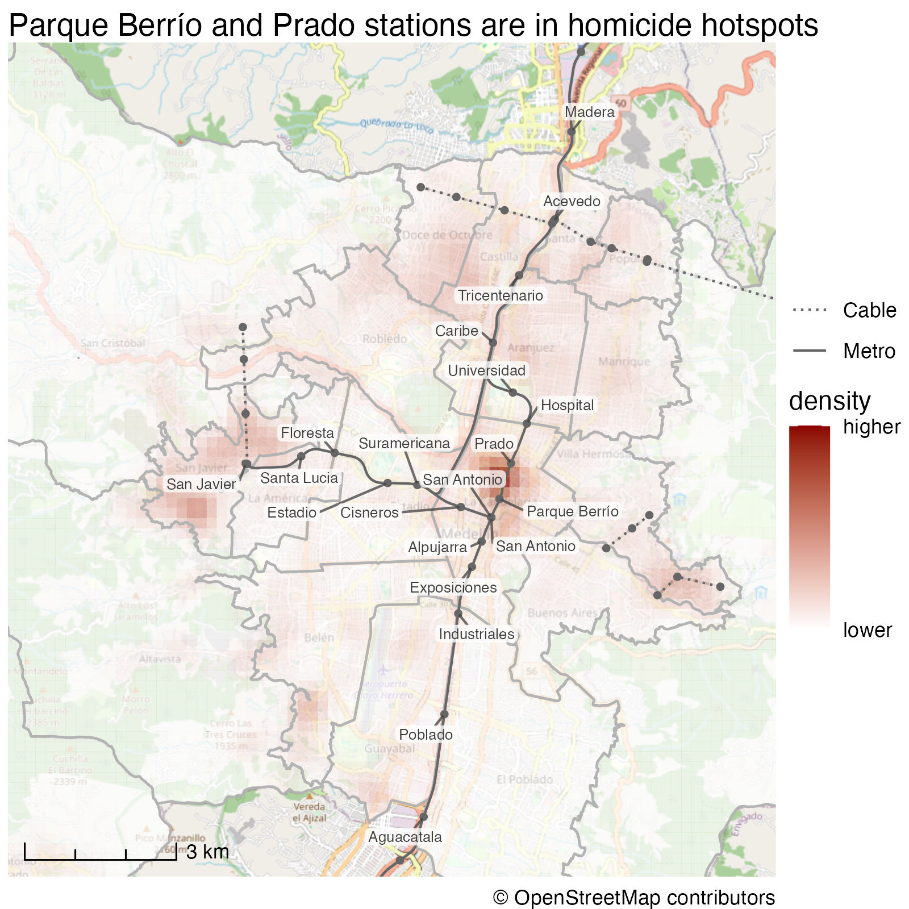
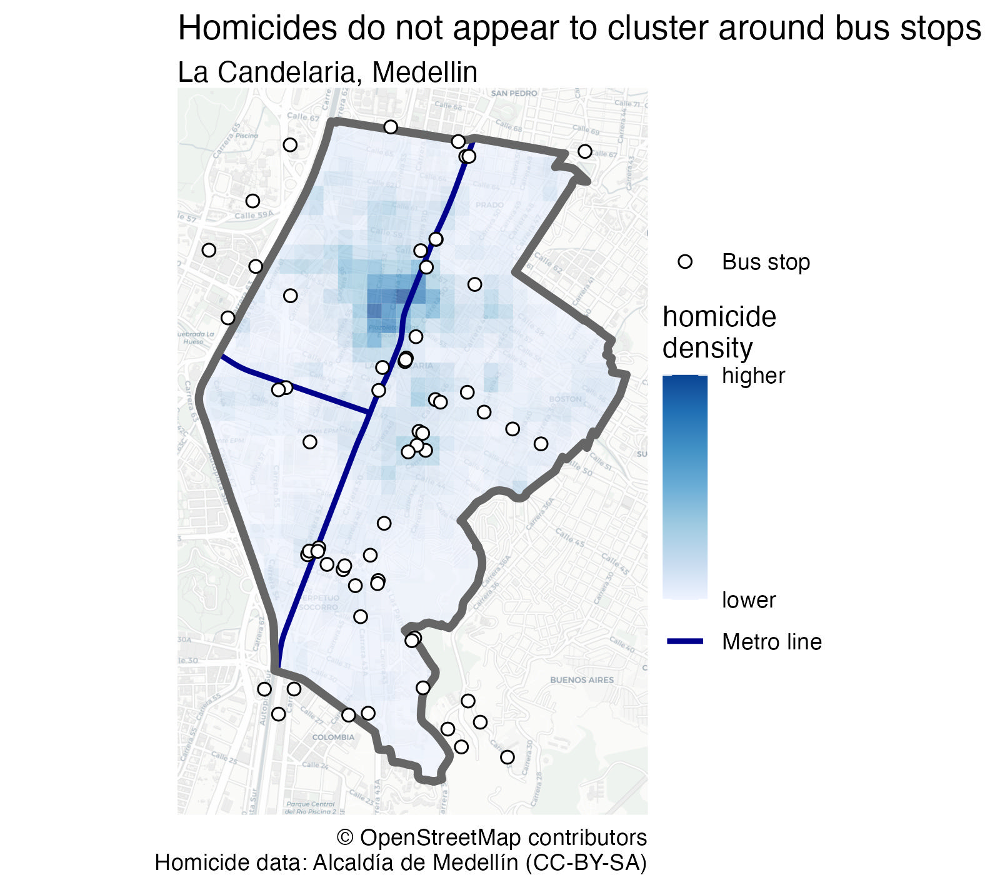
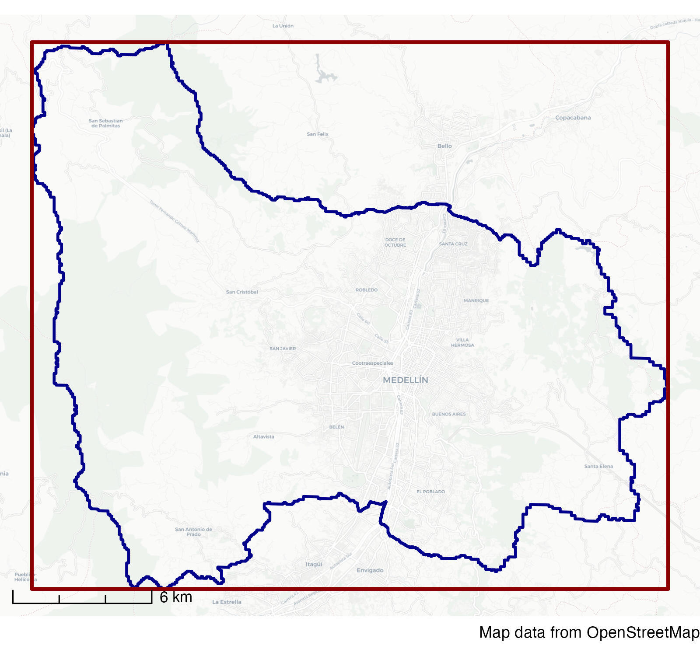

---
execute:
  freeze: auto
---


# Using data about places {#sec-place-data}

{fig-alt="Students add transit routes, houses and a purple park to a neighbourhood map." width=100%}

::: {.abstract}
Understanding the spatial context of crime is essential for effective crime mapping and analysis. This chapter explores how to make crime maps more informative by incorporating additional data about places. It covers sources of spatial data, including open data repositories and OpenStreetMap, and explains how to use shapefiles to add context to crime patterns.
:::





## Introduction

The purpose of most crime maps is to help people make decisions, be they professionals working out how best to respond to crime problems or citizens holding local leaders to account. We can make it easier for people to make decisions by putting crime data into a relevant context. We have already started to do this by adding base maps, titles, legends and so on to our maps.

Since crime is concentrated in a few places, readers of our crime maps will often be interested in understanding what features of the environment are related to specific concentrations of crime in particular places. Where patterns of crime are related to particular facilities -- such as late-night violence being driven by the presence of bars selling alcohol -- it can be useful to highlight specific features on our maps.

As an example, imagine you are the manager responsible for security on the metro network in Medellin, Colombia. There are several mountains within Medellin, so the city metro network consists of both railway lines in the valley and cable cars up the mountains. The security manager for the metro company will certainly analyse violence on the company's stations and vehicles, but may also be interested in which stations are in neighbourhoods that themselves have high levels of violence.

To help with this, you might produce a map showing the density of homicides recorded by local police.

```{r}
#| label: metro-homicides-map
#| eval: false
#| echo: false

pacman::p_load(here, httr2, sf, sfhotspot, tidyverse)

# Download the original data
if (!file.exists(here("data", "raw", "medellin_homicides.csv"))) {
  request(
    "https://mpjashby.github.io/crimemappingdata/medellin_homicides.csv"
  ) |>
    req_perform(path = here("data", "raw", "medellin_homicides.csv"))
}

## Load neighbourhood boundary ----
if (!file.exists(here("data", "raw", "medellin_comunas.gpkg"))) {
  request(
    "https://mpjashby.github.io/crimemappingdata/medellin_comunas.gpkg"
  ) |>
    req_perform(path = here("data", "raw", "medellin_comunas.gpkg"))
}

# Note: this dataset uses ';' as the column separator
medellin_homicides <- here("data", "raw", "medellin_homicides.csv") |>
  read_csv2() |>
  # Remove rows with missing coordinates
  drop_na(longitud, latitud) |>
  # Convert the data to an SF object
  st_as_sf(coords = c("longitud", "latitud"), crs = "EPSG:4326") |>
  st_transform_auto(quiet = TRUE)

medellin_comunas <- here("data", "raw", "medellin_comunas.gpkg") |>
  read_sf() |>
  janitor::clean_names() |>
  st_transform_auto(quiet = TRUE)

## Load metro lines ----

# Download zip file
metro_lines_file <- here("data", "raw", "medellin_metro_lines.zip")
request(
  "https://mpjashby.github.io/crimemappingdata/medellin_metro_lines.zip"
) |>
  req_perform(path = metro_lines_file)

# Unzip the files into a named directory
metro_lines_dir <- here("data", "processed", "medellin_metro_lines")
unzip(metro_lines_file, exdir = metro_lines_dir)

# Load the Metro data
medellin_metro_lines <- here(metro_lines_dir, "medellin_metro_lines.shp") |>
  read_sf()
medellin_metro_stns <- read_csv(
  "https://mpjashby.github.io/crimemappingdata/medellin_metro_stns.csv"
) |>
  st_as_sf(coords = c("x", "y"), crs = "EPSG:4326", remove = FALSE) |>
  st_transform_auto(quiet = TRUE) |>
  mutate(
    nombre = str_remove(nombre, "Estación "),
    nombre = str_remove(nombre, " \\(Línea [AB]\\)")
  )

medellin_homicides_density <- medellin_homicides |>
  hotspot_kde(
    grid = hotspot_grid(medellin_comunas, cell_size = 200),
    bandwidth_adjust = 0.2
  ) |>
  hotspot_clip(medellin_comunas)

medellin_homicides_map1 <- hotspot_map(medellin_homicides_density) +
  geom_sf(
    data = medellin_comunas,
    colour = "grey70",
    fill = NA,
    linewidth = 0.5
  ) +
  ggspatial::annotation_scale(style = "ticks") +
  scale_fill_gradient(
    low = "white",
    high = "darkred",
    breaks = range(pull(medellin_homicides_density, "kde")),
    labels = c("lower", "higher")
  ) +
  scale_linetype_manual(values = c("Metro" = "solid", "Cable" = "12")) +
  lims(x = c(-75.65, -75.525), y = c(6.19, 6.325)) +
  coord_sf(crs = "EPSG:4326") +
  labs(
    title = "Parque Berrío and Prado stations are in homicide hotspots",
    linetype = NULL
  ) +
  theme_void()

medellin_homicides_map2 <- medellin_homicides_map1 +
  geom_sf(
    aes(linetype = sistema),
    data = medellin_metro_lines,
    colour = "grey40"
  ) +
  geom_sf(data = medellin_metro_stns, size = 1, colour = "grey40") +
  ggrepel::geom_label_repel(
    aes(x = x, y = y, label = nombre),
    data = filter(medellin_metro_stns, linea %in% c("A", "B")),
    alpha = 0.75,
    colour = "grey25",
    fill = "white",
    label.padding = unit(0.1, "lines"),
    linewidth = 0,
    max.iter = 1e5,
    min.segment.length = 0,
    size = 2.2
  ) +
  coord_sf(crs = "EPSG:4326")

ggsave(
  "../images/medellin_homicides_map1.jpg",
  medellin_homicides_map1,
  units = "px",
  width = 1600,
  height = 1600
)

ggsave(
  "../images/medellin_homicides_map2.jpg",
  medellin_homicides_map2,
  units = "px",
  width = 1600,
  height = 1600
)
```

::: {#map-medellin-homicide-density}

<p class="full-width-image"></p>

:::

This is an acceptable crime map: it shows the data in a reasonable way, places the data layer at the top of the visual hierarchy and provides suitable context in the title, legend etc. But it is a much less useful map than it could be because it doesn't show where the metro stations are and this information is not included in the base map at this scale. A much better map would add extra layers of data showing the metro stations and the lines connecting them.

::: {#map-medellin-homicides-and-metro}

<p class="full-width-image"></p>

:::

From this second map, it is much easier to see that Parque Berrío and Prado stations are closest to an area with relatively high numbers of homicides.

In this chapter, you will produce a more-detailed map of the La Candelaria neighbourhood that compares homicide density with bus-stop locations and metro lines:

::: {#map-la-candelaria-homicides-and-transport}

<p class="full-width-image"></p>

:::

In this chapter, we will learn how to:

- find and correctly cite open spatial data;
- download, extract and load data supplied as a shapefile;
- identify OpenStreetMap tags for features of interest;
- download OpenStreetMap data using `osmdata`;
- choose a suitable projected coordinate reference system; and
- add contextual place data to a crime map.

To get started, open a new R script file in Positron and save it as `chapter_12.R` in the `R` folder of the workspace you created in @sec-create-project. Add a note to the top of this file explaining that the code will create a map of homicides in Medellin, Colombia, then add the code needed to load the packages we will use in this chapter:

```{r}
#| label: script-12-packages
#| lst-label: lst-place-data-script-12-packages
#| lst-cap: ""
#| filename: "chapter_12.R"

# This script produces a map of the density of homicides in the La Candelaria
# area of Medellin, Colombia, together with bus stops in or near the area

# Load packages
pacman::p_load(here, httr2, osmdata, sf, sfhotspot, tidyverse)
```

Run this line of code to load the packages. You will note that as well as the packages we have used in previous chapters, this code loads a new package -- osmdata -- that we will learn about in this chapter. If you want to remind yourself about the packages we have already used, see @sec-wrangling-data for here, httr2 and tidyverse, @sec-second-map for sf, and @sec-mapping-patterns for sfhotspot.

Remember to run each block of code that you add to the script by pressing .

As we learned in @sec-reports, the Medellin homicide CSV file uses semicolons to separate columns, so we must load it with `read_csv2()` rather than `read_csv()`. We will first download the original file into `data/raw`, then load that local copy.

```{r}
#| label: script-12-homicides
#| lst-label: lst-place-data-script-12-homicides
#| lst-cap: ""
#| filename: "chapter_12.R"

# LOAD DATA --------------------------------------------------------------------

## Load Medellin homicide data ----
# Download the original data
request(
  "https://mpjashby.github.io/crimemappingdata/medellin_homicides.csv"
) |>
  req_perform(path = here("data", "raw", "medellin_homicides.csv"))

# Note: this dataset uses ';' as the column separator
medellin_homicides <- here("data", "raw", "medellin_homicides.csv") |>
  read_csv2() |>
  # Remove rows with missing coordinates
  drop_na(longitud, latitud) |>
  # Convert the data to an SF object
  st_as_sf(coords = c("longitud", "latitud"), crs = "EPSG:4326")
```

In the rest of this chapter we will use data from different sources to better understand clusters of homicides in the La Candelaria neighbourhood of downtown Medellin.

## Finding data

If you are producing crime maps on behalf of a particular organisation such as a police agency or a body responsible for managing a place, it is likely that they will hold spatial data that is relevant to the local area. For example, many city governments will hold records of local businesses. It will sometimes be necessary to track down which department or individual holds this data, and it may also be necessary to convert data into formats that are useful for spatial analysis or to tidy the data as we did in @sec-messy-data.

Some organisations may also have agreements to share data with others. For example, both universities and public agencies such as police forces in the United Kingdom have agreements with the national mapping agency [Ordnance Survey](https://www.ordnancesurvey.co.uk/) to share a wide variety of spatial data. If you are producing maps on behalf of an organisation, it will often be useful to ask what data they hold that might be relevant, or ask for a specific dataset you think would help improve a map.


### Open data {#sec-place-data-open-data}

*Open data* is data that is released by organisations or individuals that can be freely used by others. Organisations such as local governments increasingly release data about their areas as open data -- almost all of the crime and other data we have seen so far in this book is open data released by different local and national governments.

Open data is extremely useful because you can skip the often lengthy and painful process of getting access to data and wrangling it into a format you can use. This means you can move on much more quickly to analysing data, reaching conclusions and making decisions. Watch this video to find out more about the value of open data.



::: {.callout-transcript .callout collapse="true" icon="false" title="Video transcript: The Potential of Open Data"}



:::

Open data is published in a wide variety of formats and distributed in different ways. Some data might only be distributed by an organisation sending you a DVD or memory stick (yes, even in `r year(Sys.Date())`). Most of the time, however, data will be released online.

Many cities now maintain open-data websites that act as a repository for all their open data. For example, the City of Bristol in England publishes the [Open Data Bristol website](https://opendata.bristol.gov.uk/). Anyone can use this website to download data on everything from population estimates to politicians' expenses. Many of these datasets can be useful for crime mapping. For example, you can download the locations of [CCTV cameras](https://opendata.bristol.gov.uk/datasets/bcc::council-cctv-cameras/about) (useful in criminal investigations), or the [locations of children's centres](https://opendata.bristol.gov.uk/datasets/bcc::childrens-centres/about)
(helpful if a crime-prevention strategy includes visits to such facilities).

Different local governments may use different terms for the same types of information, so it sometimes takes some trial and error to find if a particular dataset is available. Some data might also be held by organisations other than the main local government agency for a particular place. For example, data on the locations of electricity substations (useful if you are trying to prevent metal thefts from infrastructure networks) might be held by a power company. All this means that tracking down a particular dataset might require some detective work.

To try to make this process easier, some countries have established national open-data portals such as [Open Data in Canada](https://open.canada.ca/), [Open Government Data Platform India](https://data.gov.in/), [data.gov.uk in the United Kingdom](https://data.gov.uk/) and [data.gov in the United States](https://www.data.gov/). There are also international repositories such as the [African Development Bank Data Portal](https://dataportal.opendataforafrica.org/), [openAfrica](https://open.africa/) and [Data Portals](https://dataportals.org/), which seeks to list all the open data portals run by different governments and other organisations.


### Citing data {#sec-place-data-citing-data}

Organisations that provide data often do so on condition that users of the data follow certain rules. For example, you can use data on the Open Data Bristol website as long as you follow the conditions of the [Open Government Licence](http://www.nationalarchives.gov.uk/doc/open-government-licence/version/3/). The most-common requirement of an open-data licence is that anyone using the data acknowledges the data source in any maps, reports or other outputs they produce. In the case of the Open Government Licence, users of the data are required to add a declaration to any outputs declaring:

> Contains public sector information licensed under the Open Government Licence v3.0.

Complying with open-data licences is a legal requirement, so it is important to make sure you understand what obligations you are accepting when you use a particular dataset. You can typically find the conditions for using a dataset on the website that you download the data from. In @sec-captions we learned that we can add data attribution statements like this to maps with the `caption` argument to the `hotspot_map()` function. 


::: {.callout-quiz .callout title="Open data"}

```{r}
#| label: open-data-quiz
#| echo: false

open_data_quiz1 <- c(
  "We can use open data for any purpose -- there is no need to acknowledge the source of the data",
  "We can use open data, but only for non-commercial purposes",
  answer = "We can use open data for any purpose as long as we comply with the requirements of the licence the data is released under",
  "We can download open data but we cannot use it for any project that will be published online"
)
```


**Which one of these statements about open data is true?**

`r webexercises::longmcq(open_data_quiz1)`


:::


## Shapefiles

In this course we have used spatial data provided in different formats including geopackages (`.gpkg`) and geoJSON (`.geojson`) files, as well as creating spatial objects from tabular data in formats like CSV and Excel files (to read up on different functions for opening different types of data file, see @sec-load-functions). But there is one important spatial-data format that we haven't yet learned to use: the *shapefile*.

The shapefile format was created by Esri, the company that makes the ArcGIS suite of mapping software. It was perhaps the first spatial format that could be read by a wide variety of mapping software, which meant that lots of providers of spatial data began to provide data in shapefile format. Shapefiles are limited in various ways that mean they are unlikely to be a good choice for storing your own data, but it is important to know how to use them because many spatial datasets are still provided as shapefiles for historical reasons.

One of the complications of using shapefiles (and why they're not a good choice for storing your own data) is that different parts of the data are stored in separate files. So while the coordinates of the points, lines or polygons are stored in a file with a `.shp` extension, the non-spatial attributes of each spatial feature (such as the date on which a crime occurred or the name of a neighbourhood) are stored in a separate file with a `.dbf` extension and details of the coordinate reference system are stored in a `.prj` file -- a single dataset might be held in up to 16 separate files on a computer. All the files that make up a shapefile have the same file name, differing only in the file extension (e.g. `.shp`, `.dbf`, etc.). For example, if a `.shp` file is called `robberies.shp` then it will be accompanied by a file called `robberies.dbf` and one called `robberies.prj`, as well as a `robberies.shx` index file and possibly several others. All these separate files make it more-complicated to manage shapefiles than other spatial file formats such as the geopackage.

Because storing spatial data in a shapefile requires multiple different files, shapefile data is usually distributed in a `.zip` file that contains all the component files. This means that to access a shapefile we will have to add a step to our usual routine for downloading and opening a data file. To minimise the hassle associated with using shapefiles, in general we will:

  1. download the `.zip` file if we don't have a local copy already,
  2. create a named directory inside the `data/processed` directory (which we created in @sec-getting-started) for the extracted files,
  3. unzip the `.zip` file into that directory, and
  4. load the shapefile data from the project directory.

For example, the routes of metro lines in Medellin are available in shapefile
format at:

```
https://mpjashby.github.io/crimemappingdata/medellin_metro_lines.zip
```


To load the data from this file, we can use the process outlined above. Add this code to your `chapter_12.R` script file. Read through the notes below this code to understand what each part of the code does.

```{r}
#| label: script-12-metro
#| lst-label: lst-place-data-script-12-metro
#| lst-cap: ""
#| filename: "chapter_12.R"

## Load metro lines ----

# Download zip file
metro_lines_file <- here("data", "raw", "medellin_metro_lines.zip") #<1>
request(
  #<2>
  "https://mpjashby.github.io/crimemappingdata/medellin_metro_lines.zip"
) |>
  req_perform(path = metro_lines_file)

# Unzip the files into a named directory
metro_lines_dir <- here("data", "processed", "medellin_metro_lines") #<3>
unzip(metro_lines_file, exdir = metro_lines_dir) #<4>

# Load the data
metro_lines <- here(metro_lines_dir, "medellin_metro_lines.shp") |>
  read_sf() #<5>
```
1. Use `here()` to create a path for the downloaded ZIP file inside `data/raw`. Keeping the original download means we can always return to it if necessary.
2. Download the ZIP file using the same `httr2` workflow we have used for other datasets.
3. Use `here()` to create a path for a named directory inside `data/processed`. The extracted files are processed copies of the original ZIP file, so they should not be stored in `data/raw`.
4. Unzip the files into the processed-data directory. `unzip()` creates the directory if it does not already exist.
5. Load the correct file (see below) from the processed-data directory into an R object.


::: {.callout-important}

Note that although a shapefile consists of several different files, we only need to load the file with the extension `.shp` -- the `read_sf()` function will find all the data it needs from the other files.

Once we have loaded a shapefile into R using `read_sf()`, we can treat it in the same way as any other spatial dataset -- it is only loading shapefiles that is different from other spatial data formats.
:::


One question you might have when reading the code above is how did we know that the shapefile we wanted to load was called `medellin_metro_lines.shp`? To find out the name of the file we want to load, we need a bit of temporary code (if you want to remind yourself about the difference between permanent and temporary code, look back at @sec-permanent-code).

We can find out the name of files within a zip file using the `unzip()` function together with the argument `list = TRUE`. This produces a list of files that are inside the zip file, rather than actually unzipping any files. For example, run this code in the R Console to see a list of files in the zip file we downloaded.

```{r}
#| label: list-metro-archive-files
#| lst-label: lst-place-data-list-metro-archive-files
#| lst-cap: ""
#| filename: "R Console"

unzip(metro_lines_file, list = TRUE)
```

From this, you can see that the file with the extension `.shp` (which is what we need to load) is called `medellin_metro_lines.shp`. We use `here()` to combine that file name with the `metro_lines_dir` path we created above.


::: {.callout-quiz .callout title="Shapefiles"}

```{r}
#| label: shapefiles-quiz
#| echo: false

shapefiles_quiz1 <- c(
  "A single file that contains both spatial and non-spatial data",
  "A file format used exclusively by OpenStreetMap",
  answer = "A collection of files that store spatial data",
  "A data format that only supports point features"
)

shapefiles_quiz2 <- c(
  answer = "They contain multiple files that need to be kept together",
  "They are too large to be stored as individual files",
  "They require a password for access",
  "They can only be read in GIS software"
)

shapefiles_quiz3 <- c(
  "`read.csv()`",
  answer = "`read_sf()`",
  "`load_shapefile()`",
  "`import_shp()`"
)
```


**What is a shapefile?**

`r webexercises::longmcq(shapefiles_quiz1)`


**Why do shapefiles often come in `.zip` format?**

`r webexercises::longmcq(shapefiles_quiz2)`


**Once a shapefile is downloaded and unzipped, which function is used to read it?**

`r webexercises::longmcq(shapefiles_quiz3)`


:::


## Data from OpenStreetMap

<a href="https://www.openstreetmap.org/" class="no-external" aria-label="Visit the OpenStreetMap website"></a>

Often we can get map data from the organisation we are working for, or from open-data portals run by governments or international organisations. But sometimes they won't hold the information we need.

Fortunately, there is another source of data: OpenStreetMap (OSM). This is a global resource of map data created by volunteers (and started at UCL), using a mixture of open data from governments, data contributed by charities and data collected by the volunteers themselves. Watch this video to learn a bit more about OpenStreetMap.



::: {.callout-transcript .callout collapse="true" icon="false" title="Video transcript: OpenStreetMap: The map that saves lives"}



:::

We have already used OSM data in this course: all of the base maps we have used when we create maps with `hotspot_map()` are based on data from OpenStreetMap. But we have very little control over which information is and is not included in base maps. Sometimes we need more control over the data, and that means downloading data direct from OSM.

We can download OSM data into R using the `osmdata` package. This package allows us to choose particular features from the billions of features worldwide that are included in the OSM database. To choose features, we must:

  1. specify the area we want to download data for using the `opq()` function,
  2. specify what type of features we want to download using the `add_osm_feature()` function,
  3. download the data using the `osmdata_sf()` function, and
  4. extract the type of spatial object (points, lines or polygons) that we are interested in.

Imagine that in your analysis of homicides in Medellin, you have been asked to consider the question of whether homicides are clustered near to bus stops. To answer this question, we need to know the locations of bus stops in the area we are interested in. This information is not published as open data by the Medellin city authorities. Fortunately we can extract bus-stop locations from OpenStreetMap using the `osmdata` package.

To do this, we first need to calculate the _bounding box_ of the La Candelaria neighbourhood that we are interested in. A bounding box is the smallest rectangle that a particular spatial shape will fit inside. For example, the red rectangle on this map shows the bounding box of the city of Medellin (shown in blue).

```{r}
#| label: bbox-map
#| eval: false
#| echo: false

medellin_boundary <- medellin_comunas |>
  st_transform("EPSG:4326") |>
  st_buffer(10) |>
  st_union() |>
  st_as_sf()

medellin_bbox <- medellin_boundary |>
  st_bbox() |>
  st_as_sfc() |>
  st_as_sf()

medellin_bbox_map <- ggplot() +
  annotation_map_tile(type = "cartolight", zoomin = 1, progress = "none") +
  geom_sf(
    data = medellin_boundary,
    colour = "darkblue",
    fill = NA,
    linewidth = 0.75
  ) +
  geom_sf(data = medellin_bbox, colour = "darkred", fill = NA, linewidth = 1) +
  annotation_scale(style = "ticks", location = "bl") +
  labs(caption = "Map data from OpenStreetMap") +
  theme_void()

ggsave(
  "../images/medellin_bbox_map.jpg",
  medellin_bbox_map,
  units = "px",
  width = 1600,
  height = 1500
)
```

::: {#map-medellin-bounding-box}

<p class="full-width-image"></p>

:::

You can calculate the bounding box of an SF object using the `st_bbox()` function from the sf package. In this case we want the bounding box of the La Candelaria neighbourhood, so we will need to load a dataset that includes the boundary of that neighbourhood. Add this code to the `chapter_12.R` script file and run it.

```{r}
#| label: script-12-boundaries
#| lst-label: lst-place-data-script-12-boundaries
#| lst-cap: ""
#| filename: "chapter_12.R"

## Load neighbourhood boundary ----
request(
  "https://mpjashby.github.io/crimemappingdata/medellin_comunas.gpkg"
) |>
  req_perform(path = here("data", "raw", "medellin_comunas.gpkg"))

medellin_comunas <- here("data", "raw", "medellin_comunas.gpkg") |>
  read_sf() |>
  janitor::clean_names()
```


We can now calculate the bounding box of the neighbourhood we are interested in. Add this code to the `chapter_12.R` script file and run it.


```{r}
#| label: script-12-bbox
#| lst-label: lst-place-data-script-12-bbox
#| lst-cap: ""
#| filename: "chapter_12.R"

# GET OSM DATA -----------------------------------------------------------------

# Calculate neighbourhood bounding box
la_candelaria_bbox <- medellin_comunas |>
  filter(nombre == "LA CANDELARIA") |>
  st_bbox()
```


::: {.callout-important title="OpenStreetMap requires lon/lat data"}

All the functions in the osmdata package expect coordinates (such as the corners of a bounding box) to be provided as longitudes and latitudes. If you provide data using any other coordinate reference system you will see an error saying:

```
Error in `httr2::req_perform()`:
! HTTP 400 Bad Request.
```

If your data is in a projected coordinate system, make sure you use `st_transform()` to transform the data to use the WGS84 system, EPSG:4326.
:::


The bounding box is the first thing we need to know in order to get data from OpenStreetMap. The second thing we need to know is what search terms to use in the `add_osm_feature()` function to return the locations of bus stops. OpenStreetMap has hundreds of feature categories, all in the format `key=value`. Sometimes we will only need to search for a particular key (category of feature), such as the [`highway` key](https://wiki.openstreetmap.org/wiki/Key:highway) that contains all the features that show roads (from motorways to winding lanes leading to farms in the countryside), tracks and paths. In other cases, we will want to search for a particular value (a type of feature within a category), such as searching for the value [`natural=water`](https://wiki.openstreetmap.org/wiki/Tag:natural%3Dwater) to search for lakes, rivers, etc.

The best place to find out how a feature you are interested in is recorded in the OSM database is to look at the [OpenStreetMap Wiki](https://wiki.openstreetmap.org/wiki/Map_features). Bus stops are recorded in OSM using the tag `highway=bus_stop`.

Now that we know the bounding box of the area we are interested in and the tag for the type of feature we want, we can download the data from OpenStreetMap.

```{r}
#| label: script-12-osm
#| lst-label: lst-place-data-script-12-osm
#| lst-cap: ""
#| filename: "chapter_12.R"
#| eval: false

# Define the bounding box of the area we want to search
bus_stops <- opq(la_candelaria_bbox) |>
  # Define the features we want
  add_osm_feature(key = "highway", value = "bus_stop") |>
  # Download those features for that area
  osmdata_sf()
```

```{r}
#| label: load-cached-bus-stops
#| echo: false
#| include: false

# Load a snapshot downloaded from OpenStreetMap on 3 September 2026 so that
# rendering the chapter does not repeatedly query the Overpass API
bus_stops <- read_rds(here("12_place_data", "data", "medellin_bus_stops.rds"))
```

::: {.callout-tip title="Overpass API errors"}
The Overpass API used by `osmdata_sf()` is a shared online service. If you see an error such as `HTTP 429 Too Many Requests`, wait a few minutes and then try running the query again. This error usually means the service is temporarily busy, rather than that there is a problem with your code.
:::

The `bus_stops` object returned by `osmdata_sf()` is a _list_ of objects. If you type the name of the object in the R Console and press , you will see a summary of the contents of the `bus_stops` object:


```{r}
#| label: inspect-bus-stop-object
#| lst-label: lst-place-data-inspect-bus-stop-object
#| lst-cap: ""
#| filename: "R Console"

bus_stops
```


You can see that the object `bus_stops` has a fairly complex structure, but nested within it is an object called `osm_points` that is an SF object with `r scales::comma(nrow(bus_stops$osm_points))` rows and another SF object called `osm_polygons`. Even within a particular type of feature, some places might be represented as points (e.g. a point placed at a bus stop) while others are represented as polygons (e.g. the outline of a bus station).

We can use the `pluck()` function from the `purrr` package (part of the tidyverse) to extract the parts of the `bus_stops` object that we want. To see the first few rows of the SF object `osm_points`, we can run this code in the R Console:


```{r}
#| label: inspect-bus-stop-points
#| lst-label: lst-place-data-inspect-bus-stop-points
#| lst-cap: ""
#| filename: "R Console"

bus_stops |> pluck("osm_points") |> glimpse()
```

We can see from this that `osmdata_sf()` has returned a number of different data fields for each bus stop in the area we are interested in. Most of the fields are blank, but there is a `name` column and a `geometry` column that we can use to plot the locations of the
bus stops.

Now that we have the locations of bus stops in or near La Candelaria, let's map them and compare them to the locations of homicides. To do that, we can create a kernel density layer of homicides, as we learned to do in @sec-mapping-patterns.

We will transform the data to EPSG:3115, a projected CRS for Medellín whose coordinates are measured in metres. This makes it easy to specify a 100-metre cell size when we create the density grid. See @sec-choosing-projected-crs for how to choose a suitable projected CRS.

Add this code to the `chapter_12.R` file and run it.

```{r}
#| label: script-12-wrangle
#| lst-label: lst-place-data-script-12-wrangle
#| lst-cap: ""
#| filename: "chapter_12.R"

## WRANGLE DATA ----------------------------------------------------------------

# Create neighbourhood boundary
la_candelaria <- medellin_comunas |>
  filter(nombre == "LA CANDELARIA") |>
  # Transform the data to a local coordinate reference system
  st_transform("EPSG:3115")

# Estimate homicide density
homicide_density <- medellin_homicides |>
  # Use the same CRS as `la_candelaria`
  st_transform("EPSG:3115") |>
  # Extract only those homicides occurring within the La Candelaria
  # neighbourhood (otherwise `hotspot_kde()` will be very slow)
  hotspot_clip(la_candelaria) |>
  # Estimate density of homicides
  hotspot_kde(
    grid = hotspot_grid(la_candelaria, cell_size = 100),
    bandwidth_adjust = 0.33,
    quiet = TRUE
  ) |>
  # Clip the result to the neighbourhood boundary
  hotspot_clip(la_candelaria)
```

Note that since we have used `hotspot_clip()` twice, this code produces two messages to explain how many rows have been removed from the data. The first message tells us that when we clipped the dataset of homicides in the whole city to the boundary of the La Candelaria neighbourhood, most of the rows were removed from the dataset. This makes sense because La Candelaria is a small area of the city, so most homicides in Medellin occur outside that neighbourhood. The second message tells us that when we clipped the kernel density estimate to the neighbourhood boundary, a small proportion of rows were removed from that dataset. This also makes sense because the convex hull produced by `hotspot_grid()` will not be a perfect fit for the neighbourhood boundary. We could suppress these messages with the `quiet = TRUE` argument to `hotspot_clip()` if we wanted to.

We now have everything we need to map homicides in La Candelaria in relation to bus stops. Let's add to our script file the code needed to create a density map.

::: {#map-la-candelaria-homicides-and-places}

```{r}
#| label: script-12-map
#| lst-label: lst-place-data-script-12-map
#| lst-cap: ""
#| filename: "chapter_12.R"
#| fig-alt: "Map of La Candelaria, Medellín, showing recorded homicide density from 2010 to 2019. Darker blue cells mark higher density inside a thick grey boundary. Hollow circles mark bus stops and a blue line marks the metro. The strongest density is in the northern part, while bus stops are spread more widely, including the south."

la_candelaria_metro_lines <- metro_lines |>
  st_transform(st_crs(la_candelaria)) |>
  hotspot_clip(la_candelaria, quiet = TRUE)

# PLOT MAP ---------------------------------------------------------------------
place_data_map <- hotspot_map(
  homicide_density,
  basemap_type = "cartolight",
  caption = str_glue(
    "Map data: © OpenStreetMap contributors\n",
    "Homicide data: Alcaldía de Medellín (CC-BY-SA)"
  )
) +
  # Add metro lines within the neighbourhood
  geom_sf(
    aes(colour = "Metro line"),
    data = la_candelaria_metro_lines,
    linewidth = 1
  ) +
  # Add neighbourhood boundary
  geom_sf(data = la_candelaria, colour = "grey40", fill = NA, linewidth = 1.5) +
  # Add bus stop locations
  geom_sf(
    aes(shape = "Bus stop"),
    data = pluck(bus_stops, "osm_points"),
    colour = "black",
    fill = "white",
    size = 2
  ) +
  scale_colour_manual(values = c("Metro line" = "darkblue")) +
  scale_shape_manual(values = c("Bus stop" = 21)) +
  # Add plot labels
  labs(
    title = "Homicides do not appear to cluster around bus stops",
    subtitle = "La Candelaria, Medellin",
    colour = NULL,
    shape = NULL
  )

place_data_map
```

:::


Most of this code should be familiar to you from previous chapters -- if you would like to refresh your memory on the code needed to produce a kernel density map, look back to @sec-mapping-patterns. Before adding the metro lines, we use `hotspot_clip()` to keep only the portions inside La Candelaria. This prevents the map from expanding to show the entire metro network when we are interested in only one neighbourhood.

From this map, it looks like homicides do not cluster particularly around bus stops. This would probably be welcome information for the city's public transport managers.


::: {.callout-important title="OpenStreetMap data must be properly cited"}

Just as with other sources of map data, you are legally required to follow the [OpenStreetMap attribution guidelines](https://osmfoundation.org/wiki/Licence/Attribution_Guidelines) if you use OSM data. The code in the exercise above, for example, cites data from two sources:

  * "© OpenStreetMap contributors" acknowledges that both the base map and the bus-stop locations were obtained from OpenStreetMap.
  * "Homicide data: Alcaldía de Medellín (CC-BY-SA)" acknowledges that the Medellin homicide data were released by the Mayor of Medellin under the [Creative Commons Attribution Share-alike](https://opendefinition.org/licenses/cc-by-sa/) (CC-BY-SA) licence.
:::


::: {.callout-quiz .callout title="OpenStreetMap data"}

```{r}
#| label: osm-quiz
#| echo: false

osm_quiz1 <- c(
  "Only road networks",
  "Only administrative boundaries",
  answer = "A variety of geographic features including roads, buildings, and landmarks",
  "Only satellite imagery"
)

osm_quiz2 <- c(
  "openstreetmapr",
  answer = "osmdata",
  "osmr",
  "sf"
)

osm_quiz3 <- c(
  "Converts between coordinate reference systems",
  "Filters out duplicate points in a dataset",
  "Creates a map visualization",
  answer = "Specifies a geographic area for an OpenStreetMap query"
)
```


**What type of data can be obtained from OpenStreetMap?**

`r webexercises::longmcq(osm_quiz1)`


**Which R package is used to retrieve data from OpenStreetMap?**

`r webexercises::longmcq(osm_quiz2)`


**What does the `opq()` function do in the osmdata package?**

`r webexercises::longmcq(osm_quiz3)`


:::


## In summary


In this chapter we have learned how to find open data, including data from OpenStreetMap, and add it to our maps to help readers better understand crime patterns. We will be able to use these skills to add data to future maps that we make so that readers can gain more insight into crime patterns or other phenomena that we might be analysing.

We have practised how to:

- find and correctly cite open spatial data;
- download, extract and load a shapefile while preserving the original download;
- identify suitable OpenStreetMap tags and query them using `osmdata`;
- choose a suitable projected coordinate reference system; and
- combine crime and contextual place data in an informative map.

Your complete `chapter_12.R` script should now look like this:


```{r}
#| label: show-chapter-12-script
#| lst-label: lst-place-data-show-chapter-12-script
#| lst-cap: ""
#| eval: false
#| file: "../R/chapter_12.R"
#| filename: "chapter_12.R"
```

Save `chapter_12.R` by pressing .



Keep the script in the `R` folder, the original downloads in `data/raw` and the extracted shapefile components in `data/processed`.


::: {.box .reading}

To find out more about the skills we have worked on in this chapter, you may
want to read:

  * [a paper exploring how open crime data can be used in researching crime](https://discovery.ucl.ac.uk/id/eprint/1455360/), and
  * [a more-detailed introduction to the `osmdata` package written by Mark Padgham and Robin Lovelace](https://docs.ropensci.org/osmdata/articles/osmdata.html).

:::


::: {.callout-quiz .callout title="Revision questions"}



1. Why is it important to incorporate additional spatial data when creating crime maps?
2. What are the key differences between open data and proprietary data sources?
3. What are shapefiles, and what challenges do they present when working with spatial data?
4. How does OpenStreetMap (OSM) work as a data source, and what steps are involved in retrieving spatial data from OSM using R?
5. Why is it necessary to check the terms of use and provide attribution when using open data sources?
:::


::: {.credits}
The OpenStreetMap logo is a trademark of the OpenStreetMap Foundation and is used with their permission. This chapter is not endorsed by or affiliated with the OpenStreetMap Foundation.
:::
