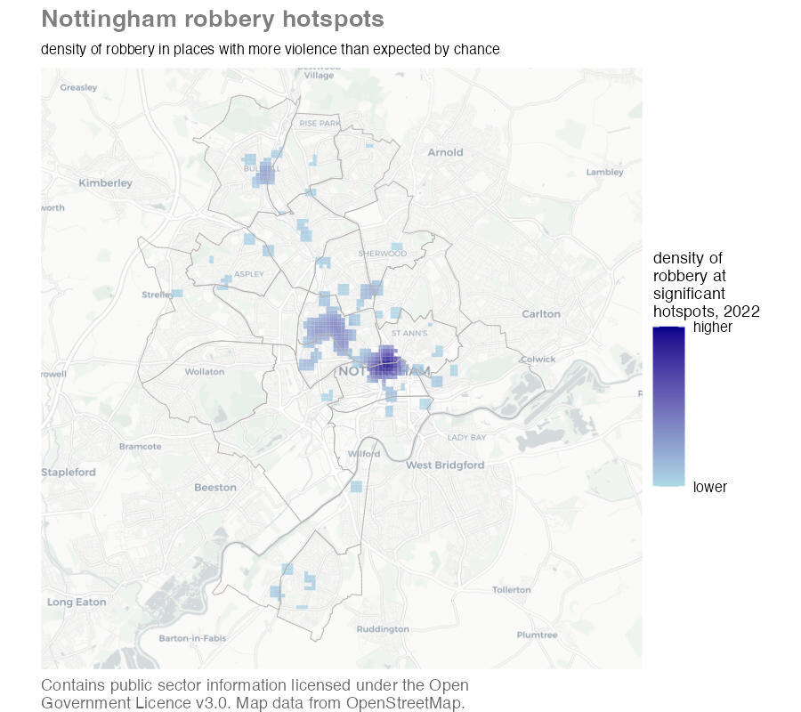

---
execute:
  freeze: auto
---

# Mapping hotspots {#sec-mapping-hotspots}


::: {.abstract}
In this chapter we will learn three techniques for better understanding hotspots of crime. We will learn what a crime hotspot is and how to use R to identify hotspots and plot them on maps. We will also learn how to better understand spatial concentrations in crime risk using dual kernel density estimation.
:::


::: {.callout-tip title="Before you start"}

1. Open Positron or -- if you already have Positron open -- start a new R session by clicking the **Restart R** (**&#10227;**) button in the **Console** panel. This makes sure no code you ran previously will interfere with the work you do in this chapter.
2. Make sure you are working in the crime mapping project workspace you created in @sec-create-project. In the top-right corner of the Positron window, you should see a folder icon and the words `crime_mapping`. If not, click the **File** menu, then **Open Folder ...** and choose the `crime_mapping` folder.
:::


## What is a hotspot?

Crime is heavily concentrated in several different ways. A small number of offenders commit a large proportion of crime (even though most people commit minor offences occasionally) and a small number of people are repeatedly victimised. For most types of crime, a large proportion of crime occurs in a small number of places. **A hotspot is a specific location or small area where an unusual amount of criminal activity occurs**.

Crime hotspots can occur in several different forms. Watch this video to understand why hotspots are important in understanding and responding to crime.



::: {.callout-transcript .callout collapse="true" icon="false" title="Video transcript: Hot Spots of Crime and Crime Prevention"}



:::

Some places are *chronic* hotspots -- they have more crime than surrounding areas over a sustained period (which may appear to be permanent). Chronic hotspots are often generated by a facility that draws vulnerable people into an area, such as a tourist attraction that draws crowds of people who are vulnerable to pickpocketing. Other places are *acute* hotspots, in which crime increases in a place that previously experienced no or few crimes. This may be the result of some change in the environment or how it's managed, such as new management that ignores drug dealing at a bar that the previous owners would have not tolerated.

When analysing hotspots, it is best to focus on *small* areas such as an apartment block, a shopping centre, a park or a single street. Focusing on smaller areas is important because resources to respond to crime are almost always limited, so it is important that those resources are directed where the problem is worst. 

Analysing larger areas, such as a neighbourhood or a police sector, is much more difficult because larger areas are always made up of many smaller areas, each of which might be quite different from one another. This means that the factors causing one street to be a hotspot might be quite different from the factors that make another street in the same district into a hotspot. Conflating different problems with different causes makes it much harder to find effective ways to reduce crime in any one place. 

These difficulties can be avoided (at least partly) by keeping hotspots small: in an urban area, a useful rule of thumb is that you should be able to stand in the middle of a hotspot and see the whole hotspot area.

Being able to identify hotspots using crime mapping is important because it forms a vital first step in many place-focused responses to crime. As an example of this, watch this video about how police in Philadelphia worked with researchers to use crime mapping to identify where to deploy foot patrols to reduce crime.




::: {.callout-transcript .callout collapse="true" icon="false" title="Video transcript: Philadelphia Foot Patrol Experiment"}



:::


In this chapter we will learn how to make maps that could be useful in identifying and responding to hotspots of crime. Among other maps, we will create this map showing hotspots of robbery in Nottingham, England.


```{r}
#| label: make-robbery-map
#| eval: false
#| echo: false
# This code is not shown to students; it generated the opening example map
nottingham <- here("data", "raw", "nottingham_wards.gpkg") |>
  read_sf() |>
  st_transform("EPSG:27700")

robbery_gi <- here("data", "raw", "nottingham_robbery.csv.gz") |>
  read_csv() |>
  st_as_sf(coords = c("longitude", "latitude"), crs = "EPSG:4326") |>
  st_transform("EPSG:27700") |>
  hotspot_gistar(cell_size = 100, bandwidth_adjust = 0.25) |>
  filter(gistar > 0, pvalue < 0.05) |>
  hotspot_clip(nottingham)

nottingham_robbery_map <- ggplot() +
  annotation_map_tile(type = "cartolight", zoomin = 0, progress = "none") +
  geom_sf(
    aes(fill = kde),
    data = robbery_gi,
    alpha = 0.8,
    colour = NA
  ) +
  geom_sf(data = nottingham, colour = "grey70", fill = NA) +
  scale_fill_gradient(
    low = "lightblue",
    high = "darkblue",
    breaks = range(pull(robbery_gi, kde)),
    labels = c("lower", "higher")
  ) +
  fixed_plot_aspect() +
  labs(
    title = "Nottingham robbery hotspots",
    subtitle = str_glue(
      "density of robbery in places with more robberies than expected by ",
      "chance"
    ),
    # Don't forget to add the licence statement -- it's a legal requirement!
    caption = str_wrap(
      str_glue(
        "Contains public sector information licensed under the Open ",
        "Government Licence v3.0. Map data from OpenStreetMap."
      ),
      width = 60
    )
  ) +
  theme_void() +
  theme(
    legend.text = element_text(size = rel(0.7)),
    legend.title = element_text(size = rel(0.8)),
    plot.caption = element_text(colour = "grey40", hjust = 0),
    plot.subtitle = element_text(
      margin = margin(t = 6, b = 6),
      size = rel(0.7)
    ),
    plot.title = element_text(colour = "grey50", face = "bold", size = rel(1.2))
  )

ggsave(
  here::here("images/nottingham_robbery_map.jpg"),
  nottingham_robbery_map,
  width = 900 / 150,
  height = 800 / 150,
  dpi = 150
)
```

<p class="full-width-image"></p>

In this chapter, we will learn how to:

- understand what crime hotspots are and why analysts usually study them at small geographic scales;
- distinguish crime density from crime risk;
- identify a suitable population at risk for a particular type of crime;
- estimate and map crime risk using dual kernel density estimation;
- distinguish apparent concentrations from statistically significant hotspots; and
- identify and map significant spatial clusters using the Getis-Ord Gi\* statistic.

You will complete two analyses in this chapter. Save the dual-KDE analysis in `chapter_13a.R` and the Gi\* analysis in `chapter_13b.R`, both inside the `R` folder of the workspace you created in @sec-create-project. Remember to run each block of code that you add to a script by pressing .


::: {.callout-quiz .callout title="Crime hotspots"}

```{r}
#| label: why-maps-quiz
#| echo: false

hotspot_quiz1 <- c(
  "Crime is extremely geographically concentrated – we can expect half of crime to be concentrated in about 1% of micro places",
  answer = "Crime is very geographically concentrated – we can expect half of crime to be concentrated in about 5% of micro places",
  "Crime is slightly geographically concentrated – we can expect half of crime to be concentrated in about one quarter of micro places",
  "Crime is usually not geographically concentrated at micro places"
)
```

**Which one of these statements is true?**

`r webexercises::longmcq(hotspot_quiz1)`


:::


## Showing the density of risk

In @sec-mapping-area-data we learned how to produce maps showing the *incidence rate* of crime by dividing the number of crimes by a measure of the population at risk of being targeted. We will often only have population estimates for areas, such as census estimates of the number of people living in an area. But for some crimes we have access to estimates of the people (or, more often, objects) at risk of being a target of a particular crime. In these cases, we can produce better maps of the risk of crime in different areas by producing a *dual KDE* map that shows the density of crime *risk* in different places.

To create a dual KDE map, we must estimate the density of crime and compare it to an estimate the density of the population at risk. Since an incidence rate is calculated as the number of crimes divided by the number of people or objects at risk, we can calculate the density of risk by dividing the density of crime estimated for each cell in the grid by the density of population estimated for the same cell. The `hotspot_dual_kde()` function from the sfhotspot package does this for us.

To illustrate making a dual KDE map, we will use reports of burglaries in three wards in Nottingham in 2020. Since the essential element of the crime of burglary in England is that an offender enters a _building_ as a trespasser in order to steal something, the best measure of the population at risk of burglary is the number of _buildings_ in each area (the definition of burglary is more complicated than this, but we don't need to worry about that here). 


::: {.callout-tip collapse="true" title="What's the difference between theft, burglary and robbery?"}

Definitions of crime vary between countries. But theft (sometimes called _larceny_) is usually defined as the act of dishonestly taking property belonging to another person while intending to keep (not just borrow) the property or treat it as the offender's own. Shoplifting, bike theft, car theft and pickpocketing are all types of theft.

Burglary and robbery are both special types of theft. A burglary is a theft committed inside a building that the offender does not have the owner's permission to be in. The most obvious type of burglary is when an offender breaks into a victim's home and steals valuables from inside. But burglary can also be committed in non-residential buildings: some types of business are frequent targets of burglary.

A robbery is a theft in which the offender uses violence or the threat of violence against the victim. It is important to remember that burglary and robbery are separate crimes. Since robbery requires (the threat of) violence against a person, robbery risk is usually described in terms of the number of robberies for a certain number of _people_. Burglary, on the other hand, can only take place in a building, so burglary risk is usually described in terms of the number of burglaries for a certain number of _premises_.
:::


Burglary is a good example of why the routine activities approach to thinking about crime that we introduced in @sec-getting-started emphasises thinking about _targets_ of crime rather than focusing only on crime _victims_. In the case of burglary, one person might be the owner of a large number of buildings (e.g. a farm with lots of out-buildings) or lots of people might own a single building (such as a house converted into flats). By thinking about the targets that are attacked by offenders, we can identify that burglary rates should be calculated based on buildings rather than, for example, residential population. Note that if our crime data only included _residential_ burglaries then we would want to use _residential_ buildings as our denominator, but in this case we have data for all burglaries, both residential and non-residential.


### Data wrangling

Before we can create our dual KDE layer, we have to complete some data wrangling. We will extract the boundaries for the wards of interest from a dataset of boundaries for all wards in Nottingham using `filter()` as we have done previously. To extract only the burglaries occurring in those three wards from a dataset of all burglaries in Nottingham, we will use `hotspot_clip()`. We will also transform both datasets to use the British National Grid (EPSG:27700), a projected CRS whose coordinates are measured in metres. Using a projected CRS makes it easy to specify a grid-cell size in metres. See @sec-choosing-projected-crs for how to choose an appropriate projected CRS.

Open `chapter_13a.R` in the `R` folder of your `crime_mapping` workspace. Add this code to download the original datasets into `data/raw`, load the local copies and prepare them for analysis.


```{r}
#| eval: false
#| filename: "chapter_13a.R"

# Load packages
pacman::p_load(here, httr2, osmdata, sf, sfhotspot, tidyverse)

# Download the original data
request(
  "https://mpjashby.github.io/crimemappingdata/nottingham_wards.gpkg"
) |>
  req_perform(path = here("data", "raw", "nottingham_wards.gpkg"))

request(
  "https://mpjashby.github.io/crimemappingdata/nottingham_burglary.csv.gz"
) |>
  req_perform(path = here("data", "raw", "nottingham_burglary.csv.gz"))

# Load dataset of wards in Nottingham and choose the ones we want
wards <- here("data", "raw", "nottingham_wards.gpkg") |>
  read_sf() |>
  st_transform("EPSG:27700") |>
  filter(ward_name %in% c("Castle", "Lenton & Wollaton East", "Meadows"))

# Load dataset of burglaries and keep only those in the wards of interest
burglaries <- here("data", "raw", "nottingham_burglary.csv.gz") |>
  read_csv() |>
  st_as_sf(coords = c("longitude", "latitude"), crs = "EPSG:4326") |>
  st_transform("EPSG:27700") |>
  hotspot_clip(wards)
```


```{r}
#| include: false

# Load packages
pacman::p_load(here, httr2, osmdata, sf, sfhotspot, tidyverse)

request(
  "https://mpjashby.github.io/crimemappingdata/nottingham_wards.gpkg"
) |>
  req_perform(path = here("data", "raw", "nottingham_wards.gpkg"))

request(
  "https://mpjashby.github.io/crimemappingdata/nottingham_burglary.csv.gz"
) |>
  req_perform(path = here("data", "raw", "nottingham_burglary.csv.gz"))

# Load dataset of wards in Nottingham and choose the ones we want
wards <- here("data", "raw", "nottingham_wards.gpkg") |>
  read_sf() |>
  st_transform("EPSG:27700") |>
  filter(ward_name %in% c("Castle", "Lenton & Wollaton East", "Meadows"))

# Load dataset of burglaries and keep only those in the wards of interest
burglaries <- here("data", "raw", "nottingham_burglary.csv.gz") |>
  read_csv() |>
  st_as_sf(coords = c("longitude", "latitude"), crs = "EPSG:4326") |>
  st_transform("EPSG:27700") |>
  hotspot_clip(wards)
```


We do not have a source of open data for all the buildings in Nottingham, so we will use the osmdata package to get the locations of buildings from OpenStreetMap (OSM). You may remember from @sec-place-data that to do this we need to know which key (and possibly value) the OSM database uses for storing the locations of buildings. The OSM feature key for a building is 'building' and it is not necessary to specify a value (since we want to capture all types of building). The osmdata package expects data to use the WGS84 coordinate reference system, so we must also make sure any data sources we use are 
projected using that system (EPSG:4326).

Add this code to your R script and run it. The first time you run the code, it downloads building data from OpenStreetMap and saves a copy in `data/processed`. On later runs, it loads that saved copy so the analysis is faster and does not change if OpenStreetMap is updated.

```{r}
#| filename: "chapter_13a.R"

buildings_file <- here("data", "processed", "nottingham_buildings.rds")

if (file.exists(buildings_file)) {
  # If buildings data has already been downloaded, load it from the saved copy
  nottingham_buildings <- read_rds(buildings_file)
} else {
  # If buildings data has not been downloaded, get it from OpenStreetMap and
  # save a copy
  nottingham_buildings <- wards |>
    # Transform ward boundaries to CRS needed by `opq()`
    st_transform("EPSG:4326") |>
    # Calculate bounding box
    st_bbox() |>
    # Set up OSM query
    opq(timeout = 120) |>
    # Add type of feature to fetch
    add_osm_feature(key = "building") |>
    # Fetch features from OSM database
    osmdata_sf()

  write_rds(nottingham_buildings, buildings_file)
}
```

::: {.callout-tip title="Overpass API errors"}

The Overpass API used by `osmdata_sf()` is a shared online service. If you see an error such as `HTTP 429 Too Many Requests` or `HTTP 504 Gateway Timeout`, wait a few minutes and run the query again. Once the query succeeds, the saved copy means you will not need to contact the service again for this analysis.
:::

::: {.callout-note collapse="true" title="What does `if (file.exists(...))` do?"}
Almost all programming languages have a way of only executing code in certain circumstances. This is usually in the form of an `if` statement. If the condition in the parentheses after `if` is true, the code inside the first pair of curly braces is run. If the condition in the parentheses after `if` is false, the code inside the second pair of curly braces (after the word `else`) is run. 

In this case, the code in the parentheses (`file.exists(...)`) checks whether a file already exists on the computer the code is running on. If it does, the code inside the parentheses evaluates to `TRUE` and the code inside the first pair of curly braces is run to load the data in the existing file into R. If the file does not exist, the code inside the parentheses evaluates to `FALSE` and the code inside the second pair of curly braces is run to download the data from OpenStreetMap and save a copy.

There are many other ways to use `if` statements in R, but we won't need to use any of them in this book. If you are interested in learning more about `if` statements, see the [_R for Data Science_](https://r4ds.had.co.nz/flow-control.html) book by Hadley Wickham and Garrett Grolemund.
:::


```{r}
#| filename: "R Console"

nottingham_buildings
```


Looking at the `nottingham_buildings` object, we can see that OSM contains data on buildings stored as points, polygons and multipolygons (we can ignore the few linestrings tagged as buildings, since it doesn't make sense for a building to be represented as a line rather than a point or a polygon). 


::: {.callout-tip collapse="true" title="What is a multipolygon?"}

OpenStreetMap stores features in several different ways. The most basic types are points, lines and polygons. But there are also multipolygons (and multilines). These are features that represent complex structures such as clusters of buildings that are separate structures but are related to each other. For example, a hospital with several buildings might be represented in OpenStreetMap as a single multipolygon feature. A multipolygon might also be used to represent complex building shapes such as buildings with a courtyard or light well in the middle.
:::


Let's create a simple map of the results produced by `osmdata_sf()`, comparing them to the buildings shown on a base map to check that OSM has reasonable coverage of the buildings in these three wards. This code uses the `pluck()` function from the purrr package (part of the tidyverse) to extract the different elements from the `nottingham_buildings` object.


```{r}
#| filename: "R Console"
#| fig-asp: 1
#| out-width: "100%"
#| fig-alt: "A map comparing OpenStreetMap building points, polygons and multipolygons with the boundaries of three Nottingham wards"

# Initiate map and add building features stored as points
hotspot_map(
  pluck(nottingham_buildings, "osm_points"),
  basemap_type = "cartolight",
  colour = "green",
  size = 0.1
) +
  # Add building features stored as polygons
  geom_sf(
    data = pluck(nottingham_buildings, "osm_polygons"),
    colour = NA,
    fill = "blue"
  ) +
  # Add building features stored as multi-polygons
  geom_sf(
    data = pluck(nottingham_buildings, "osm_multipolygons"),
    colour = NA,
    fill = "darkred"
  ) +
  # Add ward boundaries so we can see how complete OSM data is within those
  # wards
  geom_sf(data = wards, colour = "red", fill = NA, linewidth = 1.25)
```


::: {.callout-important title="`osmdata_sf()` returns data for a bounding box"}

Remember that `osmdata_sf()` gets OSM data for the area covered by the _bounding box_ of the input feature, not the feature boundaries. This means some of the buildings returned by the code above will be outside the wards we are interested in. We will deal with that shortly.

:::


It looks like almost all the streets in the three wards we are interested in are lined with buildings in the OSM data, which is what we would expect of streets in an urban area. There are some streets without buildings in the top-left of the map, but these streets are outside our three wards so this does not matter.

We can also see from this map that the `r scales::comma(nrow(pluck(nottingham_buildings, "osm_points")))` point features in the OSM data (shown as green dots on the map) typically represent the corners of buildings that are also represented as polygons, so we know we can ignore the points layer within the OSM data.

Since the `hotspot_dual_kde()` function works on points, we need to merge the polygon and multipolygon layers, then convert the combined layer to points by calculating the centroid of each building. We will transform the building data to use the British National Grid before calculating centroids. Calculating centroids in an appropriate projected coordinate system is more reliable than calculating them from longitude and latitude coordinates.

Since we are only interested in buildings in three particular wards, we can also remove any buildings outside those wards using `hotspot_clip()`. Both the building centroids and the `wards` object will use the British National Grid.

Add this code to the `chapter_13a.R` file and run it.

```{r}
#| filename: "chapter_13a.R"

# Extract polygon/multipolygon layers and combine them into a single object
nottingham_building_centroids <- bind_rows(
  pluck(nottingham_buildings, "osm_polygons"),
  pluck(nottingham_buildings, "osm_multipolygons")
) |>
  # Transform to the same CRS as the `wards` object
  st_transform("EPSG:27700") |>
  # Convert polygons to points
  st_centroid() |>
  # Remove any points outside the wards of interest
  hotspot_clip(wards)
```


::: {.callout-tip collapse="true" title="What does the warning `st_centroid assumes …` mean?"}

You might have seen a warning saying `st_centroid assumes attributes are constant over geometries of x`. You will see this warning when you use the `st_centroid()` function. It is there to remind you that columns in the original data (which the SF package refers to as the _attributes_ associated with each spatial feature) refer to the polygon as a whole, but in the object produced by `st_centroid()` it will appear that the columns relate to the centroid point. In many cases this will not be a problem, but it could expose you to the ecological fallacy so it is sometimes useful to be reminded.
:::


### Calculating dual kernel density

We now have the object `burglaries` that contains the locations of each burglary in the three Nottingham wards that we are interested in, and the object `nottingham_building_centroids` that contains the centroids of each building in those three wards. We can use these layers to estimate the density of burglaries and buildings, then combine these to estimate the density of burglary risk.

`hotspot_dual_kde()` works in the same way as `hotspot_kde()`, except that it requires two datasets. In this case, that means one dataset of crime locations and one dataset of building locations. `hotspot_dual_kde()` will set the cell size and bandwidth automatically, but we can set them manually using the `cell_size`, `bandwidth_adjust` and `grid` arguments in the same way we have done for `hotspot_kde()`. In this case, we will use the `hotspot_grid()` helper function to create a grid based on the boundaries of the wards we are interested in. All the spatial objects we are going to use here have coordinates specified using the British National Grid because we have already transformed them, so we do not need to do any transformation here.


```{r}
#| filename: "chapter_13a.R"

# Estimate density of burglary risk
burglary_risk <- hotspot_dual_kde(
  burglaries,
  nottingham_building_centroids,
  bandwidth_adjust = 0.25,
  grid = hotspot_grid(wards, cell_size = 100),
  quiet = TRUE
) |>
  hotspot_clip(wards)
```


The `burglary_risk` object looks like this:


```{r}
#| filename: "R Console"

head(burglary_risk)
```


::: {.callout-note title="What does `NaN` mean?" collapse="true"}

You might recall from earlier in this chapter that by default, the value of the `kde` column in the object produced by `hotspot_dual_kde()` is calculated by dividing the density of burglary in each grid cell by the density of buildings in the same grid cell. There are two cases where this will produce a result that is not a finite number:

  * If, for a particular cell, the density of burglaries and density of buildings are both zero, dividing one by the other will produce the result `NaN`, for 'not a number'.
  * If the density of burglaries is greater than zero but the density of buildings is exactly zero, the result will be `Inf`, for 'infinite'.

Fortunately, `hotspot_map()` will deal with these non-finite values, so we don't need to worry about them.

:::

We can plot the estimate of the density of burglary risk using `hotspot_map()`. By controlling for the density of buildings, this map shows us where building owners *on average* face the highest risk of being burgled. This might be useful in working out, for example, which building owners should be offered visits from a crime-prevention advisor or funding to install crime-prevention measures.

Add this code to your script file and run it to produce a map:


```{r}
#| filename: "chapter_13a.R"
#| fig-asp: 1
#| out-width: "100%"
#| fig-alt: "A map of three Nottingham wards in which estimated burglary risk is overwhelmingly concentrated in one grid cell on the University of Nottingham campus"

hotspot_map(
  burglary_risk,
  basemap_type = "cartolight",
  caption = str_glue(
    "Contains public sector information licensed under the Open ",
    "Government Licence v3.0"
  )
) +
  # Add ward boundaries
  geom_sf(data = wards, fill = NA) +
  labs(
    title = "Burglary risk in south-west Nottingham",
    subtitle = str_glue(
      "dual kernel density of burglary risk in Castle, Lenton & Wollaton ",
      "East and Meadows wards"
    ),
    fill = "density of burglary risk, 2020"
  ) +
  theme(
    legend.position = "bottom",
    plot.caption = element_text(colour = "grey40"),
    plot.subtitle = element_text(margin = margin(t = 6, b = 6)),
    plot.title = element_text(colour = "grey50", face = "bold", size = 16)
  )
```


Save `chapter_13a.R` by pressing . To check that the analysis is reproducible, restart R using the **Restart R** (**&#10227;**) button in Positron's R Console panel, then run the script from beginning to end. Keep the script in the `R` folder, the original downloads in `data/raw` and the saved OpenStreetMap data in `data/processed`.

Your complete `chapter_13a.R` dual-KDE script should now look like this:

```{r}
#| file: "../R/chapter_13a.R"
#| eval: false
#| filename: "chapter_13a.R"
```


::: {.callout-quiz .callout title="Dual kernel density"}

```{r}
#| label: dual-kde-quiz
#| echo: false

dual_kde_quiz1 <- c(
  answer = "`hotspot_dual_kde()` can transform longitude and latitude coordinates automatically, but a suitable projected CRS makes it easier to specify distances in metres.",
  "`hotspot_dual_kde()` can only work with longitude and latitude coordinates.",
  "`hotspot_dual_kde()` requires projected coordinates even when cell sizes and bandwidths are chosen automatically.",
  "The coordinate reference system never matters when using `hotspot_dual_kde()`."
)

dual_kde_quiz2 <- c(
  "To make our maps look nicer.",
  "To transform the coordinate system our data uses from the system `hotspot_dual_kde()` uses to the one we need to produce a map.",
  answer = "To eliminate any areas that we do not have data for, since displaying KDE values for such areas on a map might be misleading.",
  "To make it easier to see the other layers on our map."
)
```


**Which *one* of these statements is true?**

`r webexercises::longmcq(dual_kde_quiz1)`


**Why do we usually clip the result of `hotspot_dual_kde()` using `hotspot_clip()`?**

`r webexercises::longmcq(dual_kde_quiz2)`


:::


## Finding hotspots using Gi*

We have explored how to produce a better map of the density of crime in different areas. But how do we know which areas count as hotspots and which don't?


Each of the 16 density maps below shows density estimates based on 1,000 points placed completely at random on 16 different maps. There are no real patterns in the data except for statistical noise. Nevertheless, the KDE process makes it appear that there are patterns in the data.


```{r}
#| label: random-map
#| echo: false
#| fig-asp: 1
#| fig-align: "center"
#| fig-alt: "Sixteen kernel-density maps made from randomly generated points; every map appears to contain clusters even though the points were generated without a spatial pattern"

tibble(
  x = runif(n = 1000 * 16, min = 0, max = 100),
  y = runif(n = 1000 * 16, min = 0, max = 100),
  group = rep(1:16, each = 1000)
) |>
  ggplot() +
  geom_density_2d_filled(aes(x, y), bins = 9) +
  scale_fill_brewer(
    labels = c("lower", rep("", 7), "higher"),
    palette = "Oranges",
    direction = 1,
    guide = guide_legend(reverse = TRUE)
  ) +
  facet_wrap(vars(group), ncol = 4) +
  coord_fixed() +
  labs(fill = "density") +
  theme_void() +
  theme(strip.text = element_blank())
```


This is a problem because we might end up responding to an apparent problem that is nothing but an artefact of the random variation that we expect to see in many processes, including crime.

If the police and other agencies looked at these patterns and did nothing in response to them, it is likely that over time some of the areas with high density would become areas of low density, and _vice versa_. However, the harm caused by crime means it is very hard for agencies to justify sitting back and do nothing to respond to it -- many people would consider it immoral to do so. So police and other agencies are very likely to try to respond to crime patterns, even if those patterns might have occurred by chance. This is very frustrating, because if we were to go back and look at the same data in a few months time it is very likely that the apparent hotspots would have shifted to somewhere different, making all the effort spent in responding to crime seem worthless (which, if the apparent patterns were actually artefacts of the KDE process, it may have been).

You might be thinking it's better safe than sorry, and that police should respond to the apparent patterns just in case they represent real concentrations in crime. But police resources are always scarce, so responding to one problem in one place means not responding to another problem in another place. This is known as the _opportunity cost_ of acting: if police focus their limited resources in one area, that comes at the cost of not being able to deploy those resources in other areas that might need it more.

We can try to avoid this problem of wasting resources responding to random variation in crime by determining whether the number of crimes in an area is more than the greatest number we would reasonably expect if there were no actual patterns in the data (if you have studied statistics before, you might recognise this as a description of a *null hypothesis*, but you don't need to have studied statistics to apply the techniques in this book).

To determine if the number of crimes in each area is greater than we would expect by chance, we can use the *Getis-Ord Gi\* statistic* (also called the *local G* statistic, spoken out-loud as the *G-I star statistic*). If the Gi* statistic for an area is greater than a certain value, we can say that the number of crimes in that area is higher than we would expect if there were no patterns in the data. We will call areas with more crimes than we would expect by chance as _hotspots_.

We can calculate the Gi* statistic using the `hotspot_gistar()` function from the sfhotspot package. This works in a similar way to the `hotspot_kde()` function, in that it takes an SF object of the locations of crimes and returns an SF object with a grid of cells, along with the Gi* value for each grid cell. Like `hotspot_kde()`, `hotspot_gistar()` will choose default values for several ways in which we could fine-tune the calculation of the Gi* statistic, but we could override these defaults if we wanted to.

Create a new file called `chapter_13b.R` in the `R` folder of your `crime_mapping` workspace as usual.

In this example, we will find the hotspots of robbery in Nottingham in 2020, based on a grid of 100-metre cells. We will store this in an object called `robbery`, transform it to use the British National Grid coordinate system (so we can specify the cell size in metres) and then use the resulting object to calculate the Gi* values.

Add this code to the new script file and run it.

```{r}
#| eval: false
#| filename: "chapter_13b.R"

# Prepare ----------------------------------------------------------------------

# Load packages
pacman::p_load(here, httr2, sf, sfhotspot, tidyverse)

# Download the original data
request(
  "https://mpjashby.github.io/crimemappingdata/nottingham_robbery.csv.gz"
) |>
  req_perform(path = here("data", "raw", "nottingham_robbery.csv.gz"))

request(
  "https://mpjashby.github.io/crimemappingdata/nottingham_wards.gpkg"
) |>
  req_perform(path = here("data", "raw", "nottingham_wards.gpkg"))

# Load Nottingham robbery data
robbery <- here("data", "raw", "nottingham_robbery.csv.gz") |>
  read_csv() |>
  st_as_sf(coords = c("longitude", "latitude"), crs = "EPSG:4326") |>
  st_transform("EPSG:27700")
nottingham_wards <- here("data", "raw", "nottingham_wards.gpkg") |>
  read_sf() |>
  st_transform("EPSG:27700")


# FIND HOTSPOTS ----------------------------------------------------------------

# Calculate Gi* statistic
robbery_gistar <- robbery |>
  hotspot_gistar(cell_size = 100, bandwidth_adjust = 0.25, quiet = TRUE) |>
  filter(gistar > 0, pvalue < 0.05) |>
  hotspot_clip(nottingham_wards)
```

```{r}
#| echo: false

# Prepare ----------------------------------------------------------------------

# Load packages
pacman::p_load(here, httr2, sf, sfhotspot, tidyverse)

request(
  "https://mpjashby.github.io/crimemappingdata/nottingham_robbery.csv.gz"
) |>
  req_perform(path = here("data", "raw", "nottingham_robbery.csv.gz"))

request(
  "https://mpjashby.github.io/crimemappingdata/nottingham_wards.gpkg"
) |>
  req_perform(path = here("data", "raw", "nottingham_wards.gpkg"))

# Load data and transform to British National Grid, which is easier to work with
# for functions that use spatial units such as metres
robbery <- here("data", "raw", "nottingham_robbery.csv.gz") |>
  read_csv() |>
  st_as_sf(coords = c("longitude", "latitude"), crs = "EPSG:4326") |>
  st_transform("EPSG:27700")
nottingham_wards <- here("data", "raw", "nottingham_wards.gpkg") |>
  read_sf() |>
  st_transform("EPSG:27700")


# FIND HOTSPOTS ----------------------------------------------------------------

# Calculate Gi* statistic
robbery_gistar <- robbery |>
  hotspot_gistar(cell_size = 100, bandwidth_adjust = 0.25, quiet = TRUE) |>
  filter(gistar > 0, pvalue < 0.05) |>
  hotspot_clip(nottingham_wards)
```


Instead of using `head()` to view the first few rows of the object we have just created, let's use the `slice_sample()` function from the dplyr package to return a random sample of rows from that object:


```{r}
#| filename: "R Console"

slice_sample(robbery_gistar, n = 10)
```


The `robbery_gistar` object contains one row for each cell in a grid of cells covering the area of the robbery data. Each row has four columns:

  * `n` shows the number of robberies that occurred in that grid cell,
  * `kde` shows the density of robberies in that cell,
  * `gistar` shows the Gi* value for that cell, and
  * `pvalue` shows the $p$-value for that cell.

The Gi* statistic is an example of a more general group of statistics called $Z$ *scores*. Statisticians and data analysts compare the $Z$ scores produced by statistical procedures such as `hotspot_gistar()` to reference values to decide if a $Z$ score is large enough to be treated as statistically significant, i.e. if it is large enough to conclude that it is larger than we would expect if there were no actual patterns in the data. Deciding on the right reference value to compare a $Z$ score to can be difficult because of what's known as the multiple comparison problem (which we don't need to go into detail about). Fortunately, the values in the `pvalue` column have already been automatically adjusted to take account of the multiple comparison problem, so we can interpret the $p$-values instead of interpreting the Gi* statistic directly.


::: {.callout-important title="Clip data before calculating Gi* values"}
Since Gi* is a relative measure, if you want to produce a map that shows only a part of the area covered by your data (for example you have data for a county but want to produce a map showing only a town within that county), you should clip the data to the area of interest _before_ calculating the Gi* values, as well as clipping afterwards if necessary. This is because if you calculate the Gi* values for a large area and then clip the results to a smaller area, the Gi* values will be influenced by the large areas with no crime and all of the smaller area is likely to be identified as a hotspot.
:::


By convention, $p$-values are considered to be significant if they are _less than 0.05_. So if $p<0.05$, we can say that the local concentration of robberies in a given grid cell and its neighbours is unlikely to have occurred by chance. Values of Gi* greater than zero indicate cells with more robberies than expected and values of Gi* less than zero indicate cells with fewer robberies than expected. We can combine these two values to find cells with significantly _more_ robberies than expected by chance, which are those cells for which $Z>0$ and $p<0.05$. 

By default, if we apply the function `hotspot_map()` to a result produced by `hotspot_gistar()`, the map will show only those grid cells with a Gi* value that is significant (i.e. $p<0.05$). However, the default settings also mean that the map will show cells that are significant hotspots (i.e. $Z>0$) and cells that are significant coldspots (i.e. $Z<0$). In crime mapping we are generally only interested in the hotspots rather than the coldspots. To show only significant hotspots, we can use the `hotspot_map()` argument `sign = "hot"`.

Let's make a map to see what the significant robbery hotspots look like:

```{r}
#| filename: "R Console"
#| fig-asp: 1.4
#| out-width: "100%"
#| fig-alt: "A map of Nottingham in which significant robbery-hotspot cells are shaded from light to dark blue according to robbery density"

hotspot_map(
  robbery_gistar,
  basemap_type = "cartolight",
  sign = "hot",
  caption = str_glue(
    "Contains public sector information licensed under the Open ",
    "Government Licence v3.0."
  )
) +
  # Add ward boundaries
  geom_sf(data = nottingham_wards, colour = "grey70", fill = NA) +
  labs(title = "Nottingham robbery hotspots")
```

This map could be useful for police officers deciding where to conduct anti-robbery patrols, because it not only shows the areas with the highest density of robberies but only shows those areas if there are more robberies than we would expect by chance. This makes it more likely that officers won't waste time chasing apparent patterns that are actually the result of random variation.

Save `chapter_13b.R` by pressing . Your complete `chapter_13b.R` Gi\* script should now look like this:

```{r}
#| file: "../R/chapter_13b.R"
#| eval: false
#| filename: "chapter_13b.R"
```

Running the complete script produces this map:

```{r}
#| echo: false
#| fig-asp: 1
#| out-width: "100%"
#| message: false
#| fig-alt: "A map of Nottingham in which significant robbery-hotspot cells are shaded from medium to dark blue according to robbery density"

source(here("R", "chapter_13b.R"))
```

::: {.callout-quiz .callout title="Gi*"}

```{r}
#| label: gistar-quiz
#| echo: false

gistar_quiz1 <- c(
  answer = "`filter(robbery_gi, pvalue < 0.05)`",
  "`filter(robbery_gi, pvalue > 0.05)`",
  "`filter(robbery_gi, pvalue <= 0.05)`",
  "`filter(robbery_gi, pvalue == 0.05)`"
)

gistar_quiz2 <- c(
  "Cells with `gistar > 0` are always statistically significant hotspots.",
  answer = "A significant hotspot has `gistar > 0` and `pvalue < 0.05`.",
  "A significant hotspot has `gistar < 0` and `pvalue > 0.05`.",
  "The `kde` value alone tells us whether a cell is a statistically significant hotspot."
)
```

**`robbery_gi` is an object storing a result produced by the `hotspot_gistar()` function. Which of these pieces of code could be used to extract _only_ those rows in the data with significant p-values?**

`r webexercises::longmcq(gistar_quiz1)`


**Which *one* of these statements is true about the output from `hotspot_gistar()`?**

`r webexercises::longmcq(gistar_quiz2)`


:::


## Finding clusters using DBSCAN

Gi* maps are a useful way to show where there is more of a particular type of crime than we'd expect by chance. But since resources to respond to crime are almost always limited, it is often also useful to be able to rank clusters of crime so that we can see which should be prioritised for a response. One way to do this is to use a clustering algorithm called DBSCAN, which stands for 'Density-Based Spatial Clustering of Applications with Noise' (you don't need to remember that). 

DBSCAN identifies clusters of crimes based on their spatial proximity to each other, finding places where crimes are more closely clustered together in space than a cut-off value that we specify. For example, this map shows the top clusters of robbery in Nottingham in 2020:


```{r}
#| label: dbscan-robbery-map
#| file: "../R/chapter_13c.R"
#| echo: false
#| out-width: "100%"
```


We can use the `hotspot_dbscan()` function from the sfhotspot package to identify clusters using DBSCAN in R. In a similar way to how the results produced by `hotspot_kde()` are influenced by the choice of bandwidth and cell size (see @sec-kde), the results produced by `hotspot_dbscan()` are influenced by two values (known as _parameters_) that we specify.

The first value that influences the results of `hotspot_dbscan()` is `min_pts`, the minimum number of nearby points required for a location to form the core of a cluster. Note that an area won't be identified as a cluster just because it includes the specified minimum number of points -- the points also have to be close enough together to be considered a cluster (more on that shortly). `min_pts` therefore provides a _minimum_ cut-off value for the number of points in each cluster.

By default, `hotspot_dbscan()` chooses `min_pts` automatically based on the total number of points in the dataset. For very small datasets, the default value of `min_pts` is 5. As the dataset becomes larger, the automatically selected value for `min_pts` gradually increases, up to a maximum of 50. Increasing `min_pts` for larger datasets helps to avoid producing a very large number of clusters that each contain only a very-small proportion of all the crimes being studied.

Whether the automatically chosen value is reasonable depends on the type of crime you are mapping and the purpose of the analysis. If you were mapping relatively rare crimes, such as homicides in many cities, a cluster of 5 crimes might be important to identify. If you were mapping a frequent crime such as pickpocketing in central London or downtown New York City, you might only be interested in clusters containing many more crimes. Since the resources available to respond to crime are almost always limited, producing too many clusters is often unhelpful. You can override the automatically chosen value by supplying your own value for `min_pts`, so think carefully about the minimum number of crimes in a cluster that you or the audience for your analysis are likely to find useful.

These maps show the results produced by applying `hotspot_dbscan()` to the same Nottingham robbery data we used above. All that changes is each time is the value of `min_pts`. You can see that the number and size of the clusters produced varies quite substantially.

```{r}
#| label: dbscan-minpts
#| echo: false
#| out-width: "100%"

c(5, 10, 20) |>
  set_names() |>
  map(\(x) hotspot_dbscan(robbery, min_pts = x, quiet = TRUE)) |>
  bind_rows(.id = "min_pts") |>
  mutate(
    clusters = length(rank),
    contents = sum(n),
    .by = min_pts
  ) |>
  mutate(
    min_pts = fct_reorder(
      str_glue(
        "`min_pts = {min_pts}`\n produces {clusters} clusters\ncontaining ",
        "{scales::percent(contents / sum(n), accuracy = 1)} of points"
      ),
      parse_number(min_pts)
    )
  ) |>
  ggplot() +
  geom_sf(data = robbery, alpha = 0.05) +
  geom_sf(alpha = 0.7, fill = NA) +
  geom_sf_label(
    aes(label = scales::ordinal(rank)),
    alpha = 0.75,
    fill = "white",
    linewidth = 0,
    size = 2.5
  ) +
  facet_wrap(vars(min_pts), ncol = 3) +
  theme_void()
```


You can see from this map that the clusters produced by DBSCAN don't necessarily include all the points in the input data. The points that are outside the identified clusters are those that are not sufficiently close together to be part of a cluster. You can also see that the clusters produced by DBSCAN can sometimes overlap.

The second parameter that affects the results produced by `hotspot_dbscan()` is called `eps`. This parameter controls how close together points must be to be treated as neighbours within a cluster. You can specify `eps` manually using the `eps` argument, but it's often easier to control it relative to the default value chosen by `hotspot_dbscan()`. By default, `hotspot_dbscan()` chooses a suitable value automatically based on the typical local density of points in the dataset. The `density_adjust` argument controls how dense the number of crimes in an area must be (relative to that typical density) in order for the area to be considered a cluster. The default value is `density_adjust = 2`, which means `hotspot_dbscan()` searches for clusters with approximately at least twice the typical local density of points. Setting larger values of `density_adjust` identifies only denser concentrations of points, while smaller values allow clusters to be less dense.

You can see the effect of varying the `density_adjust` argument on the results shown in these maps:


```{r}
#| label: dbscan-densityadjust
#| echo: false
#| out-width: "100%"

c(1, 2, 4) |>
  set_names() |>
  map(
    \(x) hotspot_dbscan(robbery, min_pts = 10, density_adjust = x, quiet = TRUE)
  ) |>
  bind_rows(.id = "density_adjust") |>
  mutate(
    clusters = length(rank),
    contents = sum(n),
    .by = density_adjust
  ) |>
  mutate(
    density_adjust = fct_reorder(
      str_glue(
        "`density_adjust = {density_adjust}`\n produces {clusters} ",
        "clusters\ncontaining ",
        "{scales::percent(contents / sum(n), accuracy = 1)} of points"
      ),
      parse_number(density_adjust)
    )
  ) |>
  ggplot() +
  geom_sf(data = robbery, alpha = 0.05) +
  geom_sf(alpha = 0.7, fill = NA) +
  geom_sf_label(
    aes(label = scales::ordinal(rank)),
    alpha = 0.75,
    fill = "white",
    linewidth = 0,
    size = 2.5
  ) +
  facet_wrap(vars(density_adjust), ncol = 3) +
  theme_void()
```


Higher values of `density_adjust` produce physically smaller hotspots that have higher densities of crime but collectively contain a smaller proportion of all crimes. It's important to note that the objective in clustering crime is rarely to produce clusters that jointly cover all the crimes in a dataset. In most applications of crime analysis, what matters more is producing clusters that show where interventions against crime are likely to achieve the most benefit while keeping the required effort manageable within the available resources. 

While you should set `min_pts` based on your expert judgement of the minimum number of crimes that might be worthy of action, deciding on the best value of `density_adjust` is usually a matter of trial and error. As a starting point, it's often useful to produce a DBSCAN map using the default `density_adjust = 2` and look at the results, then vary `density_adjust` up or down depending on how useful you think the results are likely to be in supporting the purpose of your analysis. This inevitably involves some skill, which you will develop with time and experience. In particular, it is important (as in all data analysis) to understand the purpose for which you are conducting analysis, and how people are going to use the results of the analysis you produce.

Now that we have explored how to control the DBSCAN algorithm, let's create a DBSCAN map in R. We'll use the same robbery data as in the previous section. Create a new file called `chapter_13c.R` and save it in the `R` folder of your `crime_mapping` workspace as usual. Now add the code needed to load the packages and data we need, so that it's possible to run this script independently of the other scripts in this chapter. Read the two notes below this code, which explain two minor differences between this code and most of the similar code we have used before.

```{r}
#| filename: "chapter_13c.R"
#| eval: false

# This script identifies clusters of robberies in Nottingham, England

# Load packages
pacman::p_load(ggspatial, here, httr2, sf, sfhotspot, tidyverse)


# LOAD DATA --------------------------------------------------------------------

# Download the original data
request(
  "https://mpjashby.github.io/crimemappingdata/nottingham_robbery.csv.gz"
) |>
  req_perform(path = here("data", "raw", "nottingham_robbery.csv.gz")) |>
  # Stop this command from producing an output in the R Console
  invisible() #<1>

# Load data and transform to British National Grid so distances are in metres
robbery <- here("data", "raw", "nottingham_robbery.csv.gz") |>
  read_csv(show_col_types = FALSE) |> #<2>
  st_as_sf(coords = c("longitude", "latitude"), crs = "EPSG:4326") |>
  st_transform("EPSG:27700")
```
1. The `invisible()` function is used to prevent the output of the `req_perform()` command from being printed in the R Console. This is because the output is not useful for our purposes, and we want to keep the R Console clean and focused on the results that are relevant to our analysis.
2. The `show_col_types = FALSE` argument is used in the `read_csv()` function to suppress the printing of column types in the R Console. This is because we already know the column types from the previous analysis, and we want to keep the R Console clean and focused on the results that are relevant to our analysis.

`hotspot_dbscan()` operates in a similar way to the other hotspot functions we have already used. Let's start by keeping all the arguments at their default values. We will store the result in an object called `robbery_dbscan`.


```{r}
#| filename: "chapter_13c.R"

# FIND CLUSTERS ----------------------------------------------------------------

# Find clusters using DBSCAN
robbery_dbscan <- hotspot_dbscan(robbery)
```

You can see that `hotspot_dbscan()` tells us the values of `min_pts` and `eps` that it has chosen automatically. Let's use `hotspot_map()` to produce a quick map of the clusters that have been identified.

```{r}
#| filename: "R Console"

hotspot_map(robbery_dbscan, basemap_type = "cartolight")
```

You can see from this map that by default, `hotspot_dbscan()` has identified `r nrow(robbery_dbscan)` clusters. Let's inspect the `robbery_dbscan` object in the R Console:


```{r}
#| filename: "R Console"
robbery_dbscan
```

The `rank` column in the `robbery_dbscan` object shows the rank of each cluster, with the cluster containing the most robberies ranked 1, the cluster containing the second most robberies ranked 2, and so on. The `n` column shows the number of robberies in each cluster, while the `prop` column shows the proportion of all robberies in Nottingham in 2020 that are contained in each cluster. 

You can see from the `prop` column that `r scales::percent(pluck(robbery_dbscan, "prop", 1), accuracy = 0.1)` of all robberies in Nottingham in 2020 have been included in the cluster with rank 1. You can also see from the map above that that cluster covers quite a large section of the city. That's probably not very useful for police officers trying to decide where to patrol, or local officials deciding whether to focus crime-prevention initiatives. It will probably be more useful to identify smaller clusters that contain the the very highest densities of robbery, even if those clusters cover a smaller proportion of all robberies. To do that, we can increase the value of `density_adjust` to 5, which will identify clusters that are at least five times as dense as the typical local density of robberies in Nottingham in 2020.

Change the existing code that creates the `robbery_dbscan` object in `chapter_13c.R` to the following and run it:

```{r}
#| filename: "chapter_13c.R"

robbery_dbscan <- hotspot_dbscan(robbery, density_adjust = 5)
```

If we now inspect this object in the R Console, we'll see it contains `r nrow(robbery_dbscan)` clusters and the highest-ranked cluster contains `r scales::percent(pluck(robbery_dbscan, "prop", 1), accuracy = 0.1)` of all the robberies. Let's plot that quickly using `hotspot_map()`:

```{r}
#| filename: "R Console"

hotspot_map(robbery_dbscan, basemap_type = "cartolight")
```

This time, we can see that the clusters cover a smaller area of the city, and tell us that any efforts to prevent robbery should be concentrated in the city centre.

There are several different ways we can represent DBSCAN clusters on a map. One option (which is what `hotspot_map()` does on the map above) is to shade each cluster according to how many crimes it contains. Another option (shown earlier in the maps that illustrate the effect of varying `min_pts` and `density_adjust`) is to show the outline of each cluster and label it, for example with the cluster rank (where the cluster with containing the most crimes is ranked 1, the cluster with the second most crimes is ranked 2, and so on).

This code produces a map that shows the outline of each cluster and the proportion of all robberies in Nottingham in 2020 that are contained within it. In particular, we use: 

* the `col_fill` argument of `hotspot_map()` to "none" to specify that we don't want each polygon to have a fill colour, which means the clusters will be outlined, and
* the `col_label` argument of `hotspot_map()` to "prop" to specify that we want to label each cluster with the proportion of all robberies in Nottingham in 2020 that are contained within it.

Add this code to `chapter_13c.R` and run it:


```{r}
#| filename: "chapter_13c.R"

# PLOT MAP ---------------------------------------------------------------------

hotspot_map(
  robbery_dbscan,
  col_fill = "none",
  col_label = "prop",
  colour = "red2",
  basemap_type = "cartolight",
  caption = str_glue(
    "Contains public sector information licensed under the\nOpen ",
    "Government Licence v3.0."
  )
) +
  labs(title = "Nottingham robbery clusters") +
  theme(
    plot.title = element_text(colour = "grey50", face = "bold", size = 16)
  )
```


It's also possible to vary how the outline of each cluster is represented. The underlying DBSCAN algorithm assigns points to clusters, but it doesn't produce the polygons returned by `hotspot_dbscan()`. Instead, by default `hotspot_dbscan()` returns polygons that indicate the _concave hull_ of all the points in each cluster. You might remember we learned about _convex_ hulls in @sec-clipping-map-layers. A concave hull is similar to a convex hull, but it can be more irregular in shape and can follow the outline of the points in a cluster more closely. How closely the outline follows the points depends on another argument to `hotspot_dbscan()` called `hull_ratio`. The default value is `hull_ratio = 0.75`, which means the concave hull will follow the outline of the points in a cluster moderately closely. If you set `hull_ratio = 1`, the concave hull will be the same as the convex hull, which (depending on the arrangement of the points) is sometimes a much larger (but simpler) shape that doesn't follow the outline of the points in a cluster as closely. Most of the time you will probably not vary `hull_ratio`, but it's important to remember that the outline of the polygons returned by `hotspot_dbscan()` is not necessarily a precise representation of the outline of the points in a cluster. This is often a good thing, since crimes in future probably won't occur at exactly the same locations as crimes in the past, so a more generalised outline of a cluster is often more useful than a precise outline. But it also means that you shouldn't read too much into whether (for example) a particular location falls just inside or just outside the outline of a cluster.

Save `chapter_13c.R` by pressing . Your complete `chapter_13c.R` DBSCAN script should now look like this:

```{r}
#| file: "../R/chapter_13c.R"
#| eval: false
#| filename: "chapter_13c.R"
```

Running the complete script produces this map:

```{r}
#| filename: "chapter_13c.R"
#| echo: false
#| fig-asp: 1
#| out-width: "100%"
#| message: false
#| fig-alt: "A map of central Nottingham clusters of areas with high densities of robbery are identified. The clusters are outlined in red and labelled with the proportion of all robberies in Nottingham in 2020 that are contained within each cluster"
```

To check that the analysis is reproducible, restart R using the **Restart R** (**&#10227;**) button in Positron's R Console panel, then run the script from beginning to end. Keep the script in the `R` folder and the original downloads in `data/raw`.


::: {.callout-quiz .callout title="DBSCAN"}

```{r}
#| label: dbscan-quiz
#| echo: false

dbscan_quiz1 <- c(
  "The maximum number of clusters that DBSCAN can identify",
  answer = "The minimum number of nearby points required for a location to form the core of a cluster",
  "The minimum distance that must separate two clusters",
  "The proportion of all points that must be included in clusters"
)

dbscan_quiz2 <- c(
  "Larger clusters that may collectively contain more of the input points",
  "More clusters, each containing exactly the value of `min_pts`",
  answer = "Smaller, denser clusters that may collectively contain fewer of the input points",
  "Clusters with more precise boundaries but otherwise identical contents"
)

dbscan_quiz3 <- c(
  "The density of robberies inside the cluster",
  "The proportion of the study area covered by the cluster",
  answer = "The proportion of all robberies in the input data contained in the cluster",
  "The probability that the cluster occurred by chance"
)
```

**What does the `min_pts` argument of `hotspot_dbscan()` specify?**

`r webexercises::longmcq(dbscan_quiz1)`


**Compared with a lower value, what will a higher value of `density_adjust` usually produce?**

`r webexercises::longmcq(dbscan_quiz2)`


**What does the `prop` column in the output from `hotspot_dbscan()` represent?**

`r webexercises::longmcq(dbscan_quiz3)`


:::


## Combining hotspot techniques

In this chapter we've learned to use three techniques that we can use alongside KDE mapping (@sec-mapping-patterns) that we can use to understand patterns of crime. Each technique has its own strengths and weaknesses, and you can use them either on their own or in combination. For example, we can use Gi* to identify areas with more crime than expected by chance, then use DBSCAN to identify the most dense clusters of crime within those areas. We can even show these two techniques on the same map.

Create a new file called `chapter_13d.R` in the `R` folder of your `crime_mapping` workspace as usual. Add all the code from the file `chapter_13b.R` to the new file except the code that creates the map itself. Now run the code in the new file to load all the data we will need and calculate the Gi* values.

Next, we should add the code needed to identify clusters of robbery using DBSCAN. Add this code to the new file and run it:

```{r}
#| filename: "chapter_13d.R"

robbery_dbscan <- hotspot_dbscan(robbery, density_adjust = 5)
```

We now need to create a map that has two hotspot layers, one on top of the other. We can't add together two separate calls to `hotspot_map()` because that would mean the second call would add a basemap that would cover the first layer. Instead, we can use the `hotspot_map()` function to create a map of the Gi* hotspots, then add a layer for the DBSCAN clusters using another function from the sfhotspot package: `hotspot_layer()`. This acts in a very similar way to `hotspot_map()`, except that it adds a layer to an existing map. Just like `hotspot_map()`, `hotspot_layer()` makes some choices about how to display a layer depending on what type of layer it is given. We can also control `hotspot_layer()` in a similar way to `hotspot_map()`. For example, we can use the `col_fill` and `col_label` arguments to control how the DBSCAN clusters are displayed on the map.

Add this code to your new file and run it:


```{r}
#| filename: "chapter_13d.R"
#| fig-asp: 1.4
#| out-width: "100%"

# PLOT MAP ---------------------------------------------------------------------

# Initiate map and add KDE layer for significant hotspots
hotspot_map(
  robbery_gistar,
  basemap_type = "cartolight",
  sign = "hot",
  caption = str_glue(
    "Contains public sector information licensed under the Open ",
    "Government Licence v3.0."
  )
) +
  # Add clusters
  hotspot_layer(
    robbery_dbscan,
    col_fill = "none",
    col_label = "prop",
    colour = "red2"
  ) +
  # Add ward boundaries
  geom_sf(data = nottingham_wards, colour = "grey70", fill = NA) +
  labs(title = "Nottingham robbery hotspots")
```

You can see that this map combines different techniques -- KDE, Gi* and DBSCAN -- to help people understand patterns of robbery in this city. 

Save `chapter_13d.R` by pressing . Your complete `chapter_13d.R` script should now look like this:

```{r}
#| file: "../R/chapter_13d.R"
#| eval: false
#| filename: "chapter_13d.R"
```


## In summary

In this chapter we have learned three more-advanced topics for understanding patterns of crime: dual-KDE maps to understand crime risks, Gi* maps to understand where there is more crime than we'd expect by chance, and DBSCAN maps to understand where crime is concentrated most heavily. You can use these techniques either on their own or in combination, for example by adding DBSCAN cluster labels on top of a KDE surface that has been clipped using Gi*.

We have practised how to:

- choose a suitable population at risk for a dual KDE;
- prepare crime and denominator data in an appropriate coordinate reference system;
- create and interpret a dual-KDE risk map;
- explain why an apparent pattern on a density map is not necessarily a hotspot;
- identify and map significant hotspots using Gi* values and their associated $p$-values; and
- identify the most dense clusters of crime using DBSCAN.


::: {.box .reading}

To find out more about the ideas and skills covered in this chapter, you may want to read:

- [a practical guide to understanding and responding to crime hotspots](https://popcenter.asu.edu/content/tool-guides-crime-and-disorder-hot-spots),
- [a recent review of evidence on the concentration of crime at micro places](https://doi.org/10.1016/j.avb.2024.101979), and
- [the introduction to the `sfhotspot` package](https://pkgs.lesscrime.info/sfhotspot/articles/introduction.html).

:::


::: {.callout-quiz .callout title="Check your knowledge: Revision questions"}

Answer these questions to check you have understood the main points covered in this chapter. Write between 50 and 100 words to answer each question.

1. What are crime hotspots, and why are they important in crime analysis?
2. How do chronic and acute crime hotspots differ?
3. Why should hotspot analysis focus on small geographic areas rather than larger administrative regions?
4. What is dual kernel density estimation (dual KDE), and how does it improve crime hotspot analysis?
5. How can crime hotspot maps be used to inform crime prevention strategies?
:::
