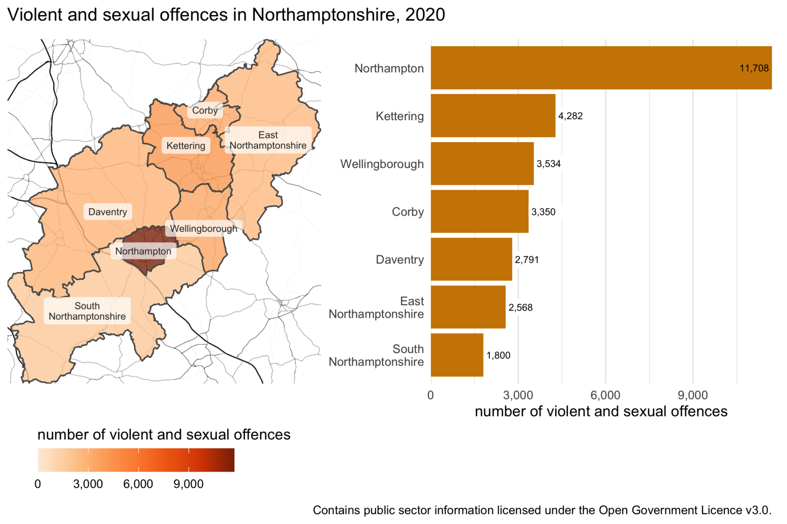
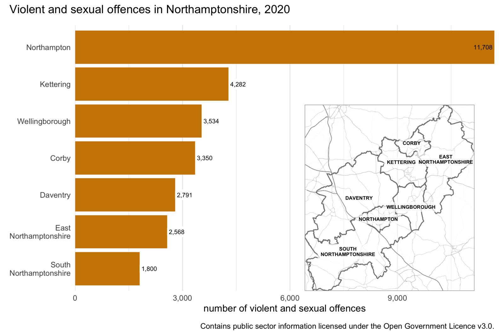

# Presenting spatial information without maps {#sec-no-maps}

{fig-alt="Students compare a bar chart, scatter plot and table of markers." width=100%}

::: {.abstract}
Maps are powerful tools for visualising spatial data, but they are not always the best choice. In this chapter, we will learn to choose between maps, tables and charts, then use the ggplot2 and gt packages to communicate spatial information clearly. We will create tables, bar charts, distribution plots and scatter plots, each suited to answering a different type of question.
:::





## Introduction

Making maps is the core of analysing spatial data. But just because a particular dataset has a spatial element to it does not always mean that a map is the best way to present insights from that data. In this chapter we will learn some other techniques for presenting data that can be more effective than maps for answering certain questions about spatial data.

In this chapter, we will learn how to:

- choose whether a map, table or chart is most appropriate for a particular question and audience;
- prepare data for presentation in a table;
- format a clear table using the gt package;
- use `ggauto()` to create a useful first version of a chart;
- build a chart from the beginning using `ggplot()`;
- choose an appropriate geom for the variables you want to show;
- create and refine bar charts, raincloud plots, ridge plots and scatter plots; and
- check whether chart colours are accessible to people with different colour vision.

As with so much in spatial analysis, whether it is best to make a map or use some other technique to convey information will depend on the circumstances. When you decide how to communicate information about the data you are analysing, you will need to consider the questions you are trying to answer, the audience that you are communicating with, what they will be using the information for and in what circumstances they will be using it.

While the best choice of how to communicate spatial information will depend on the circumstances, there are a few instances in which maps are typically *not* the best way to communicate your data. These include:


#### When you only need to convey a handful of pieces of information {.unnumbered}
  
Maps are very effective for communicating detailed information, such as the density of crime across thousands of cells in a KDE grid. But to do this, maps typically encode information into aesthetics such as colour, size and so on. This is necessary for communicating large amounts of information, but it makes the connection between the data and the visual representation of the data less direct than for other forms of data visualisation. If you only need to communicate a small amount of information, there is less justification for forcing your audience to mentally translate the fill aesthetic into whatever it represents.

For example, if you wanted to show the number of violent and sexual offences in each of the seven districts in Northamptonshire in England, a choropleth map is less clear than a bar chart (for example, in being able to decipher if there were more offences in Kettering or in Wellingborough). 


```{r}
#| label: northants-district-maps
#| echo: false
#| eval: false
library(patchwork)

# Load crime data
data_dir <- str_glue("{tempdir()}/crime_data")
unzip(
  zipfile = here::here(
    "inst/tutorials/prep/code/northamptonshire_crimes_2020.zip"
  ),
  exdir = data_dir
)
violence <- data_dir %>%
  dir(pattern = ".csv", full.names = TRUE, recursive = TRUE) %>%
  map_dfr(read_csv) %>%
  janitor::clean_names() %>%
  filter(crime_type == "Violence and sexual offences") %>%
  st_as_sf(coords = c("longitude", "latitude"), crs = 4326)

# Load boundary data
districts <- read_sf(
  "https://opendata.arcgis.com/datasets/0e07a8196454415eab18c40a54dfbbef_0.geojson"
) %>%
  janitor::clean_names() %>%
  filter(
    lad19nm %in%
      c(
        "South Northamptonshire",
        "Northampton",
        "Daventry",
        "Wellingborough",
        "Kettering",
        "Corby",
        "East Northamptonshire"
      )
  ) %>%
  select(lad19nm, geometry)

# Calculate violence counts at district level
violence_counts <- sfhotspot::hotspot_count(violence, grid = districts) %>%
  mutate(hjust = if_else(n == max(n), 1, 0))

# Download base map
base_map <- violence_counts %>%
  st_bbox() %>%
  set_names(c("left", "bottom", "right", "top")) %>%
  get_stamenmap(maptype = "toner-lines")

# Create map
violence_map <- ggmap(base_map) +
  geom_sf(
    aes(fill = n),
    data = violence_counts,
    inherit.aes = FALSE,
    alpha = 0.8
  ) +
  geom_sf_label(
    aes(label = str_replace_all(lad19nm, "\\s", "\n")),
    data = violence_counts,
    inherit.aes = FALSE,
    alpha = 0.7,
    colour = "grey20",
    label.size = NA,
    lineheight = 0.9,
    size = 2.5
  ) +
  scale_fill_distiller(
    palette = "Oranges",
    labels = scales::comma_format(),
    limits = c(0, NA),
    direction = 1,
    guide = guide_colorbar(title.position = "top", barwidth = unit(0.25, "npc"))
  ) +
  labs(
    fill = "number of violent and sexual offences"
  ) +
  theme_void() +
  theme(legend.position = "bottom")

# Create small reference map
reference_map <- ggmap(base_map) +
  # Add a 50% white mask to reduce the visibility of the base map
  annotate(
    "rect",
    xmin = -Inf,
    xmax = Inf,
    ymin = -Inf,
    ymax = Inf,
    alpha = 0.5,
    fill = "white"
  ) +
  geom_sf(
    data = districts,
    inherit.aes = FALSE,
    alpha = 0.8,
    colour = "grey50",
    fill = NA
  ) +
  geom_sf_label(
    aes(label = str_replace_all(str_to_upper(lad19nm), "\\s", "\n")),
    data = violence_counts,
    inherit.aes = FALSE,
    alpha = 0.7,
    fontface = "bold",
    label.size = NA,
    lineheight = 0.9,
    size = 2
  ) +
  theme_void() +
  theme(
    legend.position = "none",
    panel.border = element_rect(colour = "grey50", fill = NA)
  )

# Create bar chart
violence_chart <- violence_counts %>%
  mutate(lad19nm = fct_reorder(str_replace_all(lad19nm, "\\s", "\n"), n)) %>%
  ggplot(aes(n, lad19nm)) +
  geom_col(fill = "orange3") +
  geom_label(
    aes(label = scales::comma(n), fill = as_factor(hjust), hjust = hjust),
    label.size = NA,
    size = 2.5
  ) +
  scale_x_continuous(labels = scales::comma_format(), expand = c(0, 0)) +
  scale_fill_manual(values = c(`1` = "orange3", `0` = "white")) +
  labs(
    x = "number of violent and sexual offences",
    y = NULL
  ) +
  theme_minimal() +
  theme(
    legend.position = "none",
    panel.grid.major.y = element_blank(),
    panel.grid.minor.y = element_blank()
  )

# Create violence map and chart combo
violence_combined <- violence_map +
  violence_chart +
  plot_annotation(
    title = "Violent and sexual offences in Northamptonshire, 2020",
    caption = "Contains public sector information licensed under the Open Government Licence v3.0."
  )

# Save violence map and chart combo
ggsave(
  filename = here::here(
    "inst/tutorials/15_no_maps/images/map_vs_bar_chart.png"
  ),
  plot = violence_combined,
  width = 1200 / 150,
  height = 800 / 150,
  dpi = 300
)

# Create chart with reference map
chart_reference <-
  # reference_map +
  violence_chart +
  inset_element(
    reference_map,
    top = 0.7,
    right = unit(1, "npc"),
    bottom = 0,
    left = 0.5
  ) +
  # plot_layout(widths = c(1, 2)) +
  plot_annotation(
    title = "Violent and sexual offences in Northamptonshire, 2020",
    caption = "Contains public sector information licensed under the Open Government Licence v3.0."
  )

# Save chart with reference map
ggsave(
  filename = here::here(
    "inst/tutorials/15_no_maps/images/bar_chart_ref_map.png"
  ),
  plot = chart_reference,
  width = 1200 / 150,
  height = 800 / 150,
  dpi = 300
)
```


::: {#fig-northamptonshire-map-and-chart}

<p class="full-width-image"></p>

:::

A map might be a useful addition to the bar chart in this case *if* you are trying to communicate information to people who are not familiar with the locations of the districts. In that case, we might want to add a small reference map to help people understand which area is which:

::: {#fig-northamptonshire-chart-with-reference-map}

<p class="full-width-image"></p>

:::

::: {.callout-note collapse="true" title="Chart data: Northamptonshire offence counts"}

Both introductory charts show these recorded violent and sexual offence counts for 2020:

| District | Recorded offences |
|---|---:|
| Northampton | 11,708 |
| Kettering | 4,282 |
| Wellingborough | 3,534 |
| Corby | 3,350 |
| Daventry | 2,791 |
| East Northamptonshire | 2,568 |
| South Northamptonshire | 1,800 |

:::


But in most circumstances in which you create crime maps, you will be creating them for an audience (such as local police officers) that already has sufficient knowledge of the area and so an inset map such as this would not be needed. In that case, a bar chart will probably be more effective at showing this information than a map would be.


#### When you need to convey several different things about one place {.unnumbered}
  
Maps are generally most effective when they show a single piece of data about each place (e.g. a grid cell or a polygon representing a statistical area). For example, a choropleth map shows a single shade of colour for each area on the map to represent a single value, such as the frequency or rate of crime in that area. If you wanted to show the frequency of burglary *and* the frequency of robbery in the same area on a map, this would be quite hard. So if you need to convey multiple different things about each place, it is generally best to do this in a table or chart, rather than a map. 

One exception to this is when you present multiple maps side by side, each showing a single thing about an area. These are called *small multiple* maps and we will learn about them in @sec-small-multiple.


#### When the geographic relationship between places on the map is not the most important thing about them {.unnumbered}

Maps emphasise the spatial relationship between different places, but they do this at the expense of making non-spatial relationships between those places less obvious. If the spatial relationships are the most important thing that you want to convey, a map makes sense. For example, a hotspot map is often a very good way to communicate where crime is most concentrated. But in other cases the geographic relationships between variables will be much less important. For example, if you wanted to show the relationship between the amount of crime in an area and the level of poverty there, a scatter plot would probably be a more effective way to do this than a map would be.

::: {.callout-quiz .callout title="Maps, charts and tables"}

```{r}
#| label: viz-type-quiz
#| echo: false

viz_type_quiz1 <- c(
  "Maps are outdated and not widely used in spatial analysis",
  "Charts can always show spatial relationships more clearly",
  answer = "The relationships between places might not matter for the question at hand",
  "Maps cannot be used to display numerical data"
)

viz_type_quiz2 <- c(
  "The software used to create the visualisation",
  answer = "The question being answered and the audience’s needs",
  "The geographic location of the data",
  "The number of colours available in the mapping tool"
)
```

**What is one reason why spatial relationships might not be important in some visualisations?**

`r webexercises::longmcq(viz_type_quiz1)`


**What is a key factor in deciding whether to use a map, table, or chart?**

`r webexercises::longmcq(viz_type_quiz2)`


:::


## Tables

Well-designed tables can be a very effective way of communicating information, whereas badly designed tables can be confusing and even lead your audience to give up trying to engage with the information you're trying to communicate.

Tables used to present information almost always show only a summary of the available data, so the first step in preparing a table is to wrangle the data into the right format. In @sec-summarise we learned about the `summarise()` function from the dplyr package that we can use to produce summaries of rows of data.

To learn about creating a good table for displaying summary data in a report, we will use the example of the frequency of different types of violence in the different states of Malaysia in 2017. 

Create a new R script file inside the `R` folder of your `crime_mapping` workspace and save it as `chapter_14a.R`. Copy this code into that file and run it.


```{r}
#| label: script-14a-prepare
#| lst-label: lst-no-maps-script-14a-prepare
#| lst-cap: ""
#| filename: "chapter_14a.R"
#| eval: false

# Load packages
pacman::p_load(gt, here, httr2, tidyverse)

# Download annual counts of different types of violence in Malaysia
request(
  "https://mpjashby.github.io/crimemappingdata/malaysia_violence_counts.rds"
) |>
  req_perform(path = here("data", "raw", "malaysia_violence_counts.rds"))

# Load the local copy and keep only counts from 2017
violence <- here("data", "raw", "malaysia_violence_counts.rds") |>
  read_rds() |>
  # Keep only counts from 2017
  filter(year == 2017)
```


```{r}
#| label: load-malaysian-violence-data
#| echo: false

# Load packages
pacman::p_load(gt, here, httr2, tidyverse)

# Download annual counts of different types of violence in Malaysia
request(
  "https://mpjashby.github.io/crimemappingdata/malaysia_violence_counts.rds"
) |>
  req_perform(path = here("data", "raw", "malaysia_violence_counts.rds"))

# Load the local copy and keep only counts from 2017
violence <- here("data", "raw", "malaysia_violence_counts.rds") |>
  read_rds() |>
  # Keep only counts from 2017
  filter(year == 2017)
```


We can get a feel for the data by looking at a random sample of rows using the `slice_sample()` function from the dplyr package.


```{r}
#| label: slice-sample-violence-n-10
#| lst-label: lst-no-maps-slice-sample-violence-n-10
#| lst-cap: ""
#| filename: "R Console"

slice_sample(violence, n = 10)
```


The output of `slice_sample()` looks acceptable as a table, especially if it is included in a Quarto document, but readers of our reports probably don't want to know the type of each variable (underneath the variable names) and won't want to page through the table if there are more rows or columns than can fit in the available space. We can make this table much more useful for readers by wrangling it into a different format.


### Making data wider for presentation {#sec-no-maps-making-data-wider-for-presentation}

One issue with printing the `violence` object as a table is that it has `r scales::comma(nrow(violence))` rows, so it will take up a lot of space on a page or screen. We can make the data more compact by converting it from long format to wide format. In @sec-messy-data we learned that data are often easier to analyse in long format. But it is often better to _present_ data in a table in wide format. When you are choosing between storing data in long versus wide format, remember: analyse in long format, present in wide format.

As we learned in @sec-messy-data, we can convert the table to a wider format using `pivot_wider()` from the tidyr package. Here, the `names_from` argument identifies the column whose values should become new column names, while `values_from` identifies the column containing the values to put in those new columns.


```{r}
#| label: reshape-violence-table-wide
#| lst-label: lst-no-maps-reshape-violence-table-wide
#| lst-cap: ""
#| filename: "R Console"

# Produce table of crime counts in each Malaysian state
violence |>
  # Convert data to have one row per state
  pivot_wider(names_from = crime_type, values_from = count) |>
  # Convert new column names (the former values of `crime_type`) to snake case
  janitor::clean_names()
```


::: {.callout-tip collapse="true" title="Why does this code include `janitor::clean_names()`?"}

You will be used to seeing `janitor::clean_names()` used to clean the column names in a dataset that has just been loaded. In this case, the new columns created by `pivot_wider()` will have spaces in them, because the names are taken from the values of the `crime_type` column in the original dataset. Column names with spaces in them a harder to work with, so this code converts them to snake case so that they are easier to work with. 

Later in the code we will replace these column names with labels that are suitable for displaying the data in a table.
:::


Now the table has only `r nrow(pivot_wider(violence, names_from = crime_type, values_from = count))` rows, which makes it much easier to present both on screen and in print. We can also see that the `year` column is *constant* (all the values are the same), so we can remove this using the `select()` function from dplyr. We can also use `select()` to change the order of the columns from left to right so that the two types of robbery appear next to each other.


```{r}
#| label: remove-constant-year-column
#| lst-label: lst-no-maps-remove-constant-year-column
#| lst-cap: ""
#| filename: "R Console"

# Produce table of crime counts in each Malaysian state
violence |>
  # Convert data to have one row per state
  pivot_wider(names_from = crime_type, values_from = count) |>
  # Convert new column names (the former values of `crime_type`) to snake case
  janitor::clean_names() |>
  # Choose only the columns we want to show in the table
  select(
    region,
    state,
    murder,
    rape,
    aggravated_assault,
    armed_robbery,
    unarmed_robbery
  )
```


### Using the gt package to make better tables {#sec-no-maps-using-the-gt-package-to-make-better-tables}

<a href="https://gt.rstudio.com/" aria-label="Visit the gt package website" class="no-external"></a>

The table we created in @sec-no-maps-making-data-wider-for-presentation was better than simply showing the raw data to readers of a report. But we can create much better display tables with the [gt package](https://gt.rstudio.com/), which is designed to format data for display. The gt package works in a similar way to the `ggplot2` package, in that tables are made up of stacks of functions that contribute to the appearance of the final table. One difference is that the layers in a gt stack are joined using the pipe operator (`|>`)
rather than the plus operator (`+`).

We can create a very basic gt table by just passing a data frame or tibble to the `gt()` function. So we can add `gt()` to the end of the pipeline of functions we have already started to build to create a good display table. At this point, the only argument we will add to `gt()` is the `rowname_col` argument, which we use to specify which column in the data holds the row labels (in this case, the name of each state).


```{r}
#| label: create-gt-table
#| lst-label: lst-no-maps-create-gt-table
#| lst-cap: ""
#| filename: "R Console"

# Produce table of crime counts in each Malaysian state
violence |>
  # Convert data to have one row per state
  pivot_wider(names_from = crime_type, values_from = count) |>
  # Convert new column names (the former values of `crime_type`) to snake case
  janitor::clean_names() |>
  # Choose only the columns we want to show in the table
  select(
    region,
    state,
    murder,
    rape,
    aggravated_assault,
    armed_robbery,
    unarmed_robbery
  ) |>
  # Functions from tidyverse above and functions from gt below
  gt(rowname_col = "state")
```


This table is already better than the default table produced by Quarto if we just print a data frame or tibble. The gt table does not take up the whole width of the page unnecessarily (which can make it harder to read across rows) and has hidden the type of each column.

We can add more functions to the `gt()` stack to adjust the appearance of the table. For example, we can format the numeric columns as numbers using the `fmt_number()` function. This adds thousand separators (in British English, commas) to make it easier to read the large numeric values and can make various other changes such as adding a prefix or suffix to numbers (useful for showing units), scaling numbers (useful for very large numbers) or automatically formatting numbers according to the conventions of the language your computer is set to use (referred to in R help pages as the *locale* of your computer).

We choose which columns `fmt_number()` should format using the `columns` argument. In this case, we want to format all the numeric columns in the data, so we will set `columns = where(is.numeric)`.

We don't want the numbers in the table to have any decimal places (since the crime counts are all whole numbers), so we also set `decimals = 0`. We can use the default values of all the other arguments to `fmt_number()` -- type `?gt::fmt_number` in the R console to find out more about the different options available on the help page for the `fmt_number()` function.


```{r}
#| label: group-table-by-region
#| lst-label: lst-no-maps-group-table-by-region
#| lst-cap: ""
#| filename: "R Console"

# Produce table of crime counts in each Malaysian state
violence |>
  # Convert data to have one row per state
  pivot_wider(names_from = crime_type, values_from = count) |>
  # Convert new column names (the former values of `crime_type`) to snake case
  janitor::clean_names() |>
  # Choose only the columns we want to show in the table
  select(
    region,
    state,
    murder,
    rape,
    aggravated_assault,
    armed_robbery,
    unarmed_robbery
  ) |>
  # Functions from tidyverse above and functions from gt below
  gt(rowname_col = "state") |>
  # Format numbers with thousand separators and no decimals
  fmt_number(columns = where(is.numeric), decimals = 0)
```


`fmt_number()` is one of several formatting functions available in gt. For example, we could use `fmt_currency()` to format columns according to the conventions for currency values, `fmt_date()` for dates or `fmt_percent()` for percentages.

The `region` column only has two values: `West Malaysia` for states and territories in Peninsular Malaysia and `East Malaysia` for states on the island of Borneo. Rather than repeat these two values on every row of the table -- which is a waste of space and makes the table more cluttered than necessary -- we can instead group the rows according to these two regions and then only show the region names once at the top of each group.

`gt()` will automatically create group headings in a table if the data frame or tibble passed to `gt()` contains groups created by the `group_by()` function from the dplyr package. All we have to do is use `group_by()` to specify which column (in this case, `region`) contains the values that we should use to determine which group each row is in.


```{r}
#| label: format-table-numbers
#| lst-label: lst-no-maps-format-table-numbers
#| lst-cap: ""
#| filename: "R Console"

# Produce table of crime counts in each Malaysian state
violence |>
  # Convert data to have one row per state
  pivot_wider(names_from = crime_type, values_from = count) |>
  # Convert new column names (the former values of `crime_type`) to snake case
  janitor::clean_names() |>
  # Choose only the columns we want to show in the table
  select(
    region,
    state,
    murder,
    rape,
    aggravated_assault,
    armed_robbery,
    unarmed_robbery
  ) |>
  # Specify the table rows should be grouped by the values of `region`
  group_by(region) |>
  # Functions from tidyverse above and functions from gt below
  gt(rowname_col = "state") |>
  # Format numbers with thousand separators and no decimals
  fmt_number(columns = where(is.numeric), decimals = 0)
```


In tables containing lots of numbers it can be difficult to see patterns. One way to help readers to understand patterns is to map the numbers to an aesthetic property such as colour that people can easily see patterns in. To do this, we can colour the cells in a column according to the value of each cell using the `data_color()` function (note the spelling of 'color' in this function). To use `data_color()`, we specify the columns we want to shade using the `columns` argument and the colour palette we want to use using the `palette` argument. 

In this example, we will only colour the values in two columns, so we will pass the column names to the `columns` argument.

The easiest way to specify a colour palette is to use one of the built-in colour palettes that the gt package understands automatically. These use the same colour palette names we have used @sec-map-colour when using functions such as `scale_fill_distiller()`.


```{r}
#| label: style-table-header
#| lst-label: lst-no-maps-style-table-header
#| lst-cap: ""
#| filename: "R Console"
#| code-line-numbers: "12-13"

# Produce table of crime counts in each Malaysian state
violence |>
  # Convert data to have one row per state
  pivot_wider(names_from = crime_type, values_from = count) |>
  # Convert new column names (the former values of `crime_type`) to snake case
  janitor::clean_names() |>
  # Choose only the columns we want to show in the table
  select(
    region,
    state,
    murder,
    rape,
    aggravated_assault,
    armed_robbery,
    unarmed_robbery
  ) |>
  # Specify the table rows should be grouped by the values of `region`
  group_by(region) |>
  # Functions from tidyverse above and functions from gt below
  gt(rowname_col = "state") |>
  # Format numbers with thousand separators and no decimals
  fmt_number(columns = where(is.numeric), decimals = 0) |>
  # Show distribution of values in some columns using colour
  data_color(columns = unarmed_robbery, palette = "Oranges") |>
  data_color(columns = rape, palette = "Blues")
```


::: {.callout-important title="Avoid using the same colour across multiple columns"}

In this table we use two different colours to show the patterns in the frequency of rape and unarmed robbery. This is because we want readers to remember that different types of crime are *different* and so comparisons that treat crimes as being equivalent to one another are likely to be flawed. If we used the same colour across columns, readers might end up seeing that the shade used for unarmed robberies in Kuala Lumpur was darker than the shade showing the number of rapes and conclude that unarmed robberies were a bigger problem than rapes. This would be a potentially false conclusion because a single rape and a single unarmed robbery are not the same in terms of their seriousness.

For the same reason the table does not include a column showing the total number of crimes in each state -- when we total all types of crime together, we are implicitly assuming that all types of crime are the same when that is obviously untrue.
:::


### Changing column names {#sec-no-maps-changing-column-names}

Now that we have formatted the data, we can move onto changing the column labels. At the moment these are taken from the column names in the data, which means we have column labels such as `aggravated_assault`. Underscore characters (`_`) aren't standard in English text, so we should change the labels to remove them. We can do this by adding the `cols_label()` function to the `gt()` stack. As well as removing the underscores, we can also use `cols_label()` to abbreviate labels or split them over multiple lines so that the column labels don't force the columns to be wider than necessary.

We can use the `md()` helper function to use Markdown formatting to control the appearance of the labels. As well as using markup such as asterisks to create `**strongly emphasised text**` we can also use HTML markup to add more-advanced formatting. For example, we can use the code `<br>` to insert a line break to split labels over multiple lines.


```{r}
#| label: rename-table-columns
#| lst-label: lst-no-maps-rename-table-columns
#| lst-cap: ""
#| filename: "R Console"

# Produce table of crime counts in each Malaysian state
violence |>
  # Convert data to have one row per state
  pivot_wider(names_from = crime_type, values_from = count) |>
  # Convert new column names (the former values of `crime_type`) to snake case
  janitor::clean_names() |>
  # Choose only the columns we want to show in the table
  select(
    region,
    state,
    murder,
    rape,
    aggravated_assault,
    armed_robbery,
    unarmed_robbery
  ) |>
  # Specify the table rows should be grouped by the values of `region`
  group_by(region) |>
  # Functions from tidyverse above and functions from gt below
  gt(rowname_col = "state") |>
  # Format numbers with thousand separators and no decimals
  fmt_number(columns = where(is.numeric), decimals = 0) |>
  # Show distribution of values in some columns using colour
  data_color(columns = unarmed_robbery, palette = "Oranges") |>
  data_color(columns = rape, palette = "Blues") |>
  # Add column labels
  cols_label(
    "aggravated_assault" ~ "agg. assault",
    "armed_robbery" ~ md("robbery<br>(armed)"),
    "unarmed_robbery" ~ md("robbery<br>(unarmed)")
  )
```


### Adding summary rows {#sec-no-maps-adding-summary-rows}

The final structural feature we will add is a summary row containing the total number of each type of crime across all the states and territories. We do this using the `summary_rows()` function from gt. We specify the columns we want to summarise using the `columns` argument as we did for `fmt_number()`.

Summary rows can be produced using lots of different R functions. For example, we could use the `mean()` function to produce a summary row showing the mean (average) number of crimes of each type across the states. In this case, we want to know the total number of each type of crime across all states, so we will use the `sum()` function. To specify this, we pass the `fns` argument to `summary_rows()`. The `fns` argument has two parts, separated by a tilde (`~`). On the left-hand side we specify the label we want the summary row to have, and on the right-hand side we specify the function we want to use to calculate the summary. In this case, we can specify `fns = "regional total" ~ sum(.)` to say we want the summary row to have the label 'regional total' and that we want to summarise the rows using the `sum()` function. The `.` in the code `fns = "regional total" ~ sum(.)` is a placeholder that represents the data we want to summarise.

As well as summarising the data in each column, we want to specify how the summary values should be formatted. To do that, we use the `fmt` argument of `summary_rows()`. This is also a two-sided ('formula') argument, with the two sides separated by a `~`. On the left-hand side we specify which summary values we want to format. In this case we want all the summary values to be formatted as numbers, so we can use the `everything()` helper function. On the right-hand side we use a call to one of the `fmt_*()` family of functions we used earlier: in this case, we use `fmt_number()`. Looking at @lst-no-maps-script-14a-table, you'll notice that the code `fmt = everything() ~ fmt_number(., decimals = 0)` again uses the `.` placeholder to specify that we want to format the summary value produced by `sum()`.

The `summary_rows()` function produces a summary for each group of rows (in the case of this table, one summary for each region). As well as having a regional total, it would also be useful to have a total for all the groups together (i.e. for the whole country of Malaysia). To do that, we add the `grand_summary_rows()` function to our `gt()` stack, using the same arguments as for the `summary_rows()` function.

Paste this code into the `chapter_14a.R` file and run it.


```{r}
#| label: script-14a-table
#| lst-label: lst-no-maps-script-14a-table
#| lst-cap: ""
#| filename: "chapter_14a.R"

# Produce table of crime counts in each Malaysian state
violence |>
  # Convert data to have one row per state
  pivot_wider(names_from = crime_type, values_from = count) |>
  # Convert new column names (the former values of `crime_type`) to snake case
  janitor::clean_names() |>
  # Choose only the columns we want to show in the table
  select(
    region,
    state,
    murder,
    rape,
    aggravated_assault,
    armed_robbery,
    unarmed_robbery
  ) |>
  # Specify the table rows should be grouped by the values of `region`
  group_by(region) |>
  # Functions from tidyverse above and functions from gt below
  gt(rowname_col = "state") |>
  # Format numbers with thousand separators and no decimals
  fmt_number(columns = where(is.numeric), decimals = 0) |>
  # Show distribution of values in some columns using colour
  data_color(columns = unarmed_robbery, palette = "Oranges") |>
  data_color(columns = rape, palette = "Blues") |>
  # Add column labels
  cols_label(
    "aggravated_assault" ~ "agg. assault",
    "armed_robbery" ~ md("robbery<br>(armed)"),
    "unarmed_robbery" ~ md("robbery<br>(unarmed)")
  ) |>
  # Add a summary row showing the total number of crimes in each region
  summary_rows(
    columns = where(is.numeric),
    fns = "regional total" ~ sum(.),
    fmt = everything() ~ fmt_number(., decimals = 0)
  ) |>
  # Add a summary row showing the total number of crimes in Malaysia
  grand_summary_rows(
    columns = where(is.numeric),
    fns = "national total" ~ sum(.),
    fmt = everything() ~ fmt_number(., decimals = 0)
  )
```

Save `chapter_14a.R` by pressing . Your complete table script should now look like this:

```{r}
#| label: show-chapter-14a-script
#| lst-label: lst-no-maps-show-chapter-14a-script
#| lst-cap: ""
#| file: "../R/chapter_14a.R"
#| eval: false
#| filename: "chapter_14a.R"
```



::: {.callout-important title="Tables are not good at showing patterns"}

Tables are good for showing detailed information, particularly when we want to present multiple pieces of information about a single place. But it can be hard to spot patterns in tables even with coloured cells. For this reason, **do not use tables when you are primarily trying to show the relationship between two or more variables**. In @sec-making-charts, we will learn to create a bar chart in R to show patterns more effectively.
:::


::: {.callout-quiz .callout title="Tables"}

```{r}
#| label: tables-quiz
#| echo: false

tables_quiz1 <- c(
  answer = "When communicating multiple values about each area",
  "When displaying detailed spatial relationships",
  "When visualising trends over time",
  "When analysing spatial clusters"
)

tables_quiz2 <- c(
  "It makes the data easier to analyse using statistical models",
  answer = "It allows for easier comparisons across categories in a table",
  "It is the default format for spatial data in R",
  "It makes maps easier to interpret"
)

tables_quiz3 <- c(
  "`pivot_longer()`",
  "`spread()`",
  answer = "`pivot_wider()`",
  "`gather()`"
)
```

**In which of these circumstances is a table typically more effective than a map?**

`r webexercises::longmcq(tables_quiz1)`


**Why is it often preferable to present summary data in a wide format?**

`r webexercises::longmcq(tables_quiz2)`


**Which function is used in R to convert long-format data into wide-format data?**

`r webexercises::longmcq(tables_quiz3)`

:::


## Making charts with ggplot2 and ggauto {#sec-making-charts}

<a href="https://ggplot2.tidyverse.org/" aria-label="Visit the ggplot2 package website" class="no-external"></a>

In @sec-other-layers and @sec-map-context, we created maps with `hotspot_map()` and refined them with functions from the ggplot2 package. Behind the scenes, `hotspot_map()` constructs a map using other functions from the ggplot2 package, by default making choices that try to produce a good map. We can't use `hotspot_map()` to make these choices for us when we are creating charts because it is specialised for creating maps. Instead, we can use the `ggauto()` function (from the package of the same name) to automatically choose a type of chart that is likely to be appropriate for the data we are working with. We can then use functions from the ggplot2 package to refine the chart in the same way we have refined maps.

`ggauto()` can create several different types of chart automatically. It chooses which type of chart to make based on how many variables we want to visualise and whether the variables are continuous (e.g. numbers), dates/times (which we will learn more about in @sec-mapping-time), ordered categories or unordered categories. There are some types of chart that `ggauto()` can't handle, or for which the chart produced by `ggauto()` might not be appropriate for particular audiences. In those cases, we can use functions from the ggplot2 package to create a chart from scratch and then refine it to suit our needs.


To see how this works, let's start by creating a bar chart. Bar charts are useful for showing values of one _numeric_ variable (e.g. a count of crimes) for each value of one _categorical_ variable (e.g. states of a country). Before we create a bar chart, create a new R script file in the `R` folder of your `crime_mapping` workspace and save it as `chapter_14b.R`. Copy this code into that file and run it.


```{r}
#| label: script-14b-prepare
#| lst-label: lst-no-maps-script-14b-prepare
#| lst-cap: ""
#| filename: "chapter_14b.R"
#| eval: false

# This script creates several charts as examples of how to make charts in R

# Load packages
pacman::p_load(ggplot2, here, httr2, paletteer, tidyverse)

# Download annual counts of different types of violence in Malaysia
request(
  "https://mpjashby.github.io/crimemappingdata/malaysia_violence_counts.rds"
) |>
  req_perform(path = here("data", "raw", "malaysia_violence_counts.rds"))

# Load the local copy and keep only counts from 2017
violence <- here("data", "raw", "malaysia_violence_counts.rds") |>
  read_rds() |>
  # Keep only counts from 2017
  filter(year == 2017)
```

```{r}
#| label: load-malaysian-chart-data
#| filename: "chapter_14b.R"
#| echo: false

# This script creates several charts as examples of how to make charts in R

# Load packages
pacman::p_load(ggplot2, here, httr2, paletteer, tidyverse)

# Download annual counts of different types of violence in Malaysia
request(
  "https://mpjashby.github.io/crimemappingdata/malaysia_violence_counts.rds"
) |>
  req_perform(path = here("data", "raw", "malaysia_violence_counts.rds"))

# Load the local copy and keep only counts from 2017
violence <- here("data", "raw", "malaysia_violence_counts.rds") |>
  read_rds() |>
  # Keep only counts from 2017
  filter(year == 2017)
```


By default, `ggauto()` produces a useful starting point for a bar chart, so let's use it to show the number of murders in each Malaysian state in 2017. We will use the `violence` object we created earlier, which contains counts of different types of violence in each state.

```{r}
#| label: fig-no-maps-ggauto-bar-basic
#| fig-cap: ""
#| lst-label: lst-no-maps-ggauto-bar-basic
#| lst-cap: ""
#| filename: "R Console"
#| fig-alt: "Horizontal bar chart of recorded murders by Malaysian state in 2017. States run from highest to lowest count, top to bottom: Selangor is highest at just over eighty, followed by Johor at about sixty-five; Perlis is lowest at about two. The automatic chart has no title or source caption."

violence |>
  filter(crime_type == "murder") |>
  ggauto::ggauto(state, count)
```

::: {.callout-tip collapse="true" title="Why do we write `ggauto::ggauto()`?"}

The `::` notation tells R to use the `ggauto()` function from the ggauto package without first loading the whole package. We only use ggauto interactively in the R Console in this chapter, rather than using it in the scripts we are building, so there is no need to load it at the start of those scripts. The ggauto package must still be installed on your computer for this code to work.
:::

There are several features of the bar chart created by `ggauto()` that make the chart easier for readers to use than many bar charts produced by default in other software. Specifically:

* The bars are horizontal, not vertical. This means that the state labels can also be horizontal, which is very useful because in English we read text horizontally and so it's easier to read horizontal text than vertical text. Horizontal bar charts are almost always better than vertical ones when we need to show non-numeric category labels.
* A lot of clutter that is sometimes included in default charts has been removed if it isn't needed for this particular type of chart. For example, there are no _tick marks_ between the bars and the state names.
* The chart includes a title for the horizontal axis (known as the _x-axis_) so that readers know what the numbers represent, but there is no title for the vertical axis (known as the _y-axis_) because it is obvious from the context that the vertical axis shows the names of the states.
* The states have been ordered so that the states with the most murders have been shown at the top of the chart and the states with the fewest murders have been shown at the bottom. This makes it easy for readers to see which states have the most and fewest murders. Ordering the bars like this is almost always better than using the default alphabetical order of the state names.

The chart produced by `ggauto()` is a useful starting point, but we can make it more informative by adding a title and caption. We can do this using the `labs()` function from the ggplot2 package that we learned about in @sec-titles. Let's add a title showing what the chart shows and a caption giving the source of the data. In this case, the data comes from an [academic paper written by Hashom Hakim and colleagues](https://doi.org/10.1016/j.dib.2019.104449).

```{r}
#| label: fig-no-maps-ggauto-bar-labelled
#| fig-cap: ""
#| lst-label: lst-no-maps-ggauto-bar-labelled
#| lst-cap: ""
#| filename: "R Console"
#| fig-alt: "Horizontal bar chart of recorded murders by Malaysian state in 2017. States run from highest to lowest count, top to bottom: Selangor is highest at just over eighty, followed by Johor at about sixty-five; Perlis is lowest at about two. A title identifies the subject and year, and a caption gives the source."

violence |>
  filter(crime_type == "murder") |>
  ggauto::ggauto(state, count) +
  labs(
    title = "Murders in Each Malaysian State (2017)",
    caption = "Source: Hakim et al. (2019)"
  )
```

Note that because `ggauto()` produces a chart, we need to add subsequent functions such as `labs()` with the `+` operator rather than the `|>` operator.

`ggauto()` has produced a useful bar chart, but to go any further we need to learn to construct charts ourselves using the full range of functions from the ggplot2 package. For example, we might need to do this if we wanted to change the colour of the bars so that the bar for each state was coloured according to which region it was in.

We can start to learn how to create charts from scratch using functions from ggplot2 by looking at the code that would be needed to reproduce the bar chart in @fig-no-maps-ggauto-bar-labelled without using `ggauto()`. Look through @lst-bar-chart-ggplot and its accompanying explanations.


```{r}
#| label: fig-no-maps-bar-chart-ggplot
#| fig-cap: ""
#| lst-label: lst-bar-chart-ggplot
#| lst-cap: ""
#| filename: "R Console"
#| fig-alt: "Horizontal bar chart of recorded murders by Malaysian state in 2017. States run from highest to lowest count, top to bottom: Selangor is highest at just over eighty, followed by Johor at about sixty-five; Perlis is lowest at about two. Blue bars over light grid lines make their lengths easy to compare."

# Create bar chart of murder counts
violence |>
  # Keep only rows representing murder counts
  filter(crime_type == "murder") |>
  # Re-order states according to number of murders
  mutate(state = fct_reorder(state, count)) |> #<1>
  # Initialise chart
  ggplot() + #<2>
  # Translate columns in the data to aesthetics on the chart
  aes(x = count, y = state) + #<3>
  # Add bars
  geom_col(fill = "#4477AA") + #<4>
  # Add labels
  labs(
    title = "Murders in Each Malaysian State (2017)", #<5>
    caption = "Source: Hakim et al. (2019)", #<5>
    x = "Count", #<5>
    y = NULL #<5>
  ) +
  # Remove unnecessary chart elements
  theme_minimal() + #<6>
  theme(
    axis.title.x = element_text(hjust = 1), #<7>
    panel.grid.major.y = element_blank(), #<7>
    panel.grid.minor.y = element_blank(), #<7>
    plot.title.position = "plot" #<7>
  )
```
1. In order for the bars to be displayed in descending order of the number of murders, we need to reorder the `state` column in the data. To do this we convert that column to something R calls a _factor_, which is capable of storing a meaningful order for the categories. We will learn more about this in @sec-factors.
2. The `ggplot()` function takes a dataset and initiates a new chart. However, `ggplot()` (unlike `ggauto()`) doesn't produce a chart on its own. We need to add more components to the chart before it can be displayed. You can think of `ggplot()` as telling R "I want to make a chart using this data".
3. The `aes()` function specifies which columns in the data will control which _aesthetics_ of the chart. We learned about aesthetics in @sec-aesthetics and about the `aes()` function in @sec-other-layers. In this case, we want the `count` column to control the horizontal position of the end of each bar and the `state` column to control the vertical order of the bars.
4. The `geom_col()` function tells R that the chart we want to create should be a bar chart. While `ggplot()` says "I want to make a chart using this data", `geom_col()` says "the chart should be a bar chart". The argument `fill = "#4477AA"` specifies what colour we want the bars to be.
5. The `labs()` function adds titles and captions to the chart, as we learned in @sec-titles. We can also use `labs()` to control the titles of the axes on the chart. In this case, we set `y = NULL` to remove the title for the vertical axis, since a title is unnecessary when it is obvious from the context what the values on that axis represent (Malaysian states).
6. The `theme_minimal()` function controls which ggplot2 _theme_ the chart uses. Themes control the supporting elements of a visualisation, such as the appearance of grid lines, which font is used for text, etc. We will learn more about themes in @sec-themes.
7. The `theme()` function allows us to make further refinements to the theme used by the chart. There are lots of ways we can customise a chart theme. In this case we've removed the default horizontal grid lines (which aren't useful for horizontal bar charts), made the x-axis title right-aligned and moved the chart title to the top-left corner of the chart.

Now you've seen how much code is needed to create a bar chart from scratch, you can see why `ggauto()` is useful for quickly producing a sensible starting point. However, sometimes we will need to go beyond what `ggauto()` can do, so it's useful to know how to create charts from scratch. Before we go beyond what `ggauto()` can do for us, we will first delve a bit deeper into some aspects of @lst-bar-chart-ggplot that we haven't already covered.


### Controlling the order of categorical variables {#sec-factors}

If you were trying to find the three Malaysian states or territories with the most murders from this chart, it would be pretty easy to see on any bar chart that Selangor had the most murders, followed by Johor. But at a glance, it might not so easy to see which state or territory comes third unless the bars are ordered by their values. This is why alphabetical ordering of bars (which is the default used by ggplot2) is almost never the best choice for a bar chart.

To order the bars according to the number of murders in each state, we need to convert the `state` column in the data to a new type of variable: a *factor*. Factors are what R calls categorical variables that have (a) a defined set of possible values and optionally (b) a defined order of values.

One of the benefits of storing a variable as a factor is that we can specify an order for the categories. This is useful for categories that have a meaningful order, such as 'bad', 'acceptable', 'good', 'excellent'. But we can also use
this feature of factors to specify that values should appear in a particular order in any charts produced from the data, whatever the order of the values in the data itself.

<a href="https://forcats.tidyverse.org/" aria-label="Visit the forcats package website" class="no-external"></a>

To work with factors in R we can use the [forcats package](https://forcats.tidyverse.org/), so-called because it's *for* working with *categories*. forcats is loaded as part of tidyverse, so we don't need to load it separately.

All the functions in the forcats package start with the letters `fct_`, just as all the functions in the sfhotspot package start `hotspot_`. For our bar chart, we will use the `fct_reorder()` function. This takes a factor or character variable (such as the names of the Malaysian states and territories) and sets the order of the categories according to the values of a numeric variable (such as the number of murders in a state). So to re-order the `state` variable according to the count of murders, we can use `fct_reorder(state, count)`. Since we're changing an existing variable, we do this inside a call to the `mutate()` function that we learned about in @sec-mutate. Look back to the code in @lst-bar-chart-ggplot and you will see the line `mutate(state = fct_reorder(state, count))`.


### ggplot2 themes {#sec-themes}

The `theme_*()` family of functions in ggplot2 allows us to control all the _non-data_ elements of a chart. These are the elements that support the data shown by the geoms (e.g. bars, points, lines) in a chart, such as the background, grid lines, axis text and the appearance of titles and legends. It's important to note the distinction about what we can control with themes and what we cannot. Themes control the supporting elements of a visualisation rather than the data shown by its geoms. Changing the theme will not change anything about how the data is represented in a chart, such as the colour of bars.

There are many different themes that you can add to a `ggplot()` stack. Some of these are built into the ggplot2 package, and some are part of other packages that extend what ggplot2 can do. Some organisations (such as the BBC) have [their own ggplot2 themes](https://github.com/bbc/bbplot) for creating maps and charts that follow their corporate style guide.

Different themes can give charts very different appearances, even when they use the same data. For example, these four charts show what happens when different themes are applied to the end of the same `ggplot()` stack:

```{r}
#| label: fig-no-maps-compare-themes
#| fig-cap: ""
#| fig-subcap: true
#| echo: false
#| fig-asp: 1
#| fig-alt: ["Horizontal bar chart of recorded murders by Malaysian state in 2017, using theme_grey(). Selangor has the highest count and Perlis the lowest. Blue bars appear on a pale grey panel with white grid lines. The counts and bar lengths are the same in all four theme examples.", "Horizontal bar chart of recorded murders by Malaysian state in 2017, using theme_classic(). Selangor has the highest count and Perlis the lowest. Blue bars appear on a white panel with axis lines and no grid lines. The counts and bar lengths are the same in all four theme examples.", "Horizontal bar chart of recorded murders by Malaysian state in 2017, using theme_light(). Selangor has the highest count and Perlis the lowest. Blue bars appear on a white panel with pale grey grid lines and a panel border. The counts and bar lengths are the same in all four theme examples.", "Horizontal bar chart of recorded murders by Malaysian state in 2017, using theme_dark(). Selangor has the highest count and Perlis the lowest. Blue bars appear on a dark grey panel with grey grid lines. The counts and bar lengths are the same in all four theme examples."]
#| fig-format: jpeg
#| layout-ncol: 2
#| out-width: 100%

# Create chart object
murder_chart_themes <- violence |>
  # Keep only rows representing murder counts
  filter(crime_type == "murder") |>
  # Re-order states according to number of murders
  mutate(state = fct_reorder(state, count)) |> #<1>
  ggplot() + #<2>
  aes(x = count, y = state) + #<3>
  geom_col(fill = "#4477AA") + #<4>
  # Add labels
  labs(
    #<5>
    title = "Murders in Each Malaysian State (2017)",
    caption = "Source: Hakim et al. (2019)",
    x = "Count",
    y = NULL
  )

custom_theme_elements <- theme(
  legend.position = "none",
  plot.title.position = "plot"
)

plot_theme1 <- murder_chart_themes +
  labs(title = "theme_grey()") +
  theme_grey() +
  custom_theme_elements
plot_theme2 <- murder_chart_themes +
  labs(title = "theme_classic()") +
  theme_classic() +
  custom_theme_elements
plot_theme3 <- murder_chart_themes +
  labs(title = "theme_light()") +
  theme_light() +
  custom_theme_elements
plot_theme4 <- murder_chart_themes +
  labs(title = "theme_dark()") +
  theme_dark() +
  custom_theme_elements

plot_theme1
plot_theme2
plot_theme3
plot_theme4
```

If we don't specify a theme, ggplot2 will use the default theme, which is called `theme_grey()`. This theme is useful for exploring data because it includes grid lines and other elements that make it easier to see the values of the data. But when we are creating a chart for an audience, we usually want to remove unnecessary elements that don't communicate useful information. It's important to remove any unnecessary elements from our charts to help the audience focus on the most-important elements. For that reason, we will usually use `theme_minimal()` for charts, which removes the background colour and panel border while retaining grid lines that can help readers estimate values. If you look back at the code in @lst-bar-chart-ggplot you can see that it uses `theme_minimal()` and then removes the horizontal grid lines that are not useful for this chart.

One of the `theme_*()` family of functions can go a long way to improving the appearance of a chart, but we will sometimes also need to make further adjustments to make sure the chart is as clear as possible. We can do this using the `theme()` function, which allows us to make further refinements to the theme used by the chart.

There are many different elements of a chart that we can control using the `theme()` function. For example, we can control the appearance of the chart title, the axis titles, the axis text, the legend and the background. In @lst-bar-chart-ggplot we used several arguments of the `theme()` function.

* We set `axis.title.x` to `element_text(hjust = 1)` to right-align the title of the horizontal axis. `element_text()` is one of a family of helper functions that ggplot2 provides so that we can easily control the appearance of different elements within a theme. As the name suggests, `element_text()` is the function within this family that we can use to control the appearance of non-data text on the chart, such as the chart title, axis labels, etc. The `hjust` argument controls the horizontal alignment of text, with a value of 0 meaning left-aligned, a value of 1 meaning right-aligned and a value of 0.5 (the default) meaning centred.
* We set `panel.grid.major.y` and `panel.grid.minor.y` to `element_blank()` to remove the horizontal grid lines that run along the length of the bars, since they don't really make it any easier to understand the chart. `element_blank()` is a helper function that sets the specified element to be blank.
* We set `plot.title.position = "plot"` to specify that we want the chart title to appear in the top-left corner of the whole chart rather than being aligned only with the edge of the plotting area. We almost always want the chart title to appear in this way, so we will use this code often.


### Colour in bar charts {#sec-no-maps-colour-in-bar-charts}

Now that we have successfully used `ggplot()` to recreate the bar chart created by `ggauto()`, and understood all the code needed to do that, we can go on to further improve the chart by adding colour to the bars to indicate which region of Malaysia each state is in.

To do that, we need to add another _mapping_ to the `aes()` function that is included in @lst-bar-chart-ggplot and which controls which columns in the `violence` dataset control which elements of the chart. `aes()` already specifies that the `count` column controls the horizontal position of the end of each bar and that the `state` column controls the vertical order of the bars. We can add another mapping to `aes()` to specify that the fill colour of the bars should be controlled by the `region` column in the data. This will colour each bar according to which region of Malaysia it is in. Run this code in the R console to see the result. Note that this time we are saving the result in an object called `malaysia_murder_bar_chart` so that we can use the result again shortly.

```{r}
#| label: fig-no-maps-bar-chart-region-colours
#| fig-cap: ""
#| lst-label: lst-bar-chart-fill
#| lst-cap: ""
#| filename: "R Console"
#| fig-alt: "Horizontal bar chart of recorded murders by Malaysian state in 2017. States run from highest to lowest count, top to bottom: Selangor is highest at just over eighty, followed by Johor at about sixty-five; Perlis is lowest at about two. Salmon-coloured bars mark Sabah and Sarawak in East Malaysia; turquoise marks the West Malaysian states."

# Create bar chart of murder counts
malaysia_murder_bar_chart <- violence |>
  # Keep only rows representing murder counts
  filter(crime_type == "murder") |>
  # Re-order states according to number of murders
  mutate(state = fct_reorder(state, count)) |>
  # Initialise chart
  ggplot() +
  # Translate columns in the data to aesthetics on the chart
  aes(x = count, y = state, fill = region) +
  # Add bars
  geom_col() +
  # Add labels
  labs(
    title = "Murders in Each Malaysian State (2017)",
    caption = "Source: Hakim et al. (2019)",
    x = "Count",
    y = NULL
  ) +
  # Remove unnecessary chart elements
  theme_minimal() +
  theme(
    axis.title.x = element_text(hjust = 1),
    panel.grid.major.y = element_blank(),
    panel.grid.minor.y = element_blank(),
    plot.title.position = "plot"
  )

malaysia_murder_bar_chart
```


As well as changing `aes(x = count, y = state)` to `aes(x = count, y = state, fill = region)` there is one other difference between the @lst-bar-chart-fill and @lst-bar-chart-ggplot: we have changed `geom_col(fill = "#4477AA")` to `geom_col()`. If we had not done that, specifying which column in the data should control the fill aesthetic would have had no effect, since static aesthetics specified in `geom_col()` override the same aesthetic specified inside `aes()`. If you ever specify the `colour` or `fill` aesthetics inside `aes()` and it doesn't seem to have any effect, check that you haven't also specified a constant value for the same aesthetic inside the `geom_*()` function.

One issue with this chart is that the default colours that `ggplot()` produces are not easy for everyone to discern. In particular, people with colour blindness may struggle to distinguish between some combinations of colours. Some colour combinations are also hard (or impossible) to distinguish even for people with normal colour vision if a chart is printed in black and white or viewed on a screen in some lighting conditions.

We can check how well people with different colour vision will be able to read a chart using the `cvd_grid()` function from the colorblindr package. This function takes an existing `ggplot()` stack and prints several versions of the chart that simulate how different people will see it.

The colorblindr package is not on CRAN, the repository we usually install R packages from. That means we need to use slightly different code to install it. Instead of installing from CRAN, we will instead install the package from GitHub, a website that programmers use to store versions of their code. To install packages from GitHub we can use the `p_install_gh()` function from the pacman package (the same package we use to load packages at the start of each R script).


```{r}
#| label: install-colorblindr
#| lst-label: lst-no-maps-install-colorblindr
#| lst-cap: ""
#| eval: false
#| filename: "R Console"

# Install the colorblindr package from GitHub
pacman::p_install_gh("clauswilke/colorblindr")
```


Remember that because we only need to install a package once on each computer we use R on, you should never install packages inside an R script. This means you should only ever run `pacman::p_install_gh()` in the R Console, never in an R script.

Once you've installed the colorblindr package, you can use it to check how different people are likely to see the chart of murders in Malaysia.


```{r}
#| label: fig-no-maps-colour-vision-default
#| fig-cap: ""
#| lst-label: lst-no-maps-colour-vision-default
#| lst-cap: ""
#| filename: "R Console"
#| fig-asp: 1
#| fig-alt: "Four versions of the Malaysian murder-count chart simulate deuteranomaly, protanomaly, tritanomaly and a desaturated display, in reading order. The default East and West Malaysia colours become similar under the first two simulations and in greyscale. Bar lengths still communicate counts, but regional membership becomes harder to distinguish."

# Check if chart colours are safe for different people
colorblindr::cvd_grid(malaysia_murder_bar_chart)
```


From this we can see that this combination of colours works well for people with some types of colour blindness, but is likely to be hard for some people, and indeed for everyone if the chart is printed on a black-and-white printer.


[{.right-side-image alt=""}](https://emilhvitfeldt.github.io/paletteer/){.no-external aria-label="Visit the paletteer package website"}


Fortunately, there are lots of different R packages that provide colour palettes that are suitable for people with different colour vision. The [paletteer package](https://emilhvitfeldt.github.io/paletteer/) brings a lot of these colour palettes together in one place. paletteer provides three pairs of functions for different types of colour scale:

* `scale_colour_paletteer_c()`/`scale_fill_paletteer_c()` for _continuous_ scales that are suitable for representing continuous variables.
* `scale_colour_paletteer_d()`/`scale_fill_paletteer_d()` for _discrete_ scales that are suitable for representing categorical variables.
* `scale_colour_paletteer_binned()`/`scale_fill_paletteer_binned()` for _binned_ scales that are suitable for showing continuous variables that have been sub-divided ('binned') into ordered categories.

We can use each of these functions in the same way we have used functions like `scale_fill_distiller()` in @sec-map-colour. The first argument to all the main functions in the paletteer package is the name of a colour palette, of which a total of `r scales::comma(nrow(paletteer::palettes_d_names) + nrow(paletteer::palettes_c_names) + nrow(paletteer::palettes_dynamic_names))` different palettes are available. We can specify which palette to use using the same syntax we have sometimes used to refer to R functions: `package_name::palette_name`. For example, to create a discrete colour scale using the OKeeffe2 palette from the [MetBrewer package](https://github.com/BlakeRMills/MetBrewer) (a palette inspired by the painting [_Red and Yellow Cliffs_ by Georgia O'Keeffe](https://www.metmuseum.org/art/collection/search/484833)) we could use `scale_colour_paletteer_d("MetBrewer::OKeeffe2")`.

There are many useful colour palettes in the [PrettyCols package](https://nrennie.rbind.io/PrettyCols/). Let's use the Bright palette from this package to control the colours on the chart. This is the final version of the code needed to make the bar chart we want, so we will save it in the `chapter_14b.R` file and then run it to see the finished result.


```{r}
#| label: fig-no-maps-bar-chart-accessible-colours
#| fig-cap: ""
#| lst-label: lst-no-maps-bar-chart-accessible-colours
#| lst-cap: ""
#| filename: "chapter_14b.R"
#| fig-alt: "Horizontal bar chart of recorded murders by Malaysian state in 2017. States run from highest to lowest count, top to bottom: Selangor is highest at just over eighty, followed by Johor at about sixty-five; Perlis is lowest at about two. Purple marks Sabah and Sarawak in East Malaysia; orange marks West Malaysia. These groups retain different lightness as well as different hues."

# Create bar chart of murder counts
malaysia_murder_bar_chart <- violence |>
  # Keep only rows representing murder counts
  filter(crime_type == "murder") |>
  # Re-order states according to number of murders
  mutate(state = fct_reorder(state, count)) |>
  # Initialise chart
  ggplot() +
  # Translate columns in the data to aesthetics on the chart
  aes(x = count, y = state, fill = region) +
  # Add bars
  geom_col() +
  # Specify colour-blind-safe fill colours
  scale_fill_paletteer_d("PrettyCols::Bright") +
  # Add labels
  labs(
    title = "Murders in Each Malaysian State (2017)",
    caption = "Source: Hakim et al. (2019)",
    x = "Count",
    y = NULL
  ) +
  # Remove unnecessary chart elements
  theme_minimal() +
  theme(
    axis.title.x = element_text(hjust = 1),
    panel.grid.major.y = element_blank(),
    panel.grid.minor.y = element_blank(),
    plot.title.position = "plot"
  )

malaysia_murder_bar_chart
```


To see if these colours are likely to work for different people, we can again check the colours with the colorblindr package:


```{r}
#| label: fig-no-maps-colour-vision-accessible
#| fig-cap: ""
#| lst-label: lst-no-maps-colour-vision-accessible
#| lst-cap: ""
#| filename: "R Console"
#| fig-asp: 1
#| fig-alt: "Four versions of the Malaysian murder-count chart simulate deuteranomaly, protanomaly, tritanomaly and a desaturated display, in reading order. The replacement purple and orange colours become different hues under each simulation but retain a dark-versus-light distinction. East and West Malaysia remain distinguishable, including in greyscale."

# Check if chart colours are safe for different people
colorblindr::cvd_grid(malaysia_murder_bar_chart)
```

From this, we can see that this colour palette is going to be much more useful for people with different colour vision, as well as for everyone if the chart is printed in black and white or viewed on a screen in bad light.


::: {.box .reading}
There are lots of other ways to control colours on charts and maps in R. For more detail, read [Working with colours in R](https://nrennie.rbind.io/blog/colours-in-r/).
:::


Bar charts are a very common way of presenting a numeric variable for each value of a categorical variable. Bar charts are easy to interpret, even for people who are not used to interpreting charts or who only have time to look at the chart for a few seconds.

Save `chapter_14b.R` by pressing . Your complete bar-chart script should now look like this:

```{r}
#| label: show-chapter-14b-script
#| lst-label: lst-no-maps-show-chapter-14b-script
#| lst-cap: ""
#| file: "../R/chapter_14b.R"
#| eval: false
#| filename: "chapter_14b.R"
```



If the code does not run successfully, that might mean you have forgotten to include some of the code that is needed to make the chart.


::: {.callout-quiz .callout title="Bar charts"}

```{r}
#| label: bar-chart-quiz
#| echo: false

bar_chart_quiz1 <- c(
  "To follow the alphabetical order of locations",
  "To avoid using colours in the chart",
  answer = "To make it easier to see which rows have the highest values",
  "To ensure a map is not needed"
)

bar_chart_quiz2 <- c(
  "To make the bar chart look more visually appealing",
  "To display non-spatial variables",
  "To replace the need for a table",
  answer = "To provide context for areas that the audience may not recognise"
)

bar_chart_quiz3 <- c(
  answer = "Bar charts allow for direct numeric comparisons between areas",
  "Bar charts can show detailed spatial relationships",
  "Bar charts are required for all crime analysis",
  "Bar charts are easier to make than maps"
)
```


**When creating a bar chart, why might you want to sort the bars by value?**

`r webexercises::longmcq(bar_chart_quiz1)`


**What is one reason why a reference map might be included alongside a bar chart?**

`r webexercises::longmcq(bar_chart_quiz2)`


**Why might a bar chart be more effective than a choropleth map for presenting crime data?**

`r webexercises::longmcq(bar_chart_quiz3)`


:::


## Visualising distributions

Bar charts show a single piece of information about each category present in a dataset. So we might use a bar chart to show, for example, the average number of burglaries in neighbourhoods in different districts. But what if the average values masked substantial differences in the number of burglaries within each district? Averages often mask variation, and can sometimes be misleading as a result. In those circumstances it would be better to show more detail rather than a misleading average.

Let's start with the simple example of showing the distribution of burglary counts within the English county of Northamptonshire. Start a new R session by clicking the **Restart R** (**&#10227;**) button in Positron's **Console** panel. Create a new R script inside the `R` folder and save it as `chapter_14c.R`. Use this code to download and load a dataset of burglaries in each lower-layer super output area (LSOA) in Northamptonshire in England in 2020. LSOAs are small geographic areas that are used for many statistical purposes in England. Each LSOA covers about 1,500 households.


```{r}
#| label: script-14c-prepare
#| lst-label: lst-no-maps-script-14c-prepare
#| lst-cap: ""
#| filename: "chapter_14c.R"
#| eval: false

# Load packages
pacman::p_load(ggridges, here, httr2, tidyverse)

# Download the burglary data
request(
  "https://mpjashby.github.io/crimemappingdata/northants_burglary_counts.rds"
) |>
  req_perform(path = here("data", "raw", "northants_burglary_counts.rds"))

# Load the local copy of the burglary data
burglary <- here("data", "raw", "northants_burglary_counts.rds") |>
  read_rds()
```


```{r}
#| label: load-northamptonshire-burglary-data
#| filename: "chapter_14c.R"
#| echo: false

# Load packages
pacman::p_load(ggridges, here, httr2, tidyverse)

# Download the burglary data
request(
  "https://mpjashby.github.io/crimemappingdata/northants_burglary_counts.rds"
) |>
  req_perform(path = here("data", "raw", "northants_burglary_counts.rds"))

# Load the local copy of the burglary data
burglary <- here("data", "raw", "northants_burglary_counts.rds") |>
  read_rds()
```


So that we can see what this dataset looks like, we first run `head()` in the R Console:


```{r}
#| label: head-burglary
#| lst-label: lst-no-maps-head-burglary
#| lst-cap: ""
#| filename: "R Console"

head(burglary)
```


We can start the process of producing a chart by seeing what type of chart `ggauto()` produces when we give it a continuous (numeric) variable rather than (as in @fig-no-maps-ggauto-bar-basic) a categorical variable. Run this code in the R console to see the result.


```{r}
#| label: fig-no-maps-ggauto-raincloud
#| fig-cap: ""
#| lst-label: lst-no-maps-ggauto-raincloud
#| lst-cap: ""
#| filename: "R Console"
#| fig-alt: "Raincloud plot of recorded burglary counts in Northamptonshire neighbourhoods in 2020. A density curve sits above a boxplot and individual marks. Most counts lie below twenty, with a long right tail and isolated values extending beyond sixty; the distribution is strongly uneven rather than symmetric."

burglary |>
  ggauto::ggauto(count)
```


This type of chart is called a _raincloud plot_, because it looks like rain falling from a cloud. It shows us the distribution of the data in three ways:

* At the top is a density plot showing us the overall distribution of the count of burglaries in LSOAs in Northamptonshire.
* In the middle is a black bar, which shows the _inter-quartile range_ of the data: the range of values that contains the middle 50% of the data. The ends of the black bar show the first and third quartiles, which are the values that divide the lowest 25% and highest 25% of the data from the middle 50%. The black dot in the middle of the black bar shows the median value, which is the value that divides the lower half of the data from the upper half.
* At the bottom is a plot in which each LSOA is shown as a dot and the dots are stacked according to how many burglaries occurred in that LSOA.

All three of these elements show the same information, but in different ways. We can, for example, see that most LSOAs had only a few burglaries in 2020, while a small number of LSOAs had substantially more. This is what we would expect, since we learned in @sec-crime-concentration that crime is heavily concentrated in a few places.

Raincloud plots can be very useful, but really only if your audience is already familiar with interpreting them. Many audiences for crime analysis, such as police leaders or community representatives, may not be familiar with raincloud plots and so might find them confusing or off-putting. A simpler way of showing the distribution of a numeric variable is a _ridge plot_, which shows only the density plot from a raincloud plot.

We can create a ridge plot with the `geom_density_ridges()` function from the ggridges package. This function does not come from the ggplot2 package, but is designed to be used inside a `ggplot()` stack. Ridge plots are particularly useful for showing the distribution of a numeric variable across multiple categories at once. For example, we could show the distribution of burglary counts at the neighbourhood level for all the districts in Northamptonshire.

Add this code to the `chapter_14c.R` file and run it.

```{r}
#| label: fig-no-maps-burglary-ridge-plot
#| fig-cap: ""
#| lst-label: lst-no-maps-burglary-ridge-plot
#| lst-cap: ""
#| filename: "chapter_14c.R"
#| fig-alt: "Seven stacked density curves compare neighbourhood burglary counts across Northamptonshire districts in 2020. Counts are on the horizontal axis and districts on the vertical axis. All distributions peak at low counts and have right tails; Kettering has additional small peaks at higher counts, while South Northamptonshire is more tightly concentrated at low values."

# Add ridge plot of Northamptonshire burglary
burglary |>
  # Wrap the district names by replacing any space in a name with a new-line
  mutate(district = str_replace_all(district, "\\s", "\n")) |>
  ggplot() +
  # Specify which columns in the data contain the values we're interested in
  aes(x = count, y = district) +
  # Add ridge plot
  geom_density_ridges() +
  # Remove unnecessary space at either end of x axis
  scale_x_continuous(expand = c(0, 0)) +
  # Add labels
  labs(
    title = "Number of burglaries in Northamptonshire neighbourhoods",
    x = "count of burglaries, 2020",
    y = NULL
  ) +
  theme_minimal()
```


::: {.callout-tip collapse="true" title="What does the message `Picking joint bandwidth of 1.98` mean?"}

As we explored in @sec-mapping-crime-patterns-fine-tuning-cell-size-and-bandwidth, density estimation depends on us choosing a _bandwidth_ to control the degree of smoothing between data points. By default, `geom_density_ridges()` chooses a suitable bandwidth automatically and reports this in a message. The bandwidth is referred to as 'joint' because the same bandwidth is used for all the density curves on a chart.

If you wanted to include a ridge plot in a Quarto document, you would probably not want this message to appear in your report. To suppress the message, you can use the Quarto chunk option `#| message: false`.
:::

The ridge plot shows the distribution of burglary counts in LSOAs within each district, with the distributions overlapping slightly to save space. From this we can see that across all districts most LSOAs have few burglaries, with a small number of LSOAs having more. We can also see (top-right of the chart) there are a small number of LSOAs (probably, in fact, just one LSOA) in Wellingborough district with a much higher number of burglaries than anywhere else in Northamptonshire.

Save `chapter_14c.R` by pressing . Your complete distribution-analysis script should now look like this:

```{r}
#| label: show-chapter-14c-script
#| lst-label: lst-no-maps-show-chapter-14c-script
#| lst-cap: ""
#| file: "../R/chapter_14c.R"
#| eval: false
#| filename: "chapter_14c.R"
```



::: {.callout-quiz .callout title="Visualising distributions"}

```{r}
#| label: distributions-quiz
#| echo: false

distributions_quiz1 <- c(
  "A density curve only",
  answer = "A density curve, an interval-and-median summary and individual observations",
  "A fitted trend line and confidence interval",
  "A separate bar for every category"
)

distributions_quiz2 <- c(
  "They show exact values for every observation",
  "They are always familiar to general audiences",
  answer = "They make it easier to compare distributions across several categories",
  "They can only be used when every category has the same number of observations"
)
```

**Which elements are combined in the raincloud plot produced by `ggauto()`?**

`r webexercises::longmcq(distributions_quiz1)`


**Why can ridge plots be useful when a numeric variable is divided into several categories?**

`r webexercises::longmcq(distributions_quiz2)`

:::


## Comparing continuous variables {#sec-chart-continuous}

So far we have used bar charts to communicate a single number (in our example, a number of murders) for each value of a categorical variable (the name of each Malaysian state or territory), and ridge plots to show multiple numbers (burglary counts for each neighbourhood) for each value of a categorical variable (districts in Northamptonshire).

Both these types of chart compare a numeric variable to a categorical one. But sometimes we may want to compare two numeric variables. We can do this with a *scatter plot*.

Start a new R session by clicking the **Restart R** (**&#10227;**) button in Positron's **Console** panel. Create a new R script inside the `R` folder and save it as `chapter_14d.R`. Use this code to download and load rates of thefts of and from motor vehicles per 1,000 households saying they own a vehicle for a selection of municipalities in South Africa.


```{r}
#| label: script-14d-prepare
#| lst-label: lst-no-maps-script-14d-prepare
#| lst-cap: ""
#| filename: "chapter_14d.R"
#| eval: false

# Load packages
pacman::p_load(ggrepel, here, httr2, tidyverse)

# Download South African vehicle-theft rates
request(
  "https://mpjashby.github.io/crimemappingdata/south_africa_vehicle_theft.rds"
) |>
  req_perform(path = here("data", "raw", "south_africa_vehicle_theft.rds"))

# Load the local copy of the vehicle-theft rates
vehicle_theft <- here("data", "raw", "south_africa_vehicle_theft.rds") |>
  read_rds()
```

```{r}
#| label: load-vehicle-theft-data
#| filename: "chapter_14d.R"
#| echo: false

# Load packages
pacman::p_load(ggrepel, here, httr2, tidyverse)

# Download South African vehicle-theft rates
request(
  "https://mpjashby.github.io/crimemappingdata/south_africa_vehicle_theft.rds"
) |>
  req_perform(path = here("data", "raw", "south_africa_vehicle_theft.rds"))

# Load the local copy of the vehicle-theft rates
vehicle_theft <- here("data", "raw", "south_africa_vehicle_theft.rds") |>
  read_rds()
```

Let's look at the dataset in the R Console in the usual way:


```{r}
#| label: head-vehicle-theft
#| lst-label: lst-no-maps-head-vehicle-theft
#| lst-cap: ""
#| filename: "R Console"

head(vehicle_theft)
```


Since thefts *of* vehicles and thefts *from* vehicles are different but related crimes, we might want to see if there is a relationship between the rates of each type. We can do that using a _scatter plot_.

The data in the `vehicle_theft` object are in long format, with each row representing a crime rate in a particular category for a particular municipality. To make a scatter plot where each point represents a municipality, we need to have all the data for a municipality in a single row of data, so we will transform the data with `pivot_wider()` (as we did for some of the tables at the start of this chapter). This converts the values of the `crime_category` column into column names. These names are quite long, so we first convert them to snake case using `janitor::clean_names()` and then use `rename()` to shorten the names so they are easier to work with.

Replace the code in `chapter_14d.R` that loads the data with this code.


```{r}
#| label: script-14d-wrangle
#| lst-label: lst-no-maps-script-14d-wrangle
#| lst-cap: ""
#| filename: "chapter_14d.R"

# Load the local copy of the vehicle-theft rates
vehicle_theft <- here("data", "raw", "south_africa_vehicle_theft.rds") |>
  read_rds() |>
  pivot_wider(names_from = crime_category, values_from = theft_rate) |>
  janitor::clean_names() |>
  rename(
    theft_of = theft_of_motor_vehicle,
    theft_from = theft_out_of_or_from_motor_vehicle
  )
```


We can now use `ggauto()` to make a basic scatter plot.


```{r}
#| label: fig-no-maps-ggauto-scatter
#| fig-cap: ""
#| lst-label: lst-no-maps-ggauto-scatter
#| lst-cap: ""
#| filename: "R Console"
#| fig-asp: 1
#| fig-alt: "Scatter plot of vehicle-theft rates in South African municipalities in 2018–19. The horizontal axis shows thefts of vehicles and the vertical axis thefts from vehicles, both per thousand vehicle-owning households. Most dots cluster at low rates; a few extend far upwards or to the right. Large dots overlap in the main cluster."

vehicle_theft |>
  ggauto::ggauto(theft_of, theft_from) +
  labs(
    title = "Vehicle thefts in South African municipalities",
    subtitle = "each dot represents one municipality, 2018-19",
    x = "rate of thefts of motor vehicles per 1,000 vehicle-owning households",
    y = "rate of thefts from motor vehicles per 1,000 vehicle-owning households"
  )
```


This chart generally looks good, but you might be able to spot a problem: the y-axis is not labelled correctly. In the background, `ggauto()` tries to use a trick to make the y-axis label appear horizontally, so it is easier to read. Unfortunately that trick doesn't work when we specify a subtitle for the plot, or when we try to specify the y-axis title with `labs()`. Fortunately, the code needed to replicate this chart with `ggplot()` is quite simple, so in this example we don't add much more complexity by not using `ggauto()`.

Run this code in the R Console.


```{r}
#| label: fig-no-maps-scatter-plot-basic
#| fig-cap: ""
#| lst-label: lst-no-maps-scatter-plot-basic
#| lst-cap: ""
#| filename: "R Console"
#| fig-asp: 1
#| fig-alt: "Scatter plot of vehicle-theft rates in South African municipalities in 2018–19, with one small dot per municipality. Theft of vehicles is on the horizontal axis and theft from vehicles on the vertical axis, both per thousand vehicle-owning households. Most dots cluster near the lower-left, while outliers have high rates of one type."

# Create scatter plot of vehicle theft
ggplot(vehicle_theft) +
  # Specify which columns in the data should control the x and y positions of
  # each point
  aes(x = theft_of, y = theft_from) +
  # Add the points
  geom_point() +
  # Add labels
  labs(
    title = "Vehicle thefts in South African municipalities",
    subtitle = "each dot represents one municipality, 2018-19",
    x = "rate of thefts of motor vehicles per 1,000 vehicle-owning households",
    y = "rate of thefts from motor vehicles per 1,000 vehicle-owning households"
  ) +
  # Remove unnecessary chart elements
  theme_minimal()
```


From this plot we can see that most areas have low rates of both theft of and theft from motor vehicles, with a few areas having very high rates of one type or the other (but none have high rates of both).

Looking at the bottom-left corner of the chart we can see that we have again encountered the problem of overlapping points making patterns less clear. We can try to deal with this by making the points semi-transparent using the `alpha` argument to `geom_point()`.

Scatter plots can be hard for people to interpret, especially if they are not used to interpreting charts. To help readers, we can annotate the plot to show how to interpret each region of the chart. We will add two types of annotation: lines to show the median value on each axis, and labels to help interpretation.

We can add median lines using the `geom_hline()` and `geom_vline()` functions, which add horizontal and vertical lines to plots. We will add these to the `ggplot()` stack *before* `geom_point()` so that the lines appear *behind* the points.

To add text annotations we use the `annotate()` function from ggplot2, which allows us to add data to a chart by specifying the aesthetics (*x* and *y* position, etc.) directly rather than by referencing columns in the data. To add a text annotation, we set the `geom` argument of `annotate()` to `"text"`.


```{r}
#| label: fig-scatter-label-areas
#| lst-label: lst-no-maps-scatter-label-areas
#| lst-cap: ""
#| filename: "R Console"
#| fig-asp: 1
#| fig-alt: "Municipal vehicle-theft scatter plot with dashed median lines dividing four quadrants. Rates are per thousand vehicle-owning households. An upper-left annotation identifies low theft-of-vehicle but high theft-from-vehicle rates; a lower-right annotation identifies the reverse. Smaller semi-transparent points expose overlapping observations near the lower-left."
#| fig-cap: ""

# Create scatter plot of vehicle theft
ggplot(vehicle_theft) +
  # Specify which columns in the data should control the x and y positions of
  # each point
  aes(x = theft_of, y = theft_from) +
  # Add vertical line showing median rate of theft of a vehicle
  geom_vline(
    xintercept = median(pull(vehicle_theft, "theft_of")),
    linetype = "22"
  ) +
  # Add horizontal line showing median rate of theft from a vehicle
  geom_hline(
    yintercept = median(pull(vehicle_theft, "theft_from")),
    linetype = "22"
  ) +
  # Add points
  geom_point(alpha = 0.5) +
  # Add annotations to aid interpretation
  annotate(
    geom = "text",
    x = 20,
    y = 0,
    label = "high rate of thefts of vehicles\nlow rate of thefts from vehicles",
    hjust = 1,
    lineheight = 1
  ) +
  annotate(
    geom = "text",
    x = 1,
    y = 75,
    label = "low rate of thefts of vehicles\nhigh rate of thefts from vehicles",
    hjust = 0,
    lineheight = 1
  ) +
  # Add labels
  labs(
    title = "Vehicle thefts in South African municipalities",
    subtitle = str_glue(
      "each dot represents one municipality, 2018-19, dashed lines show ",
      "median values"
    ),
    x = "rate of thefts of motor vehicles per 1,000 vehicle-owning households",
    y = "rate of thefts from motor vehicles per 1,000 vehicle-owning households"
  ) +
  theme_minimal()
```


Each median line divides the municipalities into two equal-sized groups for one variable. For example, the dots below and to the left of both lines are municipalities with below-median rates of both types of theft.

We can make some further changes to this chart. For example, instead of labelling areas on the plot we could label the municipalities with unusually high rates of vehicle theft. If we add too much text to the chart then the chart will become cluttered and the text may overlap, so we will probably need to choose between labelling municipalities with unusually high values and labelling the regions as in @fig-scatter-label-areas. Which you choose is a judgement call for you to make based on what you think is most likely to be useful for a particular audience. Many audiences for crime analysis will be particularly interested in municipalities with unusually high values, so we will choose to label those.

If we labelled every dot directly using `geom_label()`, labels at their exact data positions could obscure the dots and overlap one another. The ggrepel package extends ggplot2 with `geom_label_repel()`, which automatically moves labels apart and draws connecting lines where necessary. This makes selected labels much easier to read on a crowded scatter plot.

To use it, we will create a new column in the data called `label`. This column will contain the municipality name for municipalities with high rates and `NA` for all other rows. We will then use the `na.rm = TRUE` argument to `geom_label_repel()` to tell the function to ignore the deliberately missing labels without producing a warning. We will also specify `aes(label = label)` to tell ggplot2 which column contains the text to display. The thresholds of 17 and 65 below were chosen to label a manageable number of municipalities with unusually high values; they are not the result of a formal statistical test for outliers.


```{r}
#| label: fig-no-maps-scatter-plot-repelled-labels
#| fig-cap: ""
#| lst-label: lst-no-maps-scatter-plot-repelled-labels
#| lst-cap: ""
#| filename: "R Console"
#| fig-asp: 1
#| fig-alt: "Municipal vehicle-theft scatter plot with labels placed beside outlying points without overlap. Beaufort West, Greater Kokstad and Stellenbosch have high theft-from-vehicle rates; eThekwini, Mogale City and Midvaal have high theft-of-vehicle rates. Dashed lines show the medians of the two rates per thousand vehicle-owning households."

# Create scatter plot of vehicle theft
vehicle_theft |>
  # Create a new column in the data, either containing the municipality name or
  # `NA` depending on the values of `theft_of` and `theft_from`
  mutate(label = if_else(theft_of > 17 | theft_from > 65, municipality, NA)) |>
  # Initiate plot
  ggplot() +
  # Specify which columns control the position of all the chart layers
  aes(x = theft_of, y = theft_from) +
  # Add vertical line showing median rate of theft of a vehicle
  geom_vline(
    xintercept = median(pull(vehicle_theft, "theft_of")),
    linetype = "22"
  ) +
  # Add horizontal line showing median rate of theft from a vehicle
  geom_hline(
    yintercept = median(pull(vehicle_theft, "theft_from")),
    linetype = "22"
  ) +
  # Add points
  geom_point(alpha = 0.5) +
  # Add labels for municipalities with unusually high rates
  geom_label_repel(aes(label = label), na.rm = TRUE, linewidth = 0) +
  # Add labels
  labs(
    title = "Vehicle thefts in South African municipalities",
    subtitle = str_glue(
      "each dot represents one municipality, 2018-19, dashed lines show ",
      "median values"
    ),
    x = "rate of thefts of motor vehicles per 1,000 vehicle-owning households",
    y = "rate of thefts from motor vehicles per 1,000 vehicle-owning households"
  ) +
  theme_minimal()
```


Finally, we can add a trend line to the plot. We do this using the `geom_smooth()` function from ggplot2. `geom_smooth()` can add different types of trend line to a plot, but in this example we will specify a simple linear trend line by setting `method = "lm"` ('lm' stands for _linear model_). We will also specify `formula = y ~ x` (the default) to avoid `geom_smooth()` producing a message to tell us what formula it used to calculate the trend. By default, `geom_smooth()` also adds a shaded uncertainty interval around the line. Statistical inference is outside the scope of this course, so we set `se = FALSE` to omit that interval.

Add this code to the `chapter_14d.R` file and run it.


```{r}
#| label: fig-no-maps-scatter-plot-final
#| fig-cap: ""
#| lst-label: lst-no-maps-scatter-plot-final
#| lst-cap: ""
#| filename: "chapter_14d.R"
#| fig-asp: 1
#| fig-alt: "Municipal vehicle-theft scatter plot with labelled outliers, dashed median lines and a fitted straight line. Rates of theft of and theft from vehicles are measured per thousand vehicle-owning households. The line slopes upwards, but the points are widely dispersed around it; high rates of one type do not reliably predict high rates of the other."

# Create scatter plot of vehicle theft
vehicle_theft |>
  # Create a new column in the data, either containing the municipality name or
  # `NA` depending on the values of `theft_of` and `theft_from`
  mutate(label = if_else(theft_of > 17 | theft_from > 65, municipality, NA)) |>
  # Initiate plot
  ggplot() +
  # Specify which columns control the position of all the chart layers
  aes(x = theft_of, y = theft_from) +
  # Add vertical line showing median rate of theft of a vehicle
  geom_vline(
    xintercept = median(pull(vehicle_theft, "theft_of")),
    linetype = "22"
  ) +
  # Add horizontal line showing median rate of theft from a vehicle
  geom_hline(
    yintercept = median(pull(vehicle_theft, "theft_from")),
    linetype = "22"
  ) +
  # Add trend line
  geom_smooth(
    method = "lm",
    formula = y ~ x,
    se = FALSE,
    colour = "grey20"
  ) +
  # Add points
  geom_point(alpha = 0.5) +
  # Add labels for municipalities with unusually high rates
  geom_label_repel(aes(label = label), na.rm = TRUE, linewidth = 0) +
  # Add labels
  labs(
    title = "Vehicle thefts in South African municipalities",
    subtitle = str_glue(
      "each dot represents one municipality, 2018-19, dashed lines show ",
      "median values"
    ),
    x = "rate of thefts of motor vehicles per 1,000 vehicle-owning households",
    y = "rate of thefts from motor vehicles per 1,000 vehicle-owning households"
  ) +
  theme_minimal()
```


::: {.callout-tip title="Why is `aes(label = label)` inside `geom_label_repel()`?"}

The `theft_of` and `theft_from` columns control the position of every layer, so we map them to `x` and `y` in the main call to `aes()`. Only the label layer needs the `label` column, so we map it inside `geom_label_repel()`. If we mapped `label` in the main call, `geom_smooth()` would inherit an aesthetic it cannot use and would produce a warning.
:::


From this chart, we can see which municipalities have particularly unusual vehicle-theft rates. For example, we might well want to explore the rates of theft from vehicles in Beaufort West or Stellenbosch municipalities to see what makes them so different from the others, and similarly for the rate of theft of vehicles in Ethekwini.

One note of caution when using `geom_smooth()`: this function will show the _direction_ of the estimated relationship between two variables even when that relationship is weak. A trend line can also be strongly influenced by unusual observations or fail to represent a relationship that is not approximately linear.

For example, `geom_smooth()` produces a line showing the direction of the relationship between the two variables in each of these three charts, even though the relationship on the right is much stronger than the one on the left.


```{r}
#| label: fig-no-maps-geom-smooth-relationships
#| fig-cap: ""
#| echo: false
#| fig-asp: 0.33
#| out-width: "100%"
#| fig-alt: "Three scatter plots, arranged left to right, compare weak, moderate and strong relationships. Each panel has a fitted straight line. Points are widely dispersed around the line in the weak example, less dispersed in the moderate example and closely aligned with the rising line in the strong example."

tibble(
  group = factor(
    c("weak relationship", "moderate relationship", "strong relationship"),
    levels = c(
      "weak relationship",
      "moderate relationship",
      "strong relationship"
    )
  ),
  x = list(1:10, 1:10, 1:10)
) |>
  mutate(
    sd = recode(
      group,
      "weak relationship" = 10,
      "moderate relationship" = 4,
      "strong relationship" = 0.5
    )
  ) |>
  mutate(y = list(rnorm(10, sd = sd)), .by = sd) |>
  unnest(c(x, y)) |>
  mutate(y = scales::rescale(x + y, to = c(0, 10))) |>
  ungroup() |>
  ggplot() +
  aes(x = x, y = y, colour = group) +
  geom_smooth(method = "lm", formula = "y ~ x", se = FALSE, na.rm = TRUE) +
  geom_point() +
  scale_x_continuous(limits = c(0, 10)) +
  scale_y_continuous(limits = c(0, 10)) +
  labs(x = NULL, y = NULL) +
  coord_fixed() +
  facet_grid(cols = vars(group)) +
  theme_minimal() +
  theme(
    axis.text = element_blank(),
    axis.ticks = element_blank(),
    legend.position = "none"
  )
```


::: {.callout-important title="Don't try to interpret the strength of a relationship from a trend line"}

Be very careful about trying to interpret the strength of a relationship from the slope of a trend line. A correlation coefficient can summarise the strength of a linear relationship, while statistical inference can help quantify uncertainty, but those techniques and their assumptions are outside the scope of this course. For now, inspect the spread and shape of the points as well as the line, and avoid making claims that the chart cannot support.
:::

Save `chapter_14d.R` by pressing . Your complete scatter-plot script should now look like this:

```{r}
#| label: show-chapter-14d-script
#| lst-label: lst-no-maps-show-chapter-14d-script
#| lst-cap: ""
#| file: "../R/chapter_14d.R"
#| eval: false
#| filename: "chapter_14d.R"
```



::: {.callout-quiz .callout title="Comparing continuous variables"}

```{r}
#| label: scatter-plot-quiz
#| echo: false

scatter_plot_quiz1 <- c(
  "Two categorical variables",
  answer = "Two numeric variables",
  "One spatial object and one categorical variable",
  "One numeric variable only"
)

scatter_plot_quiz2 <- c(
  answer = "It moves labels apart to reduce overlaps",
  "It removes points that do not have labels",
  "It converts labels into a legend",
  "It calculates a trend line through the points"
)

scatter_plot_quiz3 <- c(
  "Exactly half of the points must be below and to the left of both lines",
  "The lines prove that the two variables are related",
  answer = "Each line divides the observations in half for one variable",
  "Points above either line are statistical outliers"
)
```

**What type of variables does a scatter plot usually compare?**

`r webexercises::longmcq(scatter_plot_quiz1)`


**Why might you use `geom_label_repel()` rather than `geom_label()`?**

`r webexercises::longmcq(scatter_plot_quiz2)`


**What can we conclude from horizontal and vertical median lines on a scatter plot?**

`r webexercises::longmcq(scatter_plot_quiz3)`

:::


## In summary

In this chapter we have learned how to present data about crime at places without using maps. These techniques give us more flexibility about how to best present data to communicate the main points that we want to get across.

Whether to use a map or a chart, and which type of map or chart to use, are design decisions for you to make. When you make these decisions, always remember that what is most important is that your audience understands your message. This makes it very important that you understand your audience.

We have practised how to:

- choose between a map, table or chart based on the question and audience;
- prepare long-format data for presentation in a wide table;
- format and label tables using the gt package;
- use `ggauto()` to create a useful first version of a chart;
- build a visualisation from `ggplot()`, aesthetic mappings and geoms;
- use geoms, labels and themes in a ggplot2 stack;
- create clear bar charts and order their categories by value;
- use accessible colour palettes and check charts for common colour-vision differences;
- visualise distributions with raincloud plots and ridge plots; and
- compare two numeric variables using an annotated scatter plot.


::: {.box .reading}

Visualising data with charts is a very large topic and there are lots of resources available to help you learn more. To get started, you might want to look at:

  * The [Datawrapper guide to choosing a chart type](https://www.datawrapper.de/blog/chart-types-guide) for help matching a chart to the question you want to answer.
  * The [Data visualisation chapter of *R for Data Science*](https://r4ds.hadley.nz/data-visualize.html) by Hadley Wickham, Mine Çetinkaya-Rundel and Garrett Grolemund.
  * [An Introduction to ggplot2](https://uc-r.github.io/ggplot_intro) from the University of Cincinnati Business Analytics team.
  * The [ggplot2 cheat sheet](https://github.com/rstudio/cheatsheets/blob/main/data-visualization-2.1.pdf) by the team that develops the ggplot2 package.
  * The official introductions to the [gt package](https://gt.rstudio.com/articles/gt.html) and [ggauto package](https://nrennie.rbind.io/ggauto/).
  * The [R Graph Gallery](https://www.r-graph-gallery.com/) for examples of many other types of chart that you can produce in R.

:::


::: {.callout-quiz .callout title="Check your knowledge: Revision questions"}



1. Explain at least two scenarios where using a table or a chart would be more effective than a map for presenting spatial data.
2. What is `ggauto()` useful for, and why might you subsequently choose to rebuild its output using `ggplot()` and a `geom_*()` function?
3. Explain the difference between mapping a column to an aesthetic inside `aes()` and setting an aesthetic to a constant value inside a `geom_*()` function.
4. How do raincloud plots and ridge plots represent distributions, and what should you consider when deciding which is suitable for an audience?
5. Why should you check how a chart appears to people with different colour vision, and how can you do this in R?
6. How can median lines and selected non-overlapping labels help an audience interpret a scatter plot?
:::
