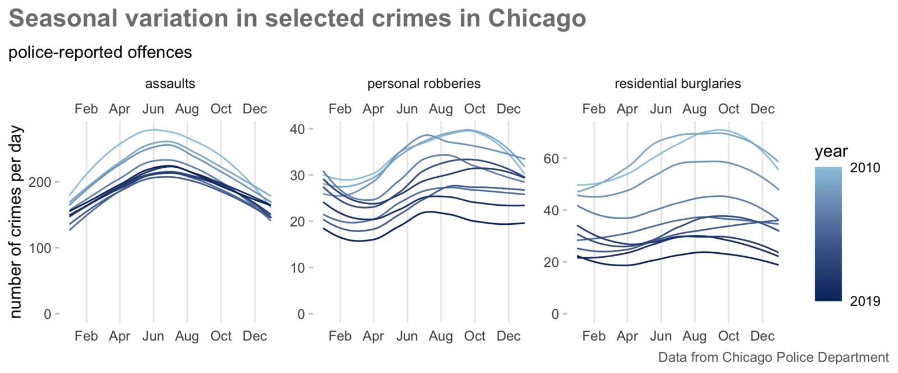
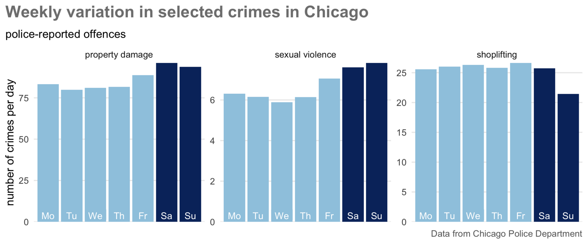
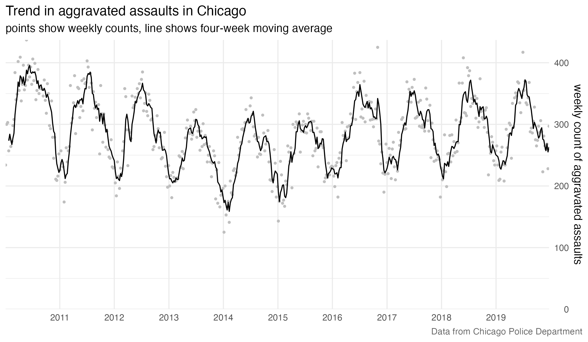
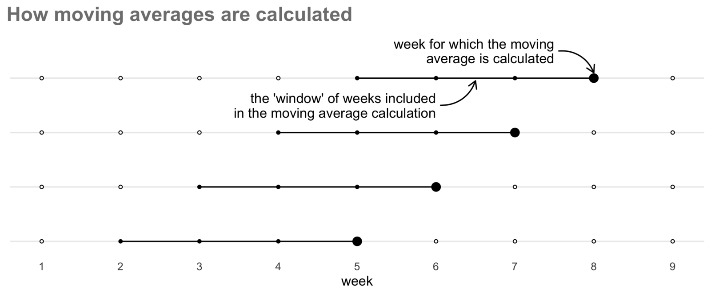

---
execute:
  freeze: auto
---

# Mapping crime over time {#sec-mapping-time}


::: {.abstract}
Understanding how crime varies over time is essential for effective crime analysis. This chapter introduces techniques for identifying short-term and long-term variations in crime. We will learn how to handle date and time data, visualise temporal changes, and create animated maps to illustrate crime trends dynamically.
:::





```{r}
#| label: setup
#| include: false

pacman::p_load(gganimate, here, httr2, sf, sfhotspot, slider, tidyverse)
```


## Introduction

In this chapter, we will learn how to:

- handle dates and times in R;
- choose appropriate temporal units of analysis for crime data;
- calculate and interpret moving averages;
- create time-series and seasonal charts;
- compare spatial crime patterns across time periods; and
- create an animated map showing how a crime pattern changes over time.

Understanding how crime varies over time is just as important as understanding how it varies between places. Very few places are hotspots of crime all the time -- business districts might be hotspots of pickpocketing in the daytime but deserted at night, while a nearby entertainment district may be quiet in the daytime but a violence hotspot at night.

Crime varies over time in lots of ways. For example, there was a long-term drop in many types of crime in many countries starting in the mid 1990s, e.g. [residential burglary in England and Wales dropped by 67% between 1993 and 2008](https://crimesciencejournal.biomedcentral.com/articles/10.1186/s40163-016-0051-z) while the number of [homicides in New York City dropped almost 90% from 2,245 in 1990 to 289 in 2018](https://www.brennancenter.org/our-work/analysis-opinion/takeaways-2019-crime-data-major-american-cities).
There are also short-term variations in crime. Many types of crime are more common at some times of year than others (known as *seasonal variation*). In Chicago between 2010 and 2019, for example, assaults, residential burglaries and personal robberies all varied throughout the year, with assaults in particular being consistently higher in summer than winter.


```{r}
#| label: chicago-seasonal-variation-charts
#| eval: false
#| echo: false
crimes <- crimedata::get_crime_data(
  years = 2010:2019,
  cities = "Chicago",
  type = "core"
)


# Seasonal chart ---------------------------------------------------------------

counts <- crimes %>%
  mutate(
    offence = case_when(
      offense_group == "assault offenses" ~ "assaults",
      offense_code == "22A" ~ "residential burglaries",
      offense_code == "12A" ~ "personal robberies",
      TRUE ~ NA
    ),
    yday = yday(date_single),
    year = year(date_single)
  ) %>%
  filter(!is.na(offence)) %>%
  count(offence, year, yday, name = "count") %>%
  mutate(date = as_date(str_glue("2012 {yday}"), format = "%Y %j"))

counts_chart <- ggplot(counts, aes(date, count, colour = year, group = year)) +
  geom_smooth(
    method = "loess",
    formula = "y ~ x",
    se = FALSE,
    size = 0.5
  ) +
  facet_wrap(vars(offence), ncol = 3, scales = "free_y") +
  scale_x_date(
    date_breaks = "2 months",
    date_labels = "%b",
    sec.axis = dup_axis()
  ) +
  scale_y_continuous(limits = c(0, NA)) +
  scale_colour_gradient(
    breaks = range(counts$year, na.rm = TRUE),
    labels = range(counts$year, na.rm = TRUE),
    low = RColorBrewer::brewer.pal(9, "Blues")[4],
    high = RColorBrewer::brewer.pal(9, "Blues")[9],
    guide = guide_colourbar(reverse = TRUE, ticks = FALSE)
  ) +
  labs(
    title = "Seasonal variation in selected crimes in Chicago",
    subtitle = "police-reported offences, 2010–2019",
    x = NULL,
    y = "number of crimes per day",
    caption = "Data from Chicago Police Department"
  ) +
  theme_minimal() +
  theme(
    axis.ticks.y = element_line(colour = "grey80"),
    panel.grid.major.y = element_blank(),
    panel.grid.minor = element_blank(),
    plot.caption = element_text(colour = "grey40"),
    plot.caption.position = "plot",
    plot.title = element_text(
      colour = "grey50",
      face = "bold",
      size = 16,
    ),
    plot.title.position = "plot",
    strip.placement = "outside"
  )

ggsave(
  filename = here::here("images", "chicago_seasonal_variation.png"),
  plot = counts_chart,
  width = 1200 / 150,
  height = 500 / 150,
  dpi = 300
)


# Weekly chart -----------------------------------------------------------------

weekly_chart <- crimes %>%
  mutate(
    offence = case_when(
      offense_code == "290" ~ "property damage",
      offense_group == "sex offenses" ~ "sexual violence",
      offense_code == "23C" ~ "shoplifting",
      TRUE ~ NA
    ),
    weekday = wday(date_single, label = TRUE, week_start = 1)
  ) %>%
  filter(!is.na(offence), !is.na(weekday)) %>%
  count(offence, weekday, name = "count") %>%
  mutate(
    count = count / (52 * 10),
    weekend = weekday %in% c("Sat", "Sun")
  ) %>%
  ggplot(aes(weekday, count, fill = weekend, label = str_sub(weekday, 1, 2))) +
  geom_col() +
  geom_label(
    aes(y = 0),
    colour = "white",
    label.size = NA,
    size = 3.25,
    vjust = 0
  ) +
  facet_wrap(vars(offence), ncol = 3, scales = "free_y") +
  scale_y_continuous(
    labels = scales::comma_format(accuracy = 1),
    expand = c(0, 0)
  ) +
  scale_fill_manual(values = c(RColorBrewer::brewer.pal(9, "Blues")[c(4, 9)])) +
  labs(
    title = "Weekly variation in selected crimes in Chicago",
    subtitle = "police-reported offences, 2010–2019",
    x = NULL,
    y = "number of crimes per day",
    caption = "Data from Chicago Police Department"
  ) +
  theme_minimal() +
  theme(
    axis.text.x = element_blank(),
    axis.title.x = element_blank(),
    legend.position = "none",
    panel.grid.major.x = element_blank(),
    panel.grid.minor = element_blank(),
    plot.caption = element_text(colour = "grey40"),
    plot.caption.position = "plot",
    plot.title = element_text(
      colour = "grey50",
      face = "bold",
      margin = margin(b = 9)
    ),
    plot.title.position = "plot"
  )

ggsave(
  filename = here::here("images", "chicago_weekly_variation.png"),
  plot = weekly_chart,
  width = 1200 / 150,
  height = 500 / 150,
  dpi = 300
)
```

```{r}
#| label: chicago-weekly-time-series-chart
#| echo: false

trend_chart <- here("data", "raw", "chicago_aggravated_assaults.csv.gz") |>
  read_csv(show_col_types = FALSE) |>
  mutate(yearweek = floor_date(as_date(date), unit = "week")) |>
  count(yearweek) |>
  slice(2:(n() - 1)) |>
  mutate(rolling_mean = slide_dbl(n, mean, .before = 3, .complete = TRUE)) |>
  ggplot(aes(x = yearweek, y = n)) +
  geom_point(colour = "grey75", size = 0.75) +
  geom_line(aes(y = rolling_mean), na.rm = TRUE) +
  scale_x_date(date_breaks = "1 year", date_labels = "%Y", expand = c(0, 0)) +
  scale_y_continuous(limits = c(0, NA), expand = c(0, 0), position = "right") +
  labs(
    title = "Trend in aggravated assaults in Chicago",
    subtitle = "points show weekly counts, line shows four-week moving average",
    caption = "Data from Chicago Police Department",
    x = NULL,
    y = "weekly count of aggravated assaults"
  ) +
  theme_minimal() +
  theme(
    panel.grid.minor.x = element_blank(),
    plot.caption = element_text(colour = "grey40"),
    plot.caption.position = "plot"
  )

ggsave(
  filename = here::here("images", "chicago_assault_trend.png"),
  plot = trend_chart,
  width = 1200 / 150,
  height = 700 / 150,
  dpi = 300
)
```


<p class="full-width-image"></p>

It is also important to understand short-term variation in crime. For example, between 2010 and 2019, both property damage and sexual violence in Chicago peaked at weekends, while there were fewer shoplifting offences on Sundays when some shops were closed or had shorter opening hours.

<p class="full-width-image"></p>

Understanding variation in crime over time is important because we can use the temporal concentration of crime to focus efforts to respond to crime most effectively. For example, imagine we wanted to deploy police patrols to a hotspot to respond to a particular crime problem. Such patrols could be very effective if they were targeted at the times when crimes were most likely to happen or completely useless if the officers were deployed at the wrong day or the wrong time.

In this chapter we will learn how to incorporate variation over time into our analysis of where crime happens, including making animated maps like this one:

<p class="centered-image"></p>


::: {.callout-quiz .callout title="Analysing temporal variation in crime"}

```{r}
#| label: time-quiz
#| echo: false

time_quiz1 <- c(
  "No, because hotspots of crime are usually hotspots at all times",
  answer = "Yes, because many crime hotspots are only hotspots some of the time",
  "No, because spatial variation in crime is usually much more important than temporal variation",
  "Yes, because crime prevention depends more on when crime occurs than on where it occurs"
)

time_quiz2 <- c(
  "Almost all types of crime are more common in the winter than in the summer",
  "Almost all types of crime are more common in the summer than in the winter",
  answer = "Different types of crime are more common at different times of year",
  "Most types of crime occur at the same frequency at all times of year"
)
```

**Is it important to think about variation over time when analysing crime patterns?**

`r webexercises::longmcq(time_quiz1)`

**Which of the following statements about seasonal variations in crime is correct?**

`r webexercises::longmcq(time_quiz2)`


:::


## Handling dates in R

<p class="full-width-image"></p>

At a very basic level, computers can store data in two ways: they can store numbers and they can store text. This makes storing dates slightly complicated, because dates aren't completely like numbers and they aren't completely like text either. Dates aren't like numbers because you can't do normal maths with dates (e.g. what date is the 29th of January plus one month?) and aren't like text because you can do some maths with them (e.g. it is easy to calculate three days from today). Dates are especially complicated because they can be written as text in so many different ways. For example, 17 January can be represented in all of these ways, all of them equally valid (although some are specific to particular countries):

  * 17/01/`r format(Sys.Date(), "%Y")`
  * 17.01.`r format(Sys.Date(), "%y")`
  * 1/17/`r format(Sys.Date(), "%Y")`
  * `r format(Sys.Date(), "%Y")`-01-17
  * 17 Jan `r format(Sys.Date(), "%y")`
  * 17 January `r format(Sys.Date(), "%Y")`
  * January 17th `r format(Sys.Date(), "%Y")`


<a href="https://lubridate.tidyverse.org/" class="no-external" aria-label="Visit the lubridate package website"></a>

R deals with this problem by _storing_ dates internally as if they were numbers and _displaying_ them (e.g. in the console or in a Quarto document) as if they were text, by default in the format ``r Sys.Date()``. Fortunately, we don't have to worry about how dates and times are stored internally in R because we can use the [lubridate package](https://lubridate.tidyverse.org/) to work with them. lubridate contains functions for working with dates, including extracting parts of a date with functions such as `month()` and converting text to date values with functions like `ymd()`.

Because of the special nature of dates, if we want to work with a date variable (for example to create a chart of crime over time) it is important that it is stored as a date, not as text or as a number. Many R functions for reading data, including `read_csv()`, `read_tsv()` and `read_excel()`, will try to recognise columns of data that contain dates and times stored in common formats. These will automatically be stored as date variables when the data is loaded.

If R does not recognise automatically that a value contains a date, we can convert it to a date by using the date-parsing functions from lubridate. Which function to use depends on the order in which the components of the date (e.g. day, month and year) appear in the variable. For example, to convert the text "17 January 1981" to a date format we can use the `dmy()` function because the **d**ay of the month comes first, the **m**onth next and then the **y**ear. Similarly, converting the text "01/17/81" needs the function `mdy()`. Note that the lubridate date-parsing functions are able to convert both numeric and text-based months, and to ignore elements that aren't needed for the conversion, such as weekday names.

If a date is stored in multiple columns in a dataset, e.g. one column for the year, one column for the month and one column for the day, we can create a single date column using the `make_date()` function to combine them. Similarly, we can create a date-time column using the `make_datetime()` function. For example, imagine we have a dataset of crimes called `thefts`:


```{r}
#| label: vancouver-thefts-example
#| echo: false

request(
  "https://mpjashby.github.io/crimemappingdata/vancouver_thefts.csv.gz"
) |>
  req_perform(path = here("data", "raw", "vancouver_thefts.csv.gz")) |>
  invisible()

thefts <- here("data", "raw", "vancouver_thefts.csv.gz") |>
  read_csv(show_col_types = FALSE) |>
  janitor::clean_names() |>
  dplyr::select(
    year,
    month_of_year = month,
    day_of_month = day,
    hour,
    minute,
    x,
    y
  ) |>
  dplyr::filter(month_of_year == 9)

thefts |>
  dplyr::slice_sample(n = 10) |>
  dplyr::arrange(month_of_year, day_of_month, hour, minute) |>
  gt::gt()
```


We could use the three columns `year`, `month_of_year` and `day_of_month` to create a column containing the full date using the code:

```{r}
#| label: make-date-example
#| filename: "Hypothetical code"

thefts |>
  mutate(
    date = make_date(year = year, month = month_of_year, day = day_of_month)
  )
```

Note that the column `date` in this tibble has the type `<date>`, which confirms that R is storing it as a date rather than as text.

Once we have converted dates stored as text to dates stored as dates, R understands that they are dates and we can do things like compare them. So while running `"Sat 17 January 1981" == "01/17/81"` to test if two dates are the same would give the answer `FALSE` (because the two pieces of text are different), once we've converted the text to date values R can tell that the two dates are the same:

```{r}
#| label: compare-identical-date-text
#| filename: "R Console"

# This code returns TRUE only because the two pieces of text are identical
"Sat 17 January 1981" == "Sat 17 January 1981"
```

```{r}
#| label: compare-different-date-text
#| filename: "R Console"

# This code returns FALSE because the two pieces of text are different, even
# though the dates they represent are the same
"Sat 17 January 1981" == "01/17/81"
```

```{r}
#| label: compare-parsed-dates
#| filename: "R Console"

# This code returns TRUE because R knows they are dates and so compares them as
# dates, finding that the two dates are the same
dmy("Sat 17 January 1981") == mdy("01/17/81")
```


### Working with dates

When analysing dates and times, it is often useful to be able to extract date or time portions. We can do this with the lubridate functions `year()`, `month()`, `wday()` (for day of the week), `mday()` (for day of the month), `yday()` (for day of the year, counting from 1 January), `hour()`, `minute()` and `second()`, each of which extracts the relevant portion of a date or time as a number. The `month()` and `wday()` functions are slightly different, because they can also return the day or month name as text by specifying the argument `label = TRUE`. We can see this by extracting the different portions of the current date and time, which we can retrieve with the `now()` function from lubridate.


```{r}
#| label: extract-date-components-code
#| eval: false
#| filename: "R Console"

message("Current year: ", year(now()))
message("Current month (as a number): ", month(now()))
message("Current month (as text, abbreviated): ", month(now(), label = TRUE))
message("Current month (as text): ", month(now(), label = TRUE, abbr = FALSE))
message("Current day of the year (days since 1 Jan): ", yday(now()))
message("Current day of the month: ", mday(now()))
message("Current day of the week (as a number): ", wday(now()))
message("Current day of the week (as text): ", wday(now(), label = TRUE))
message("Current hour of the day: ", hour(now()))
message("Current minute: ", minute(now()))
message("Current second: ", second(now()))
```


```{r}
#| label: extract-date-components-output
#| echo: false

message("Current year: ", year(now()))
message("Current month (as a number): ", month(now()))
message("Current month (as text, abbreviated): ", month(now(), label = TRUE))
message("Current month (as text): ", month(now(), label = TRUE, abbr = FALSE))
message("Current day of the year (days since 1 Jan): ", yday(now()))
message("Current day of the month: ", mday(now()))
message("Current day of the week (as a number): ", wday(now()))
message("Current day of the week (as text): ", wday(now(), label = TRUE))
message("Current hour of the day: ", hour(now()))
message("Current minute: ", minute(now()))
message("Current second: ", second(now()))
```


It is sometimes useful to be able to add to or subtract from dates. For example, if you wanted to filter a dataset so that only records from the past 28 days were included, you would need to work out the date 28 days ago. We can do this with a group of functions from lubridate that store a period of time that we can then add to or subtract from an existing date. These functions are `years()`, `months()`, `weeks()`, `days()`, `hours()`, `minutes()`, and `seconds()`.


::: {.callout-important title="Remember which lubridate functions extract parts of a date and which manipulate them"}

In the lubridate package, functions that are used to _extract_ parts of a date are _singular_, e.g. `day()`, `month()`, `year()`. Functions that are used to _manipulate_ dates by adding or subtracting from them are _plural_, e.g. `days()`, `months()`, `years()`. So, for example, you would use the code `month(now())` to extract the month (as a number between 1 and 12) from the current date but the code `now() + months(1)` to find out what the date and time will be one month from now.
:::


To subtract 28 days from today's date (which we can retrieve with the `today()` function), we would use `today() - days(28)`.

```{r}
#| label: subtract-days-example
#| filename: "R Console"

message(str_glue("Today is {today()} and 28 days ago was {today() - days(28)}"))
```

Adding or subtracting periods from dates can be very useful when combined with the `filter()` function from the dplyr package. For example, if we had a dataset of crimes stored in an object called `crimes` and wanted to extract only those that occurred in the most-recent seven days, we could do this:

```{r}
#| label: filter-recent-dates-example
#| eval: false
#| filename: "Hypothetical code"

filter(crimes, occur_date >= today() - days(7))
```

```{r}
#| label: period-setup
#| include: false

start_date <- today() - days(28 + 7)
end_date <- today() - days(7)

start_date_formatted <- case_when(
  year(start_date) == year(end_date) && month(start_date) == month(end_date) ~
    str_squish(format(start_date, "%e")),
  year(start_date) == year(end_date) ~ str_squish(format(start_date, "%e %B")),
  TRUE ~ str_squish(format(start_date, "%e %B %Y"))
)

end_date_formatted <- str_squish(format(end_date, "%e %B %Y"))
```


If we wanted to extract crimes that occurred between two dates, we can use the `between()` function from dplyr, which returns either `TRUE` or `FALSE` depending on whether each item in the first argument is between the values given in the second and third arguments (inclusive).

When filtering based on dates or times, it is important to understand that R can store dates in two ways: as a *date* object (shown as `<date>` when we print a tibble in the R Console) or as a *date-time* object (shown as `<dttm>` when we print a tibble). Date variables store only a date with no time, while date-time variables always include a time component, even if the data doesn't contain any information about time. If we store a variable that only has information about the date of an event as a date-time variable, R will silently add the time midnight to each date. This is important because if we compare a date variable to a date-time variable, R will silently convert the dates to date-times with the times set to midnight. If we are trying to filter crimes between two times, this might not be what we want. For example, if we used the code:


```{r}
#| label: between-dates-risky-example
#| eval: false
#| filename: "Hypothetical code"

between(offence_date, ymd("2021-01-01"), ymd("2021-01-31"))
```


to extract all the crimes that occurred in January 2021, that would work as we expected only if `offence_date` was a date variable. If the `offence_date` column instead held dates *and* times, R would filter the data *as if* we had specified:


```{r}
#| label: between-datetimes-expanded-example
#| eval: false
#| filename: "Hypothetical code"

between(offence_date, ymd_hm("2021-01-01 00:00"), ymd_hm("2021-01-31 00:00"))
```

which would exclude any crimes that occurred on 31 January (except those occurring at exactly 00:00 hours). To deal with this problem, we can either check to make sure the variables we are filtering on are date variables, convert them to date variables using the `as_date()` function, or assume that they might be date-time variables and specify the exact time that we want as the end of our range. For example, specifying:


```{r}
#| label: between-datetimes-complete-day-example
#| eval: false
#| filename: "Hypothetical code"

between(offence_date, ymd_hm("2021-01-01 00:00"), ymd_hm("2021-01-31 23:59"))
```


or


```{r}
#| label: between-converted-dates-example
#| eval: false
#| filename: "Hypothetical code"

between(as_date(offence_date), ymd("2021-01-01"), ymd("2021-01-31"))
```


would allow us to select all the crimes occurring in January 2021.

::: {.callout-quiz .callout title="Handling dates in R"}

```{r}
#| label: dates-quiz
#| echo: false

dates_quiz1 <- c(
  '`mdy("17/01/2025")`',
  answer = '`dmy("17/01/2025")`',
  '`ymd("17/01/2025")`',
  '`parse_date("17/01/2025")`'
)

dates_quiz2 <- c(
  "`extract_month(date)`",
  "`get_month(date)`",
  answer = "`month(date)`",
  "`date_month(date)`"
)
```


**What function from the lubridate package would you use to convert "17/01/2025" into a proper date format?**

`r webexercises::longmcq(dates_quiz1)`


**How can you extract the month from a date variable in R?**


`r webexercises::longmcq(dates_quiz2)`


:::


## Showing change over time

One common task in crime analysis is to show how crime changes over time. The simplest way to do this is to produce a *time-series chart*. For example, we can see how the frequency of aggravated assaults recorded by police in Chicago has changed over time:


<p class="full-width-image"></p>


In this section we will learn how to construct a time-series chart like this. To get started, create a new file called `chapter_15a.R` in the `R` folder of your `crime_mapping` workspace. This file will contain code to download and prepare the datasets we will use in this chapter. Now add this code, which downloads the original datasets into `data/raw`, loads the local copies and prepares them for analysis by transforming the data to use an appropriate local coordinate reference system (as we learned in @sec-choosing-projected-crs) and by filtering the data to contain only the police districts we are interested in.


```{r}
#| label: prepare-chicago-data-code
#| eval: false
#| filename: "chapter_15a.R"

# Load packages
pacman::p_load(here, httr2, sf, sfhotspot, slider, tidyverse)

# Download the original data
request(
  "https://mpjashby.github.io/crimemappingdata/chicago_aggravated_assaults.csv.gz"
) |>
  req_perform(
    path = here("data", "raw", "chicago_aggravated_assaults.csv.gz")
  )

request(
  "https://mpjashby.github.io/crimemappingdata/chicago_police_districts.kml"
) |>
  req_perform(path = here("data", "raw", "chicago_police_districts.kml"))

# Load Chicago aggravated assault data
assaults <- here("data", "raw", "chicago_aggravated_assaults.csv.gz") |>
  read_csv(show_col_types = FALSE)

# Load dataset of Chicago Police Department (CPD) district boundaries
cpd_districts <- here("data", "raw", "chicago_police_districts.kml") |>
  read_sf() |>
  janitor::clean_names() |>
  # Transform this object to use a suitable local coordinate reference system
  st_transform("EPSG:26916")

# Create a separate dataset holding just the boundaries of the three CPD
# districts covering the downtown area
cpd_central <- filter(cpd_districts, name %in% c("1", "12", "18"))
```


```{r}
#| label: prepare-chicago-data
#| echo: false

# Load packages
pacman::p_load(here, httr2, sf, sfhotspot, slider, tidyverse)

# Download the original data
request(
  "https://mpjashby.github.io/crimemappingdata/chicago_aggravated_assaults.csv.gz"
) |>
  req_perform(
    path = here("data", "raw", "chicago_aggravated_assaults.csv.gz")
  )

request(
  "https://mpjashby.github.io/crimemappingdata/chicago_police_districts.kml"
) |>
  req_perform(path = here("data", "raw", "chicago_police_districts.kml"))

# Load Chicago aggravated assault data
assaults <- here("data", "raw", "chicago_aggravated_assaults.csv.gz") |>
  read_csv(show_col_types = FALSE)

# Load dataset of Chicago Police Department (CPD) district boundaries
cpd_districts <- here("data", "raw", "chicago_police_districts.kml") |>
  read_sf() |>
  janitor::clean_names() |>
  # Transform this object to use a suitable local coordinate reference system
  st_transform("EPSG:26916")

# Create a separate dataset holding just the boundaries of the three CPD
# districts covering the downtown area
cpd_central <- filter(cpd_districts, name %in% c("1", "12", "18"))
```


The first task in charting the frequency of crime is to choose a temporal *unit of analysis*. For example, the chart above counts the number of crimes each *week*. Weeks are often a good choice as units for counting crimes, since all weeks are the same length and because many human activities have a weekly cycle (e.g. people do different things at weekends than on weekdays, even though which days count as weekdays differs across cultures).


::: {.callout-important title="Months are usually a bad choice of temporal unit of analysis"}

Months are much less useful than weeks as a temporal unit of analysis because months differ in length, so monthly counts of crime will look like they show some variation even if the amount of crime occurring each day remains constant. For example, if exactly 10 crimes occur every day throughout February and March, there will be `r scales::comma(10 * 28, accuracy = 1)` or `r scales::comma(10 * 29, accuracy = 1)` crimes in February (depending on whether it is a leap year) but `r scales::comma(10 * 31, accuracy = 1)` in March. In these circumstances, it will look like the volume of crime increased by `r scales::percent(((10 * 31) - (10 * 28)) / (10 * 28))` between February and March, not because the rate at which crimes occurred increased but because March is `r scales::percent(((10 * 31) - (10 * 28)) / (10 * 28))` longer than February.

Converting monthly counts to average daily rates deals with differences in the number of days per month, but does not solve every problem. Months contain different numbers of each weekday (e.g. one month might have four Fridays while the next has five), and crimes are typically concentrated on particular days of the week (more on that later). **Avoid using months as the temporal unit of analysis** unless there is a clear reason to use them, such as only having data available as monthly counts.
:::


To count the number of crimes occurring each week we can use the `count()` function from the dplyr package. But before doing that, we have to allocate each crime to a week so that we can then count those weeks rather than counting days. To do this we use the `floor_date()` function from the lubridate package. This function rounds dates down to the start of a specified unit of time, in this case a week. By default, `floor_date()` treats Sunday as the start of the week and so if the specified unit of time is a week, all dates will be rounded down to the date of the previous Sunday.

`floor_date()` works on date variables, so if we want to use it on a date-time variable we should first convert it to a date variable using the `as_date()` function from lubridate. So to convert a date-time stored in a variable called `date` into the date of the first day of that week, we would use the code `floor_date(as_date(date), unit = "week")`.

One complication of counting incidents by week is that our data might not fit neatly into calendar weeks. For example, if we have data for a particular year and that year started on a Tuesday, the first weekly count will only have data for five days and it will look like there were fewer crimes that week in comparison to other weeks. This could be misleading, since this week only looks like it has less crime because we don't have data for the whole week. The same problem can happen with the last week of data, too. To deal with this, after counting the crimes by week we will remove the first and last row of the data using the `slice()` function from the dplyr package.

```{r}
#| label: count-weekly-assaults
#| filename: "chapter_15a.R"

# Count number of aggravated assaults each week
assault_weekly_counts <- assaults |>
  # Convert offence dates so that it appears each offence happened on the first
  # day (Sunday) of the week
  mutate(week_date = floor_date(as_date(date), unit = "week")) |>
  # Count the number of assaults each week
  count(week_date, name = "count") |>
  # The code `(n() - 1)` gives us the row number of the second-to-last row in
  # the data because `n()` returns the number of rows in the data. Note the
  # parentheses!
  slice(2:(n() - 1))
```

```{r}
#| label: preview-weekly-assault-counts
#| filename: "R Console"

head(assault_weekly_counts)
```


Now we have weekly counts of aggravated assaults, we can plot them on a chart. As we learned in @sec-no-maps, we can use `ggauto::ggauto()` to create a basic chart automatically.


```{r}
#| label: fig-weekly-assaults-chart-ggauto
#| filename: "R Console"
#| fig-cap: ""
#| fig-alt: "Time-series chart of weekly aggravated-assault counts in Chicago between 2010 and 2019, showing a downward trend until 2014, seasonal peaks and substantial week-to-week variation."

assault_weekly_counts |> ggauto::ggauto(week_date, count)
```

This chart already tells us quite a lot about how the frequency of assaults in Chicago has changed over time. For example, we can see a downward trend in assaults from 2010 to 2014, after which the frequency seems to have gone up somewhat. More obviously, we can see that there is strong seasonality in the frequency of assaults, with assaults peaking in the summer months and falling in the winter months. Finally, we can see there is a lot of short-term variation in the frequency of assaults, with the number of assaults varying substantially from one week to the next.


### Signal versus noise in temporal data

One issue created by the short-term variation in assaults visible in @fig-weekly-assaults-chart-ggauto is that it can be hard to see the longer-term trends in the data. While this week-to-week short-term variation is real, we often refer to this type of short-term variation as *noise* because it can obscure the *signal* of longer-term trends. This terminology originally came to statistics -- and therefore crime analysis -- from radio engineering, but has become common over time.

The key decision in making a time-series chart is usually choosing the balance between removing (or de-emphasising) the noise in a time series sufficiently to make longer-term trends easier to see, while not removing so much noise that we lose important information about the short-term variation. For example, if we tried to plot hourly counts of assaults in Chicago, there would be so much noise that it would be hard to see any long-term trends:


```{r}
#| label: hourly-assault-noise-chart
#| echo: false
#| fig-asp: 0.6
#| fig-alt: "Scatter plot of hourly aggravated-assault counts in Chicago between 2010 and 2019, with dense variation making the long-term trend difficult to see."

assaults |>
  mutate(
    date_hour = make_datetime(
      year = year(date),
      month = month(date),
      day = day(date),
      hour = hour(date)
    )
  ) |>
  count(date_hour, name = "count") |>
  ggplot() +
  aes(x = date_hour, y = count) +
  geom_point(alpha = 0.1) +
  scale_x_datetime(date_breaks = "1 year", date_labels = "%Y") +
  scale_y_continuous(expand = expansion()) +
  labs(
    subtitle = "each dot represents one hourly count of assaults",
    x = NULL,
    y = "hourly count of assaults"
  ) +
  theme_minimal() +
  theme(
    panel.grid.major.x = element_blank(),
    panel.grid.minor.x = element_blank()
  )
```

On the other hand, if we removed too much noise, for example by only plotting annual counts of assaults, we would remove most of the information (or signal) contained in the data about how assaults vary over time. While we would be able to see some of the long-term trend (although not whether the trend changed mid-year or between years), we would lose all information about the seasonal and the week-to-week variation in assaults:


```{r}
#| label: annual-assault-count-chart
#| echo: false
#| fig-asp: 0.6
#| fig-alt: "Bar chart of annual aggravated-assault counts in Chicago between 2010 and 2019, showing the broad long-term trend but hiding seasonal and weekly variation."

assaults |>
  mutate(year = factor(year(date))) |>
  count(year, name = "count") |>
  ggplot() +
  aes(x = year, y = count) +
  geom_col() +
  scale_y_continuous(labels = scales::comma, expand = expansion()) +
  labs(
    x = NULL,
    y = "annual count of assaults"
  ) +
  theme_minimal() +
  theme(
    panel.grid.major.x = element_blank(),
    panel.grid.minor.x = element_blank()
  )
```


Striking the balance between removing noise while retaining information is one of those choices that partly depends on your experience as an analyst. One way to work out what balance to strike is to consider the needs of the audience you are producing analysis for. For example, if you are producing a chart for a city mayor who is interested in the long-term trend in assaults, it might be appropriate to remove more noise than if you were producing a chart for a local police commander that is more interested in the short term.


### Adding a moving average

One way to reduce the visual impact of noisy short-term variation on our chart is by adding a line showing a *moving average* (also called a *rolling average* or *rolling mean*) of the count of crime over time. A moving average is the average (or mean) of the count of crimes in the current week and a given number of adjacent (in this case, previous) weeks.

To add a moving average to our time-series chart, we need to move from using `ggauto()` to constructing the plot ourselves with the ggplot2 package that we learned about in @sec-no-maps. To start with, we will create a chart that shows each weekly count as a dot. We can then add a line showing the moving average.

Run this code in the R Console. Make sure you understand (using the notes below the chart) why we are using `aes()` here in two different ways.

```{r}
#| label: weekly-assault-points-chart
#| filename: "R Console"
#| fig-alt: "Time-series chart showing weekly aggravated-assault counts in Chicago between 2010 and 2019 as grey points."

# Create plot of weekly assault counts with moving average
assault_weekly_counts |>
  ggplot() +
  # Specify aesthetics that will be used by all layers in the plot
  aes(x = week_date) + #<1>
  # Add points showing weekly counts of assaults
  geom_point(aes(y = count), colour = "grey75", size = 0.75) + #<2>
  theme_minimal()
```
1. We specify that the x-axis of the chart will be controlled by the `week_date` column in the `assault_weekly_counts` tibble. We specify that in the `aes()` function that's added to `ggplot()` because the x-axis will be the same for all layers in the plot.
2. We specify that the y-axis for the points layer will be controlled by the `count` column in the `assault_weekly_counts` tibble. We specify that in the `aes()` function that's added _inside_ the `geom_point()` function because the column controlling the y-axis will be different for this layer than for other layers we will add later.

We can now think about adding the moving average. Moving averages are calculated by plotting the mean frequency of assaults of a number of adjacent periods (weeks, in this case) instead of (or in addition to) the actual frequency of assaults in each period. For example, a four-week moving average would be calculated by averaging the counts of assaults in weeks 1, 2, 3 and 4. The moving average for week 5 would be calculated by averaging the counts of assaults in weeks 2, 3, 4 and 5, and so on.


```{r}
#| label: moving-averages-chart
#| eval: false
#| echo: false
ma <- tibble(
  period = rep(2:5, times = 4),
  week = rep(1:4, each = 4)
) %>%
  mutate(period = period + (week - 1), included = TRUE) %>%
  complete(period, week, fill = list(included = FALSE)) %>%
  add_row(period = 1, week = 1:4, included = FALSE) %>%
  add_row(period = 9, week = 1:4, included = FALSE) %>%
  arrange(week, period) %>%
  group_by(week) %>%
  mutate(
    last = (lead(included) != included &
      !is.na(lead(included)) &
      included == TRUE) |
      (included == TRUE & row_number() == n())
  ) %>%
  ungroup()

ggplot(ma) +
  geom_point(aes(period, week, fill = included, size = last), shape = 21) +
  geom_line(
    aes(period, week, group = week),
    data = filter(ma, included),
    show.legend = FALSE
  ) +
  annotate(
    "curve",
    x = 7.55,
    y = 4.5,
    xend = 8,
    yend = 4.1,
    curvature = -0.35,
    arrow = arrow(length = unit(0.5, "lines"))
  ) +
  annotate(
    "text",
    x = 7.5,
    y = 4.5,
    hjust = 1,
    label = "week for which the moving\naverage is calculated",
    lineheight = 0.9
  ) +
  annotate(
    "curve",
    x = 6.05,
    y = 3.5,
    xend = 6.5,
    yend = 3.95,
    curvature = 0.35,
    arrow = arrow(length = unit(0.5, "lines"))
  ) +
  annotate(
    "text",
    x = 6,
    y = 3.5,
    hjust = 1,
    label = "the 'window' of weeks included\nin the moving average calculation",
    lineheight = 0.9
  ) +
  scale_x_continuous(n.breaks = 10) +
  scale_y_continuous(minor_breaks = NULL, expand = c(0.05, 0.1)) +
  scale_fill_manual(
    values = c(`TRUE` = "black", `FALSE` = "white")
  ) +
  scale_size_manual(
    values = c(`TRUE` = 3, `FALSE` = 1)
  ) +
  labs(
    title = "How moving averages are calculated",
    x = "week"
  ) +
  theme_minimal() +
  theme(
    axis.text.y = element_blank(),
    axis.title.y = element_blank(),
    legend.position = "none",
    legend.title = element_blank(),
    panel.grid.major.x = element_blank(),
    panel.grid.minor.x = element_blank(),
    plot.caption = element_text(colour = "grey40"),
    plot.caption.position = "plot",
    plot.title = element_text(
      colour = "grey50",
      face = "bold",
      size = 16,
      margin = margin(b = 9)
    ),
    plot.title.position = "plot"
  )

ggsave(
  filename = here::here("images", "moving_averages.png"),
  width = 1200 / 150,
  height = 500 / 150,
  dpi = 300
)
```


<p class="full-width-image"></p>


Since moving averages show the average count of crime over several weeks, they are less influenced by week-to-week variation. To calculate a moving average we have to choose how many weeks to include (known as the *window* of the moving average). The more weeks we include in the window, the smoother the values will appear from week to week and the more short-term variation will be obscured. There is a balance to be struck between making longer-term trends clear and obscuring genuine short-term variation, so you should experiment with different window lengths to ensure you are not over-smoothing.

We can calculate moving averages in R with the `slide_dbl()` function from the [slider package](https://slider.r-lib.org/) (so called because its functions slide along a series of values). `slide_dbl()` can calculate several types of moving averages, so we specify that it should use the `mean()` function to calculate the average by specifying `.f = mean` (note the lack of parentheses after `mean`). We use the `.before` argument (note the `.`) to specify how many weeks *before the current week* to include in our moving average. So if we wanted to calculate a four-week moving average (i.e. the current week and the previous three weeks), we would specify `.before = 3`.
We also specify `.complete = TRUE` to stop `slide_dbl()` from trying to calculate averages for the first few weeks in our data, because we don't have the necessary data from previous weeks (i.e. before the start of our data) that we would need to make these averages accurate. `slide_dbl()` will use `NA` as the moving average value for those weeks, so we later need to specify `na.rm = TRUE` to tell `ggplot()` to ignore these when we plot the data.

Once we've calculated a moving average, we can show this using the line on our chart on top of the existing points, to show the longer-term trends and how much short-term variation there is in the data.

Add this code to the `chapter_15a.R` file and run it. You can see we are also adding some other functions to the `ggplot()` stack, which are explained in the notes below the code.


```{r}
#| label: plot-assault-moving-average
#| filename: "chapter_15a.R"
#| fig-alt: "Chart of weekly aggravated-assault counts in Chicago between 2010 and 2019, with points showing weekly counts and a line showing a four-week moving average."

# Create plot of weekly assault counts with moving average
assault_weekly_counts |>
  # Calculate moving average
  mutate(moving_avg = slide_dbl(count, mean, .before = 3, .complete = TRUE)) |>
  ggplot() +
  # Specify which columns in the data will control which parts of the chart
  aes(x = week_date) +
  # Add points showing weekly counts of assaults
  geom_point(aes(y = count), colour = "grey75", size = 0.75) +
  # Add line showing moving average
  geom_line(aes(y = moving_avg), na.rm = TRUE) +
  # Specify how dates should be shown on the x axis
  scale_x_date(date_breaks = "1 year", date_labels = "%Y", expand = c(0, 0)) + #<1>
  # Make sure y axis starts at zero
  scale_y_continuous(limits = c(0, NA), expand = c(0, 0), position = "right") + #<2>
  # Add labels
  labs(
    title = "Trend in aggravated assaults in Chicago",
    subtitle = "points show weekly counts, line shows four-week moving average",
    caption = "Data from Chicago Police Department",
    x = NULL,
    y = "weekly count of aggravated assaults"
  ) +
  theme_minimal() +
  theme(
    panel.grid.minor.x = element_blank(),
    plot.caption = element_text(colour = "grey40"),
    plot.caption.position = "plot"
  )
```
1. `scale_x_date()` controls the appearance of the horizontal (x) axis on the chart. The `date_breaks = "1 year"` argument specifies that we want a label at the start of each year, the `date_labels = "%Y"` argument uses a code to specify that we want each label to be a four-digit year, and the `expand = c(0, 0)` argument specifies that we want to remove the default extra space that ggplot2 adds at the ends of the axis. You can find a full list of codes used to specify different parts of a date and time in the axis labels by typing `?strptime` in the R Console.
2. `scale_y_continuous()` controls the appearance of the vertical (y) axis on the chart. The `limits = c(0, NA)` argument specifies that we want the y axis to start at zero, and (by specifying `NA`) to finish at the maximum value in the data. The `expand = c(0, 0)` argument specifies that we want to remove the default extra space that ggplot2 adds at the ends of the axis. The `position = "right"` argument specifies that we want the y axis to be shown on the right-hand side of the chart rather than on the left-hand side, which is ggplot2's default. We put the y-axis on the right-hand side because the most-recent values in a time-series chart (which are on the right-hand end of the time series) are normally of most interest.

You can experiment with the effect of setting a longer or shorter window for the moving average by specifying larger or smaller values of the `.before` argument to `slide_dbl()`. For example, create an eight-week moving average by specifying
`.before = 7`. What would happen to the apparent seasonal variation in the number of assaults (visible in the chart above) if you create a *52-week moving average* by specifying `.before = 51`?


::: {.callout-tip collapse="true" title="Why does this `ggplot()` stack have three calls to `aes()`?"}

The `aes()` function is used to specify which columns in the data will control which parts of the chart. We can use `aes()` in two ways. If we add `aes()` directly to the stack just after `ggplot()`, that will specify which columns in the data will control the appearance of _all_ the layers on the chart. Conversely, if we specify `aes()` inside one of the `geom_*()` family of functions, that will only affect the appearance of that specific layer.

In the code above, we use `aes()` first to specify that the horizontal position of data in _all_ the layers should be controlled by the `week_date` column in the data. We then use `aes()` inside both `geom_point()` and `geom_line()` to specify which (different) columns in the data should be used to control the vertical position of the points and lines.
:::


## Showing repeating patterns over time

We have already seen that there is seasonal variation in the number of aggravated assaults in Chicago. As is very common for assaults, there are more offences in the summer and fewer in the winter. We can see this in the time-series chart we have already produced, but it's hard to see the detail. For example, we might want to know how consistent this seasonal variation is across different years. Is it, for example, consistent enough that the local police might want to restrict the number of officers who can take holidays in certain weeks of the year to maximise the number of officers available when violent crime is likely to be highest?

To do this we can create a *seasonal chart*. This can be used to show any type of repeating variation, but is often used to show patterns across a year (hence the name). To create a seasonal plot we need to add a variable to our data specifying which year each weekly count belongs to, which we can do by using the `year()` function to extract the year from the offence dates. We can do this at the same time as we calculate the moving averages. Once we've done that, we can specify that we want our chart to have a separate line for each year by setting `group = year` inside the `aes()` function that controls how the data are shown on the chart, making each year a different colour using `colour = year`.

Run this code in the R Console. Note that since there is quite a lot of noise in the weekly counts, this chart uses an eight-week moving average (using the `.before = 7` argument to `slide_dbl()`) to make the seasonal pattern clearer.


```{r}
#| label: initial-seasonal-assault-chart
#| filename: "R Console"
#| fig-alt: "Line chart showing eight-week moving averages of weekly aggravated-assault counts between 2010 and 2019, with a separate colour for each year."

# Create a seasonal plot of aggravated assaults
assault_weekly_counts |>
  mutate(
    # Create an eight-week moving average
    moving_avg = slide_dbl(count, mean, .before = 7, .complete = TRUE),
    # Create a new column showing just the year
    year = year(week_date)
  ) |>
  ggplot() +
  # Specify which columns in the data should control which parts of the chart
  aes(x = week_date, y = moving_avg, colour = year, group = year) +
  # Add lines
  geom_line(na.rm = TRUE) +
  # Specify how dates should be shown on the x axis
  scale_x_date(date_breaks = "1 year", date_labels = "%Y") +
  # Make sure y axis starts at zero
  scale_y_continuous(limits = c(0, NA)) +
  # Specify that the legend should be labelled with whole numbers
  scale_colour_continuous(breaks = c(2010, 2013, 2016, 2019)) +
  # Add labels
  labs(
    x = NULL,
    y = "moving average of weekly count of aggravated assaults",
    colour = NULL
  ) +
  theme_minimal() +
  theme(
    panel.grid.minor.x = element_blank()
  )
```


This chart might not look like you expected it to. Although the grouping of the lines by year has worked (there is a break between the lines at the start of each year), it's no easier to compare the seasonal patterns across years. Comparing years would be much easier if we superimpose the weekly counts for each year on top of one another.

To do this, we need to trick `ggplot()` into plotting all the weekly counts as if they occurred in a single year, so the counts appear in the same locations on the horizontal axis of the chart, whichever year they occurred in. We can do this by creating a fake date value for each weekly count which has the same month and day of the month as the original date, but a single year across all the rows in the data. We will create this pseudo date by extracting the month and day of the month using the `month()` and `mday()` functions from the lubridate package, then creating a new date with `make_date()`.

Add this code to the end of your R script file and run it.


```{r}
#| label: plot-seasonal-assault-chart
#| filename: "chapter_15a.R"
#| fig-alt: "Seasonal chart superimposing eight-week moving averages of weekly aggravated-assault counts for each year from 2010 to 2019, showing a recurring summer peak and winter trough."

# Create a seasonal plot of aggravated assaults
assault_weekly_counts |>
  mutate(
    # Create an eight-week moving average
    moving_avg = slide_dbl(count, mean, .before = 7, .complete = TRUE),
    # Create a new column showing just the year
    year = year(week_date),
    # By only specifying the `month` and `day` arguments to `make_date()` we
    # will create a date in 1970 (the year that R uses by default), but that
    # doesn't matter because we are not going to show the year on the chart
    pseudo_date = make_date(month = month(week_date), day = mday(week_date))
  ) |>
  ggplot() +
  # Specify which columns in the data should control which parts of the chart
  aes(x = pseudo_date, y = moving_avg, colour = year, group = year) +
  # Add lines
  geom_line(na.rm = TRUE) +
  # Specify how dates should be shown on the x axis
  scale_x_date(date_breaks = "1 month", date_labels = "%b") +
  # Make sure y axis starts at zero
  scale_y_continuous(limits = c(0, NA)) +
  # Specify that the legend should be labelled with whole numbers
  scale_colour_continuous(breaks = c(2010, 2013, 2016, 2019)) +
  # Add labels
  labs(
    x = NULL,
    y = "moving average of weekly count of aggravated assaults",
    colour = NULL
  ) +
  theme_minimal() +
  theme(
    panel.grid.minor.x = element_blank()
  )
```


From this chart we can see that assaults consistently peak in July, although in one year they peaked slightly earlier in late June and in one year slightly later in August. At the other end of the year, weekly counts of assaults are almost always least frequent in late January and throughout February before starting to increase quite rapidly in March.

As well as showing seasonal variation, we can use the same technique to understand variation over other periods of time. For example, since we know a lot of human activities follow weekly patterns, we might want to produce a chart showing the number of crimes in each hour on each day of the week.

To do this, we:

  1. Extract the weekday and hour components of each date using `wday()` and `hour()`.
  2. Count the total number of crimes occurring in each hour of each day *across all ten years of the data* using `count()`.
  3. Create a pseudo-date-time using `make_datetime()`.

We can do this in a single piece of code. Add this R code to the R script file just after the code that creates the `assault_weekly_counts` object. Remember to run this chunk of code.


```{r}
#| label: count-hourly-assaults
#| filename: "chapter_15a.R"

# Create counts of assaults by hours of the day and week
assault_hourly_counts <- assaults |>
  # Extract day of the week and hour of the day from the date column
  mutate(wday = wday(date, label = TRUE), hour = hour(date)) |>
  # Count crimes for each hour of each day of the week
  count(wday, hour, name = "count") |>
  # By only setting the `hour` argument to `make_datetime()` we will create a
  # date-time on 1 January 1970, but that doesn't matter because we will not
  # show the date on the chart
  mutate(pseudo_date = make_datetime(hour = hour))
```


We can now create a chart with appropriate labels on the horizontal axis and a suitable qualitative colour scheme to show the days of the week using `scale_colour_brewer()`.


```{r}
#| label: fig-hourly-assault-chart
#| filename: "R Console"
#| fig-cap: ""
#| fig-alt: "Line chart comparing hourly aggravated-assault totals for each day of the week in Chicago between 2010 and 2019."

# Create chart of assaults by hour of the day for each day of the week
ggplot(assault_hourly_counts) +
  # Specify which columns in the data should control each part of the chart
  aes(x = pseudo_date, y = count, colour = wday, group = wday) +
  # Add lines
  geom_line() +
  # Specify how dates should be shown on the x axis
  scale_x_datetime(date_breaks = "2 hours", date_labels = "%H:%M") +
  # Make sure y axis starts at zero and labels have thousands separators
  scale_y_continuous(limits = c(0, NA), labels = scales::comma_format()) +
  # Specify a qualitative colour scheme should be used
  scale_colour_brewer(type = "qual") +
  # Add labels
  labs(
    x = NULL,
    y = "hourly total of aggravated assaults, 2010–2019",
    colour = NULL
  ) +
  theme_minimal()
```


On this chart you can see that there are two distinct temporal patterns of assaults on different days of the week. Between Mondays and Thursdays, assaults peak between about 14:00 and 21:00 before reducing to a very low level at about 05:00. At the weekend, the picture is different: assaults peak between midnight and 02:00 on both Saturdays and Sundays (i.e. very late on Friday and Saturday evenings). In fact, there are more aggravated assaults between midnight and 03:00 on Saturdays and Sundays than at any other time of the week.


### Small-multiple charts {#sec-small-multiple}

@fig-hourly-assault-chart probably uses the maximum number of different colours for days of the week that we could use before some of the colours became too similar to one another to be distinguishable. But even with this many colours, it might not be easy for a colour-blind person to translate between the colours of the lines and the colours in the legend. When you find that there are too many colours on a chart, this is a good sign that you should consider using an alternative approach called _small-multiple charts_ instead. Small-multiple charts are a way of showing several related data series in separate panels next to one another, to make it easier to see the details of each series while still being able to compare them to one another.

We can convert @fig-hourly-assault-chart into a small-multiple chart by splitting the data into two panels: one for weekdays and one for weekends. This will make it easier to see the details of each pattern, while still being able to compare them to one another. We can do this by (a) adding a column to the data specifying whether each day is a weekday or on a weekend, then (b) adding `facet_grid()` to our `ggplot()` stack.

Add this code to the `chapter_15a.R` file and run it.

```{r}
#| label: plot-faceted-hourly-assault-chart
#| filename: "chapter_15a.R"
#| fig-asp: 1
#| fig-alt: "Two-panel line chart comparing hourly aggravated-assault totals by day of the week, with weekdays in one panel and Saturday and Sunday in the other."

# Create chart of assaults by hour of the day for each day of the week
assault_hourly_counts |>
  # Create a new column specifying if each day is a weekday or weekend
  mutate(weekend = if_else(wday %in% c("Sat", "Sun"), "Sat–Sun", "Mon–Fri")) |>
  ggplot() +
  # Specify which columns in the data should control each part of the chart
  aes(x = pseudo_date, y = count, colour = wday) +
  # Add lines
  geom_line(linewidth = 1) +
  # Assign the facets to rows so that we can compare the same time on different
  # days more easily (change `rows` to `cols` to see the alternative)
  facet_grid(rows = vars(weekend)) +
  # Specify how dates should be shown on the x axis
  scale_x_datetime(date_breaks = "2 hours", date_labels = "%H:%M") +
  # Make sure y axis starts at zero and labels have thousands separators
  scale_y_continuous(limits = c(0, NA), labels = scales::comma_format()) +
  # Specify a qualitative colour scheme should be used
  scale_colour_brewer(type = "qual") +
  # Add labels
  labs(
    x = NULL,
    y = "hourly total of aggravated assaults, 2010–2019",
    fill = NULL
  ) +
  theme_minimal()
```


This shows the two distinct patterns (weekdays and weekends) more clearly, while also letting us see that Friday is not like other weekdays since the peak in assaults continues later in the evening.


::: {.callout-quiz .callout title="Showing change over time"}

```{r}
#| label: change-quiz
#| echo: false

change_quiz1 <- c(
  "A one-time spike in burglary due to a major event",
  "A steady decline in homicide rates over 10 years",
  answer = "An increase in shoplifting before major holidays each year",
  "A sudden crime wave in an area with no prior incidents"
)

change_quiz2 <- c(
  "By examining a single week's worth of data",
  "By only focusing on yearly statistics",
  "By assuming all crime trends follow a predictable cycle",
  answer = "By analysing each type of temporal variation (e.g. seasonal, weekly) separately"
)

change_quiz3 <- c(
  answer = "It smooths out short-term fluctuations to highlight longer-term trends",
  "It removes all variations in crime data",
  "It replaces the need for crime maps",
  "It predicts the exact time and location of future crimes"
)
```


**Which of the following is an example of a repeating pattern in crime data?**

`r webexercises::longmcq(change_quiz1)`


**How can temporal analysis of crime deal with the multiple ways in which crime varies over time?**

`r webexercises::longmcq(change_quiz2)`


**What does a moving average help with when analysing crime trends?**

`r webexercises::longmcq(change_quiz3)`


:::


## How to map change over time

Time-series or seasonal charts are often the best way to show change in the frequency of crime over time. But it can also be useful to show maps of the patterns of crimes at different points in time. We might, for example, want to show the density of crime in an area for different periods in time.

Choosing how to divide up time into periods is an important step in this process, because in doing so we are converting a continuous variable (time) into a number of categories (periods of time). Whenever we convert a continuous variable to a categorical one we inevitably lose information. For example, if we decided to categorise the maximum temperature every day as being either 'hot' or 'cold', we would lose a lot of information about whether a particular day was moderately hot, very hot, etc. The same is true of time, since by splitting time into periods (hours, days, weeks, etc.) we lose information about variations within each period. This is inevitable, since we can't produce infinite maps showing all the infinite moments in time, but it is the reason why choosing periods carefully is important.

When choosing a period over which to count crime, it is important not to just use default periods like the day from 00:00 to 23:59 just because that is the standard definition of a day. As we saw in the previous section, the peaks of many types of crime like assaults cross over the boundaries between days because the peak frequency is late in the evening. For this reason it may be better to, for example, define a day as a period from 05:00 to 04:59 and count the number of crimes within each day according to that definition. This takes advantage of the fact that very few crimes concentrate in the early hours of the morning.

Sometimes, it will be easy to choose periods because they will be dictated by the purpose for which you're creating the map. In this section we will create separate maps showing the density of aggravated assaults in a part of Chicago for each of the standard Chicago Police shifts of 06:00 to 13:59, 14:00 to 21:59 and 22:00 to 05:59 (bearing in mind that the actual hours some officers work may differ slightly).

To do this, we will estimate the density of assaults separately for each shift period, then combine the three density layers and plot them on small-multiple maps. First, we create a new object containing data for the Chicago Police districts we are interested in with a column showing which police shift each assault occurred in.

We can construct this column using the `case_when()` function from dplyr. `case_when()` allows us to specify any number of tests that we can apply to our data -- when a test is passed the function assigns the corresponding label to that row (the label is separated from the test by a tilde character `~`). `case_when()` is like `case_match()`, but for when we need to test for more-complicated things than just whether a variable has a particular value.

Add this code to your R script file just after the code that creates the `assault_hourly_counts` object. Remember to run the code.


```{r}
#| label: prepare-assaults-by-shift
#| filename: "chapter_15a.R"

# Calculate number of assaults by shift
assaults_by_shift <- assaults |>
  # Restrict counts to just the central area of Chicago
  filter(district %in% c(1, 12, 18)) |>
  mutate(
    shift = case_when(
      between(hour(date), 6, 13) ~ "06:00 to 13:59",
      between(hour(date), 14, 21) ~ "14:00 to 21:59",
      hour(date) >= 22 | hour(date) < 6 ~ "22:00 to 05:59",
      TRUE ~ NA
    )
  ) |>
  # Convert the data to an SF object
  st_as_sf(coords = c("longitude", "latitude"), crs = "EPSG:4326") |>
  # Transform it to a coordinate reference system based on metres
  st_transform("EPSG:26916")
```


::: {.callout-tip collapse="true" title="Why did we include `TRUE ~ NA` in `case_when()`?"}

`case_when()` uses a series of true/false tests to create a variable, usually based on the values of other columns in the data. To make sure that every row in the dataset is matched by at least one of the tests, it is common practice to include a final test that is always true. The easiest way to do this is to simply create a test with the fixed value `TRUE`, since `TRUE` is always true!

This catch-all test must be the last test within the `case_when()` function, because `case_when()` runs the tests in the order in which they are given and stops testing a given row in the data as soon as a test produces a true value.

In this case, we will set the label for this last test to be `NA` to catch any rows that have missing values of `date` or aren't matched by any of our tests. Since our tests between them cover all the hours of the day, there shouldn't be any rows that are not matched by at least one test, but including a catch-all test makes it easier to catch any problems with our code.

There's lots more to learn about the `case_when()` function: you can find out more by looking at the [`case_when()` page on the dplyr package website](https://dplyr.tidyverse.org/reference/case_when.html).

:::


```{r}
#| label: preview-assaults-by-shift
#| filename: "R Console"

head(assaults_by_shift)
```


The next step is to produce a kernel density (KDE) layer for assaults occurring in each shift. In a previous chapter we learned how to do this using the sfhotspot package. We could run the `hotspot_kde()` function from that package three times to create the KDE layers for each shift, but there is a simpler way to apply the same function to different parts of a dataset using the `group_modify()` function from `dplyr`.

Normally, when we use a function to modify a dataset, that function is applied to the dataset as a whole. With `group_modify()`, we can apply a function to different parts of a dataset separately but still get the result as a single tibble with a column showing which group each row relates to (which is what we need to produce a map).

`group_modify()` needs two inputs. The first is a _grouped_ dataset. We have practised using the `group_by()` function to specify which column in a dataset represents the group each row belongs to. The second input is the function we want to use to modify each group. We will provide this function in a compact format called a _lambda function_. You do not need to understand all the details of how lambda functions work, but you should note two things:

  1. A lambda function starts with a backslash followed by parentheses containing names for its inputs, such as `\(x, ...)`.
  2. Inside the lambda function, `x` represents the data in each group. The `...` accepts an additional input supplied by `group_modify()` that we do not need to use here.

So this code:

```{r}
#| label: group-modify-example
#| eval: false
#| filename: "Hypothetical code"

some_data |>
  group_by(some_variable) |>
  group_modify(\(x, ...) hotspot_kde(x))
```

means 'take the dataset `some_data`, group it according to the values in the `some_variable` column and apply the `hotspot_kde()` function separately to each group'. The only thing left for us to do then is to use `ungroup()` to remove
the grouping from the result produced by `group_modify()` and convert that result back to an SF object using `st_as_sf()`. Don't worry about specifying any arguments to `st_as_sf()` – R will extract information such as the coordinate reference system from the `geometry` column of the data automatically.

To compare the KDE layers accurately, they must all use the same grid. We will create a grid covering the three central police districts and supply it to every call to `hotspot_kde()`. Add this code to `chapter_15a.R` just after the code that creates the `assaults_by_shift` object. Remember to run the code.


```{r}
#| label: estimate-kde-by-shift
#| cache: true
#| filename: "chapter_15a.R"

# Create a grid to be used for every shift-specific KDE layer
grid <- hotspot_grid(cpd_central, cell_size = 200)

# Estimate density of assaults for each CPD shift
kde_by_shift <- assaults_by_shift |>
  # Group dataset by which shift the assaults occurred in
  group_by(shift) |>
  # Separately estimate density of assaults for each shift
  group_modify(
    \(x, ...) hotspot_kde(x, grid = grid, bandwidth_adjust = 0.5, quiet = TRUE)
  ) |>
  # Ungroup the dataset
  ungroup() |>
  # Convert the result to an SF object (because although `hotspot_kde()` returns
  # an SF object, `group_modify()` silently converts it to a tibble)
  st_as_sf() |>
  # Clip the result to the boundary of the three central police districts
  hotspot_clip(cpd_central, quiet = TRUE)
```


::: {.callout-tip collapse="true" title="How do lambda functions work?"}

We can create our own functions in R by using the `function()` function. For example, if we wanted to create our own version of the `head()` function that printed the first 10 rows of a dataset – rather than the default six rows printed by `head()` – we could create a function called `head10()`:

```{r}
#| label: named-function-example
#| eval: false
#| filename: "Hypothetical code"

head10 <- function(x) {
  head(x, n = 10)
}

head10(some_data)
```

When we call the new `head10()` function on a dataset, R will take whatever data we provide to that function and run all the code inside the braces `{}` using that data. We can use this new function anywhere in our code _after_ we've created it. In this example, `x` is the name used for the data inside the function. This is important because it means our custom function will work regardless of what a particular dataset is called.

We could include lots of lines of code inside our new function, but in this case there is just one – `head(x, n = 10)`. When we want to create a function that consists of a single line of code, we can dispense with the braces and put the whole function on one line:

```{r}
#| label: one-line-function-example
#| eval: false
#| filename: "Hypothetical code"

head10 <- function(x) head(x, n = 10)

head10(some_data)
```

For a single-line function, modern versions of R allow us to replace `function` with a backslash. This compact form is called a _lambda function_:

```{r}
#| label: lambda-function-example
#| eval: false
#| filename: "Hypothetical code"

head10 <- \(x) head(x, n = 10)

head10(some_data)
```

Creating a function and giving it a name is useful if we want to use it several times. But we only need to use the function supplied to `group_modify()` once, so we can place the lambda function directly inside `group_modify()` without naming it. In our KDE code, `\(x, ...)` gives the group data the name `x`; `...` accepts the additional grouping information supplied by `group_modify()` that we do not need to use; and we pass `x` to `hotspot_kde()`.

There is a lot more you could learn about creating your own functions in R. If you are interested, you might want to [work through this lesson on Creating Functions](https://swcarpentry.github.io/r-novice-inflammation/02-func-R.html).

:::


If we look at the result produced by this code, we can see that it looks like the output produced by `hotspot_kde()` except there is an extra column that we can use to distinguish the KDE value for each cell for each of the three shifts.


```{r}
#| label: preview-kde-by-shift
#| filename: "R Console"

head(kde_by_shift)
```


Now we have a KDE layer for each shift, we can create three maps for the three shifts. The key thing we need to do is tell R that we want to create multiple maps, with a separate map for each shift. We do that using `facet_grid()` in a similar way as we did in @sec-small-multiple.

Normally when we use `hotspot_map()` to create a KDE map, in the background `hotspot_map()` identifies that the object we're trying to map is a KDE layer and automatically sets up the map with that in mind. Unfortunately, that won't work if we pass `kde_by_shift` to `hotspot_map()` because `kde_by_shift` isn't the direct output from `hotspot_kde()`, it's the output from `hotspot_kde()` that's then been passed through `group_modify()`, `ungroup()` and `st_as_sf()`. The information `hotspot_map()` needs to identify a KDE layer is lost along the way, so we will need to specify more arguments in `hotspot_map()` to give it the correct appearance, and add some extra functions to the stack as well. The extra code is explained in the notes immediately below the next chunk of code.


```{r}
#| label: map-kde-by-shift
#| filename: "R Console"
#| fig-asp: 0.5
#| fig-alt: "Three maps comparing the density of aggravated assaults in downtown Chicago between 2010 and 2019 during daytime, evening and overnight police shifts."

# Add density map of assaults by shift
hotspot_map(
  kde_by_shift,
  aes(fill = kde), #<1>
  colour = NA, #<2>
  basemap_type = "cartolight",
  caption = "Crime data from Chicago Police Department"
) +
  # Add district boundaries
  geom_sf(data = cpd_central, colour = "grey33", fill = NA) +
  # Specify a separate map for each shift
  facet_grid(cols = vars(shift)) +
  # Add scale to control fill colour of KDE cells
  scale_fill_distiller(
    direction = 1,
    breaks = range(pull(kde_by_shift, kde)),
    labels = c("low", "high"),
  ) + #<3>
  # Add labels
  labs(
    title = "Aggravated assaults in downtown Chicago, 2010–2019",
    fill = "density of aggravated assaults"
  ) +
  theme(
    legend.position = "bottom",
    legend.title = element_text(hjust = 1)
  )
```
1. As we learned in @sec-other-layers, the `aes()` function is used to specify which column in the data should control each of the aesthetics on a map or chart. For KDE objects, normally `hotspot_map()` handles this for us, but in this case we provide the same information manually by specifying `aes()` as the second argument to `hotspot_map()` and setting `fill = kde` to tell R that the `kde` column in the data should control the fill colour of the KDE cells.
2. The `colour = NA` argument is used to remove the outline around each KDE cell, so that only the fill colour is visible. Again, this is something that `hotspot_map()` does automatically for KDE objects but which we need to specify manually here.
3. As we learned in @sec-map-colour, the `scale_fill_distiller()` function is used to control the colour scale that represents the KDE values. The `direction = 1` argument means that the colours will be ordered from light to dark, `range(pull(kde_by_shift, kde))` specifies that the legend should have labels corresponding to the minimum and maximum KDE values in the data, and `labels = c("low", "high")` sets the label text.


On this map we can see that some places have a relatively high density of assaults throughout all three shifts, but others only have a high density at certain times. We can perhaps make this clearer by highlighting the grid cells with the highest estimated density of assaults during each shift. We can do this using the `slice_max()` function from dplyr, which allows us to extract the rows in a dataset with the highest values of a particular variable. In this case we will use `slice_max()` together with `group_by()` to get the rows with the highest values _separately for each shift_ rather than those with the highest values across all three shifts combined.


```{r}
#| label: map-highest-kde-by-shift
#| filename: "chapter_15a.R"
#| fig-asp: 0.5
#| fig-alt: "Three maps comparing aggravated-assault density in downtown Chicago between 2010 and 2019, with red outlines around the highest-density cells in each police shift."

# Create new dataset containing just the cells in each shift with the highest
# KDE values
kde_shift_highest <- kde_by_shift |>
  group_by(shift) |>
  slice_max(order_by = kde, n = 10)

# Add density map of assaults by shift
hotspot_map(
  kde_by_shift,
  aes(fill = kde),
  colour = NA,
  basemap_type = "cartolight",
  caption = "Crime data from Chicago Police Department"
) +
  # Highlight the cells with the highest density in each shift
  geom_sf(
    data = kde_shift_highest,
    alpha = 0.75,
    colour = "red2",
    fill = NA,
    linewidth = 1
  ) +
  # Add district boundaries
  geom_sf(data = cpd_central, colour = "grey33", fill = NA) +
  # Add scale to control fill colour of KDE cells
  scale_fill_distiller(
    direction = 1,
    breaks = range(pull(kde_by_shift, kde)),
    labels = c("low", "high"),
  ) + #<3>
  # Specify a separate map for each shift
  facet_grid(cols = vars(shift)) +
  # Add labels
  labs(
    title = "Aggravated assaults in downtown Chicago, 2010–2019",
    fill = "density of aggravated assaults"
  ) +
  theme(
    legend.position = "bottom",
    legend.title = element_text(hjust = 1)
  )
```

This map makes it very clear that, between 2010 and 2019, the grid cells with the highest densities of aggravated assaults were very similar in the daytime and evening shifts, in both cases being concentrated in the downtown area known as The Loop. For the overnight shift, however, the cells with the highest densities were on the other side of the Chicago River in the River North neighbourhood. A map like this might be particularly useful if the resources available to respond to a crime problem were very limited and so could only be deployed in the places where the problem was worst -- this is often the case because crime-prevention resources *are* often very limited.


::: {.callout-quiz .callout title="Mapping temporal change"}

```{r}
#| label: map-quiz
#| echo: false

map_quiz1 <- c(
  answer = "Using a series of small-multiple maps, each representing a different time period",
  "Using a single map with all time periods combined into one dataset",
  "Ignoring temporal differences and only focusing on spatial patterns",
  "Only mapping crime data from the most recent year"
)

map_quiz2 <- c(
  "To filter out specific groups in a grouped data frame",
  "To summarise grouped data into a single-row output per group",
  answer = "To apply the same function to each group in a grouped data frame and return a modified data frame",
  "To convert a grouped data frame into a list"
)

map_quiz3 <- c(
  "To change the colour scheme of a ggplot visualisation",
  answer = "To split a single plot into multiple panels based on a categorical variable",
  "To overlay multiple datasets on a single plot",
  "To adjust the width and height of a single plot"
)
```


**What is one way to effectively compare crime patterns over different time periods on a map?**

`r webexercises::longmcq(map_quiz1)`

**What is the primary purpose of the `group_modify()` function in R?**

`r webexercises::longmcq(map_quiz2)`


**What is the `facet_grid()` function from the ggplot2 package used for?**


`r webexercises::longmcq(map_quiz3)`


:::


Save `chapter_15a.R` by pressing . Your complete `chapter_15a.R` script should now look like this:

```{r}
#| label: complete-chapter-15a-script
#| file: "../R/chapter_15a.R"
#| eval: false
#| filename: "chapter_15a.R"
```


## Making animated maps

The small-multiple map we have produced of aggravated-assault hotspots in Chicago is useful, especially for policing because it uses periods based on police shifts. But aggregating crimes into only three temporal periods inevitably throws away a lot of information about when crime happens. For example, at what time of night does the area of highest assault density move across the river from The Loop to River North?

We could produce a series of small-multiple maps showing shorter periods (meaning more small multiples). For example, we could show one small-multiple map for each hour of the day. However, this would make each map very small and it would be hard to see the details of locations on each map.

One alternative is to produce an animated map with each frame in the animation representing the map for each hour. We can do this using the [gganimate package](https://gganimate.com/).

The first step in producing an animated map is to create a KDE layer for each hour of the day. The code for this is the same as for the code we have already used to produce the KDE layers for each shift, except that we create a variable for hour of the day rather than police shift. Because an animated map of hours of the day needs 24 KDE layers, in this case it is particularly useful to use `group_modify()` to avoid having to create 24 different objects and then binding them together.

Since the code to make animated maps is quite long, and our script file is fairly long already, let's start a new script file to store the code needed to make an animated map. Start a new R session by clicking the **Restart R** (**&#10227;**) button in the **Console** panel, then create `chapter_15b.R` in the `R` folder of your `crime_mapping` workspace.

Copy this code into that file and run the code. There is quite a lot of code here, but all of it is code we have seen earlier in this chapter.


::: {.callout-important title="This code will take a while to run"}

This code estimates the density of crime in each grid cell 24 times (once for each hour of the day) so it is likely the code will take a few minutes to run. How long it takes to run will depend on the speed of your computer.
:::


```{r}
#| label: prepare-hourly-kde-code
#| eval: false
#| filename: "chapter_15b.R"

# PREPARE ----------------------------------------------------------------------

# Load packages
pacman::p_load(gganimate, here, httr2, sf, sfhotspot, tidyverse)

# Download the original data
request(
  "https://mpjashby.github.io/crimemappingdata/chicago_aggravated_assaults.csv.gz"
) |>
  req_perform(
    path = here("data", "raw", "chicago_aggravated_assaults.csv.gz")
  )

request(
  "https://mpjashby.github.io/crimemappingdata/chicago_police_districts.kml"
) |>
  req_perform(path = here("data", "raw", "chicago_police_districts.kml"))

# Load Chicago aggravated assault data
assaults <- here("data", "raw", "chicago_aggravated_assaults.csv.gz") |>
  read_csv(show_col_types = FALSE)

# Load dataset of Chicago Police Department (CPD) district boundaries
cpd_districts <- here("data", "raw", "chicago_police_districts.kml") |>
  read_sf() |>
  janitor::clean_names() |>
  # Transform this object to use a suitable local coordinate reference system
  st_transform("EPSG:26916")

# Create a separate dataset holding just the boundaries of the three CPD
# districts covering the downtown area
cpd_central <- filter(cpd_districts, name %in% c("1", "12", "18"))


# WRANGLE ----------------------------------------------------------------------

# Create a version of the dataset with a column showing which hour the assault
# occurred in
assaults_by_hour <- assaults |>
  # Keep only the CPD districts in downtown Chicago we are interested in
  filter(district %in% c(1, 12, 18)) |>
  # Create nicely formatted labels to represent each hour
  mutate(
    hour_name = str_pad(hour(date), width = 2, pad = "0"),
    hour_name = str_glue("{hour_name}:00 to {hour_name}:59")
  ) |>
  # Convert the data to an SF object
  st_as_sf(coords = c("longitude", "latitude"), crs = "EPSG:4326") |>
  # Convert the data to a suitable coordinate system for Chicago
  st_transform("EPSG:26916")

# Create a grid to be used by all the KDE layers, otherwise `hotspot_kde()` will
# generate each grid based on the convex hull of the assaults occurring in each
# hour and each grid will be slightly different (which would make the animation
# flicker)
grid <- hotspot_grid(cpd_central, cell_size = 200)

# Calculate KDE layer for each hour of the day
hour_layers <- assaults_by_hour |>
  group_by(hour_name) |>
  group_modify(
    \(x, ...) hotspot_kde(x, grid = grid, bandwidth_adjust = 0.5, quiet = TRUE)
  ) |>
  ungroup() |>
  st_as_sf() |>
  hotspot_clip(cpd_central, quiet = TRUE)

# Extract only the 10 cells with the highest density in each hour
hour_highest <- hour_layers |>
  group_by(hour_name) |>
  slice_max(order_by = kde, n = 10)
```


```{r}
#| label: prepare-hourly-kde
#| echo: false
#| cache: true

# PREPARE ----------------------------------------------------------------------

# Load packages
pacman::p_load(gganimate, here, httr2, sf, sfhotspot, tidyverse)

# Download the original data
request(
  "https://mpjashby.github.io/crimemappingdata/chicago_aggravated_assaults.csv.gz"
) |>
  req_perform(
    path = here("data", "raw", "chicago_aggravated_assaults.csv.gz")
  )

request(
  "https://mpjashby.github.io/crimemappingdata/chicago_police_districts.kml"
) |>
  req_perform(path = here("data", "raw", "chicago_police_districts.kml"))

# Load Chicago aggravated assault data
assaults <- here("data", "raw", "chicago_aggravated_assaults.csv.gz") |>
  read_csv(show_col_types = FALSE)

# Load dataset of Chicago Police Department (CPD) district boundaries
cpd_districts <- here("data", "raw", "chicago_police_districts.kml") |>
  read_sf() |>
  janitor::clean_names() |>
  # Transform this object to use a suitable local coordinate reference system
  st_transform("EPSG:26916")

# Create a separate dataset holding just the boundaries of the three CPD
# districts covering the downtown area
cpd_central <- filter(cpd_districts, name %in% c("1", "12", "18"))


# WRANGLE ----------------------------------------------------------------------

# Create a version of the dataset with a column showing which hour the assault
# occurred in
assaults_by_hour <- assaults |>
  # Keep only the CPD districts in downtown Chicago we are interested in
  filter(district %in% c(1, 12, 18)) |>
  # Create nicely formatted labels to represent each hour
  mutate(
    hour_name = str_pad(hour(date), width = 2, pad = "0"),
    hour_name = str_glue("{hour_name}:00 to {hour_name}:59")
  ) |>
  # Convert the data to an SF object
  st_as_sf(coords = c("longitude", "latitude"), crs = "EPSG:4326") |>
  # Convert the data to a suitable coordinate system for Chicago
  st_transform("EPSG:26916")

# Create a grid to be used by all the KDE layers, otherwise `hotspot_kde()` will
# generate each grid based on the convex hull of the assaults occurring in each
# hour and each grid will be slightly different (which would make the animation
# flicker)
grid <- hotspot_grid(cpd_central, cell_size = 200)

# Calculate KDE layer for each hour of the day
hour_layers <- assaults_by_hour |>
  group_by(hour_name) |>
  group_modify(
    \(x, ...) hotspot_kde(x, grid = grid, bandwidth_adjust = 0.5, quiet = TRUE)
  ) |>
  ungroup() |>
  st_as_sf() |>
  hotspot_clip(cpd_central, quiet = TRUE)

# Extract only the 10 cells with the highest density in each hour
hour_highest <- hour_layers |>
  group_by(hour_name) |>
  slice_max(order_by = kde, n = 10)
```


To create an animated map using the `hour_layers` and `hour_highest` objects, we use the `transition_states()` function from the gganimate package. `transition_states()` works in a similar way to `facet_grid()`, in that when added to a `ggplot()` stack it splits the chart or map up into a separate map for each value of one of the variables in the data (in this case, the hour of the day). The only difference is that while `facet_grid()` arranges those separate maps next to one another, `transition_states()` arranges them into an animation.

Add this code to your script file and run it.


```{r}
#| label: build-animated-assault-map
#| cache: true
#| filename: "chapter_15b.R"
#| fig-asp: 1

# VISUALISE --------------------------------------------------------------------

chicago_downtown_kde_map <- hotspot_map(
  hour_layers,
  basemap_type = "cartolight",
  caption = "Crime data from Chicago Police Department"
) +
  # Add layer showing cells with highest density of assaults
  geom_sf(data = hour_highest, alpha = 0.75, colour = "red2", fill = NA) +
  # Add CPD district boundaries
  geom_sf(data = cpd_central, colour = "grey33", fill = NA) +
  # Specify that each hour should be a separate frame in an animation
  transition_states(states = hour_name) +
  # Add labels
  labs(
    title = "Aggravated assaults in downtown Chicago, 2010–2019",
    subtitle = "Areas with most aggravated assaults:\n{closest_state}",
    fill = "density of\naggravated\nassaults"
  )
```


There is one other feature of gganimate we have used in the code used to make this map. You might have noticed that in the map `subtitle` is the code `{closest_state}`. This is a special code that gganimate will replace with the current value of the variable in the data that is used to control which facet appears in each frame of the animation. So for this map, `{closest_state}` will be replaced in the animation with the value of the `hour_name` variable in the data for each frame in the animation.

One difference between animated maps and other maps we have created in previous chapters is that most of the controls that influence how a map is animated are not contained in a function we add to the `ggplot()` stack, but are instead included in the separate `animate()` function. `animate()` takes a `ggplot()` stack that includes the `transition_states()` function and converts it into the final animation. Among other things, `animate()` controls the type of file the animation will be saved in (by default, an animated GIF), the height and width of the plot and so on.

One important element that is controlled by `animate()` is the speed of the animation. Controlling the length of the animation is important because if the animation is too quick, it will be hard for readers to see where the hotspots in each hour are. The `fps` (_frames per second_) argument can be used to control how quickly the animation moves between each state (in this case, each hour). For a fixed number of frames, a lower value of `fps` makes the animation slower and longer, while a higher value makes it faster and shorter. The default is 10 frames per second, so using `fps = 2` makes the animation five times longer than the default.

We can save an animated map to a file by using `animate()` together with the `anim_save()` function. `anim_save()` saves the animation created by `animate()` in a file. For example, if we stored the map created above in an object called `chicago_downtown_kde_map`, we could save it to an animated GIF file.


```{r}
#| label: save-animated-assault-map
#| eval: false
#| filename: "chapter_15b.R"

anim_save(
  filename = here("output", "chicago_downtown_agg_assaults.gif"),
  animation = animate(
    plot = chicago_downtown_kde_map,
    fps = 2,
    height = 800,
    width = 800,
    units = "px"
  )
)
```


::: {.callout-quiz .callout title="Animated maps"}

```{r}
#| label: animated-maps-quiz
#| echo: false

animated_maps_quiz1 <- c(
  "Crimes that do not have clear temporal patterns",
  answer = "Crimes with clear time-based patterns",
  "Crimes that only occur indoors",
  "Crimes that have no spatial component"
)

animated_maps_quiz2 <- c(
  answer = "The speed of the animation",
  "The number of colours used in the background",
  "The exact GPS coordinates of each crime",
  "The type of crime, but not when it happened"
)

animated_maps_quiz3 <- c(
  "A single static crime map",
  "Ignoring time in crime analysis",
  answer = "A series of maps showing different time periods",
  "Using a bar chart instead"
)
```


**What kind of crime data benefits most from being shown on an animated map?**

`r webexercises::longmcq(animated_maps_quiz1)`


**Which of these considerations is particularly important when making animated maps?**

`r webexercises::longmcq(animated_maps_quiz2)`


**What is an alternative to using an animated map for temporal crime analysis?**

`r webexercises::longmcq(animated_maps_quiz3)`


:::


Save `chapter_15b.R` by pressing . Your complete `chapter_15b.R` script should now look like this:

```{r}
#| label: complete-chapter-15b-script
#| file: "../R/chapter_15b.R"
#| eval: false
#| filename: "chapter_15b.R"
```


## In summary

In this chapter we have learned how to incorporate change over time into our analysis of where crime happens. This is important because the distribution of crime across different places often varies at different times. Being aware of the importance of time when we make maps means we can do things like create small-multiple or animated maps for different time periods, which we could use to make sure that scarce crime-prevention resources are used at the right time as well as in the right place.

We have practised how to:

- parse dates and date-times and extract the components needed for analysis;
- choose temporal units that preserve important patterns in crime;
- use moving averages to distinguish longer-term trends from short-term variation;
- create time-series, seasonal and hourly charts;
- use common grids and scales to compare spatial patterns across time periods; and
- create and save an animated map with gganimate.


::: {.box .reading}
You can learn more about:

  * using the different functions in the lubridate package to [Do more with dates and times in R](https://lubridate.tidyverse.org/articles/lubridate.html),
  * calculating moving averages and other [sliding-window summaries with slider](https://slider.r-lib.org/), and
  * animating different types of map and chart in different ways in [Getting Started with gganimate](https://gganimate.com/articles/gganimate.html).
:::


::: {.callout-quiz .callout title="Check your knowledge: Revision questions"}



1. Why is it difficult for computers to deal with dates, and how does R solve this problem?
2. How can we (a) extract and (b) manipulate date and time components in R?
3. What are some challenges in visualising crime trends over time, and how can they be addressed?
4. How can seasonal variations in crime be identified and visualised?
5. Why is it important to consider both spatial and temporal dimensions when analysing crime?
:::


::: {.credits}
[Artwork by Allison Horst](https://allisonhorst.com/)
:::
