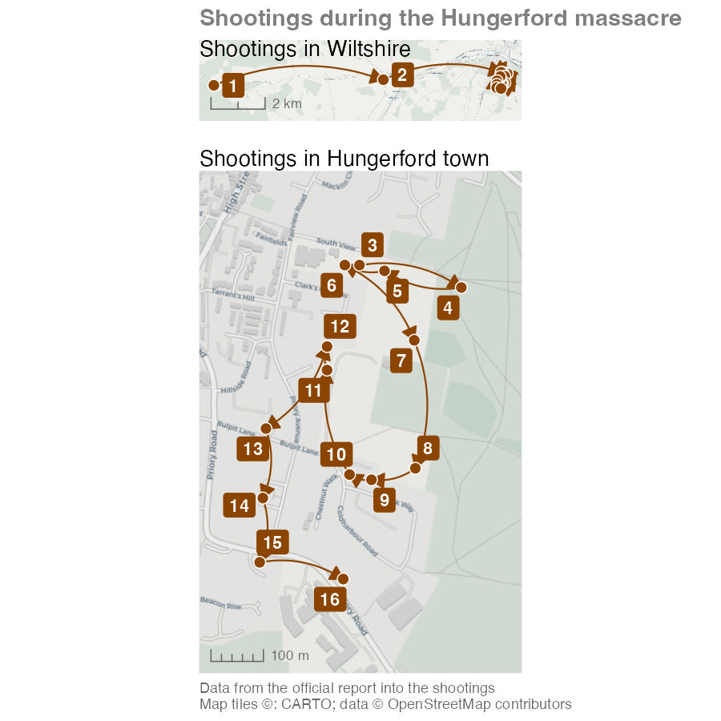

# Mapping crime series {#sec-crime-series}

{fig-alt="Students examine linked case locations connected across a neighbourhood map." width=100%}

::: {.abstract}
In this chapter we will learn to map _crime series_, a sequence of crimes committed by the same individual or group. Using a historical case study, we will learn how to visualise crime series by mapping linked cases.
:::





```{r}
#| label: create-hungerford-shootings
#| echo: false
#| include: false

pacman::p_load(ggrepel, ggspatial, patchwork, tidyverse)

hungerford_shootings <- crimemappingdata::hungerford_shootings |>
  arrange(order)
```


## Introduction

Up until now we've mapped each crime in a dataset as a separate event. This is very common in crime mapping, and is useful for many purposes. But a large proportion of crimes are committed by a relatively small proportion of all the people who commit crime. These persistent or repeat offenders commit crimes frequently, maybe several times a day in the case of some people. One type of repeat offending is the *crime series*, in which an offender or group of offenders commits the same or related crimes in different places over time. If we are trying to understand a crime series, it is important to map the sequence of events, rather than treating each crime as a separate event. In this chapter we will learn how to map crime series.


### Case linkage {#sec-crime-series-case-linkage}

One of the difficulties in studying serial offending is in identifying which offences are committed by the same offender. *Case linkage* is the process of identifying crime series by looking for similarities in the method used by an offender (e.g. entering a house by breaking a lock on a side door out of sight from the street) or by evidence left at the scene (such as fingerprints or DNA). Case linkage is typically an imperfect process -- investigators might believe that two offences were committed by the same person, but in most cases they are unlikely to know for sure unless the offender has been caught (and sometimes not even then).

Watch this video to learn a bit more about crime linkage.



::: {.callout-transcript .callout collapse="true" icon="false" title="Video transcript: What Is Crime Linkage?"}



:::


::: {.callout-quiz .callout title="Case linkage"}

```{r}
#| label: case-linkage-quiz
#| echo: false

case_linkage_quiz1 <- c(
  "To determine the time a crime was committed",
  answer = "To identify which offences were committed by the same offender",
  "To analyse the psychological state of the offender",
  "To predict where future crimes will occur"
)

case_linkage_quiz2 <- c(
  answer = "The specific methods the offender uses to carry out their crimes",
  "The DNA evidence left behind at the crime scene",
  "The legal defence strategy used by the offender in court",
  "The geographical location where the crimes occur"
)

case_linkage_quiz3 <- c(
  "The offender’s modus operandi",
  "The geographical locations of the crimes",
  answer = "Forensic evidence, such as DNA",
  "The type of victim the offender targets"
)
```


**What is the primary goal of case linkage?**

`r webexercises::longmcq(case_linkage_quiz1)`


**Which of the following is an example of an offender’s modus operandi (MO)?**

`r webexercises::longmcq(case_linkage_quiz2)`


**According to the video, what is the most reliable factor to use when linking crimes?**

`r webexercises::longmcq(case_linkage_quiz3)`


:::


### The case used in this chapter {#sec-crime-series-the-case-used-in-this-chapter}

Due to the inherent uncertainty of case linkage, there is little publicly available data on the locations of serial crimes. The available data tend to focus on serial murders, since murder is the crime that is most likely to be solved (in most developed countries, a very high proportion of murders are solved). To minimise the likelihood of anyone reading this book having been directly affected by -- or knowing anyone affected by -- the cases we use in this chapter, we will use a historical example.


```{r}
#| label: create-hungerford-murder-count
#| include: false

hungerford_murder_count <- hungerford_shootings |>
  mutate(murder_count = str_count(victims, "†")) |>
  summarise(murder_count = sum(murder_count)) |>
  pull(murder_count)
```


The [Hungerford massacre](https://en.wikipedia.org/wiki/Hungerford_massacre) occurred in southern England in August 1987, when a marauding attacker (also 
known as a spree offender) killed `r hungerford_murder_count` people and shot many others in the space of about 90 minutes. We will use a dataset called 
`hungerford_shootings` that contains the names of each victim and the approximate location at which they were shot (recorded as eastings and northings in the British National Grid). This data is taken from the [official report into the massacre](https://www.jesip.org.uk/uploads/media/incident_reports_and_inquiries/Hungerford%20Shootings.pdf). Each row represents a shooting location, so some rows contain more than one victim. The `order` column shows the sequence of locations rather than numbering individual victims. These are the first few rows of the dataset (the dagger symbol † shows that the victim was killed, rather than non-fatally injured):


```{r}
#| label: preview-hungerford-victims
#| echo: false

hungerford_shootings |>
  mutate(victims = str_replace_all(victims, "\\n", ", ")) |>
  head(5) |>
  knitr::kable()
```


In this chapter we will learn how to create this composite map of the locations of the shootings in this crime series.


```{r}
#| label: display-chapter-16-script
#| echo: false
#| include: false
#| file: "../R/chapter_16.R"
```

```{r}
#| label: save-hungerford-intro-map
#| echo: false
#| include: false

ggsave(
  here::here("images/hungerford_map.jpg"),
  hungerford_map,
  width = 900 / 150,
  height = 900 / 150,
  dpi = 150
)
```


::: {#map-hungerford-shooting-sequence}

<p class="full-width-image"></p>

:::

::: {.callout-note collapse="true" title="Map description: the Hungerford shooting sequence" #desc-hungerford-sequence}

The two maps use different scales. In the upper map, location 1 is furthest west in Wiltshire. An arrow runs east to location 2, then onwards to the tightly packed locations in Hungerford. The scale bar represents 2 kilometres.

The lower map enlarges locations 3 to 16 in the town, with a 300-metre scale bar. Starting in the north, arrows link 3 to 4 to the east, then turn west through 5 and 6. The sequence runs south through 7, 8 and 9, then north-west through 10, 11 and 12. It then moves south along the western side through 13, 14 and 15, east to 16 and back north towards the earlier locations. The numbers indicate the order of shooting locations, rather than the number of victims. Arrows connect recorded locations; they do not identify every street travelled along.

:::


In this chapter, we will learn how to:

- prepare an ordered sequence of events for mapping using `arrange()` and `lag()`;
- connect event locations using curved lines and directional arrows;
- expand the area displayed on a map;
- add labels that are automatically offset from the points they relate to;
- create overview and detailed maps of the same events; and
- combine multiple maps into one output using the patchwork package.

Create a new R script file in Positron and save it as `chapter_16.R` in the `R` folder of the workspace you created in @sec-create-project. Add this code to download the original data into `data/raw`, load the local copy and prepare to make the map. Run the code by pressing .


```{r}
#| label: script-16-prepare
#| lst-label: lst-crime-series-script-16-prepare
#| lst-cap: ""
#| filename: "chapter_16.R"
#| eval: false

# This script creates a combination of maps showing the sequence of shootings
# during the Hungerford massacre in 1987

# Load data --------------------------------------------------------------------

# Load packages
pacman::p_load(ggrepel, ggspatial, here, httr2, patchwork, tidyverse)

# Download the original shootings data
request(
  "https://mpjashby.github.io/crimemappingdata/hungerford_shootings.csv"
) |>
  req_perform(path = here("data", "raw", "hungerford_shootings.csv"))

# Load the local copy of the shootings data
hungerford_shootings <- here("data", "raw", "hungerford_shootings.csv") |>
  read_csv() |>
  arrange(order)
```

```{r}
#| label: prepare-hungerford-script
#| filename: "chapter_16.R"
#| echo: false

# This script creates a combination of maps showing the sequence of shootings
# during the Hungerford massacre in 1987

# Load data --------------------------------------------------------------------

# Load packages
pacman::p_load(ggrepel, ggspatial, here, httr2, patchwork, tidyverse)

# Download the original shootings data
request(
  "https://mpjashby.github.io/crimemappingdata/hungerford_shootings.csv"
) |>
  req_perform(path = here("data", "raw", "hungerford_shootings.csv"))

# Load the local copy of the shootings data
hungerford_shootings <- here("data", "raw", "hungerford_shootings.csv") |>
  read_csv() |>
  arrange(order)
```

You might notice this code loads some packages we haven't worked with before. We'll introduce these packages in this chapter.


## Mapping linked cases

Mapping crime series can be useful for several reasons. For example, a map of a crime series might help the jurors in a criminal trial to better understand the sequence of events that the suspect is accused of. This can be especially helpful if the sequence is complicated or especially long.

At the moment, the `hungerford_shootings` dataset contains the *point* location of each event and the order in which they occurred. To show a sequence of events on a map, we need to link each event with those that happened immediately before and after it. 

```{r}
#| label: preview-hungerford-script-data
#| echo: false

hungerford_shootings |>
  mutate(victims = str_replace_all(victims, "\\n", ", ")) |>
  head(5) |>
  knitr::kable()
```

One way to do that is to draw lines on the map connecting each incident in turn. To do this, we will create a dataset where each row contains _two_ pairs of coordinates: one representing the location of a particular shooting and the other representing the location of the _previous_ shooting. To do that, we will:

  1. Take the `hungerford_shootings` dataset and rename the existing columns holding the coordinates so that it is clear those coordinates are for the
     _end_ of each line between points. To do this we will use the `rename()` function from the dplyr package.
  2. Sort the rows using the `order` column. This is essential because `lag()` uses the current row order when it retrieves the previous value.
  3. Add two new columns to each row that show the coordinates of the row in the dataset immediately above the current row (i.e. the row that represents
     the location before the current location). We will do this with the `lag()` function, also from dplyr.
  4. Use these two pairs of coordinates to plot lines on a map.

```{r}
#| label: script-16-lines
#| lst-label: lst-crime-series-script-16-lines
#| lst-cap: ""
#| filename: "chapter_16.R"

# Prepare data -----------------------------------------------------------------

# Create dataset of lines joining shootings in sequence
hungerford_lines <- hungerford_shootings |>
  # Arrange the rows in order of the sequence of shootings
  arrange(order) |>
  # Make it clear the coordinates refer to the coordinates we want to use for
  # the *end* of each line, to distinguish them from the second set of
  # coordinates we'll create next
  rename(x_end = easting, y_end = northing) |>
  # Copy the coordinates from the row above each row to create a second set of
  # coordinates for the *start* of each line
  mutate(x_start = lag(x_end), y_start = lag(y_end)) |>
  # Remove the first row, which now contains missing values for `y_start` and
  # `x_start`, and which we don't need
  drop_na(x_start, y_start)
```

```{r}
#| label: head-hungerford-lines
#| lst-label: lst-crime-series-head-hungerford-lines
#| lst-cap: ""
#| filename: "R Console"

head(hungerford_lines)
```


::: {.callout-tip collapse="true" title="Why does this code include `drop_na()`?"}

You might notice that the values in the first row of the `x_start` and `y_start` columns in the `hungerford_lines` object are `NA` values. This is because these columns have been created using the `lag()` function, which gets the value from the same column in the row immediately above. The first row doesn't have a row immediately above it, so `lag()` returns `NA`. Since the first row does not represent a link between shootings in any case, we can remove it with
`drop_na()`.
:::


This method for creating lines between points is one of several ways we could achieve the same result. For example, we could create lines connecting the points and store them as SF objects. However, the code to do that is more complicated and would give us slightly less control over the appearance of the lines.

Using this method means the points and lines we want to put on our map are not SF objects, so we cannot use `geom_sf()` to add them to the map. Instead, we will add the points representing shooting locations to the map using `geom_point()` and add the lines between points using `geom_segment()`, both from the ggplot2 package. Since `hotspot_map()` only works for SF objects, we cannot use `hotspot_map()` in this case, either. That means we have to do some things manually that would normally be done for us automatically. The extra code in @lst-crime-series-draw-hungerford-shootings-straight-lines is explained in the accompanying notes.

Run this code in the R Console.


::: {#map-hungerford-shootings-straight-lines}

```{r}
#| label: draw-hungerford-shootings-straight-lines
#| lst-label: lst-crime-series-draw-hungerford-shootings-straight-lines
#| lst-cap: ""
#| filename: "R Console"
#| fig-asp: 0.3
#| fig-alt: "Wide, very shallow map of the Hungerford shooting locations in August 1987. Black dots are joined by straight black lines. Two outlying locations stretch the map westwards, leaving the town locations tightly packed at the eastern end; direction and event order are not labelled."

# Plot a basic map
ggplot() +
  # Add base map
  annotation_map_tile(type = "cartolight", zoomin = 0, progress = "none") + #<1>
  # Add lines between points
  geom_segment(
    aes(x = x_start, y = y_start, xend = x_end, yend = y_end),
    data = hungerford_lines
  ) +
  # Add points
  geom_point(aes(x = easting, y = northing), data = hungerford_shootings) +
  # Since our layers are not an SF object, tell `ggplot()` what coordinate
  # system to use
  coord_sf(crs = "EPSG:27700") + #<2>
  # Add base map attribution statement
  labs(caption = "Map tiles ©: CARTO; data © OpenStreetMap contributors") + #<3>
  theme_void() #<4>
```

:::
1. When we make a map using `hotspot_map()`, in the background that function uses the `annotation_map_tile()` function (from the ggspatial package) to add a base map to the map. Since we're not using `hotspot_map()`, we have to do this ourselves.
2. Since we aren't using SF objects, we need to tell `ggplot()` how to translate the coordinates in our data to locations on the map. We do this with the `coord_sf()` function.
3. `hotspot_map()` automatically adds a caption to the map to acknowledge the source of the base map tiles used on a particular map (see @sec-base-maps), so here we have to do this ourselves.
4. We use `theme_void()` to remove information that is often useful for a chart but not for a map, such as labels along the x- and y-axes showing coordinates.


This map is not particularly useful -- we will improve it in @sec-crime-series-extending-the-map-area and @sec-crime-series-adding-arrows-and-curves.

If you look at this code, you'll see that we've included the function `coord_sf()` in our `ggplot()` stack. In all the previous maps that we have made, we have used `geom_sf()` to plot geographic data on our maps. `geom_sf()` understands how to translate coordinates specified using different coordinate systems to locations on the surface of each map. Other functions in the `geom_*()` family of functions do not know how to do this automatically, so we must specify the coordinate system by adding the `coord_sf()` function to the stack. We only need to use one argument to `coord_sf()`: the `crs` argument to specify the coordinate system that our data uses. In this case, we know that the coordinates in the `hungerford_shootings` and `hungerford_lines` objects are specified using the British National Grid, which has the EPSG code EPSG:27700.

@map-hungerford-shootings-straight-lines shows the sequence of events, but there are at least four ways that we can make it better.

  1. It would be useful to be able to see a larger area around the shooting locations, to see more of the town surrounding the area in which the crimes occurred.
  2. We don't know which order to move through the sequence of lines. We can deal with this by adding arrows to show the direction in which the sequence progressed.
  3. The straight lines make it look like the offender travelled across fields between locations, which is probably not true. Since we do not have data on what routes the offender took, we can replace the straight lines with curves to indicate that the exact route is unknown.
  4. Because the first two shootings occurred outside the town, the map has to cover a large area and this makes it harder to see the sequence of events in the town itself.


### Extending the map area {#sec-crime-series-extending-the-map-area}

By default, `ggplot()` works out the limits of the area shown on the map based on the area covered by the data we add to each stack with functions from the `geom_*()` family of functions. Usually this works well, but in this case the distribution of the shootings means that the map shows only a small slice of the town of Hungerford and the surrounding area. It would be useful for readers to be able to see a larger area, to be able to better identify where the shootings occurred. 

We can increase the size of the area shown on the plot in two ways. We could use the `fixed_plot_aspect()` function from the ggspatial package to control the aspect ratio of the plot (i.e. how tall it is relative to how wide it is). With some trial and error, we could use this to determine the best aspect ratio for showing the data on this map. However, this only allows us to control the overall size of the plot, not the amount of space around the data in each direction. 

For more-specific control over what area is shown, we can use the `scale_x_continuous()` and `scale_y_continuous()` functions from the ggplot2 package. We used the `scale_fill_distiller()` function in @sec-map-colour to control how columns in the data are represented as colours on the map. The `scale_x_continuous()` and `scale_y_continuous()` functions are similar, in that they control the horizontal (X) and vertical (Y) axes on the map. We don't need to use most of the capabilities of these because `ggplot()` sets reasonable default values. The only argument we need to set is the `expand` argument, which controls how far the map should extend around the area covered by the data.

The easiest way to set the correct values for the `expand` argument is to use the `expansion()` helper function. We can use this to specify how much extra area around the data we want to include on the map. For example, `expansion(2)` means that the axis of the map should cover the area covered by the data and twice that distance either side of the data.

Run this code in the R Console.


::: {#map-hungerford-shootings-expanded-extent}

```{r}
#| label: draw-hungerford-shootings-expanded-extent
#| lst-label: lst-crime-series-draw-hungerford-shootings-expanded-extent
#| lst-cap: ""
#| filename: "R Console"
#| fig-asp: 0.3
#| fig-alt: "Overview map of the Hungerford shooting locations in August 1987, with more space above and below the dots. Straight black lines join consecutive locations from two western outliers into the town at the eastern end. The added vertical space improves the map proportions but does not separate the crowded town locations."

# Plot a basic map
ggplot() +
  # Add base map
  annotation_map_tile(type = "cartolight", zoomin = 0, progress = "none") +
  # Add lines between points
  geom_segment(
    aes(x = x_start, y = y_start, xend = x_end, yend = y_end),
    data = hungerford_lines
  ) +
  # Add points
  geom_point(aes(x = easting, y = northing), data = hungerford_shootings) +
  # Expand the map to show a larger area above/below the data
  scale_y_continuous(expand = expansion(2)) +
  # Specify coordinate system
  coord_sf(crs = "EPSG:27700") +
  # Add base map attribution statement
  labs(caption = "Map tiles ©: CARTO; data © OpenStreetMap contributors") +
  theme_void()
```

:::

::: {.callout-important title="`scale_x_continuous()` vs `scale_y_continuous()`"}

The `scale_y_continuous()` function specifically controls the vertical (Y) axis of the map, so it only adds space above and below the data on the map. If we wanted to add space to the left and right of the data, we would need to use the `scale_x_continuous()` function. But in this case, since the map is already very wide relative to its height, we will not make the map any wider.
:::


### Adding arrows and curves {#sec-crime-series-adding-arrows-and-curves}

To add an arrow to the end of each line segment we can use the `arrow()` helper function from the `ggplot2` package to specify the `arrow` argument of the `geom_segment()` function in our `ggplot()` stack. Here, we make the arrowhead smaller than the default by setting `length = unit(3, "mm")` and choose the style of the arrowhead with `type = "closed"`.

To prevent the arrowheads from obscuring the points, we will give the points a thin white border by specifying `shape = 21` (a circle with a separate border) and `colour = "white"`, as well as making the points slightly bigger with `size = 3`.

Run this code in the R Console.


::: {#map-hungerford-shootings-arrowheads}

```{r}
#| label: draw-hungerford-shootings-arrowheads
#| lst-label: lst-crime-series-draw-hungerford-shootings-arrowheads
#| lst-cap: ""
#| filename: "R Console"
#| fig-asp: 0.3
#| fig-alt: "Overview map of the Hungerford shooting locations in August 1987. Brown dots are joined by brown straight lines with arrowheads, showing travel eastwards from two outlying locations towards the town. The town dots still overlap, so arrowheads clarify direction without making every event distinguishable."

ggplot() +
  # Add base map
  annotation_map_tile(type = "cartolight", zoomin = 0, progress = "none") +
  # Add lines between points
  geom_segment(
    aes(x = x_start, y = y_start, xend = x_end, yend = y_end),
    data = hungerford_lines,
    arrow = arrow(length = unit(3, "mm"), type = "closed"),
    colour = "darkorange4"
  ) +
  # Add points
  geom_point(
    aes(x = easting, y = northing),
    data = hungerford_shootings,
    shape = 21,
    colour = "white",
    fill = "darkorange4",
    size = 3
  ) +
  # Expand the map to show a larger area above/below the data
  scale_y_continuous(expand = expansion(2)) +
  # Specify coordinate system
  coord_sf(crs = "EPSG:27700") +
  # Add base map attribution statement
  labs(caption = "Map tiles ©: CARTO; data © OpenStreetMap contributors") +
  theme_void()
```

:::

This makes it easier to see that the shootings started at the point on the left of the map, but makes the problem of understanding the sequence of events in the town itself even worse. We will deal with this in @sec-crime-series-multiple-maps.

In @map-hungerford-shootings-arrowheads, we used the `geom_segment()` function to add the lines to our map. If we change this to `geom_curve()` the lines will become curved rather than straight. By specifying `curvature = -0.2` we get a slightly straighter line than the default, and a left-hand curve because the value of `curvature` is negative. These curves show only the sequence in which the locations were visited. They do not show the route travelled between locations, which is not recorded in the data.

The other change we can make at this point is to add a layer of labels showing the order in which the shootings occurred. We don't want the labels to overlap the points, so instead of adding labels with the `geom_label()` function from the ggplot2 package we will use `geom_label_repel()` from the ggrepel package that we learned about in @sec-chart-continuous. `geom_label_repel()` creates labels that are automatically offset from the points they relate to. For now, we will just label the first two locations.

At this point we can also make some minor changes to the map: adding a title and scale bar, putting a border around the map, and temporarily removing the base map attribution statement. The purpose of those changes will become clear in @sec-crime-series-multiple-maps.

Add this code to the `chapter_16.R` script file and run it.


```{r}
#| label: script-16-overview
#| lst-label: lst-crime-series-script-16-overview
#| lst-cap: ""
#| filename: "chapter_16.R"
#| fig-asp: 0.3
#| fig-alt: "Overview map of the Hungerford shootings in August 1987. Numbered brown labels and curved arrows run from location one in the west to location two further east, then to the tightly grouped town locations at the eastern end. The long distances between the first locations make the town sequence hard to read at this scale."

# Make component maps ----------------------------------------------------------

# Create map showing overall locations of shootings
hungerford_map_overall <- ggplot() +
  # Plot base map
  annotation_map_tile(type = "cartolight", zoomin = 0, progress = "none") +
  # Plot lines between points
  geom_curve(
    aes(x = x_start, y = y_start, xend = x_end, yend = y_end),
    data = hungerford_lines,
    arrow = arrow(length = unit(3, "mm"), type = "closed"),
    curvature = -0.2,
    colour = "darkorange4"
  ) +
  # Add points
  geom_point(
    aes(x = easting, y = northing),
    data = hungerford_shootings,
    shape = 21,
    colour = "white",
    fill = "darkorange4",
    size = 3
  ) +
  # Add labels
  geom_label_repel(
    aes(x = easting, y = northing, label = order),
    data = filter(hungerford_shootings, order %in% 1:2),
    colour = "white",
    fill = "darkorange4",
    fontface = "bold",
    linewidth = 0
  ) +
  # Add scale bar
  annotation_scale(style = "ticks", line_col = "grey40", text_col = "grey40") +
  # Expand the map to show a larger area above/below the data
  scale_y_continuous(expand = expansion(2)) +
  # Specify coordinate system
  coord_sf(crs = "EPSG:27700") +
  # Add title
  labs(title = "Shootings in Wiltshire") +
  theme_void() +
  theme(
    panel.border = element_rect(colour = "grey20", fill = NA),
    plot.title = element_text(margin = margin(b = -18))
  )
```


Since we have saved this latest map to an object called `hungerford_map_overall`, we need to run the object name in the R Console in order to print the map in Positron's **Plots** pane.


::: {#map-hungerford-shootings-overview}

```{r}
#| label: draw-hungerford-shootings-overview
#| lst-label: lst-crime-series-draw-hungerford-shootings-overview
#| lst-cap: ""
#| filename: "R Console"
#| fig-asp: 0.3
#| fig-alt: "Overview map of the Hungerford shootings in August 1987. Numbered brown labels and curved arrows run from location one in the west to location two further east, then to the tightly grouped town locations at the eastern end. The long distances between the first locations make the town sequence hard to read at this scale."

hungerford_map_overall
```

:::


Now we have added arrowheads and curved lines, in @sec-crime-series-multiple-maps we will learn how to solve the problem of the events in the town itself being unclear on the map.


::: {.callout-quiz .callout title="Mapping crime series"}

```{r}
#| label: series-quiz
#| echo: false

series_quiz1 <- c(
  "By adding street names to each location",
  "By removing locations that are too close together",
  answer = "By connecting each point to the previous crime location",
  "By only mapping the final crime in the series"
)

series_quiz2 <- c(
  answer = "To include more contextual information about the surrounding environment",
  "To make the map appear more colourful",
  "To reduce the number of crime points displayed",
  "To increase the complexity of the visualisation"
)

series_quiz3 <- c(
  "`theme_void()`",
  answer = "`geom_label_repel()`",
  "`position_dodge()`",
  "`geom_text()`"
)
```

**How can we show the sequence of locations in a crime series?**

`r webexercises::longmcq(series_quiz1)`


**Why might we want to extend the area shown on a crime series map?**

`r webexercises::longmcq(series_quiz2)`


**Which function in R can be used to prevent label overlap on crime maps?**

`r webexercises::longmcq(series_quiz3)`


:::


## Multiple maps {#sec-crime-series-multiple-maps}

<p class="full-width-image"></p>

Our existing map is difficult to understand because we have a mix of some events very close together (including several on the same street) and some that occurred further away. This means the closer events overlap on the map, especially now that we have made the points larger to distinguish them from the lines linking each event.

<a href="https://patchwork.data-imaginist.com/" class="no-external" aria-label="Visit the patchwork package website"></a>

To deal with this problem we can display two maps: an *overview map* showing the whole area covered by the points and a *detail map* showing only the events in the town of Hungerford itself. In @sec-map-change-over-time we created small-multiple maps with `facet_grid()`, but what we want to do here is slightly different. In this case the maps show the same data at different scales, rather than different data for the same area. To combine these maps, we need to use the [patchwork package](https://patchwork.data-imaginist.com/), which can combine multiple maps or charts made using `ggplot()` into a single output.

We have already saved the overview map as `hungerford_map_overall`. We can create a detail map showing only the shootings in Hungerford itself by removing the first two points from `hungerford_shootings` (since they represent shootings outside the town itself). We can do this for all the existing layers using the `slice()` function from the dplyr package.

We will use the `plot.margin` argument to the `theme()` function to add a small amount of space at the top (and outside the border of) of this map. When we put the two maps together, that space will help separate the two maps. We will also get the map to cover a slightly larger area than it would by default by using the `scale_x_continuous()` and `scale_y_continuous()` functions.

Add this code to your script file and run it.


```{r}
#| label: script-16-town
#| lst-label: lst-crime-series-script-16-town
#| lst-cap: ""
#| filename: "chapter_16.R"
#| fig-alt: "Street map of Hungerford showing shooting locations three to sixteen in August 1987. Brown numbered labels and curved arrows trace movements among northern streets, south through the town and back towards the centre. Labels three, five and six are close together; a larger map scale separates the later locations that overlapped in the overview."

# Create detail map showing shootings in Hungerford town
hungerford_map_town <- ggplot() +
  annotation_map_tile(type = "cartolight", zoomin = 0, progress = "none") +
  # Add lines between points
  geom_curve(
    aes(x = x_start, y = y_start, xend = x_end, yend = y_end),
    data = slice(hungerford_lines, 3:n()),
    arrow = arrow(length = unit(3, "mm"), type = "closed"),
    curvature = -0.2,
    colour = "darkorange4"
  ) +
  # Add points
  geom_point(
    aes(x = easting, y = northing),
    data = slice(hungerford_shootings, 3:n()),
    shape = 21,
    colour = "white",
    fill = "darkorange4",
    size = 3
  ) +
  # Add labels
  geom_label_repel(
    aes(x = easting, y = northing, label = order),
    data = slice(hungerford_shootings, 3:n()),
    colour = "white",
    fill = "darkorange4",
    fontface = "bold",
    linewidth = 0
  ) +
  # Add scale bar
  annotation_scale(style = "ticks", line_col = "grey40", text_col = "grey40") +
  # Expand the map to show a larger area around the data
  scale_x_continuous(expand = expansion(0.3)) +
  scale_y_continuous(expand = expansion(0.3)) +
  # Specify coordinate system
  coord_sf(crs = "EPSG:27700") +
  labs(title = "Shootings in Hungerford town") +
  theme_void() +
  theme(
    panel.border = element_rect(colour = "grey20", fill = NA),
    plot.margin = margin(t = 12)
  )
```

::: {#map-hungerford-shootings-town}

```{r}
#| label: draw-hungerford-shootings-town
#| lst-label: lst-crime-series-draw-hungerford-shootings-town
#| lst-cap: ""
#| filename: "R Console"
#| fig-asp: 1
#| fig-alt: "Street map of Hungerford showing shooting locations three to sixteen in August 1987. Brown numbered labels and curved arrows trace movements among northern streets, south through the town and back towards the centre. Labels three, five and six are close together; a larger map scale separates the later locations that overlapped in the overview."

hungerford_map_town
```

:::


Now we have two maps, we can use patchwork to combine them. The patchwork package uses mathematical operators to combine multiple ggplot2 objects. To place two plots beside one another, we would use the `|` operator. In this case we want to place one plot on top of another, so we use the `/` operator. You can combine plots in more-complicated ways by combining these operators, together with parentheses.

To position the town detail map (stored in `hungerford_map_town`) below the overview map (stored in `hungerford_map_overall`), we can use this code:


::: {#map-hungerford-shootings-combined}

```{r}
#| label: draw-hungerford-shootings-combined
#| lst-label: lst-crime-series-draw-hungerford-shootings-combined
#| lst-cap: ""
#| filename: "R Console"
#| fig-asp: 1
#| fig-alt: "Two vertically arranged maps show the sequence of the Hungerford shootings in August 1987. The upper overview locates the first two shootings west of the town; the taller lower street map separates locations three to sixteen within Hungerford. Brown numbered labels and curved arrows show order, while each map has its own scale bar. A text description of the sequence is available with the introductory map."

hungerford_map_overall / hungerford_map_town
```

:::


When we created the `hungerford_map_overall` object in @sec-crime-series-adding-arrows-and-curves, we gave the map title a _negative_ margin using the `plot.title` argument to the `theme()` function. This had the effect of moving the title downwards onto the map to save space, since the top-left corner of the map was empty. We also added a scale bar, since when you present two related maps of different scales next to one another, it is useful to show the scales of both maps to help readers relate them to one another. You can see in @map-hungerford-shootings-combined, for example, the very different scales of the two maps.

We can add shared titles and captions to combined maps created with patchwork using the `plot_annotation()` function. We will add an overall title for the combined maps, as well as adding back the base map attribution statement, since it applies to both maps so there is no need to take up space by adding it to each map individually.

`plot_annotation()` also has a `theme` argument, which we can use to change the appearance of the shared title and caption just as we use `theme()` to change the appearance of elements on single maps. Finally, we can use `ggsave()` to save the combined map to an image file, as we learned to do in @sec-saving-maps.

Add this code to the script file and run it.


```{r}
#| label: script-16-combine
#| lst-label: lst-crime-series-script-16-combine
#| lst-cap: ""
#| filename: "chapter_16.R"
#| fig-asp: 1
#| fig-alt: "Two vertically arranged maps show the sequence of the Hungerford shootings in August 1987. The upper overview locates the first two shootings west of the town; the taller lower street map separates locations three to sixteen within Hungerford. Brown numbered labels and curved arrows show order, while each map has its own scale bar. A text description of the sequence is available with the introductory map."

# Combine maps and add titles --------------------------------------------------

hungerford_map <- (hungerford_map_overall / hungerford_map_town) +
  plot_annotation(
    title = "Shootings during the Hungerford massacre",
    caption = str_glue(
      "Data from the official report into the shootings\nMap tiles ©: CARTO; ",
      "data © OpenStreetMap contributors"
    ),
    theme = theme(
      plot.caption = element_text(colour = "grey40", hjust = 0),
      plot.title = element_text(colour = "grey50", face = "bold", size = 14)
    )
  )

ggsave(
  here("output", "hungerford_map.jpg"),
  hungerford_map,
  width = 900 / 150,
  height = 900 / 150,
  dpi = 150
)
```


There are various other improvements that we could make to this map based on the mapping skills we have already learned during this course. For example, we could add the locations of buildings or particular facilities using data from OpenStreetMap. What information we choose to present on the map will depend on what information we think it is important to communicate to our audience.

The connecting curves should be interpreted cautiously. Their accuracy depends on the events being correctly linked and ordered, and they do not show the route travelled between locations.


::: {.callout-quiz .callout title="Combining maps"}

```{r}
#| label: multiple-maps-quiz
#| echo: false

multiple_maps_quiz1 <- c(
  "To show two unrelated datasets without explaining the connection",
  answer = "To show the overall spatial pattern while preserving detail in a smaller area",
  "To avoid including scale information on either map",
  "To make every point appear at the same scale"
)

multiple_maps_quiz2 <- c(
  "The `|` operator",
  answer = "The `/` operator",
  "The `+` operator",
  "The `*` operator"
)

multiple_maps_quiz3 <- c(
  "Because patchwork requires every plot to contain one",
  "Because both maps always cover the same area",
  answer = "Because the maps use different scales and readers need to interpret distance on each one",
  "Because scale bars identify the order of the events"
)
```

**Why is it useful to combine an overview map with a detail map?**

`r webexercises::longmcq(multiple_maps_quiz1)`


**Which patchwork operator places one plot above another?**

`r webexercises::longmcq(multiple_maps_quiz2)`


**Why should both component maps include scale information?**

`r webexercises::longmcq(multiple_maps_quiz3)`

:::


## Putting it all together

In this chapter, we practised how to:

- sort linked events into the correct order before mapping them;
- use `lag()` to associate each location with the previous location;
- connect locations using curves and directional arrows;
- expand the area displayed on a map;
- add labels that are automatically offset from their points with `geom_label_repel()`;
- create overview and detailed maps; and
- combine multiple maps using the patchwork package.


```{r}
#| label: names-killed
#| echo: false

names_killed <- hungerford_shootings |>
  pull("victims") |>
  str_split("\n") |>
  unlist() |>
  str_subset("†") |>
  str_remove("†") |>
  as_tibble() |>
  separate(value, into = c("first", "last")) |>
  arrange(last) |>
  mutate(name = str_glue("{first} {last}")) |>
  pull("name") |>
  str_to_title() |>
  str_flatten_comma(last = " and ")
```


When we are mapping crime data, it is important to remember that the rows in the data we are using often represent traumatic events that have happened to people. In this chapter, every row in the data represents one or more people who were killed or injured during the massacre. The people killed were `r names_killed`.

<p class="full-width-image image-border"></p>

The complete script in @lst-crime-series-show-chapter-16-script contains everything needed to download the original data and make and save the composite map. Save `chapter_16.R` by pressing .



```{r}
#| label: show-chapter-16-script
#| lst-label: lst-crime-series-show-chapter-16-script
#| lst-cap: ""
#| file: "../R/chapter_16.R"
#| eval: false
#| filename: "chapter_16.R"
```


## Further reading

- The [Crime Linkage International NetworK](https://more.bham.ac.uk/c-link/) provides information about research and practice in behavioural case linkage.
- The official [patchwork documentation](https://patchwork.data-imaginist.com/) includes further examples of arranging and annotating multiple plots.


::: {.credits}
[Photograph of PC Roger Brereton's funeral](https://www.getreading.co.uk/news/berkshire-history/gallery/30-years-hungerford-massacre-13495555) from Berkshire Live, [artwork by Allison Horst](https://allisonhorst.com/).
:::


::: {.callout-quiz .callout title="Check your knowledge: Revision questions"}



1. What is a crime series, and in what circumstances might mapping a series provide information that would not be visible if each crime were considered separately?
2. What challenges do investigators face when trying to determine whether crimes are linked?
3. Why is it useful to visualise a crime series on a map? Give some examples of when a map of a crime series might be useful.
4. Explain the role of arrows and labels in mapping crime series. How do these elements help improve the clarity of crime maps?
5. Describe the steps taken to prepare a dataset for mapping a crime series in R. Why is it necessary to create a dataset of linked points?
:::
