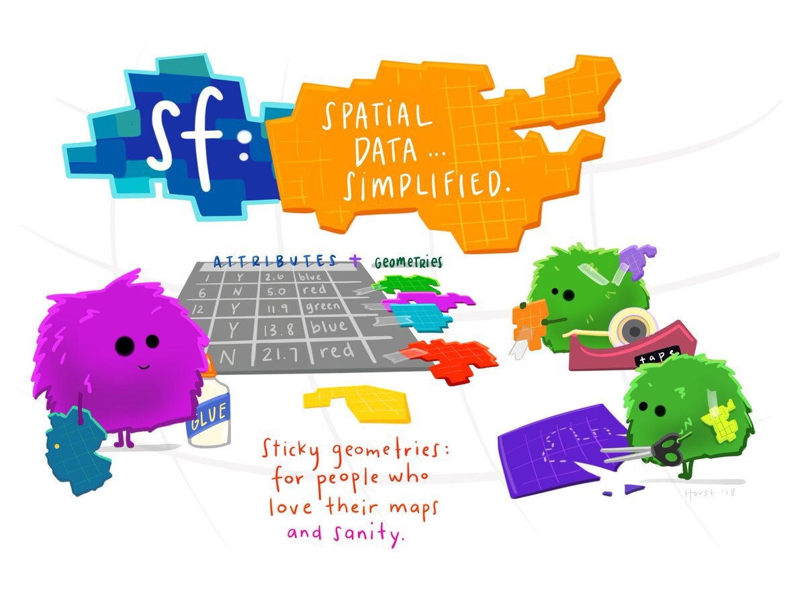
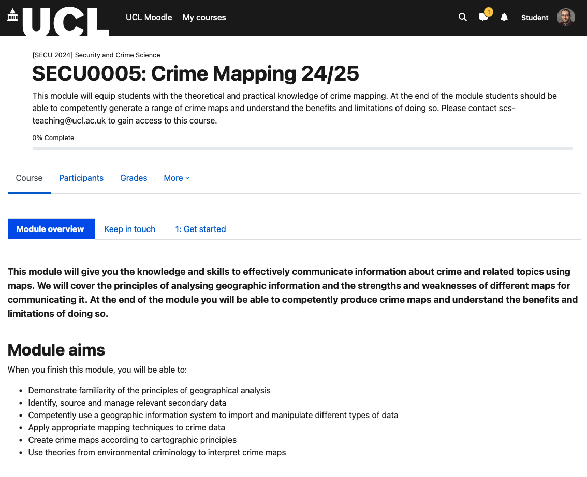
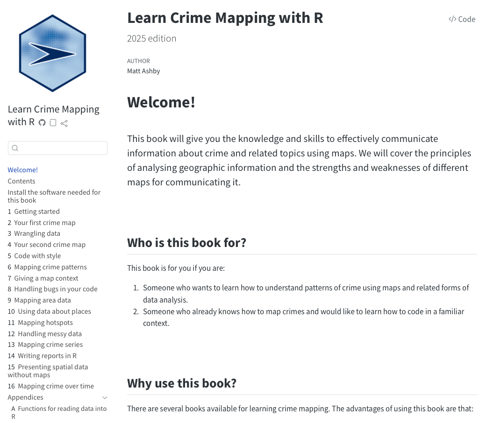
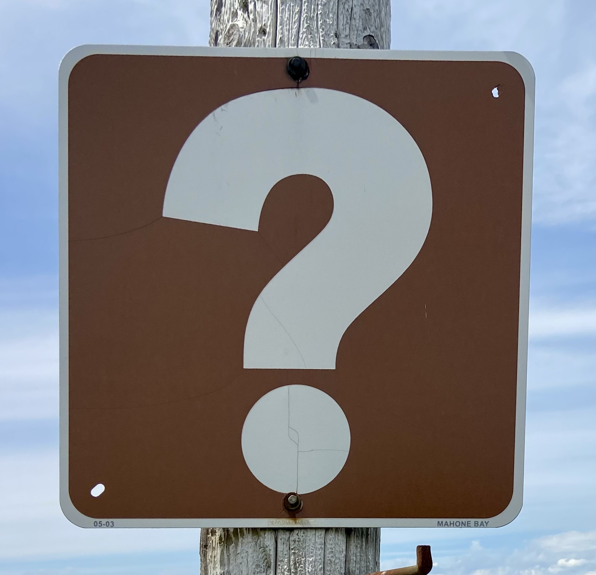

## This module

::: {.fragment .top-space}
> This module will equip you with the knowledge and skills to use maps to
> understand why crime happens in some places more than others
:::

:::: {.fragment .top-space}
… and …

::: {.top-space}
> This module will introduce you to using R to analyse crime
:::

::::

--------------------------------------------------------------------------------

## _Another_ programming language!? :scream:

::: {.top-space}
_Why?_
:::

:::::: {.columns}

::::: {.column width="50%" .fragment .center}
{width=50% fig-alt="Three cute fuzzy monsters adding spatial geometries to an existing table of attributes using glue and tape, while one cuts out the spatial polygons. Title text reads “sf: spatial data...simplified.” and a caption at the bottom reads “sticky geometries: for people who love their maps and sanity.”"}

Different languages have different strengths
:::::

::::: {.column width="50%" .fragment .center}
{width=200px fig-alt="Python logo"} {width=200px fig-alt="R logo"}

Knowing multiple languages gives you access to more jobs

:::: {.columns}

::: {.column width="25%"}
{fig-alt="Office for National Statistics logo" width=150px}
::::

::: {.column width="25%"}
{width=150px fig-alt="Ministry of Justice logo"}
:::

::::

:::::

::::::

--------------------------------------------------------------------------------

## You’ll use R again

* next term: SECU0013 Probability, Statistics and Modelling II
* next year: SECU0050 Data Science

--------------------------------------------------------------------------------

## A typical week

::: {.fragment .top-space}
**Monday--Friday**  work through chapters
:::

::: {.fragment .top-space}
**Tuesday**  in-person lecture and workshop
:::

::: {.fragment .top-space}
**Friday**  write and submit code for weekly practice exercise
:::

--------------------------------------------------------------------------------

## Week by week

:::: {.columns}

::: {.column width="50%" .fragment}
### First half of term

| Week | Topic                    |
|-----:|:-------------------------|
| 1    | Getting started          |
| 2    | Transforming data        |
| 3    | Mapping crime patterns   |
| 4    | Mapping area data        |
| 5    | **Assessment 1**         |
:::

::: {.column width="50%" .fragment}
### Second half of term

| Week | Topic                    |
|-----:|:-------------------------|
| 6    | Handling messy data      |
| 7    | Mapping hotspots         |
| 8    | Mapping without maps     |
| 9    | Mapping change over time |
| 10   | **Assessment 2**         |
:::

::::

::: {.fragment .top-space}
**January**: final assessment
:::

--------------------------------------------------------------------------------

## Module assessment

| Type       | Weight | Deadline                 | You will produce …           |
|:-----------|:-------|:-------------------------|:-----------------------------|
| Exam       | 20%    | Tue 3 November           | code to make 2 maps          |
| Exam       | 20%    | Tue 15 December          | code to make a short report  |
| Coursework | 60%    | Thu 14 January           | code to make a longer report |

--------------------------------------------------------------------------------

## How to do well

::: {.fragment .top-space}
**Manage your time**  don't try to finish everything in the in-person session
:::

::: {.fragment .top-space}
**Complete all the activities**  lectures only cover part of what you need to know
:::

::: {.fragment .top-space}
**Ask lots of questions**  easier to do in person than on Moodle
:::

::: {.fragment .top-space}
**Practice**  submit each week's exercise before Friday @ 4pm
:::

--------------------------------------------------------------------------------

## Module resources

:::: {.columns}

::: {.column width="33%" .fragment .center}
[{width=90% fig-alt="Screenshot of the Moodle home page for this module"}](https://moodle.ucl.ac.uk/course/view.php?id=42365)

[module Moodle page](https://moodle.ucl.ac.uk/course/view.php?id=42365)
:::

::: {.column width="33%" .fragment .center}
[{width=80% fig-alt="Screenshot of the home page of the online textbook for this module"}](https://books.lesscrime.info/learncrimemapping/2026/)

[_Learn Crime Mapping with R_](https://books.lesscrime.info/learncrimemapping/2026/)
:::

::: {.column width="33%" .fragment .center}
{width=80% fig-alt="Positron logo"}

[Positron](https://positron.posit.co/)

:::

::::

--------------------------------------------------------------------------------

## Questions

::: {.center}
{width=50% fig-alt="" role="presentation"}
:::
