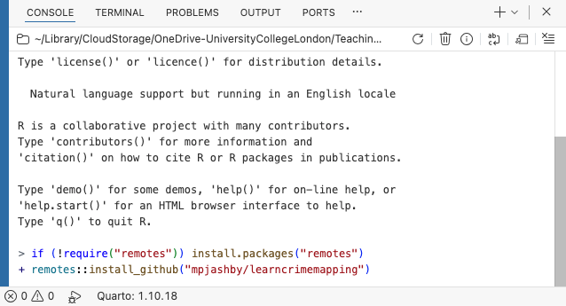

# Install the software needed for this book {.unnumbered}

::: {.abstract}
However you are going to use this book, you will first want to install the software that we
will use to create crime maps.
:::


## Step 1: install R

The first step is to download and install R, a programming language designed for analysing and visualising data, including making maps. To install R, follow the instructions below for whatever type of computer you are using. If you already have R installed on your computer, please update it to the latest release.

::: {.panel-tabset}

## Windows

1. Open your web browser and go to <https://cran.r-project.org/bin/windows/base/>.
2. Click **Download R x.x.x for Windows**, where *x.x.x* is the latest version number.
3. Wait for the installer to download.
4. Open your **Downloads** folder.
5. Double-click the downloaded `.exe` file. If Windows asks whether you want to allow the installer to make changes to your computer, click **Yes**.
6. Select your preferred language if prompted.
7. Click **OK**.
8. Click **Next**.
9. Leave all the default settings unchanged.
10. Continue clicking **Next** until you reach the **Install** button.
11. Click **Install**.
12. Wait for the installation to complete.
13. Click **Finish**.

## macOS

1. Open your web browser and go to <https://cran.r-project.org/bin/macosx/>.
2. Download the installer appropriate for your Mac:
   - **Apple Silicon (`arm64`)** for Macs with an M1 or newer processor.
   - **Intel (`x86_64`)** for older Intel-based Macs.
3. Wait for the installer to download.
4. Open your **Downloads** folder.
5. Double-click the downloaded `.pkg` file.
6. If macOS asks whether you want to open the installer, click **Open**.
7. Click **Continue**. Continue through the installation screens, accepting the licence agreement when prompted. Leave the installation location unchanged.
8. Click **Install**.
9. Enter your Mac password or use Touch ID if prompted.
10. Wait for the installation to complete.
11. Click **Close**.

## Ubuntu Linux

1. Open your web browser and go to <https://cran.r-project.org/bin/linux/ubuntu/>.
2. Follow the instructions on the page to add the official CRAN repository for your version of Ubuntu.
3. Open the **Terminal** application.
4. Update the package list by typing:

   ```bash
   sudo apt update
   ```

5. Press **Enter**.
6. Install R by typing:

   ```bash
   sudo apt install r-base
   ```

7. Press **Enter**.
8. If Ubuntu asks whether you want to continue, type:

   ```text
   Y
   ```

9. Press **Enter**.
10. Wait for Ubuntu to download and install R.

:::

::: {.callout-important}


When you install R, the installation wizard will also install a small piece of software called the R GUI (graphical user interface), which uses the R icon shown here. However, the R GUI is quite limited and so we will not be using it (very few people do). Instead, we will use Positron, a more powerful and user-friendly interface for R. To avoid inadvertently using the wrong software, **do not open the R GUI software**.
:::


## Step 2: install Positron

The next step is to install Positron, an app that you can use to work with the R programming language more efficiently. To install Positron, follow the instructions below for whatever type of computer you are using. If you already have Positron installed on your machine, please update it to the latest release.

::: {.panel-tabset}

## Windows

1. Open your web browser and go to <https://positron.posit.co/download.html>.
2. Click **Download for Windows**.
3. If you are asked to accept the Positron licence agreement and privacy policy, select the checkbox to confirm that you agree.
4. Click the download button.
5. Wait for the installer to download.
6. Open your **Downloads** folder.
7. Double-click the downloaded `.exe` file. If Windows asks whether you want to allow the installer to make changes to your computer, click **Yes**.
8. Follow the instructions shown by the installer. Leave the default installation options unchanged.
9. Wait for the installation to complete.
10. Open the **Start** menu.
11. Search for **Positron**.
12. Click **Positron** to open it.
13. If Positron asks you to choose between R and Python, choose **R**.
14. If Positron asks you to select an R installation, choose the latest version of R shown in the list.

## macOS

1. Open your web browser and go to <https://positron.posit.co/download.html>.
2. Download the installer appropriate for your Mac:
   - **macOS Apple Silicon** for Macs with an M1 or newer processor.
   - **macOS Intel** for older Intel-based Macs.
3. If you are asked to accept the Positron licence agreement and privacy policy, select the checkbox to confirm that you agree.
4. Click the download button.
5. Wait for the installer to download.
6. Open your **Downloads** folder.
7. Double-click the downloaded `.dmg` file. A window containing the Positron icon will open. **Do not double-click the Positron icon**.
8. Drag the **Positron** icon onto the **Applications** folder shown in the window.
9. Wait for Positron to be copied into the Applications folder.
10. Close the installer window.
11. Open the **Applications** folder.
12. Double-click **Positron**.
13. If macOS asks whether you are sure you want to open Positron, click **Open**.
15. If Positron asks you to choose between R and Python, choose **R**.
16. If Positron asks you to select an R installation, choose the latest version of R shown in the list.

## Ubuntu Linux

1. Open your web browser and go to <https://positron.posit.co/download.html>.
2. Click **Download for Linux**.
3. If you are asked to accept the Positron licence agreement and privacy policy, select the checkbox to confirm that you agree.
4. Download the Debian or Ubuntu installer, which has a filename ending in `.deb`.
5. Wait for the installer to download.
6. Open your **Downloads** folder.
7. Double-click the downloaded `.deb` file.
8. When the software-installation window opens, click **Install**.
9. Enter your password if prompted.
10. Wait for the installation to complete.
11. Open the applications menu.
12. Search for **Positron**.
13. Click **Positron** to open it.
14. If Positron asks you to choose between R and Python, choose **R**.
15. If Positron asks you to select an R installation, choose the latest version of R shown in the list.

:::


## Step 3: install Rtools (Windows only)

If you are using a Windows computer you should install Rtools. Rtools provides additional software that R uses when installing some packages. You only need to install Rtools if you are using Windows. Mac and Linux users already have the equivalent tools available through their operating system.

To install RTools: 

1. Open your web browser and go to <https://cran.r-project.org/bin/windows/Rtools/>.
2. Click the link for the latest version of **Rtools** that matches your version of R.
3. Wait for the installer to download.
4. Open your **Downloads** folder.
5. Double-click the downloaded `.exe` file.
6. If Windows asks whether you want to allow the installer to make changes to your computer, click **Yes**.
7. Click **Next**.
8. Leave the default installation options unchanged.
9. Continue clicking **Next** until you reach the **Install** button.
10. Click **Install**.
11. Wait for the installation to complete.
12. Click **Finish**.


## Set up R for crime mapping

As we will learn in subsequent chapters, most of the mapping capabilities in R are provided by add-on packages. To download and install the packages you will need to run the code included in this book:

  1. Open Positron.
  2. Find the panel (usually in the bottom-left) marked **Console**.
  3. Find the `>` symbol at the bottom of that panel.
  4. Copy and paste the following code to the right of the `>` symbol -- you can use the copy icon on the top-right of this code block to copy it to your clipboard:

```{r}
#| eval: false
#| filename: "R Console"
#| code-line-numbers: false

if (!require("remotes")) install.packages("remotes")
remotes::install_github("mpjashby/learncrimemapping")
```

  5. Press  on your keyboard.

{fig-alt="Screenshot of the Positron Console after starting R. The console displays the standard R startup messages, including information about licensing, contributors, citations and help. At the `>` prompt, two commands have been entered to install the learncrimemapping package from GitHub. The first installs the remotes package if it is not already installed, and the second runs remotes::install_github(\"mpjashby/learncrimemapping\"). The Positron interface also shows the Console, Terminal, Problems, Output and Ports tabs across the top."}


::: {.callout-tip collapse="true"}
#### `Do you want to install from sources the package which needs compilation?` -- what should I do?

If you see a popup message appear asking `Do you want to install from sources the package which needs compilation?`, you can safely choose 'No'.
:::


::: {.callout-important}
It will take a few minutes for the set-up process to finish. Once the process is complete, you will see the `>` symbol has appeared in the R Console again.
:::

